---
output:
  slidy_presentation:
    css: w3c-blue.css
    fig_caption: yes
    toc: yes
    toc_depth: 3
    includes:
      in_header: header.html
      before_body: doc_prefix.html
      after_body: doc_suffix.html

bibliography: bibliography.bib


---

```{r, warning=FALSE, message=FALSE, echo=FALSE}

library(tidyverse)

```

```{r setup, include=FALSE}
 
knitr::opts_chunk$set(echo = TRUE, message = FALSE, warning = FALSE )
```


```{r, echo=FALSE}

remissivo <<- tibble(palavra = "####")

slide_atual <<- 1

a_r <- function(palavra_add){
    remissivo <<- remissivo %>% 
        bind_rows(tibble(palavra = palavra_add, slide = slide_atual))

    str_glue("**{palavra_add}**")
    
}


escreve_remissivo <- function(){
    
    remissivo_final <- remissivo %>% 
        slice(2:nrow(remissivo)) %>% 
        mutate(
            linha = row_number(),
            link = str_glue("[{palavra}](#({slide}))\n\n")
        ) %>% 
        arrange(palavra)
        
    str_flatten(remissivo_final$link, "\n\n")

}


```


# COMUNICANDO OS RESULTADOS
`r slide_atual = slide_atual + 1`


## Criando visualizações interativas com Shiny

`r slide_atual = slide_atual + 1`

`r a_r("Shiny")` é um pacote R que permite a criação de `r a_r("aplicações WEB interativas")` que ativam código em R, com as possibilidades de formatação de tabelas, geração de gráficos, execução de modelos etc que as bibliotecas do R disponibilizam.

É a melhor alternativa para criação de aplicações Web interativas para desenvolvedores que já estão acostumados e utilizam muitas funcionalidades já providas pela linguagem R

## Uma aplicação Shiny mínima

`r slide_atual = slide_atual + 1`

Os códigos desta seção que fala do Shiny não são executados diretamente, apenas são mostrados.

Uma aplicação Shiny mínima tem 4 itens:

-   Carregamento da biblioteca `shiny`

-   Definição da interface do usuário, ou seja, a página HTML com a qual o usuário vai interagir. Essa interface é definida com o uso da função `r a_r("fluidPage()")`

-   Definição do comportamento da aplicação com a função `server()`

-   Execução da função `shinyApp(ui, server)` para construir e iniciar uma aplicação.

```{r, eval=FALSE}

library(shiny)
ui <- fluidPage(
  "Hello, world!"
)
server <- function(input, output, session) {
}
shinyApp(ui, server)

```

## Uma aplicação simples funcional

`r slide_atual = slide_atual + 1`

Abaixo uma aplicação Shiny simples

Na função `r a_r("ui() do aplicativo shiny")`, definimos a interface.

No exemplo abaixo, além dos títulos, há um select, ou seja, uma lista de opções, e espaços para um gráfico e duas tabelas.

Na função `r a_r("server() do aplicativo shiny")`, definimos o comportamento, ou seja, como o aplicativo reage a mudanças nos inputs

No exemplo abaixo, definimos como o gráfico e as tabelas são gerados a partir do conteúdo do select contido na interface.

Repare que há duas tabelas, cada uma gerada com uma biblioteca diferente.

A biblioteca `r a_r("reactable")` permite que tenhamos mais controle sobre a estética

A biblioteca `r a_r("rhandontable")` parece mais com uma tabela de Excel, permitindo inclusive copiar e colar os números.

```{r, eval=FALSE}

library(shiny)
library(reactable)
library(rhandsontable)
library(gapminder)
library(tidyverse)

selectPaises <-     
    selectInput(
        "pais", 
        label = "País", 
        choices = gapminder$country %>% unique() %>% sort(),
        multiple = TRUE 
    )


ui <- fluidPage(
    h1("Dashboard Gapminder"),
    hr(),
    h3("Filtros:"),
    selectPaises,
    h3("Gráfico:"),
    plotOutput("grafico"),
    h3("Tabela bonita:"),
    reactableOutput("tabela_reactable"),
    h3("Tabela pros viciados:"),
    rHandsontableOutput("tabela_rhanson")
)

server <- function(input, output, session) {
    
    output$grafico <- renderPlot({
        gapminder %>% 
            filter(country %in% input$pais) %>% 
            ggplot() +
            geom_line(aes(x = year, y = gdpPercap, color = country )) +
            geom_point(aes(x = year, y = gdpPercap, color = country )) +
            theme_light()
        
    }) 
    
    
    output$tabela_reactable <- renderReactable({
        
        gapminder %>% 
            filter(country %in% input$pais) %>%
            select(
                country,
                year,
                gdpPercap
            ) %>% 
            pivot_wider(
                names_from = year,
                values_from = gdpPercap
            ) %>% 
            reactable(
                defaultColDef = colDef(
                    format = colFormat(digits = 0, separators = TRUE) 
                )
            )
        
    })
    
    
    output$tabela_rhanson <- renderRHandsontable({
        gapminder %>% 
            filter(country %in% input$pais) %>%
            select(
                country,
                year,
                gdpPercap
            ) %>% 
            pivot_wider(
                names_from = year,
                values_from = gdpPercap
            ) %>% 
            mutate_at(
                vars(matches("[0-9]{4}")),
                ~round(x = .x, digits = 0)
            ) %>% 
            rhandsontable(
                readOnly = TRUE
            ) %>% 
            hot_cols(
                format = "0,000",
                language = "pt-BR"
            )
        
    })
    
    
}


shinyApp(ui, server)


```

## Programação reativa

`r slide_atual = slide_atual + 1`

Diferentemente da programação feita em scripts, a execução no Shiny não segue a ordem dos comandos. É o conceito da `r a_r("programação reativa")`

A execução das funções do tipo render (que já vimos), reactive, observe e observeEvent é preguiçosa. Só acontece quando os inputs são alterados.

No caso do nosso aplicativo simples, apenas quando o input "pais" é alterado, as funções render relativas aos outputs (gráfico e tabela) são executadas.


## Produtores e consumidores

`r slide_atual = slide_atual + 1`

Temos 2 papéis para os objetos: produtores e consumidores

Os inputs são produtores e os outputs são consumidores.

Vamos começar a ver agora objetos que funcionam tanto como produtores como consumidores.

As `r a_r("reactive expressions do shiny")` são objetos que assumem os dois papéis.

Elas possibilitam que cálculos e tratamentos que são comuns a várias saídas sejam executados apenas uma vez.

## Usando reactive para evitar duplicação

`r slide_atual = slide_atual + 1`

Na aplicação que desenhamos anteriormente, o select de país filtra da mesma forma os dados que são mostrados no gráfico e nas tabelas.

Podemos inserir um reactive que vai realizar esse tratamento, que é comum a todas as saídas, de uma só vez.

Assim evitamos mais facilmente, também, duplicar código.


## Reactive expressions

`r slide_atual = slide_atual + 1`

Esta é a sintaxe das `r a_r("reactive expressions")`. Elas devem ser declaradas dentro de server().


São funções disparadas no momento em que algum input que elas usam é alterado. O mecanismo disponibilizado pela shiny se encarrega disso


```{r, eval=FALSE}

  dados_filtrados <- reactive({
      
      gapminder %>% 
          filter(country %in% input$pais)
      
  })


```


O resultado pode ser usado por outras funções em server. É necesário usar "()".


```{r eval=FALSE}

    output$grafico <- renderPlot({
            dados_filtrados() %>% 
            ggplot() +
            geom_line(aes(x = year, y = gdpPercap, color = country )) +
            geom_point(aes(x = year, y = gdpPercap, color = country )) +
            theme_light()
        
    }) 


```


Ao refatorar nossa aplicação para que o gráfico e as tabelas compartilhem a saída do reactive, temos a seguinte aplicação:


```{r, eval=FALSE }

library(shiny)
library(reactable)
library(rhandsontable)
library(gapminder)
library(tidyverse)


selectPaises <-     
    selectInput(
        "pais", 
        label = "País", 
        choices = gapminder$country %>%  unique() %>%  sort(),
        multiple = TRUE 
    )


ui <- fluidPage(
    h1("Dashboard Gapminder"),
    hr(),
    h3("Filtros:"),
    selectPaises,
    h3("Gráfico:"),
    plotOutput("grafico"),
    h3("Tabela bonita:"),
    reactableOutput("tabela_reactable"),
    h3("Tabela pros viciados:"),
    rHandsontableOutput("tabela_rhanson")
)

server <- function(input, output, session) {
    
    
    
    dados_filtrados <- reactive({
        
        gapminder %>% 
            filter(country %in% input$pais)
        
    })
    
    
    output$grafico <- renderPlot({
            dados_filtrados() %>% 
            ggplot() +
            geom_line(aes(x = year, y = gdpPercap, color = country )) +
            geom_point(aes(x = year, y = gdpPercap, color = country )) +
            theme_light()
        
    }) 
    
    
    output$tabela_reactable <- renderReactable({
        
        dados_filtrados() %>% 
            select(
                country,
                year,
                gdpPercap
            ) %>% 
            pivot_wider(
                names_from = year,
                values_from = gdpPercap
            ) %>% 
            reactable(
                defaultColDef = colDef(
                    format = colFormat(digits = 0, separators = TRUE) 
                )
            )
        
    })
    
    
    output$tabela_rhanson <- renderRHandsontable({

        dados_filtrados() %>% 
            select(
                country,
                year,
                gdpPercap
            ) %>% 
            pivot_wider(
                names_from = year,
                values_from = gdpPercap
            ) %>% 
            mutate_at(
                vars(matches("[0-9]{4}")),
                ~round(x = .x, digits = 0)
            ) %>% 
            rhandsontable(
                readOnly = TRUE
            ) %>% 
            hot_cols(
                format = "0,000",
                language = "pt-BR"
            )
        
    })
    
    
}


shinyApp(ui, server)


```


## Rastreio da reatividade

`r slide_atual = slide_atual + 1`


É possível rastrear a reatividade dos componentes do Shiny.

Com a progressão do desenvolvimento de uma aplicação, o grafo (conjunto de vértices e arestas que os ligam) relativo aos componentes (vérices) e seus disparos que os ligam (arestas) pode ficar muito complexo.

{width="60%"}

A biblioteca reactlog ajuda a rastreas essas ligações.

Ao habilitar a reactlog, como no código abaixo, podemos rodar uma aplicação shiny e clicar em Ctrl + F3 para visualziar o grafo 


```{r, eval=FALSE}

library(reactlog)

reactlog_enable()


```


## Reatividade quando a aplicação é executada

`r slide_atual = slide_atual + 1`


É possível ver o que acontece todos os passos relacionados à reatividade   

Num primeiro momento todos os valores estão inválidos

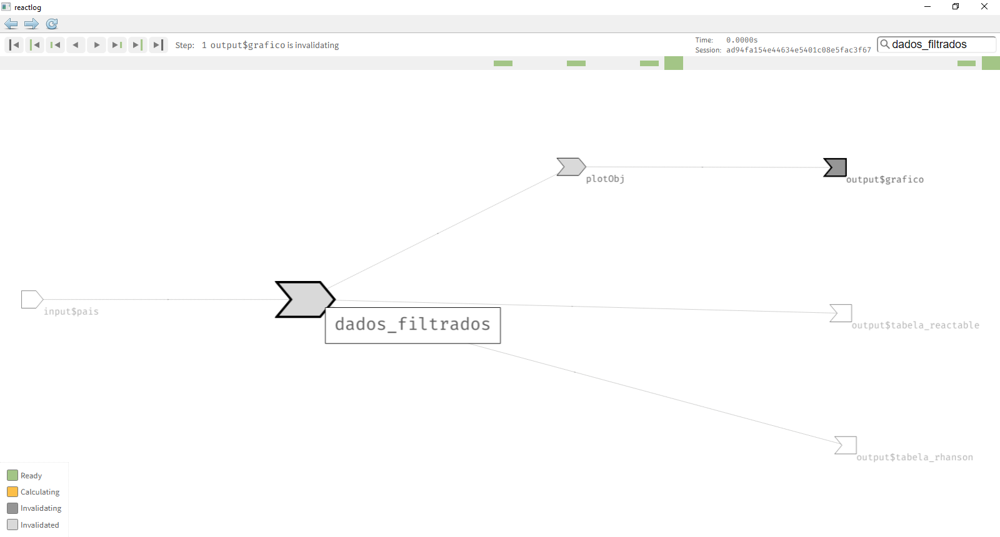{width="60%"}

O caminho até o primeiro objeto válido é seguido, então, pra cada elemento inválido

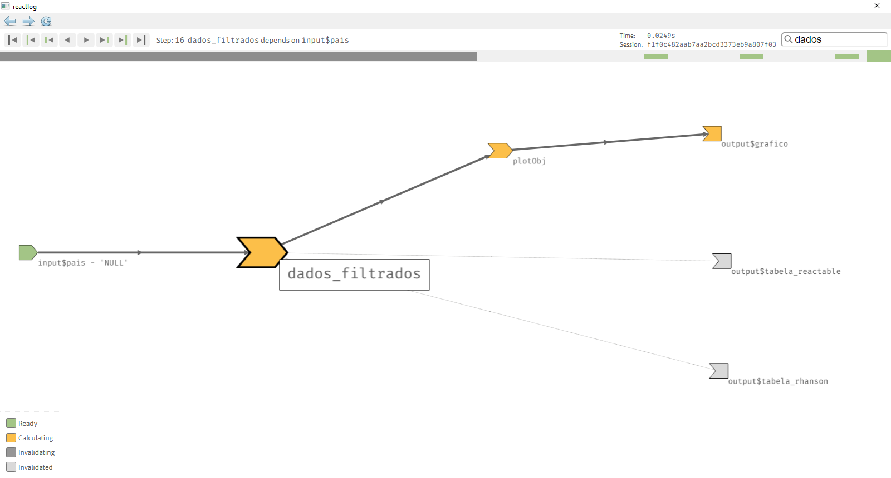{width="60%"}

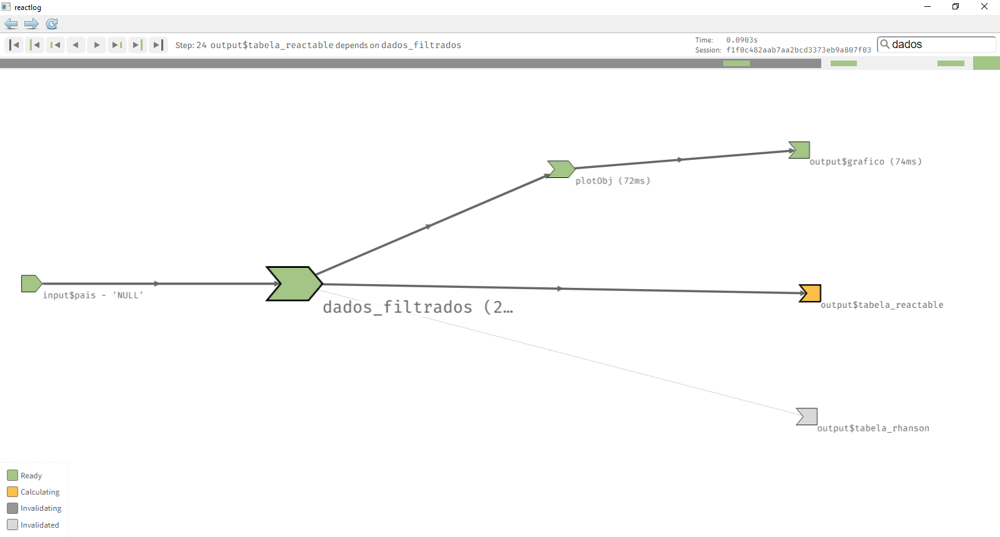{width="60%"}

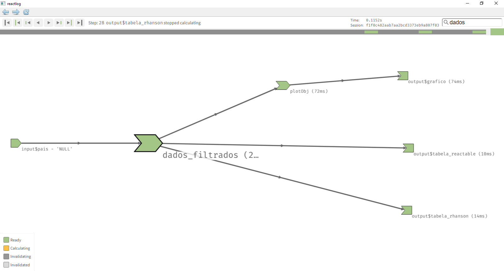{width="60%"}


## Reatividade quando o usuário muda um input

`r slide_atual = slide_atual + 1`


Quando um usuário muda um input, ele fica inválido.

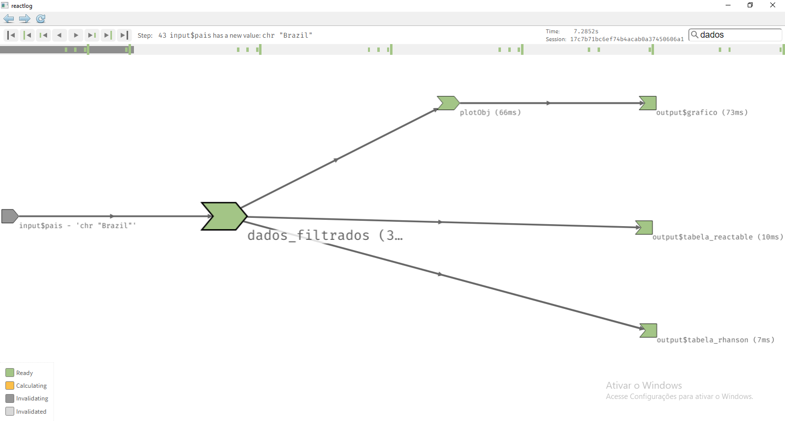{width="60%"}

Isso invalida todos os objetos que dependem dele

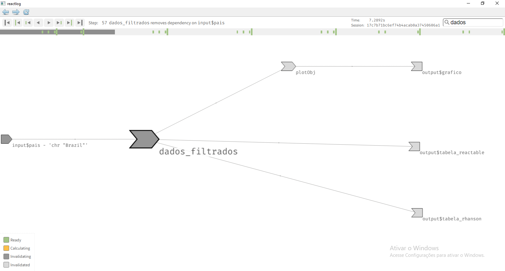{width="60%"}

O processo de cálculo é seguido de novo

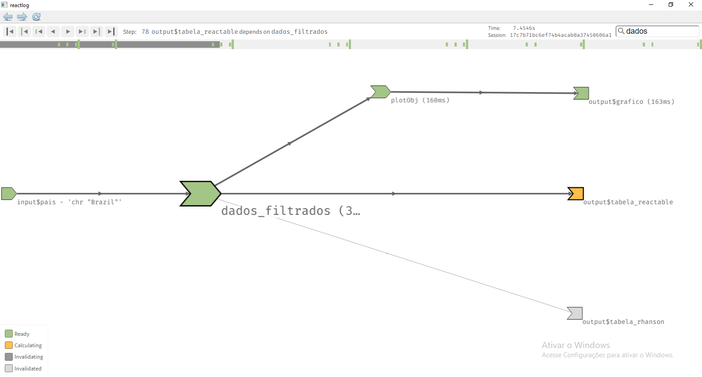{width="60%"}


## Ativando a reatividade apenas quando um evernto acontece: eventReactive
`r slide_atual = slide_atual + 1`

Nem sempre é interessante que todos os cálculos sejam disparados assim que o usuário muda o valor do input.

Pode ser que os cálculos sejam demorados, por exemplo, ou que haja muitos inputs para ajustar.

O eventReactive só é disparado mediante um evento específico, por exemplo o clique em um actionButton()

Para iso, ao invés de usar o reactive, vamos usar o eventReactive, que vai observar um actionButton


```{r, eval=FALSE}
 
library(shiny)
library(reactable)
library(rhandsontable)
library(gapminder)
library(tidyverse)


selectPaises <-     
    selectInput(
        "pais", 
        label = "País", 
        choices = gapminder$country %>%  unique() %>%  sort(),
        multiple = TRUE 
    )

botao <- actionButton(inputId = "botao_vai", label = "Vai!")


ui <- fluidPage(
    h1("Dashboard Gapminder"),
    hr(),
    h3("Filtros:"),
    selectPaises,
    botao,
    h3("Gráfico:"),
    plotOutput("grafico"),
    h3("Tabela bonita:"),
    reactableOutput("tabela_reactable"),
    h3("Tabela pros viciados:"),
    rHandsontableOutput("tabela_rhanson")
)

server <- function(input, output, session) {
    
    
    
    dados_filtrados <- eventReactive(
      eventExpr = input$botao_vai, 
      valueExpr = 
      {
        
        gapminder %>% 
            filter(country %in% input$pais)
        
    })
    
    
    output$grafico <- renderPlot({
            dados_filtrados() %>% 
            ggplot() +
            geom_line(aes(x = year, y = gdpPercap, color = country )) +
            geom_point(aes(x = year, y = gdpPercap, color = country )) +
            theme_light()
        
    }) 
    
    
    output$tabela_reactable <- renderReactable({
        
        dados_filtrados() %>% 
            select(
                country,
                year,
                gdpPercap
            ) %>% 
            pivot_wider(
                names_from = year,
                values_from = gdpPercap
            ) %>% 
            reactable(
                defaultColDef = colDef(
                    format = colFormat(digits = 0, separators = TRUE) 
                )
            )
        
    })
    
    
    output$tabela_rhanson <- renderRHandsontable({

        dados_filtrados() %>% 
            select(
                country,
                year,
                gdpPercap
            ) %>% 
            pivot_wider(
                names_from = year,
                values_from = gdpPercap
            ) %>% 
            mutate_at(
                vars(matches("[0-9]{4}")),
                ~round(x = .x, digits = 0)
            ) %>% 
            rhandsontable(
                readOnly = TRUE
            ) %>% 
            hot_cols(
                format = "0,000",
                language = "pt-BR"
            )
        
    })
    
    
}


shinyApp(ui, server)


```


## Seguindo os passos de um eventReactive
`r slide_atual = slide_atual + 1`

No primeiro momento, o eventReactive consulta o actionButton e verifica que não é necessário ser disparado, portanto fica "ready" sem disparar nada para os elementos posteriores da cadeia.


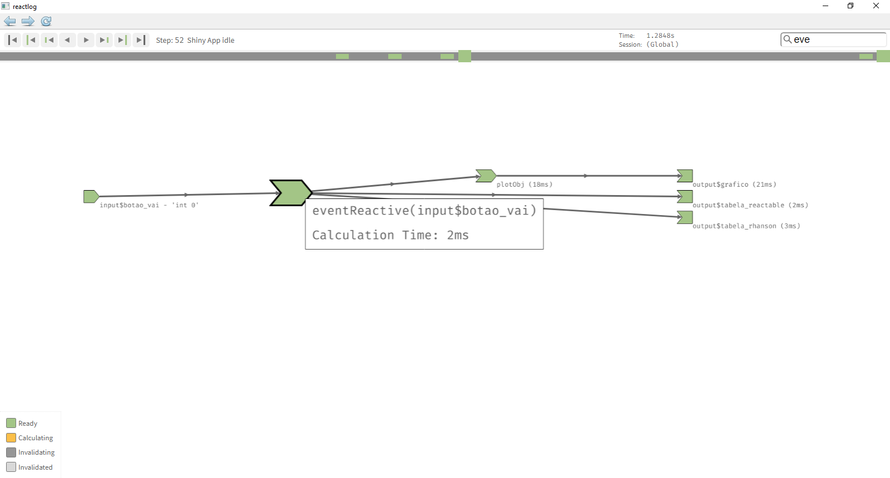{width="60%"}


No momento em que clicamos no botão, todos os elementos dependentes são invalidados


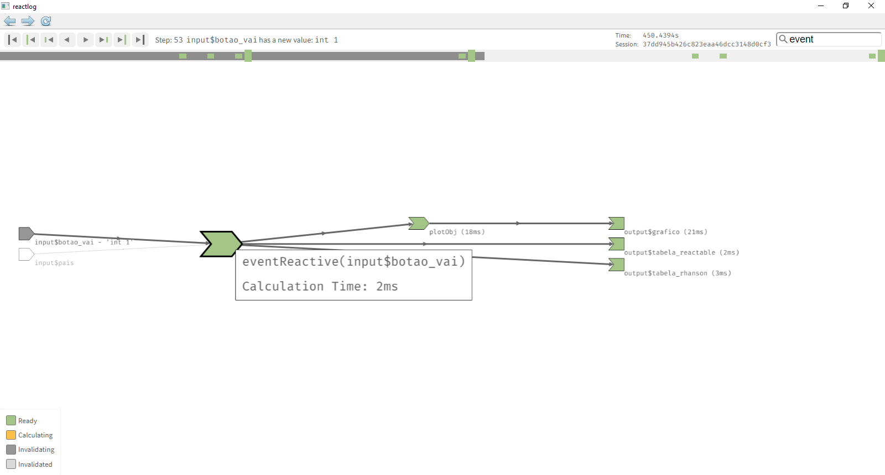{width="60%"}

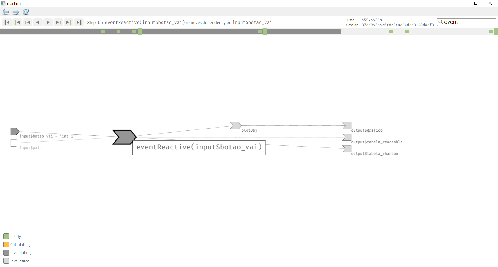{width="60%"}


Então os elementos buscam de novo os valores dos quais dependem

Dessa vez, como o objeto que disparao eventReactive tem valor 1, o valor é calculado, e o input do qual o cálculo é consultado


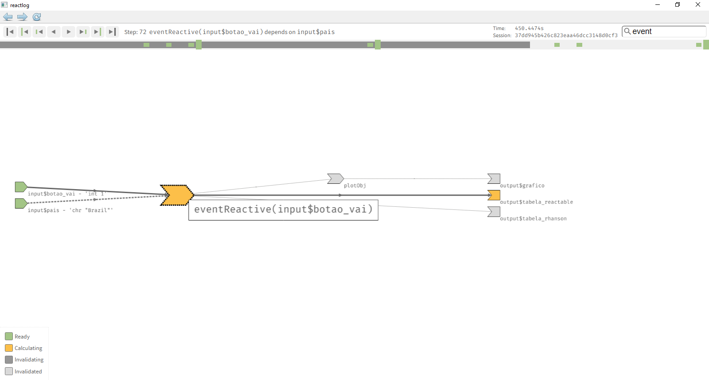{width="60%"}

Todos os valores são calculados e o grafo fica todo em estado "ready".

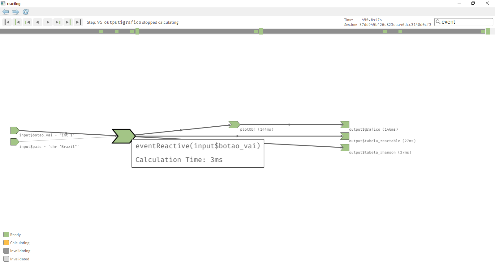{width="60%"}


Quando o input é alterado, ele não causa a invalidez dos outros elementos porque o botão não mudou de valor

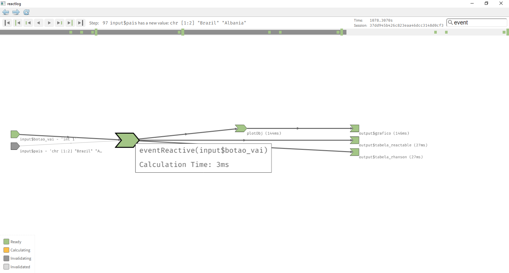{width="60%"}

Apenas quando o botão muda de valor, os elementos são invalidados e os cálculos, refeitos

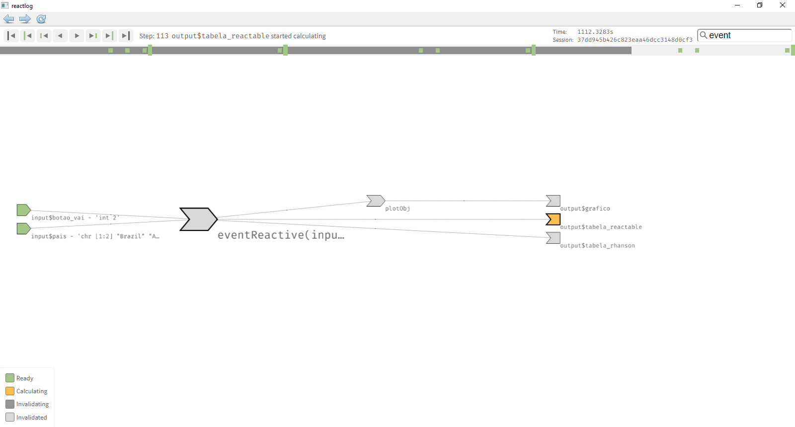{width="60%"}


## Filtro vazio = Todos ?
`r slide_atual = slide_atual + 1`

Um filtro do tipo select vazio pode querer dizer que o usuário que ver todos os elementos. Podemos emular esse comportamento acrescentando uma operação "ou" testando se o valor relativo ao filtro tem comprimento zero.

Incluí aqui uma função chamada browser(), que faz com que a execução seja interrompida. A função browser estabelece um breakpoint na execução. Assim o desenvolvedor pode visualizar o estado das variáveis. Esta técnica de debug é importante, principalmente nos casos de programação reativa.


```{r eval = FALSE}


library(shiny)
library(reactable)
library(rhandsontable)
library(gapminder)
library(tidyverse)


selectContinentes <-     
    selectInput(
        "continent", 
        label = "Continente", 
        choices = gapminder$continent %>%  unique() %>%  sort(),
        multiple = TRUE 
    )


selectPaises <-     
    selectInput(
        "pais", 
        label = "País", 
        choices = gapminder$country %>%  unique() %>%  sort(),
        multiple = TRUE 
    )

botao <- actionButton(inputId = "botao_vai", label = "Vai!")


ui <- fluidPage(
    h1("Dashboard Gapminder"),
    hr(),
    h3("Filtros:"),
    selectContinentes,
    selectPaises,
    botao,
    h3("Gráfico:"),
    plotOutput("grafico"),
    h3("Tabela bonita:"),
    reactableOutput("tabela_reactable"),
    h3("Tabela pros viciados:"),
    rHandsontableOutput("tabela_rhanson")
)

server <- function(input, output, session) {
    
    
    
    dados_filtrados <- eventReactive(
        eventExpr = input$botao_vai, 
        valueExpr = 
            {
                browser()
                gapminder %>% 
                    filter(country %in% input$pais | length(input$pais) == 0) %>% 
                    filter(continent %in% input$continent | length(input$continent) == 0)
                
            })
    
    
    output$grafico <- renderPlot({
        dados_filtrados() %>% 
            ggplot() +
            geom_line(aes(x = year, y = gdpPercap, color = country )) +
            geom_point(aes(x = year, y = gdpPercap, color = country )) +
            theme_light()
        
    }) 
    
    
    output$tabela_reactable <- renderReactable({
        
        dados_filtrados() %>% 
            select(
                country,
                year,
                gdpPercap
            ) %>% 
            pivot_wider(
                names_from = year,
                values_from = gdpPercap
            ) %>% 
            reactable(
                defaultColDef = colDef(
                    format = colFormat(digits = 0, separators = TRUE) 
                )
            )
        
    })
    
    
    output$tabela_rhanson <- renderRHandsontable({
        
        dados_filtrados() %>% 
            select(
                country,
                year,
                gdpPercap
            ) %>% 
            pivot_wider(
                names_from = year,
                values_from = gdpPercap
            ) %>% 
            mutate_at(
                vars(matches("[0-9]{4}")),
                ~round(x = .x, digits = 0)
            ) %>% 
            rhandsontable(
                readOnly = TRUE
            ) %>% 
            hot_cols(
                format = "0,000",
                language = "pt-BR"
            )
        
    })
    
    
}


shinyApp(ui, server)


```


## Selects progressivos com um observer
`r slide_atual = slide_atual + 1`


Os filtros de continentes e países, neste caso, podem ser progressivos, pois existe uma relação 1 para n dos continentes com os países (cada continente pode estar ligado a vários países e cada país está ligado a um continente)

Vamos atualizar o select de países de acordo com os continentes escolhidos. Para isso vamos usar a função observe, que cria um observer. O observer é copmo um reactive mas não retorna um valor. Ee executa uma ação. É o tipo de elemento que deve ser usado quando precisamos disparar uma ação quando algum valor muda 

No caso, a ação que é disparada é a alteração das opções do select de países


{width="60%"}


```{r, eval=FALSE}


library(shiny)
library(reactable)
library(rhandsontable)
library(gapminder)
library(tidyverse)


selectContinentes <-     
    selectInput(
        "continent", 
        label = "Continente", 
        choices = gapminder$continent %>%  unique() %>%  sort(),
        multiple = TRUE 
    )


selectPaises <-     
    selectInput(
        "pais", 
        label = "País", 
        choices = gapminder$country %>%  unique() %>%  sort(),
        multiple = TRUE 
    )

botao <- actionButton(inputId = "botao_vai", label = "Vai!")


ui <- fluidPage(
    h1("Dashboard Gapminder"),
    hr(),
    h3("Filtros:"),
    selectContinentes,
    selectPaises,
    botao,
    h3("Gráfico:"),
    plotOutput("grafico"),
    h3("Tabela bonita:"),
    reactableOutput("tabela_reactable"),
    h3("Tabela pros viciados:"),
    rHandsontableOutput("tabela_rhanson")
)

server <- function(input, output, session) {
    
  

    paises_para_select <- reactive({
        
        resposta <- gapminder %>% 
            filter(continent %in% input$continent | length(input$continent) == 0 ) %>% 
            pull(country) %>% 
            unique() %>% 
            sort()
        
        resposta
        
    })
    

    observe(
        updateSelectInput(session = session, inputId = "pais", choices = paises_para_select() )
    )
    
    
    dados_filtrados <- eventReactive(
        eventExpr = input$botao_vai, 
        valueExpr = 
            {
                gapminder %>% 
                    filter(country %in% input$pais | length(input$pais) == 0) %>% 
                    filter(continent %in% input$continent | length(input$continent) == 0)
                
            })
    
    
    output$grafico <- renderPlot({
        dados_filtrados() %>% 
            ggplot() +
            geom_line(aes(x = year, y = gdpPercap, color = country )) +
            geom_point(aes(x = year, y = gdpPercap, color = country )) +
            theme_light()
        
    }) 
    
    
    output$tabela_reactable <- renderReactable({
        
        dados_filtrados() %>% 
            select(
                country,
                year,
                gdpPercap
            ) %>% 
            pivot_wider(
                names_from = year,
                values_from = gdpPercap
            ) %>% 
            reactable(
                defaultColDef = colDef(
                    format = colFormat(digits = 0, separators = TRUE) 
                )
            )
        
    })
    
    
    output$tabela_rhanson <- renderRHandsontable({
        
        dados_filtrados() %>% 
            select(
                country,
                year,
                gdpPercap
            ) %>% 
            pivot_wider(
                names_from = year,
                values_from = gdpPercap
            ) %>% 
            mutate_at(
                vars(matches("[0-9]{4}")),
                ~round(x = .x, digits = 0)
            ) %>% 
            rhandsontable(
                readOnly = TRUE
            ) %>% 
            hot_cols(
                format = "0,000",
                language = "pt-BR"
            )
        
    })
    
    
}


shinyApp(ui, server)


```


## Estrutura de Dashboard
`r slide_atual = slide_atual + 1`


Em muitos casos, temos painéis de visualização com várias seções diferentes.

Existem algumas bibliotecas que disponibilizam frameworks que criam menus onde é possível definir diversas seções.

Um delas é a shinydashboard, que oferece uma estrutura via dashboardPage(), que deve receber a especificação do cabeçalho, do menu lateral e do corpo principal

```{r, eval=FALSE}

ui <- dashboardPage(
    header = header,
    sidebar = sidebar,
    body = body
)


```


O menu lateral aponta para itens que têm o mesmo nome definido no corpo principal


```{r, eval=FALSE}

header <- dashboardHeader(
    title = "Gapminder"
)


sidebar <- dashboardSidebar(
    sidebarMenu(
        menuItem(
            text = "PIB", tabName = "tab_pib"
        ) ,
        menuItem(
            text = "Expec. Vida", tabName = "tab_expec"            
        )
    )
)


body <- dashboardBody(
    tabItems(
        tabItem(
            tabName = "tab_pib",
            "Sou o pib"
        ) ,
        tabItem(
            tabName = "tab_expec",
            "Sou expec"
        ) 
    )
)


```


Juntando tudo:


```{r, eval=FALSE}


library(shiny)
library(reactable)
library(rhandsontable)
library(gapminder)
library(tidyverse)
library(shinydashboard)


header <- dashboardHeader(
    title = "Gapminder"
)


sidebar <- dashboardSidebar(
    sidebarMenu(
        menuItem(
            text = "PIB", tabName = "tab_pib"
        ) ,
        menuItem(
            text = "Expec. Vida", tabName = "tab_expec"            
        )
    )
)


body <- dashboardBody(
    tabItems(
        tabItem(
            tabName = "tab_pib",
            "Sou o pib"
        ) ,
        tabItem(
            tabName = "tab_expec",
            "Sou expec"
        ) 
    )
)


ui <- dashboardPage(
    header = header,
    sidebar = sidebar,
    body = body
)


server <- function(input, output, session){
    
}


shinyApp(
    ui = ui, server = server
)


```


  
## Dashboard sem DRY - don't repeat yourself
`r slide_atual = slide_atual + 1`


Muitas vezes várias seções do Dashboard são parecidas.

O jeito mais ingênuo de fazer é copiar o codigo e modificar uma pequena parte da cópia.

Isso é uma péssima prática, que viola um principio chamado DRY - Don´t Repeat Yourself.

Código copiado é uma das piores pragas da programação. É também uma das mais comuns.

Todo código significa um legado, um elemento que deve ser mantido.


```{r, eval=FALSE}

library(shiny)
library(reactable)
library(rhandsontable)
library(gapminder)
library(tidyverse)
library(shinydashboard)


header <- dashboardHeader(
    title = "Gapminder"
)


sidebar <- dashboardSidebar(
    sidebarMenu(
        menuItem(
            text = "PIB", tabName = "tab_pib"
        ) ,
        menuItem(
            text = "Expec. Vida", tabName = "tab_expec"            
        )
    )
)

selectContinentes <-     
    selectInput(
        "continent", 
        label = "Continente", 
        choices = gapminder$continent %>%  unique() %>%  sort(),
        multiple = TRUE 
    )


selectPaises <-     
    selectInput(
        "pais", 
        label = "País", 
        choices = gapminder$country %>%  unique() %>%  sort(),
        multiple = TRUE 
    )

botao <- actionButton(inputId = "botao_vai", label = "Vai!")


nucleo <- fluidPage(
    h1("Dashboard Gapminder - País"),
    hr(),
    h3("Filtros:"),
    selectContinentes,
    selectPaises,
    botao,
    h3("Gráfico:"),
    plotOutput("grafico")
)


selectContinentes_expec <-     
    selectInput(
        "continent_expec", 
        label = "Continente", 
        choices = gapminder$continent %>%  unique() %>%  sort(),
        multiple = TRUE 
    )


selectPaises_expec <-     
    selectInput(
        "pais_expec", 
        label = "País", 
        choices = gapminder$country %>%  unique() %>%  sort(),
        multiple = TRUE 
    )

botao_expec <- actionButton(inputId = "botao_vai_expec", label = "Vai!")


nucleo_expec <- fluidPage(
    h1("Dashboard Gapminder - Expectativa de vida"),
    hr(),
    h3("Filtros:"),
    selectContinentes_expec,
    selectPaises_expec,
    botao_expec,
    h3("Gráfico:"),
    plotOutput("grafico_expec"),
)


body <- dashboardBody(
    tabItems(
        tabItem(
            tabName = "tab_pib",
            nucleo
        ) ,
        tabItem(
            tabName = "tab_expec",
            nucleo_expec
        ) 
    )
)


ui <- dashboardPage(
    header = header,
    sidebar = sidebar,
    body = body
)


server <- function(input, output, session){
    

    paises_para_select <- reactive({
        
        resposta <- gapminder %>% 
            filter(continent %in% input$continent | length(input$continent) == 0 ) %>% 
            pull(country) %>% 
            unique() %>% 
            sort()
        
        resposta
        
    })
    
    paises_para_select_expec <- reactive({
        
        resposta <- gapminder %>% 
            filter(continent %in% input$continent_expec | length(input$continent_expec) == 0 ) %>% 
            pull(country) %>% 
            unique() %>% 
            sort()
        
        resposta
        
    })
    
    observe(
        updateSelectInput(session = session, inputId = "pais", choices = paises_para_select() )
    )
    
    observe(
        updateSelectInput(session = session, inputId = "pais_expec", choices = paises_para_select_expec() )
    )
    
    dados_filtrados <- eventReactive(
        eventExpr = input$botao_vai, 
        valueExpr = 
            {
                gapminder %>% 
                    filter(country %in% input$pais | length(input$pais) == 0) %>% 
                    filter(continent %in% input$continent | length(input$continent) == 0)
                
            })
    
    
    dados_filtrados_expec <- eventReactive(
        eventExpr = input$botao_vai_expec, 
        valueExpr = 
            {
                gapminder %>% 
                    filter(country %in% input$pais_expec | length(input$pais_expec) == 0) %>% 
                    filter(continent %in% input$continent_expec | length(input$continent_expec) == 0)
                
            })
    
    
    output$grafico <- renderPlot({
        dados_filtrados() %>% 
            ggplot() +
            geom_line(aes(x = year, y = gdpPercap, color = country )) +
            geom_point(aes(x = year, y = gdpPercap, color = country )) +
            theme_light()
        
    }) 
    
    
    output$grafico_expec <- renderPlot({
        dados_filtrados_expec() %>% 
            ggplot() +
            geom_line(aes(x = year, y = lifeExp, color = country )) +
            geom_point(aes(x = year, y = lifeExp, color = country )) +
            theme_light()
        
    }) 
    
    
}


shinyApp(
    ui = ui, server = server
)


```


## Além de DRY, Acoplamento e Coesão
`r slide_atual = slide_atual + 1`


Duas metas muito importantes na programação são Alta Coesão e Baixo Acoplamento. Essas metas estão muito aquém do que podem estar na situação que estamos visualizando.


Coesão: um componente do software deve servir a APENAS UMA responsabilidade bem definida. Os elementos contidos neste componente devem colaborar e depender um dos outros mais do que dependem de componentes externos.


Acoplamento: componentes de software devem depender o menos possível um dos outros. Se não houver acoplamento, o software não funciona, mas ele deve ser minimizado.


## Acoplamento e Coesão no dashboard usado como exemplo
`r slide_atual = slide_atual + 1`

Veja como no dashboard abaixo o único módulo existente tem duas responsabilidades: lidar com a apresentação do PIB e com a apresentação da Expectativa de Vida.

Além disso conseguimos notar dois grupos de componentes que precisam realmente se relacionar entre si. Entretanto nada impede que os componentes se relacionem, o que aumentaria a complexidade desnecessariamente e poderia levar a bugs. 


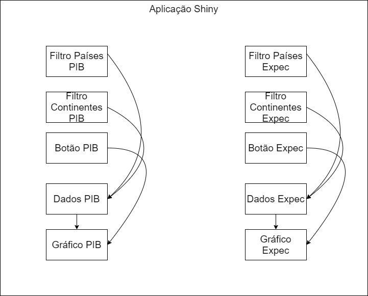{width="60%"}


## Uma divisão em módulos melhora a arquitetura
`r slide_atual = slide_atual + 1`


Se dividirmos a aplicação em dois módulos, teremos maior coesão: cada módulo vai cuidar de uma só responsabilidade e os componentes contidos em cada módulo são realmente os que deveriam se relacionar.


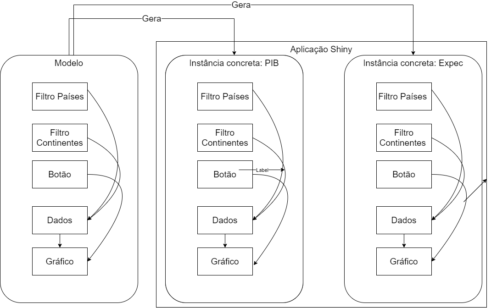{width="60%"}


## E o princípio DRY - Don't Repeat Yourself ?
`r slide_atual = slide_atual + 1`


Podemos perceber também que os módulos são praticamente iguais: a forma como os componentes se relacionam são iguais, e o gráfico é igual. A única diferença é a coluna usada para o eixo y do gráfico.


É posível usar uma técnica que define modelos de módulos que são usados para gerar instâncias concretas que se comportam de forma diferebnte apenas onde necessário.


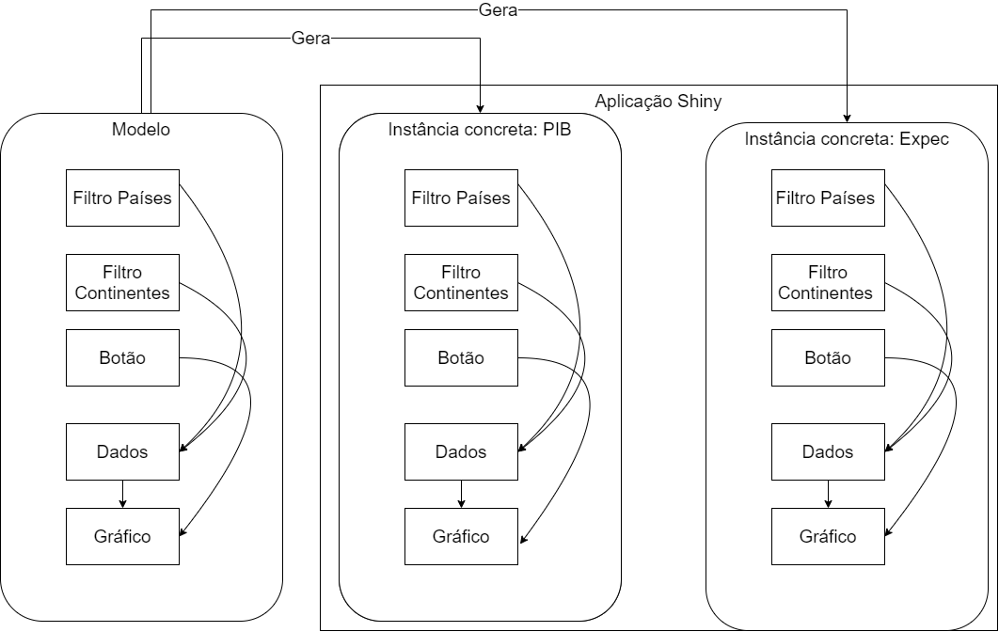{width="60%"}


## Shiny Modules
`r slide_atual = slide_atual + 1`


Os shiny modules são a forma de definir templates de módulos com suas funções UI e Server que podem ser instanciados várias vezes. Cada instância possui um valor diferente em sua variável namespace.


Primeiro vamos escrever um módulo que só vai se preocupar em emular o comportamento para a primeira tab do nosso namespace (PIB).

Depois vamos estendê-lo para funcionar tanto para PIB quando para Expectativa de Vida.

A convenção mais usada é escrever as funções "nomedomodulo_ui" e "nomedomodulo_server" em um arquivo "nomedomodulo.R" que ficará em uma pasta "R" na raiz do diretório onde fica aplicação Shiny (ou seja, onde fica o arquivo app.R ou UI.R e Server.R).

No nosso caso, vamos escrever o arquivo visualiza_gapminder.R assim como abaixo.


Na ui:

- Vamos encapsular o código que gera a ui em uma função que recebe id

- Vamos encapsular os nomes dos id originais dos componentes com NS(id, id_original_do_componente)


Na server:

- A função deve receber id

- Deve chamar uma função chamada moduleServer


```{r, eval=FALSE}


library(shiny)
library(tidyverse)


visualiza_gapminder_ui <- function(id){
  
  selectContinentes <-     
    selectInput(
      inputId = NS(id, "continent"), 
      label = "Continente", 
      choices = gapminder$continent %>%  unique() %>%  sort(),
      multiple = TRUE 
    )
  
  
  selectPaises <-     
    selectInput(
      inputId = NS(id, "pais"),
      label = "País", 
      choices = gapminder$country %>%  unique() %>%  sort(),
      multiple = TRUE 
    )
  
  botao <- actionButton(inputId = NS(id, "botao_vai"), label = "Vai!")
  
  
  nucleo <- fluidPage(
    h1("Dashboard Gapminder - País"),
    hr(),
    h3("Filtros:"),
    selectContinentes,
    selectPaises,
    botao,
    h3("Gráfico:"),
    plotOutput(NS(id, "grafico"))
  )
  
  
  nucleo  
  
}


visualiza_gapminder_server <- function(id){
  
  moduleServer(id, function(input, output, session){
    
    
    paises_para_select <- reactive({
      
      resposta <- gapminder %>% 
        filter(continent %in% input$continent | length(input$continent) == 0 ) %>% 
        pull(country) %>% 
        unique() %>% 
        sort()
      
      resposta
      
    })
    
    observe(
      updateSelectInput(session = session, inputId = "pais", choices = paises_para_select() )
    )
    
    
    dados_filtrados <- eventReactive(
      eventExpr = input$botao_vai, 
      valueExpr = 
        {
          gapminder %>% 
            filter(country %in% input$pais | length(input$pais) == 0) %>% 
            filter(continent %in% input$continent | length(input$continent) == 0)
          
        })
    
    
    output$grafico <- renderPlot({
      dados_filtrados() %>% 
        ggplot() +
        geom_line(aes(x = year, y = gdpPercap, color = country )) +
        geom_point(aes(x = year, y = gdpPercap, color = country )) +
        theme_light()
      
    }) 
    
  })
}


```


No código principal do shiny, as funções relativas devem ser chamadas.


```{r, eval=FALSE}


library(shiny)
library(gapminder)
library(tidyverse)
library(shinydashboard)


header <- dashboardHeader(
  title = "Gapminder"
)


sidebar <- dashboardSidebar(
  sidebarMenu(
    menuItem(
      text = "PIB", tabName = "tab_pib"
    )
  )
)

body <- dashboardBody(
  tabItems(
    tabItem(
      tabName = "tab_pib",
      visualiza_gapminder_ui(id = "pib")
    ) 
  )
)


ui <- dashboardPage(
  header = header,
  sidebar = sidebar,
  body = body
)


server <- function(input, output, session){
  
  visualiza_gapminder_server(id = "pib")
  
  
}


shinyApp(
  ui = ui, server = server
)


```


## Melhorando a organização da aplicação Shiny
`r slide_atual = slide_atual + 1`

Para tornar o módulo genérico precisamos tratar o código abaixo.


```{r, eval=FALSE}
    output$grafico <- renderPlot({
      dados_filtrados() %>% 
        ggplot() +
        geom_line(aes(x = year, y = gdpPercap, color = country )) +
        geom_point(aes(x = year, y = gdpPercap, color = country )) +
        theme_light()
      
    }) 

```


Aqui temos um problema de múltiplas responsabilidades.

Este código é responsável por algumas coisas, dentre elas

- Gerar um gráfico específico com uma linha pra cada país com eixo x = ano e eixo y igual à métrica de PIB

- Definir o gráfico deve aparecer no output chamado grafico e quais dados devem ser usados pra ele.

Temos uma oportunidade de melhorar bastante o código separando essas responsabilidades.

Da forma como o código está há vários problemas: não podemos, por exemplo, reutilizar o mesmo gráfico em outros lugares.

Vamos ver posteriormente como isso é mais importante do que você pode imaginar agora.


## Boa prática Shiny: separar implementação não depende de reatividade
`r slide_atual = slide_atual + 1`

De modo geral é positivo separar a parte do código que depende dos inputs, reactives etc, ou seja, a parte que tem que rodar dentro do ambiente reativo das parte do código que implementa funcionalidades que não dependem de reatividade.

A construção de um gráfico não depende de reatividade, as informações necessárias que vêm do ambiente reativo podem ser tratados antes da chamada da função que gera o gráfico.

Assim, a construção do gráfico vai passar para uma função separada, que sera colocada em um arquivo R separado também.


```{r, eval=FALSE}

gera_grafico_series_temporais_pais <- function(dados){

    ggplot(dados) +
    geom_line(aes(x = year, y = gdpPercap, color = country )) +
    geom_point(aes(x = year, y = gdpPercap, color = country )) +
    theme_light()
}


```


Vamos deixar o código no shiny module tratar as informações vindas do ambiente reativo

Repare que chamei a funcão e "gera_grafico_series_temporais_pais" e não "gera_grafico_series_temporais_pais", já que a ideia é tornar essa função genérica pra pib, expectativa de vida etc.


```{r, eval=FALSE}

output$grafico <- renderPlot({
  gera_grafico_series_temporais_pais(dados_filtrados())
}) 


```


Agora podemos chamar essa função de outros suportes, como relatórios estáticos ou relatórios shiny


## Recebendo por parâmetro o campo a mapear na escala
`r slide_atual = slide_atual + 1`

Vamos preparar nossa função para receber via parâmetro o nome do campo que vai ser mapeado no eixo y, já que ora vamos usar PIB, ora vamos usar Expectativa de Vida

Para isso vamos usar .data[[nome_do_campo]] dentro de aes()


```{r, eval=FALSE}

gera_grafico_series_temporais_pais <- function(dados, campo_y){
  
  ggplot(dados) +
    geom_line(aes(x = year, y = .data[[campo_y]] , color = country )) +
    geom_point(aes(x = year, y =  .data[[campo_y]], color = country )) +
    theme_light()
}


```


## Generalizando o módulo para PIb, Expectativa de Vida, ...
`r slide_atual = slide_atual + 1`


Agora precisamos que o nome módulo passe o nome do campo correto para a função que gera o gráfico

Uma forma de fazer isso é criar uma estrutura que contenha, para cada id possível, informações para execução da aplicação


```{r, eval=FALSE}


library(shiny)
library(tidyverse)


info_modulos <- tribble(
  ~id,   ~campo_y,      ~titulo,
  "pib",   "gdpPercap",   "PIB",
  "expec", "lifeExp",     "Expectativa de Vida",
  "pop",   "pop",         "População"
  
)


define_titulo_visualiza_gapminder <- function(id_escolhido){
  info_modulos %>% 
    filter(
      id == id_escolhido
    ) %>% 
    pull(titulo)
}


define_campo_y_visualiza_gapminder <-  function(id_escolhido){
  info_modulos %>% 
    filter(
      id == id_escolhido
    ) %>% 
    pull(campo_y)
}


visualiza_gapminder_ui <- function(id){
  
  selectContinentes <-     
    selectInput(
      inputId = NS(id, "continent"), 
      label = "Continente", 
      choices = gapminder$continent %>%  unique() %>%  sort(),
      multiple = TRUE 
    )
  
  
  selectPaises <-     
    selectInput(
      inputId = NS(id, "pais"),
      label = "País", 
      choices = gapminder$country %>%  unique() %>%  sort(),
      multiple = TRUE 
    )
  
  botao <- actionButton(inputId = NS(id, "botao_vai"), label = "Vai!")
  
  
  
  nucleo <- fluidPage(
    h1("Dashboard Gapminder - {define_titulo_visualiza_gapminder(id)}" %>% str_glue()),
    hr(),
    h3("Filtros:"),
    selectContinentes,
    selectPaises,
    botao,
    h3("Gráfico:"),
    plotOutput(NS(id, "grafico"))
  )
  
  
  nucleo  
  
}


visualiza_gapminder_server <- function(id){
  
  moduleServer(id, function(input, output, session){
    
    
    paises_para_select <- reactive({
      
      resposta <- gapminder %>% 
        filter(continent %in% input$continent | length(input$continent) == 0 ) %>% 
        pull(country) %>% 
        unique() %>% 
        sort()
      
      resposta
      
    })
    
    observe(
      updateSelectInput(session = session, inputId = "pais", choices = paises_para_select() )
    )
    
    
    dados_filtrados <- eventReactive(
      eventExpr = input$botao_vai, 
      valueExpr = 
        {
          gapminder %>% 
            filter(country %in% input$pais | length(input$pais) == 0) %>% 
            filter(continent %in% input$continent | length(input$continent) == 0)
          
        })
    
    
    output$grafico <- renderPlot({
      gera_grafico_series_temporais_pais(
        dados = dados_filtrados(),
        campo_y = define_campo_y_visualiza_gapminder(id)
      )
    }) 
    
  })
}


```


Na aplicação criamos os itens de menu necessários


```{r, eval=FALSE}


library(shiny)
library(gapminder)
library(tidyverse)
library(shinydashboard)


header <- dashboardHeader(
  title = "Gapminder"
)


sidebar <- dashboardSidebar(
  sidebarMenu(
    menuItem(
      text = "PIB", tabName = "tab_pib"
    ),
    menuItem(
      text = "Expectativa de vida", tabName = "tab_expec"
    ),
    menuItem(
      text = "População", tabName = "tab_pop"
    )
  )
)

body <- dashboardBody(
  tabItems(
    tabItem(
      tabName = "tab_pib",
      visualiza_gapminder_ui(id = "pib")
    ), 
    tabItem(
      tabName = "tab_expec",
      visualiza_gapminder_ui(id = "expec")
    ) ,
    tabItem(
      tabName = "tab_pop",
      visualiza_gapminder_ui(id = "pop")
    ) 
  )
)


ui <- dashboardPage(
  header = header,
  sidebar = sidebar,
  body = body
)


server <- function(input, output, session){
  
  visualiza_gapminder_server(id = "pib")
  visualiza_gapminder_server(id = "expec")
  visualiza_gapminder_server(id = "pop")
  
  
}


shinyApp(
  ui = ui, server = server
)


```


## Funcionalidade de baixar dados
`r slide_atual = slide_atual + 1`


Uma funcionalidade bastante pedida pelos usuários dos dashboards é a possibilidade de baixar dados referentes à análise.

Para fazer isso, precisamos incluir um downloadButton ou downloadLink na ui. Cuidado pra não esquecer a NS()

Vamos usar para mostrar o uso das fontes font awesome

```{r, eval=FALSE}

downloadLink(outputId = NS(id,"baixar_dados"), label = HTML("<i class='fas fa-file-excel'></i>")),

```


Na server, precisamos conectar este output a funções que vão determinar o nome e o conteúdo do arquivo a ser baixado

Vamos baixar uma planilha excel, portanto vamos usar a função write_xlsx a biblioteca writexl

```{r, eval=FALSE}

    output$baixar_dados <- downloadHandler(
      filename = function(){
        "dados.xlsx"
      },
      content = function(arquivo){
        write_xlsx(dados_filtrados(), arquivo)
      }
    )


```


## Gráficos interativos
`r slide_atual = slide_atual + 1`

Algumas bibliotecas possibilitam transformar o gráfico vindo da ggplot em um html widget. 

O HTML widget, diferentemente do resultado do ggplot, não é uma imagem, mas sim um conjunto de elementos em html que podem ter comportamento ativado por código javascript, facilitando a interatividade.

Existem vários tipos de interação possíveis entre esses gráficos interativos e o usuário vamos nos concentrar nos tooltips

Pelo menos duas bibliotecas ajudam a transformar o resultado do gglplot em um html widget: ggiraph e plotly


## Gráfico interativo via ggiraph
`r slide_atual = slide_atual + 1`


Para gerar os elementos interativos para a ggiraph é necessário usar os elementos geom_xxxx_interactive, e mapear o texto desejadoà escala "tooltip"


```{r, eval=FALSE}
gera_grafico_series_temporais_pais <- function(dados, campo_y = "gdpPercap"){
  
  ggplot(dados) +
    geom_line(aes(x = year, y = .data[[campo_y]] , color = country )) +
    geom_point_interactive(
      aes(
        x = year, 
        y =  .data[[campo_y]], 
        color = country ,
        tooltip = paste0(
          country,
          ", ",
          year,
          ": ",
          number(.data[[campo_y]], accuracy = 1, big.mark = ".")
        )
      )
    ) +
    theme_light() +
    theme(
      legend.position = "top"
    )
  

}


```


Temos que encapsular o gráfico em uma chamada a girafe(). Criamos uma função para isso

```{r, eval=FALSE}

encapsula_ggiraph <- function(grafico){
  
  girafe(
    code = {print(grafico)},
    width_svg = 10,
    height_svg = 6,
    options = list(
      opts_tooltip(use_fill = TRUE)
    )
  )  
}


```


## Gráfico interativo via plotly
`r slide_atual = slide_atual + 1`


Para transformar um ggplot em ploty, é necessário encapsular o gráfico na função ggplotly


```{r, eval=FALSE}

encapsula_plotly <- function(grafico){
  ggplotly(
    grafico,
    tooltip = "text"
  )
}


```


tooltip deve apontar para a escala onde a string de carateres correspondente à tooltip foi mapeada. Isso deve ser feito na construção do gráfico


```{r, eval = FALSE}

gera_grafico_series_temporais_pais <- function(dados, campo_y = "gdpPercap"){
  
  ggplot(dados) +
    geom_line(aes(x = year, y = .data[[campo_y]] , color = country )) +
    geom_point(
      aes(
        x = year, 
        y =  .data[[campo_y]], 
        color = country ,
        text = paste0(
          country,
          ", ",
          year,
          ": ",
          number(.data[[campo_y]], accuracy = 1, big.mark = ".")
        )
      )
    ) +
    theme_light() +
    theme(
      legend.position = "top"
    )
  

}


```


Devemos usar o par de funções renderPlotly e plotlyOutput


## RMarkdown
`r slide_atual = slide_atual + 1`


O RMarkdown é um tipo de documento que conjuga conteúdo textual com code chunks escritos em linguagem R.


É possível criar alguns tipos de documento, mas os mais usados são HTML e PDF (escrito em LaTeX)


Vamos demonstrar em aula a criação dos dois tipos de documento

Eles são documentos estáticos

{width="60%"}

As instruções sobre como o documento deve ser gerado são inscritas em um cabeçalho YAML. A apresentação que você está vendo é um documento RMarkdown do tipo presentation Slidy. O YAML deste documento é assim:


```{YAML}

output:
  slidy_presentation:
    css: w3c-blue.css
    fig_caption: yes
    toc: yes
    toc_depth: 3
    includes:
      in_header: header.html
      before_body: doc_prefix.html
      after_body: doc_suffix.html

bibliography: bibliography.bib

```


A geração do documento é feita com o botão "knit" ou com o atalho ctrl + shift + k


## RMarkdown + Shiny
`r slide_atual = slide_atual + 1`

Uma possibilidade muito interessante é usar o RMarkdown com um engine shiny por trás. Isso faz com que possamos criar um relatório corrido com interatividade.

Ele pode até ser uma visualização alternativa ao dashboard


Para isso, precisamos criar um YAML com a informação de que o documento terá o engine por trás


```{YAML}

title: "Teste"
output: 
  html_document:
    toc: true
    toc_float: true
    
runtime: shiny


```


Podemos usar, então, componentes de UI como os do shiny usando a função inputPanel em um code chunk.

Note que não temos como usar um observe aqui. Então usamos renderUI, que cria um ambiente reativo para criação de um componente de UI


```{r eval=FALSE}

selectContinentes <-     
  selectInput(
    inputId = "continent", 
    label = "Continente", 
    choices = gapminder$continent %>%  unique() %>%  sort(),
    multiple = TRUE 
  )


paises_para_select <- reactive({
  
  resposta <- gapminder %>% 
    filter(continent %in% input$continent | length(input$continent) == 0 ) %>% 
    pull(country) %>% 
    unique() %>% 
    sort()
  
  resposta
  
})
    

    
dados_filtrados <- reactive({
  gapminder %>% 
    filter(country %in% input$pais | length(input$pais) == 0) %>% 
    filter(continent %in% input$continent | length(input$continent) == 0)
      
})


inputPanel(

  selectContinentes,
  renderUI({
    selectInput(
      inputId = "pais",
      label = "País", 
      choices = paises_para_select(),
      multiple = TRUE 
    )
  })
  
)


```


Podemos plotar gráficos e tabelas com as funções com a função render_

```{r, eval=FALSE}


renderPlotly({
  gera_grafico_series_temporais_pais(dados_filtrados()) %>% 
    ggplotly(
      tooltip = "text"
    )
})


```


