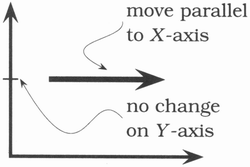
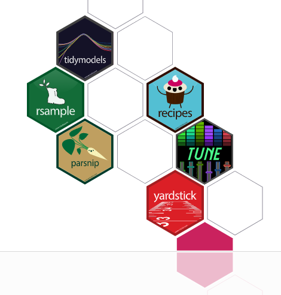
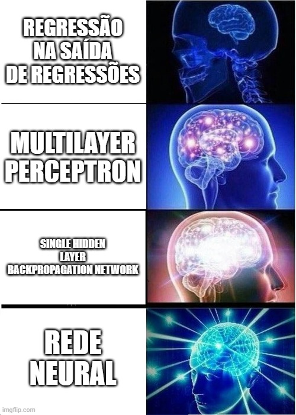
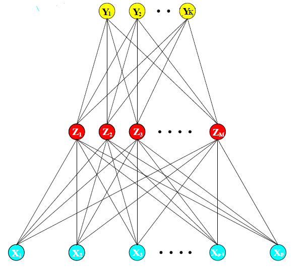

---
output:
  slidy_presentation:
    css: w3c-blue.css
    fig_caption: yes
    toc: yes
    toc_depth: 3
    includes:
      in_header: header.html
      before_body: doc_prefix.html
      after_body: doc_suffix.html

bibliography: bibliography.bib


---

```{r, warning=FALSE, message=FALSE, echo=FALSE}


library(tidymodels)
library(tidyverse)
library(skimr)
library(dotwhisker)
library(ggforce)
library(gt)
library(ggrepel)
library(rpart.plot)
library(kknn)
library(shadowtext)
library(tsibble)
library(feasts)
library(lubridate)
library(fable)
library(furrr)
```

```{r setup, include=FALSE}
 
knitr::opts_chunk$set(echo = TRUE, message = FALSE, warning = FALSE )
```

```{r, echo=FALSE}

remissivo <<- tibble(palavra = "####")

slide_atual <<- 1

a_r <- function(palavra_add){
    remissivo <<- remissivo %>% 
        bind_rows(tibble(palavra = palavra_add, slide = slide_atual))

    str_glue("**{palavra_add}**")
    
}


escreve_remissivo <- function(){
    
    remissivo_final <- remissivo %>% 
        slice(2:nrow(remissivo)) %>% 
        mutate(
            linha = row_number(),
            link = str_glue("[{palavra}](#({slide}))\n\n")
        ) %>% 
        arrange(palavra)
        
    str_flatten(remissivo_final$link, "\n\n")

}


```

# CURSO DE R PARA ANÁLISE DE DADOS


## Tidymodels

`r slide_atual = slide_atual + 1`


<div class='left' style='float:left;width:18%'>

</div>
<div class='right' style='float:right;width:78%'>

Tidymodels é um conjunto de bibliotecas que cuida de todos os passos necessários para desenvolver o workflow de seleção e avaliação de modelos de aprendizado estatístico.

O desenvolvimento é financiado pela RStudio e liderado por Max Kuhn, o principal desenvolvedor de uma biblioteca similar mais antiga: caret.

A tidymodels é toda tidy friendly. Essa é uma das diferenças em relação à caret. Ela também é mais completa e possui muito mais funcionalidades.

É possível obter mais informações em [tidymodels.org](https://www.tidymodels.org/)
</div>


## Bibliotecas ortogonais

`r slide_atual = slide_atual + 1`


<div class='left' style='float:left;width:18%'>

</div>
<div class='right' style='float:right;width:78%'>

Tidymodels é formada por pacotes ortogonais.

Este termo é emprestado da matemática. No caso de dois vetores ortogonais, podemos nos mover na direção de um deles sem que nossa projeção no outro seja alterada.

Em programação ou arquitetura de software dizemos que componentes ortogonais são desacoplados: a mudança em um componente não afeta outros. Esta propriedade exige componentes menores e mais coesos, com responsabilidades bem definidas, e permite alterações com menos efeitos colaterais. Um bom livro para quem quer entender como usar conceitos como esse em programação se chama Pragmatic Programmer, de David Thomas e Andrew Hunt.

As bibliotecas que compõem a tidymodels funcionam assim: ao configurar o workflow que vai implementar o processo de treinamento, seleção e avaliação de modelos, várias etapas ortogonais vão ser preparadas com uso de várias bibliotecas.

</div>


## Principais bibliotecas

`r slide_atual = slide_atual + 1`


<div class='left' style='float:left;width:30%'>

</div>
<div class='right' style='float:right;width:68%'>


- **workflows** ajuda a montar todas as etapas do processo de trabalho em uma estrutura de fluxo de trabalho;

- **recipes** permite criar as etapas de pré-processamento, facilitando o processo de feature engineering e sua aplicação a dados fora da amostra;

- **rsample** ajuda a dividir dados em treinamento, teste e validação e provê a infraestrutura de amostragem para realizar processos de cross-validation;

- **parnsnip** contém interfaces genéricas para vários tipos de modelos de aprendizado estatístico;

- **tune** ajuda a criar executar a busca pelo melhor conjunto de hiperparâmetros para um modelo;

- **dials** ajuda a definir valores candidatos para os hiperparâmetros;

- **yardsticks** provê as funcionalidades necessárias para medir a performance dos modelos.


</div>


## Estudo de caso

`r slide_atual = slide_atual + 1`


<div class='left' style='float:left;width:25%'>
{width=90%}
</div>
<div class='right' style='float:right;width:73%'>

Os dados vieram de um estudo de pesquisadores da Columbia Business School, Ray Fisman and Sheena Iyenga.

Eles fizeram várias rodadas de encontros de 4 minutos entre homens e mulheres heterossexuais.

Várias características foram coletadas, incluindo um veredito final determinando se cada parceiro de encinto gostou do outro.

</div>

`r slide_atual = slide_atual + 1`


## Dados do estudo de caso

`r slide_atual = slide_atual + 1`


Os dados foram coletados no site Kaggle

Eles não estão redondos...


```{r, cache=TRUE}

dados_speed_date <- read_csv("dados/speed/Speed Dating Data.csv")


glimpse(dados_speed_date)


```

## Renomeando coluna por coluna

`r slide_atual = slide_atual + 1`

Algumas colunas devem ser renomeadas para nomes mais inteligíveis 


```{r}

dados_speed_date_renomeado <- dados_speed_date %>% 
  rename(
    unique_id_number = iid,
    id_within_wave = id,
    male = gender,
    subject_within_gender = idg,
    choice = condtn,
    n_people_met_in_wave = round,
    position_meeting = position,
    position_started = positin1,
    order_meeting = order,
    partnet_id_within_wave = partner,
    partner_unique_id_number =pid ,
    interests_correlation = int_corr,
    same_race = samerace,
    my_age = age,
    partner_age = age_o,
    partner_race = race_o,
    partner_stated_pref_time0_attractive = pf_o_att,
    partner_stated_pref_time0_sincere = pf_o_sin,
    partner_stated_pref_time0_intelligent = pf_o_int,
    partner_stated_pref_time0_fun = pf_o_fun,
    partner_stated_pref_time0_ambitious = pf_o_amb,
    partner_stated_pref_time0_shared_interests = pf_o_sha,
    cod_field = field_cd,
    importance_same_race = imprace,
    importance_same_religion = imprelig,
    place_from = from,
    zipcode = zipcode,
    income_zipcode = income,
    frequency_date = date,
    frequency_go_out = go_out,
    career_macro = career_c,
    happy_expec = exphappy,
    n_expect_like_you = expnum,
    i_liked_partner = dec,
    partner_liked_me = dec_o,
    i_found_partner__attractive = attr,
    i_found_partner__sincere = sinc,
    i_found_partner__intelligent = intel,
    i_found_partner__fun = fun,
    i_found_partner__ambitious = amb,
    i_found_partner__interests = shar,
    degree_i_liked_partner = like,
    partner_found_me__attractive = attr_o,
    partner_found_me__sincere = sinc_o,
    partner_found_me__intelligent = intel_o,
    partner_found_me__fun = fun_o,
    partner_found_me__ambitious = amb_o,
    partner_found_me__interests = shar_o,
    probability_i_find_partner_liked_me = prob,
    met_before = met,
    n_matches_you_think = match_es,
    satisfaction_with_partners = satis_2,
    opinion_duration_of_date = length,
    opinion_num_dates = numdat_2,
    num_matches_you_called = you_call,
    num_matches_called_you = them_cal,
    have_you_dated = date_3
    
  )

glimpse(dados_speed_date_renomeado)


```

## Renomeando conjuntos misteriosos em lote

`r slide_atual = slide_atual + 1`


Ainda há colunas com sufixos misteriosos, como 1_1


```{r, cache=TRUE}

adjust_column_feature <- function(x, suffix, meaning ){
      

      suffix_removed <- str_remove(string = x, pattern = suffix)
      
      type <-  case_when(
        suffix_removed == "attr" ~ "attractive",
        suffix_removed == "sinc" ~ "sincere",
        suffix_removed == "intel" ~ "intelligent",
        suffix_removed == "fun" ~ "fun",
        suffix_removed == "amb" ~ "ambitious",
        suffix_removed == "shar" ~ "shared_interests"
      ) 

      str_glue("{meaning}_{type}")
      
}


dados_speed_date_rename_with <- dados_speed_date_renomeado %>% 
  rename_with(
    .cols = matches("^(?:attr|sinc|intel|fun|amb|shar)4_1"),
    .fn = ~adjust_column_feature(x = .x, suffix = "4_1", meaning = "competitors_look_for_")
  ) %>%
  rename_with(
    .cols = matches("^(?:attr|sinc|intel|fun|amb|shar)4_2"),
    .fn = ~adjust_column_feature(x = .x, suffix = "4_2", meaning = "competitors_look_for_follow_up_")
  ) %>%
  rename_with(
    .cols = matches("^(?:attr|sinc|intel|fun|amb|shar)4_3"),
    .fn = ~adjust_column_feature(x = .x, suffix = "4_3", meaning = "competitors_look_for_follow_up_weeks_")
  ) %>%
  rename_with(
    .cols = matches("^(?:attr|sinc|intel|fun|amb|shar)1_1"),
    .fn = ~adjust_column_feature(x = .x, suffix = "1_1", meaning = "you_look_for_")
  ) %>%
  rename_with(
    .cols = matches("^(?:attr|sinc|intel|fun|amb|shar)1_s"),
    .fn = ~adjust_column_feature(x = .x, suffix = "1_s", meaning = "you_look_for_half_way_")
  ) %>%
  rename_with(
    .cols = matches("^(?:attr|sinc|intel|fun|amb|shar)1_2"),
    .fn = ~adjust_column_feature(x = .x, suffix = "1_2", meaning = "you_look_for_follow_up_")
  ) %>%
  rename_with(
    .cols = matches("^(?:attr|sinc|intel|fun|amb|shar)1_3"),
    .fn = ~adjust_column_feature(x = .x, suffix = "1_3", meaning = "you_look_for_follow_up_weeks_")
  ) %>%
  rename_with(
    .cols = matches("^(?:attr|sinc|intel|fun|amb|shar)2_1"),
    .fn = ~adjust_column_feature(x = .x, suffix = "2_1", meaning = "you_think_opposite_sex_look_for_")
  ) %>%
  rename_with(
    .cols = matches("^(?:attr|sinc|intel|fun|amb|shar)2_2"),
    .fn = ~adjust_column_feature(x = .x, suffix = "2_2", meaning = "you_think_opposite_sex_look_for_follow_up_")
  ) %>%
  rename_with(
    .cols = matches("^(?:attr|sinc|intel|fun|amb|shar)2_3"),
    .fn = ~adjust_column_feature(x = .x, suffix = "2_3", meaning = "you_think_opposite_sex_look_for_follow_up_weeks_")
  ) %>%
  rename_with(
    .cols = matches("^(?:attr|sinc|intel|fun|amb|shar)5_1"),
    .fn = ~adjust_column_feature(x = .x, suffix = "5_1", meaning = "others_perceive_you_")
  ) %>%
  rename_with(
    .cols = matches("^(?:attr|sinc|intel|fun|amb|shar)5_2"),
    .fn = ~adjust_column_feature(x = .x, suffix = "5_2", meaning = "others_perceive_you_follow_up_")
  ) %>%
  rename_with(
    .cols = matches("^(?:attr|sinc|intel|fun|amb|shar)5_3"),
    .fn = ~adjust_column_feature(x = .x, suffix = "5_3", meaning = "others_perceive_you_follow_up_weeks_")
  ) %>%
  rename_with(
    .cols = matches("^(?:attr|sinc|intel|fun|amb|shar)3_1"),
    .fn = ~adjust_column_feature(x = .x, suffix = "3_1", meaning = "you_perceive_yourself_")
  ) %>%
  rename_with(
    .cols = matches("^(?:attr|sinc|intel|fun|amb|shar)3_2"),
    .fn = ~adjust_column_feature(x = .x, suffix = "3_2", meaning = "you_perceive_yourself_follow_up_")
  ) %>%
  rename_with(
    .cols = matches("^(?:attr|sinc|intel|fun|amb|shar)3_s"),
    .fn = ~adjust_column_feature(x = .x, suffix = "3_s", meaning = "you_perceive_yourself_half_way_")
  ) %>%
  rename_with(
    .cols = matches("^(?:attr|sinc|intel|fun|amb|shar)3_3"),
    .fn = ~adjust_column_feature(x = .x, suffix = "3_3", meaning = "you_perceive_yourself_follow_up_weeks_")
  ) %>%
  rename_with(
    .cols = matches("^(?:attr|sinc|intel|fun|amb|shar)7_2"),
    .fn = ~adjust_column_feature(x = .x, suffix = "7_2", meaning = "actual_importance_")
  ) %>%
  rename_with(
    .cols = matches("^(?:attr|sinc|intel|fun|amb|shar)7_3"),
    .fn = ~adjust_column_feature(x = .x, suffix = "7_3", meaning = "actual_importance_follow_up_weeks_")
  ) %>%
  select(  
    -c(
      undergra,
      mn_sat,
      tuition
    )
  )  

glimpse(dados_speed_date_rename_with)


```

## Traduzindo códigos para fatores com strings

`r slide_atual = slide_atual + 1`


Muitos atributos estão codificados numericamente, o que atrapalha a interpretação, eles foram transformados em vetores de caracteres. 

Essa codificação numérica é muito comum em produtos de análise estatística de prateleira, que possibilitam point-and-click.

Reparem que o atributo frequency_date foi transformado em um fator onde os levels tem uma ordem espcífica. Isso trará implicações posteriores.

```{r, cache=TRUE}

  dados_speed_date_fatores <- dados_speed_date_rename_with %>%  mutate(
    choice = if_else(choice == 1, "limited", "extensive") ,
    field_factor = case_when(
      cod_field == 1 ~ "Law",
      cod_field == 2 ~ "Math",
      cod_field == 3 ~ "Social Science, Psychologist" ,
      cod_field == 4 ~ "Medical Science, Pharmaceuticals, and Bio Tech" ,
      cod_field == 5 ~ "Engineering"  ,
      cod_field == 6 ~ "English/Creative Writing/ Journalism" ,
      cod_field == 7 ~ "History/Religion/Philosophy" ,
      cod_field == 8 ~ "Business/Econ/Finance" ,
      cod_field == 9 ~ "Education, Academia" ,
      cod_field == 10 ~ "Biological Sciences/Chemistry/Physics",
      cod_field == 11 ~ "Social Work" ,
      cod_field == 12 ~ "Undergrad/undecided" ,
      cod_field == 13 ~ "Political Science/International Affairs" ,
      cod_field == 14 ~ "Film",
      cod_field == 15 ~ "Fine Arts/Arts Administration",
      cod_field == 16 ~ "Languages",
      cod_field == 17 ~ "Architecture",
      cod_field == 18 ~ "Other"
    ),
    
    race = case_when(
      race == 1 ~ "Black",
      race == 2 ~ "White",
      race == 3 ~ "Latino", 
      race == 4 ~ "Asian" ,
      race == 5 ~ "Native American"  ,
      race == 6 ~ "Others" 
    ),
    
    partner_race = case_when(
      partner_race == 1 ~ "Black",
      partner_race == 2 ~ "White",
      partner_race == 3 ~ "Latino", 
      partner_race == 4 ~ "Asian" ,
      partner_race == 5 ~ "Native American"  ,
      partner_race == 6 ~ "Others" 
    ),
    
    goal = case_when(
      goal == 1 ~ "Fun",
      goal == 2 ~ "Meet new people",
      goal == 3 ~ "Date",
      goal == 4 ~ "Serious",
      goal == 5 ~ "To say",
      goal == 6 ~ "Other"
    ),
    
    cod_frequency_date = frequency_date
    
    ,

    frequency_date = 
      case_when(
        frequency_date == 1 ~ "Several a week",
        frequency_date == 2 ~ "Twice a week",
        frequency_date == 3 ~ "Once a week",
        frequency_date == 4 ~ "Twice a month",
        frequency_date == 5 ~ "Once a month",
        frequency_date == 6 ~ "Several a year",
        frequency_date == 7 ~ "Never"
      ) %>% 
      factor(
        level = c(
          "Several a week",
          "Twice a week",
          "Once a week",
          "Twice a month",
          "Once a month",
          "Several a year",
          "Never"
        ),
        ordered = TRUE
      ) 
    ,
    
    
    frequency_go_out = 
      case_when(
        frequency_go_out == 1 ~ "Several a week",
        frequency_go_out   == 2 ~ "Twice a week",
        frequency_date == 3 ~ "Once a week",
        frequency_date == 4 ~ "Twice a month",
        frequency_date == 5 ~ "Once a month",
        frequency_date == 6 ~ "Several a year",
        frequency_date == 7 ~ "Never"
      ) %>% 
      factor(
        level = c(
          "Several a week",
          "Twice a week",
          "Once a week",
          "Twice a month",
          "Once a month",
          "Several a year",
          "Never"
        ),
        ordered = TRUE
      ) ,

    
    
    career = str_to_title(career),

    career_macro = 
      case_when(
        career_macro == 1 ~ "Lawyer",
        career_macro == 2 ~ "Academic/Research",
        career_macro == 3 ~ "Psychologist" ,
        career_macro == 4 ~ "Doctor/Medicine" ,
        career_macro == 5 ~ "Engineer" ,
        career_macro == 6 ~ "Creative Arts/Entertainment" ,
        career_macro == 7 ~ "Banking/Consulting/Finance/Marketing/Business/CEO/Entrepreneur/Admin" ,
        career_macro == 8 ~ "Real Estate" ,
        career_macro == 9 ~ "International/Humanitarian Affairs" ,
        career_macro == 10 ~ "Undecided" ,
        career_macro == 11 ~ "Social Work",
        career_macro == 12 ~ "Speech Pathology",
        career_macro == 13 ~ "Politics",
        career_macro == 14 ~ "Pro sports/Athletics",
        career_macro == 15 ~ "Other",
        career_macro == 16 ~ "Journalism",
        career_macro == 17 ~ "Architecture"
    ),
    
    met_before = if_else(met_before == 1, TRUE, FALSE),
    
    opinion_duration_of_date = case_when(
      opinion_duration_of_date == 1 ~ "Too little",
      opinion_duration_of_date == 2 ~ "Too much",
      opinion_duration_of_date == 3 ~ "Just Right",
    ),
    
    opinion_num_dates = case_when(
      opinion_num_dates == 1 ~ "Too few",
      opinion_num_dates == 2 ~ "Too many"
    ),
    
    have_you_dated = case_when(
      have_you_dated == 1 ~ TRUE,
      have_you_dated == 2 ~ FALSE
    )
    ,
    sex = if_else(male > 0, "Homem", "Mulher") %>%  as_factor()
  ) %>% 
  select(
    match,
    unique_id_number,
    id_within_wave,
    sex,
    subject_within_gender,
    choice,
    n_people_met_in_wave,
    position_meeting,
    position_started,
    order_meeting,
    partnet_id_within_wave,
    partner_unique_id_number,
    interests_correlation,
    same_race,
    my_age,
    partner_age,
    partner_race,
    partner_stated_pref_time0_attractive,
    partner_stated_pref_time0_sincere,
    partner_stated_pref_time0_intelligent,
    partner_stated_pref_time0_fun,
    partner_stated_pref_time0_ambitious,
    partner_stated_pref_time0_shared_interests,
    importance_same_race,
    importance_same_religion,
    income_zipcode,
    frequency_date,
    frequency_go_out,
    career_macro,
    happy_expec,
    n_expect_like_you,
    partner_liked_me,
    i_liked_partner,
    i_found_partner__attractive,
    i_found_partner__sincere,
    i_found_partner__intelligent,
    i_found_partner__fun,
    i_found_partner__ambitious,
    i_found_partner__interests,
    partner_found_me__attractive,
    partner_found_me__sincere,
    partner_found_me__intelligent,
    partner_found_me__fun,
    partner_found_me__ambitious,
    partner_found_me__interests,
    probability_i_find_partner_liked_me,
    met_before,
    opinion_duration_of_date,
    opinion_num_dates,
    starts_with("competitors_look_for__"),
    starts_with("you_look_for__"),
    starts_with("opposite_sex_look_for__"),
    starts_with("others_perceive_you__"),
    starts_with("you_perceive_yourself__"),
    starts_with("actual_importance__"),
    choice,
    race,
    goal,
    frequency_date,
    career_macro,
    met_before,
    opinion_duration_of_date,
    opinion_num_dates,
  ) %>% 
  mutate(
    across(
      .cols = where(is.character),
      .fns = as.factor
    )
  ) %>% 
  mutate(
    across(
      .cols = c(match, same_race, partner_liked_me, i_liked_partner) ,
      .fns = as.logical
    )
  ) 


glimpse(dados_speed_date_fatores)


```

## Compatibilizando normalizações diferentes


`r slide_atual = slide_atual + 1`


Algumas perguntas foram feitas de forma inconsistente ao longo dos dias da pesquisa. 

Em alguns dias foi dado um orçamento de x pontos para os entrevistados distribuírem nos atributos de mesmo tipo, em outros foi dado um orçamento pra cada atributo.


```{r, cache=TRUE}

normaliza_no_prefixo <-  function(
  df = dados_com_representacao , 
  prefixo = "partner_stated_pref_time0_" ){
  

  dados_speed_date_normalizada <- df %>%
    rowwise() %>% 
    mutate(
      "{prefixo}_soma" := 
        sum(c_across(starts_with(prefixo)), na.rm = TRUE)
    ) %>% 
    mutate(
      across(
        .cols = starts_with(prefixo),
        .fns = ~.x / .data[[str_glue("{prefixo}_soma")]]
      )
    ) %>% 
    select(
      -contains(str_glue("{prefixo}_soma"))
    ) 
    
}

dados_speed_date_normalizada <- dados_speed_date_fatores %>%  
  normaliza_no_prefixo("partner_stated_pref_time0_" ) %>% 
  normaliza_no_prefixo("you_look_for__" ) %>% 
  normaliza_no_prefixo("opposite_sex_look_for__" ) %>% 
  ungroup()


glimpse(dados_speed_date_normalizada)


```


## Estatísticas sobre o resumo dos dados


`r slide_atual = slide_atual + 1`


A biblioteca skim, com a função skimr(), oferece uma boa forma de ver um resumo com a característica dos dados


```{r, cache=TRUE}


skim(dados_speed_date_normalizada)


```

## Uma boa forma de ver um resumo dos dados


`r slide_atual = slide_atual + 1`


A função skim() devolve um tibble, que pode ser usado para extrair estatísticas da base


```{r, cache=TRUE}

resumo <- skim(dados_speed_date_normalizada)


glimpse(resumo)


```

Podemos ver que temos muito campos quase completos e alguns campos bem menos preenchidos.

De modo geral, são campos que foram preenchidos numa pesquisa feita semanas depois do evento. 


```{r, cache=TRUE}

ggplot(resumo) +
  geom_density(
    aes(
      x = complete_rate
    ),
    adjust = 0.1
  ) +
  theme_minimal()


```


Retiramos, então os dados com pouca representação


```{r, cache=TRUE}

campos_com_representacao <-  resumo %>% 
  filter(
    complete_rate > 0.75
  )


dados_com_representacao <-  dados_speed_date_normalizada %>% 
  select(
    campos_com_representacao$skim_variable
  )


```


## Adicionando dados do parceiro


`r slide_atual = slide_atual + 1`


Queremos ter algumas impressões do parceiro no nosso conjunto de dados, e assim fazemos o resumo final para começar a brincar com os dados.


```{r, cache=TRUE}
dados_speed_date_partner_side <- dados_speed_date_normalizada %>% 
  select(
    unique_id_number, 
    partner_unique_id_number,
    probability_partner_find_i_liked_partner = probability_i_find_partner_liked_me,
    partner_career_macro = career_macro,
    starts_with("you_perceive_yourself__")
  ) %>% 
  rename_with(
    .cols = starts_with("you_perceive_yourself__"),
    .fn = ~str_replace(.x, "you_perceive_yourself__", "partner_perceives_himself__")
  )


dados_finais <- dados_com_representacao %>% 
  left_join(
    dados_speed_date_partner_side,
    by = c("unique_id_number" = "partner_unique_id_number", "partner_unique_id_number" = "unique_id_number"  )
  ) %>% 
  filter(
    across(
      .cols = everything(),
      .fns = ~!is.na(.x)
    )
  ) %>% 
  mutate(
    across(
      .cols = where(is.logical) ,
      .fns = as.numeric
    )
  )
  


resumo_com_representacao <-  skim(dados_finais)

resumo_com_representacao


```


## Alguma análise exploratória


`r slide_atual = slide_atual + 1`

Podemos ver, por exemplo, se as pessoas têm uma imagem acurada da própria atratividade

```{r, cache=TRUE}

escala_sexo = c(Homem = "darkblue", Mulher = "darkred")


dados_finais %>% 
  ggplot(
    aes(
      y = partner_found_me__attractive,
      x = you_perceive_yourself__attractive
    )
  ) +
  geom_boxplot(
    aes(
      group = you_perceive_yourself__attractive,
      color = sex,
      fill = sex,
      alpha = 0.3
    ),
    show.legend = FALSE
  ) +
  scale_color_manual(
    values = escala_sexo
  ) +
  scale_fill_manual(
    values = escala_sexo
  ) +
  stat_smooth(
    method = "loess",
    formula = y ~ x,
    show.legend = FALSE,
    se = FALSE,
    aes(
      color = sex
    )
    
  ) +
  geom_function(
    fun = identity 
  ) +
  facet_wrap(
    ~sex
  ) +
  scale_x_continuous(
    breaks = 0:10
  ) +
  scale_y_continuous(
    breaks = 0:10
  ) +
  labs(
    x = "Me acho bonito",
    y = "Parceiro me acha bonito"
  ) +
  theme_minimal()


```


## Alguma análise exploratória


`r slide_atual = slide_atual + 1`


Como o quanto eu achei o parceiro bom em algum atributo está correlacionado com o fato de eu gostar do parceiro?


```{r, cache=TRUE}

dados_grafico_partner_liked <- dados_finais %>% 
  select(
    i_liked_partner,
    starts_with("i_found_partner__"),
    sex
  ) %>% 
  pivot_longer(
    cols = -c(i_liked_partner, sex),
    names_to = "i_found_partner",
    names_pattern = "i_found_partner__(.*)",
    values_to = "degree"
  ) %>% 
  mutate(
    degree = round(degree)
  ) %>% 
  group_by(
    degree,
    i_found_partner,
    sex
  ) %>% 
  summarise(
    i_liked_partner = mean(i_liked_partner),
    n = n()
  ) %>% 
  filter(
    n > 100
  )

  
ggplot(dados_grafico_partner_liked) +
  geom_line(
    aes(
      x = degree,
      y = i_liked_partner,
      color = sex,
    ),
    size = 1.2

  ) +
  geom_point(
    aes(
      x = degree,
      y = i_liked_partner,
      color = sex,
      size = n
    )
  ) +
  facet_wrap(
    ~i_found_partner
  ) +
  theme_minimal() +
  theme(
    legend.position = "top"
  ) +
  scale_x_continuous(
    breaks = 1:10
  ) +
  scale_y_continuous(
    limits = c(0,1),
    breaks = seq(0, to = 1, by = .2),
    labels = percent_format(accuracy = 1)
  ) +
  scale_color_manual(
    values = escala_sexo
  ) +
  labs(
    x = "Gostei deste atributo no parceiro",
    y = "Gostei do parceiro. Quero ele(a)"
  )
  


```


## Biblioteca Parnsip


`r slide_atual = slide_atual + 1`


<div class='left' style='float:left;width:18%'>
{width=100%}
</div>
<div class='right' style='float:right;width:78%'>

Na análise anterior, fizemos a média condicional variável a variável, mas podemos fazer a média condicional a todas as variáveis ao mesmo tempo. 

A forma de fazer isso é rodando uma regressão linear de mínimos quadrados ordinários múltipla.

parnsnip é a sucessora do núcleo da caret.

Ela é usada para oferecer uma interface genérica a alguns tipos de modelos de aprensizado estatístico

No caso, escolhemos um modelo linear e usamos como engine a função lm do R

```{r}

lm_mod <- 
  linear_reg() %>% 
  set_engine("lm")

lm_mod

```

</div>

## Regressão múltipla nos atributos


`r slide_atual = slide_atual + 1`


<div class='left' style='float:left;width:18%'>
{width=100%}
</div>
<div class='right' style='float:right;width:78%'>

Agora rodamos efetivamente o modelo

Notem que o modelo é rodado com as interações entre os atributos e a dummy "sex"

A biblioteca yardstick oferece métodos para extrairmos métrica e estimações de dentro dos objetos retornados pelas funções de treinamento da parsnip, como fit()


```{r}


lm_fit <- 
  lm_mod %>% 
  fit(  i_liked_partner ~ 
        sex +
        i_found_partner__attractive * sex +
        i_found_partner__ambitious * sex +
        i_found_partner__fun * sex +
        i_found_partner__intelligent * sex +
        i_found_partner__interests * sex +
        i_found_partner__sincere * sex ,

  data = dados_finais)


tidy(lm_fit)


```
Mais fácil ver em forma de gráfico

```{r}

dwplot(tidy(lm_fit), dot_args = list(size = 2, color = "darkblue"),
         whisker_args = list(color = "darkblue"),
         vline = geom_vline(xintercept = 0, colour = "darkblue", linetype = 2)) +
  theme_minimal()


```


</div>


## Estimando a resposta com novos dados


`r slide_atual = slide_atual + 1`

Podemos usar a função predict() para gerar estimativas para valores de y dados novos valores de x


```{r, cache=TRUE}


medias_i_found <- dados_finais %>% 
  select(
    starts_with("i_found_partner__"),
    sex
  ) %>% 
  pivot_longer(
    cols = -c(sex),
    names_to = "i_found_partner",
    names_pattern = "i_found_partner__(.*)",
    values_to = "degree"
  ) %>% 
  mutate(
    degree = as.numeric(degree)
  ) %>% 
  group_by(
    sex,
    i_found_partner
  ) %>% 
  summarise(
    p10 = quantile(degree, probs = 0.1, na.rm = TRUE),
    p90 = quantile(degree, probs = 0.9, na.rm = TRUE),
    p25 = quantile(degree, probs = 0.25, na.rm = TRUE),
    p75 = quantile(degree, probs = 0.75, na.rm = TRUE),
    p33 = quantile(degree, probs = 0.33, na.rm = TRUE),
    p67 = quantile(degree, probs = 0.67, na.rm = TRUE),
    mean = mean(degree, na.rm = TRUE)
  ) %>% 
  pivot_wider(
    names_from = i_found_partner,
    values_from = c(mean, p10, p90, p25, p75, p33, p67)
  ) 
  

med_h <- medias_i_found %>% 
  filter(
    sex == "Homem"
  )
  
med_m <- medias_i_found %>% 
  filter(
    sex == "Mulher"
  )

pontos_novos <- 
  tribble(
    ~attractive,           ~ambitious,     ~fun,      ~intelligent,      ~interests,     ~sincere,       ~sex,    ~nome,
    med_h$mean_attractive, med_h$mean_ambitious, med_h$mean_fun, med_h$mean_intelligent, med_h$mean_interests, med_h$mean_sincere, "Homem", "Média",
    med_h$p10_attractive,  med_h$mean_ambitious, med_h$mean_fun, med_h$mean_intelligent, med_h$mean_interests, med_h$mean_sincere, "Homem", "P10",
    med_h$p25_attractive,  med_h$mean_ambitious, med_h$mean_fun, med_h$mean_intelligent, med_h$mean_interests, med_h$mean_sincere, "Homem", "P25",
    med_h$p90_attractive, med_h$mean_ambitious, med_h$mean_fun, med_h$mean_intelligent, med_h$mean_interests, med_h$mean_sincere, "Homem",  "P90",
    med_h$p75_attractive,  med_h$mean_ambitious, med_h$mean_fun, med_h$mean_intelligent, med_h$mean_interests, med_h$mean_sincere, "Homem", "P75",
    med_h$p33_attractive,  med_h$mean_ambitious, med_h$mean_fun, med_h$mean_intelligent, med_h$mean_interests, med_h$mean_sincere, "Homem", "P33",
    med_h$p67_attractive,  med_h$mean_ambitious, med_h$mean_fun, med_h$mean_intelligent, med_h$mean_interests, med_h$mean_sincere, "Homem", "P67",
    med_m$mean_attractive, med_m$mean_ambitious, med_m$mean_fun, med_m$mean_intelligent, med_m$mean_interests, med_m$mean_sincere, "Mulher", "Média",
    med_m$p10_attractive, med_m$mean_ambitious, med_m$mean_fun, med_m$mean_intelligent, med_m$mean_interests, med_m$mean_sincere, "Mulher", "P10",
    med_m$p90_attractive, med_m$mean_ambitious, med_m$mean_fun, med_m$mean_intelligent, med_m$mean_interests, med_m$mean_sincere, "Mulher", "P90",
    med_m$p25_attractive, med_m$mean_ambitious, med_m$mean_fun, med_m$mean_intelligent, med_m$mean_interests, med_m$mean_sincere, "Mulher", "P25",
    med_m$p75_attractive, med_m$mean_ambitious, med_m$mean_fun, med_m$mean_intelligent, med_m$mean_interests, med_m$mean_sincere, "Mulher", "P75",
    med_m$p33_attractive, med_m$mean_ambitious, med_m$mean_fun, med_m$mean_intelligent, med_m$mean_interests, med_m$mean_sincere, "Mulher", "P33",
    med_m$p67_attractive, med_m$mean_ambitious, med_m$mean_fun, med_m$mean_intelligent, med_m$mean_interests, med_m$mean_sincere, "Mulher", "P67" 
  ) %>% 
  rename_with(
    .cols = -c(sex, nome),
    .fn = ~str_glue("i_found_partner__{.x}")
  ) 
  


conf_int_pred <- predict(lm_fit, 
                         new_data = pontos_novos, 
                         type = "conf_int")

mean_pred <- predict(lm_fit, 
                         new_data = pontos_novos
                         )


dados_pred <- pontos_novos %>% 
  bind_cols(
    conf_int_pred
  ) %>% 
  bind_cols(
    mean_pred
  ) %>% 
  view()


ggplot(dados_pred, aes(x = i_found_partner__attractive)) + 
  geom_point(aes(y = .pred, color = sex)) + 
  geom_errorbar(aes(ymin = .pred_lower, 
                    ymax = .pred_upper, color = sex),
                width = .2) + 
  labs(y = "Prob. I like partner")+
  # geom_mark_circle(
  #   aes(
  #     y = .pred,
  #     label = nome,
  #     group = interaction(sex, nome),
  #     color = sex,
  #     fill = sex
  #   ),
  #   label.fontsize = 7,
  #   con.cap = 1,
  #   expand = 0.001,
  #   label.buffer = unit(1, 'mm'),
  #   show.legend = FALSE
  # ) +
  theme_minimal() +
  theme(
    legend.position = "top"
  ) +
  geom_line(
    aes(
      color = sex,
      y = .pred
    )
  ) +
  scale_color_manual(
    values = escala_sexo
  ) +
  scale_x_continuous(
    breaks = 1:10
  ) +
  scale_y_continuous(
    breaks = seq(0, to = 1, by= 0.2),
    limits = c(0,1),
    label = percent_format(accuracy = 1)
  )
  


```

## Rodando um modelo mais complexo


`r slide_atual = slide_atual + 1`


Agora vamos sair do modelo linear e rodar uma rede neural


```{r, cache=TRUE}


dados_finais_nao_nulos_sex_numerico <- dados_finais %>% 
  mutate(
    sex = if_else(sex == "Homem", 1, 0) ,
    i_liked_partner = as.numeric(i_liked_partner),
  ) %>% 
  filter(
    across(
      .cols = everything(),
      .fns = ~!is.na(.x)
    )
  )

pontos_novos_rand_for <- pontos_novos %>% 
  mutate(
    sex = if_else(sex == "Homem", 1, 0) 
  ) 
  

set.seed(192)

modelo_nnet <- mlp(mode = "regression", hidden_units = 10 ) %>%
  set_engine("nnet") 
  
modelo_nnet


```


```{r, cache=TRUE}

  
  
fit_nnet <- modelo_nnet %>% fit(  i_liked_partner ~ 
        i_found_partner__attractive +
        i_found_partner__ambitious +
        i_found_partner__fun +
        i_found_partner__intelligent +
        i_found_partner__interests +
        i_found_partner__sincere +
        sex,
        

  data =  dados_finais_nao_nulos_sex_numerico)

fit_nnet


```

## Relação entre variável de entrada e saída pela rede neural


`r slide_atual = slide_atual + 1`

No caso da rede neural, as relações não precisam ser lineares. É o caso aqui


```{r, cache=TRUE}


mean_pred <- predict(fit_nnet, 
                         new_data = pontos_novos_rand_for 
                         )


dados_pred_nnet <- pontos_novos %>% 
  bind_cols(
    mean_pred
  )


ggplot(dados_pred_nnet, aes(x = i_found_partner__attractive)) + 
  geom_point(aes(y = .pred, color = sex)) + 
  labs(y = "urchin size")+
  geom_mark_circle(
    aes(
      y = .pred,
      label = nome,
      group = interaction(nome, sex),
      color = sex,
      fill = sex
    ),
    label.fontsize = 8,
    con.cap = 1,
    expand = 0.001,
    label.buffer = unit(3.5, 'mm'),
    show.legend = FALSE
  ) +
  theme_minimal() +
  theme(
    legend.position = "top"
  ) +
  geom_line(
    aes(
      color = sex,
      y = .pred
    )
  ) +
  scale_color_manual(
    values = escala_sexo
  ) +
  scale_y_continuous(
    breaks = seq(0, to = 1, by= 0.2),
    limits = c(0,1)
  ) +
  labs(y = "Prob. I like partner")
  


```

## Análise exploratória pode (e deve) ser muito mais profunda


`r slide_atual = slide_atual + 1`

É importante fazer uma sessão de exploração, que pode ser muito mais detalhada do que a que fizemos.

A sessão de exploração nos ajuda fazer alguns testes de sanidade nos dados e a extrair alguns insights que podem ou não ser usados para construir o processo Feature Engineering que pode ajudar o modelo atingir melhores resultados.

O processo de feature engineering é o lugar onde mais podemos melhorar o tipo de modelo que vamos usar na maioria das vezes.

A dependência desse processo é menor quando usamos modelos muito complexos, de deep learning, mas para isso é necessário ter uma quantidade colossal de dados.


## Escolha e avaliação do modelo: antes separar os dados de teste


`r slide_atual = slide_atual + 1`


<div class='left' style='float:left;width:30%'>
{width=80%}
</div>
<div class='right' style='float:right;width:68%'>


Tudo o que fizermos durante o processo de seleção do modelo, como já vimos, deve ser feito nos dados de treinamento (que tambem servirão como validação).

Após a escolha de UM modelo, vamos avaliá-lo nos dados de teste.

{width=80%}

A biblioteca rsamples oferece a infraestrutura necessária para retirar amostras dos dados disponíveis.

Usamos ela aqui para isolar os dados de teste.

Ela será usada novamente para criar as amostras usadas no cross-validation.

set.seed() é usada para manter a reprodutibilidade. Com a mesma semente, garantimos que a cada execução do script a mesma sequência (pseudo)aleatória será gerada.

O parâmetro strata garante que o balanceamento de um dos atributos (no caso o que usaremos como saída) será mantido nas duas partições.


```{r, cache=TRUE}


dados_classificacao <- dados_finais %>% 
  mutate(
    i_liked_partner = if_else(i_liked_partner == 1, "Liked", "Not") %>% factor(levels = c("Liked","Not"))
  )  
  

set.seed(123)
# Put 3/4 of the data into the training set 
split_dado <- initial_split(
  data = dados_classificacao, 
  strata = i_liked_partner,
  prop = 3/4
)


# Create data frames for the two sets:
dado_treino <- training(split_dado)
dado_teste  <- testing(split_dado)


```


```{r}
skim(dado_treino)
```

```{r}

skim(dado_teste)

```


</div>


## Especificação e pré-processamento, pra qualquer modelo


`r slide_atual = slide_atual + 1`


<div class='left' style='float:left;width:30%'>
{width=80%}
</div>
<div class='right' style='float:right;width:68%'>


Conforme comentamos, as bibliotecas da tidymodels são ortogonais.

A biblioteca recipes serve a um fim específico: definir os passos do pré-processamento dos dados. Esses passos podem ser definidos de forma independente da definição do modelo a ser usado, da forma de cross-validation, da medição da performance etc.

Um dos passos que podem ser definidos na recipes é a identificação de atributos que não têm papel preditivo e, portanto, não devem ser usados no treinamento e na predição, mas que queremos manter no nosso tibble para identificação das linhas.


```{r}

receita <- recipe(i_liked_partner ~ ., data = dado_treino) %>%
  update_role(
    match,
    unique_id_number,
    id_within_wave,
    subject_within_gender,
    partnet_id_within_wave,
    partner_unique_id_number,
    new_role = "ID"
  )

summary(receita)


```


</div>


## Criando dummies


`r slide_atual = slide_atual + 1`

Alguns engines de modelos não trabalham bem com fatores. 

Quem está acostumado com a lm, sabe que os fatores são transformados automaticamente em dummies, mas isso não acontece com todos os engines.

step_dummy() faz esse trabalho, ou seja, cria uma variável binária pra cada level do fator (menos um). Veja como podemos usar o seletor all_nominal() e o all_outcomes()

step_zv() retira as variáveis com variância zero. Isso vai acontecer bastante quando temos levels de fatores infrequentes.


```{r}

receita <- recipe(i_liked_partner ~ ., data = dado_treino) %>%
  update_role(
    match,
    unique_id_number,
    id_within_wave,
    subject_within_gender,
    partnet_id_within_wave,
    partner_unique_id_number,
    new_role = "ID"
  ) %>% 
  step_dummy(
    all_nominal(), -all_outcomes() 
  ) %>% 
  step_zv(all_predictors()) 
  


summary(receita) %>% 
  gt()


```


## Criando variáveis ordinais


`r slide_atual = slide_atual + 1`

Alguns fatores são ordinais. Pode ser uma boa ideia codificá-los em uma só variável numérica, que vai manter a ordem natural dos levels.

No nosso exemplo, a variável que representa com qual frequência as pessoas saem à noite apresenta níveis que podem ser ordenados.


```{r, cache=TRUE}

receita <- recipe(i_liked_partner ~ ., data = dado_treino) %>%
  update_role(
    match,
    unique_id_number,
    id_within_wave,
    subject_within_gender,
    partnet_id_within_wave,
    partner_unique_id_number,
    new_role = "ID"
  ) %>% 
  step_ordinalscore(
    frequency_date
  ) %>% 
  step_dummy(
    all_nominal(), -frequency_date, -all_outcomes()
  ) %>%
  step_zv(all_predictors()) 


```

## Criando um workflow para estimar um modelo

`r slide_atual = slide_atual + 1`


<div class='left' style='float:left;width:30%'>
{width=80%}
</div>
<div class='right' style='float:right;width:68%'>


Sabendo criar uma receita de pré-processamento e relembrando como criar uma interface genérica para um modelo com parsnip() e como selecionar um engine pra ele, podemos criar um pequeno fluxo de trabalho para realizar esse processamento, usando a biblioteca workflows()


```{r, cache=TRUE}

lr_mod <- 
  logistic_reg() %>% 
  set_engine("glm") 

wf <- workflow() %>% 
  add_recipe(receita) %>% 
  add_model(lr_mod) 

wf


```

</div>


## Estimando o modelo com uso do workflow

`r slide_atual = slide_atual + 1`

Com o workflow criado é possível estimá-lo usando a função fit()


```{r, cache=TRUE}


fit_teste <- 
  wf %>% 
  fit(
    data = dado_treino
  )

fit_teste %>%  tidy() %>% 
  select(
    term,
    estimate,
    p.value
  ) %>% 
  arrange(
    p.value
  ) %>% 
  gt() %>% 
  fmt_number(
    columns = one_of("estimate"),
    decimals = 3
  ) %>% 
  fmt_number(
    columns = one_of("p.value"),
    decimals = 2
  ) 


```

## Adicionando interação entre preditores

`r slide_atual = slide_atual + 1`


Um tipo de passo interessante que pode ser adicionado à recipe é a adição de novos preditores que representam interações entre os preditores originais.

É interessante poder usar as funções helpers, que tornam muito mais fácil a adição de vários termos de interação de uma só vez.

Aqui vamos usar uma regressão ao invés de classificação para facilitar a interpretação dos coeficientes.   


```{r, cache=TRUE}


dado_treino_regressao <- dado_treino %>% 
  mutate(
    i_liked_partner = if_else(i_liked_partner == "Liked", 1, 0)
  )


receita_com_interacao <- recipe(i_liked_partner ~ ., data = dado_treino_regressao) %>%
  update_role(
    match,
    unique_id_number,
    id_within_wave,
    subject_within_gender,
    partnet_id_within_wave,
    partner_unique_id_number,
    new_role = "ID"
  ) %>% 
  step_ordinalscore(
    frequency_date
  ) %>% 
  step_dummy(
    all_nominal(), -frequency_date, -all_outcomes() 
  ) %>%
  step_interact(
    terms = ~ starts_with("race")*starts_with("partner_race")*importance_same_race
  ) %>% 
  step_interact(
    terms = ~ starts_with("i_found_partner__")*starts_with("sex_")
  ) %>%  
  step_interact(
    terms = ~ starts_with("interests_correlation")*starts_with("sex_")
  ) %>% 
  step_interact(
    terms = ~ starts_with("partner_age")*starts_with("sex_")
  ) %>%  
  step_interact(
    terms = ~ starts_with("you_perceive_yourself__")*starts_with("sex_")
  ) %>% 
  step_interact(
    terms = ~ starts_with("partner_perceives_himself__")*starts_with("sex_")
  ) %>% 
  step_interact(
    terms = ~ starts_with("career_macro")*starts_with("partner_career_macro")
  ) %>% 
  step_zv(all_predictors()) 


```


## Normalizando os preditores

`r slide_atual = slide_atual + 1`


Alguns modelos funcionam melhor com os preditores normalizados, por exemplo os que aplicam penalidades aos coeficientes que multiplicam os preditores. Com os preditores em uma faixa parecida, esta penalização é mais justa.


```{r}

receita_com_interacao <- recipe(i_liked_partner ~ ., data = dado_treino_regressao) %>%
  update_role(
    match,
    unique_id_number,
    id_within_wave,
    subject_within_gender,
    partnet_id_within_wave,
    partner_unique_id_number,
    new_role = "ID"
  ) %>% 
  step_ordinalscore(
    frequency_date
  ) %>% 
  step_dummy(
    all_nominal(), -frequency_date, -all_outcomes() 
  ) %>%
  step_interact(
    terms = ~ starts_with("race")*starts_with("partner_race")*importance_same_race
  ) %>% 
  step_interact(
    terms = ~ starts_with("i_found_partner__")*starts_with("sex_")
  ) %>%  
  step_interact(
    terms = ~ starts_with("interests_correlation")*starts_with("sex_")
  ) %>% 
  step_interact(
    terms = ~ starts_with("partner_age")*starts_with("sex_")
  ) %>%  
  step_interact(
    terms = ~ starts_with("you_perceive_yourself__")*starts_with("sex_")
  ) %>% 
  step_interact(
    terms = ~ starts_with("partner_perceives_himself__")*starts_with("sex_")
  ) %>% 
  step_interact(
    terms = ~ starts_with("career_macro")*starts_with("partner_career_macro")
  ) %>% 
  step_zv(all_predictors()) %>% 
  step_center(all_numeric()) %>%
  step_scale(all_numeric())


```


## Regressões lasso e ridge

`r slide_atual = slide_atual + 1`

Com a adição destes termos de interação, ficamos com muitos preditores, vários deles bem correlacionados. 

O uso de termos muito correlacionados (não só em pares) pode levar ao fenômeno da colinearidade. O modelo pode atribuir efeito a uma ou outra variável de entrada de acordo com a amostra usada pra treinamento, ficando, portanto, com maior variância.

Uma forma de evitar que muitas variáveis sejam efetivamente usadas no modelo é aplicar uma penalidade de forma a diminuir o número de coeficientes acionados, e, por consequência a variância do modelo. É isso que as regressões do tipo `r a_r("Ridge")` e `r a_r("Lasso")` fazem.

Essas regressões que penalizam o número e o tamanho do efeito das relações entre as variáveis de entrada e os coeficientes trocam viés por variância e (no caso da lasso) interpretabilidade: elas têm mais viés, se adaptam menos ao conjunto de treinamento, mas não variam tanto dependendo de qual amostra da população foi escolhida para o treinamento. Além disso, por ter menos coeficientes "ligados" (no caso da lasso), é mais interpretável.

{width=80%}

O modelo `r a_r("Elastic Net")` conjuga a penalização do tipo Ridge com a penalização do tipo Lasso modificando a função de penalização da regressão, que na regressão de mínimos quadrados ordinários, a mais comum, como o nome diz, é o erro quadrático:

$$RSS = \sum_{i = 1}^{n} ( y_i - \beta_0 - \sum_{j=1}^{p}\beta_j x_{ij})^2  $$

Para a regressão Ridge, os coeficientes são penalizados de forma quadrática. Isso diminui a variância do modelo mas não diminui tantoo número de coeficientes diferentes de 0:

$$Loss_{Ridge} = RSS + \lambda \sum_{j=1}^{p}\beta_j^2 $$

Para a regressão Lasso, os coeficientes são penalizados pelo seu valor absoluto. Isso diminui a variância do modelo E diminui o número de coeficientes diferentes de 0, favorecendo a interpretabilidade

$$Loss_{Lasso} = RSS + \lambda \sum_{j=1}^{p} \left| \beta_j \right| $$


## Utilizando os hiperparâmetros

`r slide_atual = slide_atual + 1`


<div class='left' style='float:left;width:30%'>
{width=80%}
</div>
<div class='right' style='float:right;width:68%'>


O conceito de interface é importante na engenharia de software.

É sempre melhor depender de interfaces do que de implementações. A parnsip funciona como uma camada de abstração que oferece uma interface única que se encarrega de cuidar da chamada às diferentes implementações.

As interfaces genéricas da parnsip estão prontas para receber os parâmetros mais comuns usados nos engines e estão preparadas para passar ao engine o valor destes parâmetros.

No caso das regressões lineares, alguns engines como o glmnet estão preparados para receber os hiperparâmetros necessários para a implementação da regressão Elçastic Net lasso-ridge.


```{r, cache=TRUE}


lr_mod <- 
  linear_reg(penalty = .02, mixture = 1) %>% 
  set_engine("glmnet")

wf_com_interacao <- workflow() %>% 
  add_recipe(receita_com_interacao) %>% 
  add_model(lr_mod) 

wf_com_interacao


```

</div>


## Fit com Elastic Net

`r slide_atual = slide_atual + 1`


Na estimação com Elastic Net temos menos preditores acionados


```{r, cache=TRUE}


fit_com_interacao <- 
  wf_com_interacao %>% 
  fit(
    data = dado_treino_regressao
  )

fit_com_interacao %>%  tidy() %>% 
  filter(
    estimate != 0
  ) %>% 
  arrange(
    estimate %>% abs() %>% desc()
  ) %>% 
  select(
    term,
    estimate
  ) %>% 
  gt() %>% 
  fmt_number(
    columns = one_of("estimate"),
    decimals = 3
  )


```


## Mais tipos de pré-processamento

`r slide_atual = slide_atual + 1`

Aqui adicionamos mais alguns passos de pré-processamento:

- step_mutate() cria um novo preditor baseado em um cálculo em cima de outros

- step_poly() adiciona preditores elevados a números naturais maiores que 1 (por default 2) possibilitando a representação de efeitos não lineares (quadráticos, por exemplo) 

- step_corr() retira preditores de forma que não haja mais nenhum par com correlação acima do threshold.


```{r, cache=TRUE}


receita_com_interacao_class <- recipe(i_liked_partner ~ ., data = dado_treino) %>%
  update_role(
    match,
    unique_id_number,
    id_within_wave,
    subject_within_gender,
    partnet_id_within_wave,
    partner_unique_id_number,
    new_role = "ID"
  ) %>% 
  step_ordinalscore(
    frequency_date
  ) %>% 
  step_dummy(
    all_nominal(), -frequency_date, -all_outcomes() 
  ) %>%
  step_mutate(
    diff_age = my_age - partner_age     
  ) %>% 
  step_poly(
    diff_age
  ) %>% 
  step_interact(
    terms = ~ starts_with("diff_age") * starts_with("sex")
  ) %>% 
  step_interact(
    terms = ~ starts_with("race")*starts_with("partner_race")*importance_same_race
  ) %>% 
  step_interact(
    terms = ~ starts_with("i_found_partner__")*starts_with("sex_")
  ) %>%  
  step_interact(
    terms = ~ starts_with("interests_correlation")*starts_with("sex_")
  ) %>%
  step_interact(
    terms = ~ starts_with("partner_age")*starts_with("sex_")
  ) %>%
  step_interact(
    terms = ~ starts_with("you_perceive_yourself__")*starts_with("sex_")
  ) %>%
  step_interact(
    terms = ~ starts_with("partner_perceives_himself__")*starts_with("sex_")
  ) %>%
  step_interact(
    terms = ~ starts_with("partner_found_me__")*starts_with("sex")
  ) %>%
  step_interact(
    terms = ~ starts_with("you_look_for__")*starts_with("sex")
  ) %>%
  step_interact(
    terms = ~ starts_with("you_look_for__")*starts_with("i_found_partner")
  ) %>%
  step_interact(
    terms = ~ starts_with("probability_partner_find_i_liked_partner")*starts_with("sex")
  ) %>%
  step_interact(
    terms = ~ starts_with("career_")*starts_with("sex")
  ) %>%
  step_interact(
    terms = ~ starts_with("partner_career_")*starts_with("sex")
  ) %>%
  step_interact(
    terms = ~ starts_with("goal")*starts_with("sex")
  ) %>%
  step_corr(
    all_predictors(), 
    threshold = 0.8  
  ) %>% 
  step_zv(all_predictors()) %>% 
  step_center(all_numeric()) %>%
  step_scale(all_numeric())
  
  
log_mod <- 
  logistic_reg() %>% 
  set_engine("glm")

wf_com_interacao_class <- workflow() %>% 
  add_recipe(receita_com_interacao_class) %>% 
  add_model(log_mod)


fit_com_interacao_class <- 
  wf_com_interacao_class %>% 
  fit(
    data = dado_treino
  )


```


## Avaliando a curva ROC a partir da yardstick

`r slide_atual = slide_atual + 1`


A curva `r a_r("ROC")` (Receiver Operating Characteristics) foi inventada na época da Segunda Guerra Mundial para avaliar se os operadores de radar americanos estavam detectando confiavelmente aeronaves japonesas a partir de sinais de radar.

A curva mostra, para vários thresholds, qual a fração de verdadeiros positivos (ou sensibilidade) e a fração de falsos positivos (fall-out, ou $1 - especificidade$ ).

Uma métrica numérica que traduz o a precisão geral de um modelo de classificação consiste na área embaixo desta curva (`r a_r("AUC, Area Under the Curve)")`. Note que quanto mais perto de um essa área, menor a taxa de falsos positivos e maior a sensibilidade


Aqui executamos a predição nos próprios dados de treinamento e usamos função roc_curve() da yardstick para gerar os dados necessários para plotara curva


```{r, cache=TRUE}

pred_like <- predict(
  object = fit_com_interacao_class,
  new_data = dado_teste,
  type = "prob"
) %>% 
  bind_cols(dado_teste %>%  select(i_liked_partner))


dados_roc <- pred_like %>% 
  roc_curve(
    truth = i_liked_partner,
    .pred_Liked
  )

dados_roc %>% 
  filter(
    row_number() %% 100 == 0
  ) %>% 
  gt() %>% 
  fmt_number(
    columns = everything(),
    decimals = 3
  )


```


Plotamos, então, a curva


```{r, cache=TRUE}

ponto_gatilho <- dados_roc %>% 
  filter(
    .threshold > 0.5
  ) %>% 
  slice_min(
    n = 1, order_by = .threshold
  )

dados_roc %>% ggplot(aes(x = 1 - specificity, y = sensitivity)) +
  geom_path() +
  geom_point(
    data = ponto_gatilho,
    aes(x = 1 - specificity, y = sensitivity),
    size = 3,
    color = "darkblue"
  ) +
  geom_text_repel(
    data = ponto_gatilho,
    aes(
      x = 1 - specificity + 0.15, 
      y = sensitivity - 0.15,
      label = str_glue("{sensitivity %>% percent(accuracy = 0.1)}/{(1 - specificity) %>%  percent(accuracy = 0.1)}")
    )
  ) +
  geom_abline(lty = 3) +
  coord_equal() +
  theme_bw()


```

Existe uma função que plota a curva automaticamente


```{r, cache=TRUE}

dados_roc %>% 
  autoplot()

```

A função roc_auc calcula a área embaixo da curva


```{r, cache=TRUE}

pred_like %>% 
  roc_auc(
    truth = i_liked_partner,
    .pred_Liked
  ) %>% 
  gt()


```


## Rodando sem interação

`r slide_atual = slide_atual + 1`


```{r, cache=TRUE}


receita_sem_interacao_class <- recipe(i_liked_partner ~ ., data = dado_treino) %>%
  update_role(
    match,
    unique_id_number,
    id_within_wave,
    subject_within_gender, 
    partnet_id_within_wave,
    partner_unique_id_number,
    new_role = "ID"
  ) %>% 
  step_ordinalscore(
    frequency_date
  ) %>% 
  step_dummy(
    all_nominal(), -frequency_date, -all_outcomes() 
  )

wf_sem_interacao_class <- workflow() %>% 
  add_recipe(receita_sem_interacao_class) %>% 
  add_model(log_mod)


fit_sem_interacao_class <- 
  wf_sem_interacao_class %>% 
  fit(
    data = dado_treino
  )

pred_like_sem <- predict(
  object = fit_sem_interacao_class,
  new_data = dado_teste,
  type = "prob"
) %>% 
  bind_cols(dado_teste %>%  select(i_liked_partner))


pred_like_sem %>% 
  roc_curve(
    truth = i_liked_partner,
    .pred_Liked
  ) %>% 
  autoplot()


```


```{r}


pred_like_sem %>% 
  roc_auc(
    truth = i_liked_partner,
    .pred_Liked
  ) %>% 
  gt()


```


## Comparando as curvas

`r slide_atual = slide_atual + 1`


As curvas ficaram muito parecidas.

Nao adiantou muito a adição de interações, mas isso pode ser causado pela simplicidade do modelo


```{r}


rocs <- bind_rows(
  roc_curve(pred_like_sem, i_liked_partner, .pred_Liked) %>% mutate(tipo = "Sem interação"),
  roc_curve(pred_like, i_liked_partner, .pred_Liked) %>% mutate(tipo = "Com interação"),
)
  


rocs %>%
  ggplot(aes(x = 1 - specificity, y = sensitivity, color = tipo)) +
  geom_path() +
  geom_abline(lty = 3) +
  coord_equal() +
  theme_bw() +
  theme(
    legend.position = "top"
  )


```

## Implementando cross validation

`r slide_atual = slide_atual + 1`


A biblioteca rsamples, que já vimos, oferece a infraestrutura para geração das amostras necessárias para o Cross Validation.

Relembrando, temos que montar o seguinte esquema:


No código abaixo, fazemos 2 divisões em 5 partes. Ficaremos, portanto, com 10 particionamentos entre treinamento e validação.


```{r, cache=TRUE}


folds <- vfold_cv(dado_treino, v = 5, repeats = 2, strata = i_liked_partner)

folds


```

```{r}

analysis(x = folds$splits[[1]] ) %>%  glimpse()


```


## Executando cross validation

`r slide_atual = slide_atual + 1`


Executar o cross validation, como vimos, significa estimar o modelo várias vezes em execuções que são completamente independentes, o que é perfeito para executar em paralelo.

A função fit_resamples() faz todas as estimações. 

É possível registrar um backend para fazer a execução de forma paralela


```{r, cache=TRUE}


all_cores <- parallel::detectCores(logical = FALSE)

library(doParallel)
cl <- makePSOCKcluster(all_cores)
registerDoParallel(cl)

log_mod <- 
  logistic_reg() %>% 
  set_engine("glm")

wf_com_interacao_class <- workflow() %>% 
  add_recipe(receita_com_interacao_class) %>% 
  add_model(log_mod)

fit_com_interacao_resample <- 
  wf_com_interacao_class %>% 
  fit_resamples(
    folds,
    control = control_resamples(
      allow_par = TRUE 
    )
  )

stopCluster(cl)

fit_com_interacao_resample


```


A função collect_metrics() recebe o objeto retornado por fit_resamples() e retorna uma estrutura com os resultados das execuções, no nosso caso 10. Como não há hiperparâmetros para variar, há apenas duas linhas, com duas métricas relativas ao mesmo conjunto único de hiperparâmetros.


```{r}


collect_metrics(fit_com_interacao_resample) %>% 
  gt() %>% 
  fmt_percent(
    columns = vars(mean, std_err)
  )


```


## Fazendo o tuning nos hiperparâmetros

`r slide_atual = slide_atual + 1`


<div class='left' style='float:left;width:30%'>
{width=80%}
</div>
<div class='right' style='float:right;width:68%'>


O modelo de regressão logística que rodamos anteriormente não tinha hiperparâmetros, mas ao rodar modelos como Elastic Net (lasso-ridge) gostaríamos de avaliar qual o melhor conjunto de hiperparâmetros nos dados de validação.

A biblioteca tune nos ajuda a fazer esse procedimento.

No momento de definir o modelo, atribuimos a resposta de tune() aos parâmetros do modelo que queremos variar para fins de tuning


```{r}

tune_spec_logistic_reg <- logistic_reg(
  penalty = tune(),
  mixture = tune()
) %>% 
  set_engine(
    engine = "glmnet"
  ) %>% 
  set_mode(
    "classification"
  )


tune_spec_logistic_reg


```


</div>


## Definindo os valores a serem testados

`r slide_atual = slide_atual + 1`


<div class='left' style='float:left;width:30%'>
{width=80%}
</div>
<div class='right' style='float:right;width:68%'>


Uma das formas de executar esta busca pelo melhor conjunto de hiperparâmetros é criar um grid com várias especificações.

A biblioteca dials ajuda na criação deste grid de valores pros hiperparâmetros.

A função grid_regular() cria um grid com intervalos regulares (esses intervalos regulares, dependendo do parâmetro podem ser regulares em log, por exemplo).

Existem funções com os mesmos nomes usados para os parâmetros na interface genérica da parnsnip. Quando chamadas sem parâmetros, essas funções geram valores que normalmente fazem sentido, mas é possível escolher os valores de forma personalizada.

O parâmetro levels define quantos valores diferentes serão usados para cada parâmetro.


```{r}

net_grid <- grid_regular(
  penalty(range = c(-4,-1)),
  mixture(),
  levels = c(
    penalty = 10,
    mixture = 10
  )
)

net_grid


```

</div>


## Rodando o tuning

`r slide_atual = slide_atual + 1`

A função tunegrid() roda a busca dentro deste grid de valores de parâmetros rodando o processo de cross validation de acordo com o que for passado para o parâmetro resample.


```{r, cache=TRUE}


all_cores <- parallel::detectCores(logical = FALSE)

library(doParallel)
cl <- makePSOCKcluster(all_cores)
registerDoParallel(cl)


wf_logreg_tune_sample <- workflow() %>% 
  add_model(
    tune_spec_logistic_reg
  ) %>% 
  add_recipe(receita_com_interacao_class)


res_logreg_tune_sample_optim <- wf_logreg_tune_sample %>% 
  tune_grid(
    resamples = folds,
    grid = net_grid,
    control = control_grid(allow_par = TRUE)
  )  

stopCluster(cl)

res_logreg_tune_sample_optim


```


## Visualizando os resultados

`r slide_atual = slide_atual + 1`


Uma forma de visualizar os resultados é com geom_tile, após rodar a função collect_metrics()


```{r, cache=TRUE}

 


plot_result_tune <- function(results){
  results %>% 
    collect_metrics() %>%
    filter(
      .metric == "roc_auc"
    ) %>% 
    mutate(
      ranque = rank(mean)
    ) %>%     
    ggplot() +
    geom_tile(
      aes(
        x = penalty,
        y = mixture,
        fill = ranque
      )
    ) +
    geom_shadowtext(
      aes(
        x = penalty,
        y = mixture,
        label = percent(mean, accuracy = .01),
      ),
      size = 3,
      color = "white",
      bg.colour="black",
      
    ) +
    scale_x_log10() +
    scale_fill_gradient(low = "white", high = "darkgreen") +
    theme_minimal() +
    theme(
      legend.position = "top"
    )
}


plot_result_tune(res_logreg_tune_sample_optim)


```


```{r}

res_logreg_tune_sample_optim %>% 
  collect_metrics() %>% 
  filter(
    .metric == "roc_auc"
  ) %>% 
  arrange(mean %>%  desc()) %>% 
  gt() %>% 
  fmt_percent(
    columns = vars(mean, std_err)
  ) %>% 
  fmt_number(
    columns = vars(penalty, mixture),
    n_sigfig = 2
  )
  
      


```


## Árvore de decisão

`r slide_atual = slide_atual + 1`

A `r a_r("árvore de decisão")` particiona o espaço formado pelas variáveis explicativas em subespaços baseando-se na "pureza" desses subespaços com relação à variável dependente.

Abaixo fazemos uma experiência com apenas 2 features contínuas e uma feature categórica com dois valores possíveis .


```{r, cache=TRUE}

receita_arvore_decisao_demo <- recipe(
  i_liked_partner ~
    i_found_partner__attractive +
    sex +
    my_age,
   data = dado_treino
)

arvore_decisao_mod <- 
  decision_tree(
    tree_depth = 4,
    min_n = 1,
    cost_complexity = 0
    
  ) %>% 
  set_engine("rpart") %>% 
  set_mode("classification")

wf_arvore_decisao_demo <- workflow() %>% 
  add_recipe(receita_arvore_decisao_demo) %>% 
  add_model(arvore_decisao_mod)

fit_ad_demo <- 
  wf_arvore_decisao_demo %>% 
  fit(
    data = dado_treino
  )
  

```

O algoritmo cira uma árvore de decisão como essa.

Ele escolhe, portanto, a ordem e os valores dos atributos que fatiarão a população. Seguindo a árvore até suas folhas, que são os nós sem filhos, podemos determinar a saída prevista de cada valor do vetor x.


```{r, cache=TRUE}

fit_ad_demo$fit$fit$fit %>% rpart.plot() 


```

Temos um espaço formado por duas features contínuas e uma feature categórica com duas categorias, podemos pensar este espaço como dois planos.

O algoritmo da árvore de decisão escolhe qual feature divide cada plano em duas partes mais puras no sentido da classificação (com mais pontos com a mesma categoria). 

Como temos duas features contínuas e mais uma com duas categorias possíveis, isso é equivalente a dividir o espaço representado por dois planos com retas na vertical e horizontal.


```{r, cache=TRUE}

valores_partner_atractive = tibble(i_found_partner__attractive = seq(0, 10, by = 0.1))

valores_my_age = 
  tibble(
    my_age = seq(min(dado_treino$my_age), max(dado_treino$my_age), by = 1 ) 
  )

valores_sex = tibble( sex = c("Homem", "Mulher")  )


dados_novos <- crossing(
  valores_partner_atractive,
  valores_my_age,
  valores_sex
)

predicoes_arvore <- predict(
  object = fit_ad_demo,
  new_data = dados_novos
)


predicoes_arvore_com_dados <- bind_cols(
  dados_novos,
  predicoes_arvore
) 


ggplot(predicoes_arvore_com_dados) +
  geom_tile(
    aes(
      x = i_found_partner__attractive,
      y = my_age,
      fill = .pred_class,
      alpha = 0.1
    )
  ) +
  geom_jitter(
    data = dado_treino,
    width = 0.5,
    aes(
      x = i_found_partner__attractive,
      y = my_age,
      color = i_liked_partner
    ),
    size = 0.8,
    show.legend = FALSE
  ) +
  geom_vline(
    xintercept = 6.75
  ) +
  geom_vline(
    xintercept = 7.25
  ) +
  geom_hline(
    data = tibble(
      my_age = 20.5,
      sex = "Homem"
    ), 
    aes(
      yintercept = my_age
    )
  ) +
  geom_hline(
    data = tibble(
      my_age = 28.5,
      sex = "Mulher"
    ), 
    aes(
      yintercept = my_age
    )
  ) +
  facet_wrap(
    ~sex
  ) +
  guides(
    alpha = FALSE
  ) +
  theme_minimal() +
  scale_fill_manual(
    values = c(Liked = "darkgreen", Not = "darkred")
  ) +
  scale_color_manual(
    values = c(Liked = "darkgreen", Not = "darkred")
  ) +
  theme(
    legend.position = "top"
  ) +
  labs(
    fill = "",
    x = "Achei bonito",
    y = "Minha idade"
  )


```


```{r}


log_reg_mod <- 
  logistic_reg(
  ) %>% 
  set_engine("glm") %>% 
  set_mode("classification")

wf_log_reg_demo <- workflow() %>% 
  add_recipe(receita_arvore_decisao_demo) %>% 
  add_model(log_reg_mod)

fit_log_reg_demo <- 
  wf_log_reg_demo %>% 
  fit(
    data = dado_treino
  )


```


A título de comparação, podemos ver o mesmo esquema com a regressão logística


```{r}

predicoes_log_reg <- predict(
  object = fit_log_reg_demo,
  new_data = dados_novos
)


predicoes_log_reg_com_dados <- bind_cols(
  dados_novos,
  predicoes_log_reg
) 


ggplot(predicoes_log_reg_com_dados) +
  geom_tile(
    aes(
      x = i_found_partner__attractive,
      y = my_age,
      fill = .pred_class,
      alpha = 0.1
    )
  ) +
  geom_jitter(
    data = dado_treino,
    width = 0.5,
    aes(
      x = i_found_partner__attractive,
      y = my_age,
      color = i_liked_partner
    ),
    size = 0.8,
    show.legend = FALSE
  ) +
  facet_wrap(
    ~sex
  ) +
  guides(
    alpha = FALSE
  ) +
  theme_minimal() +
  scale_fill_manual(
    values = c(Liked = "darkgreen", Not = "darkred")
  ) +
  scale_color_manual(
    values = c(Liked = "darkgreen", Not = "darkred")
  ) +
  theme(
    legend.position = "top"
  ) +
  labs(
    fill = "",
    x = "Achei bonito",
    y = "Minha idade"
  )


```


## Random Forest

`r slide_atual = slide_atual + 1`

A forma como a árvore de decisão é criada faz com que ela tenha muita variância.

Cada decisão de particionamento é tomada a partir de características que podem ser muito específicas aos dados de treinamento.

Uma ideia usada nas `r a_r("Random Forests")` é criar $trees$ conjuntos de treinamento a partir do conjunto original, mas retirando amostras de mesmo tamanho do conjunto original, com reposição. Além disso, cada vez que a árvore é particionada, a partição só pode acontecer em $mtry$ das variáveis explicativas.

O resultado final é uma média da decisão dessas $trees$ árvores.

Estas duas mudanças fazem com que o modelo tenha uma variância muito menor do que as árvore de decisão simples.


`r slide_atual = slide_atual + 1`


```{r}

ranger_mod <- 
  rand_forest(
    mtry = 2,
    trees = 100,
    min_n = 1
  ) %>% 
  set_engine("ranger") %>% 
  set_mode("classification")

wf_ranger_demo <- workflow() %>% 
  add_recipe(receita_arvore_decisao_demo) %>% 
  add_model(ranger_mod)

fit_ranger_demo <- 
  wf_ranger_demo %>% 
  fit(
    data = dado_treino
  )


```


## Random Forest: maior flexibilidade

`r slide_atual = slide_atual + 1`


Abaixo podemos ver que o modelo oferece muito mais flexibilidade que as árvores de decisão simples.


```{r}


predicoes_ranger <- predict(
  object = fit_ranger_demo,
  new_data = dados_novos
)


predicoes_ranger_com_dados <- bind_cols(
  dados_novos,
  predicoes_ranger
) 


ggplot(predicoes_ranger_com_dados) +
  geom_tile(
    aes(
      x = i_found_partner__attractive,
      y = my_age,
      fill = .pred_class,
      alpha = 0.1
    )
  ) +
  geom_jitter(
    data = dado_treino,
    width = 0.5,
    aes(
      x = i_found_partner__attractive,
      y = my_age,
      color = i_liked_partner
    ),
    size = 0.8,
    show.legend = FALSE
  ) +
  facet_wrap(
    ~sex
  ) +
  guides(
    alpha = FALSE
  ) +
  theme_minimal() +
  scale_fill_manual(
    values = c(Liked = "darkgreen", Not = "darkred")
  ) +
  scale_color_manual(
    values = c(Liked = "darkgreen", Not = "darkred")
  ) +
  theme(
    legend.position = "top"
  ) +
  labs(
    fill = "",
    x = "Achei bonito",
    y = "Minha idade"
  )


```


## Random Forest: montando o tuning da Random Forest

`r slide_atual = slide_atual + 1`


Abaixo montamos a nova configuração de modelo, com seus hiperparâmetros a serem tunados.


```{r}


tune_spec_rand_forest <- rand_forest(
  mtry = tune(),
  trees = tune(),
  min_n = tune()
) %>% 
  set_engine(
    engine = "ranger"
  ) %>% 
  set_mode(
    "classification"
  )

tune_spec_rand_forest

```


## Fazendo o tuning da random forest

`r slide_atual = slide_atual + 1`


Vamos criar um primeiro grid para tentar otimizar o valor dos hiperparâmetros


```{r}


rand_for_grid <- grid_regular(
  mtry(range = c(3,50)),
  trees(range = c(1,100)),
  min_n(),
  levels = 4
)

rand_for_grid

```

```{r}


wf_rand_for_tune_sample <- workflow() %>% 
  add_model(
    tune_spec_rand_forest
  ) %>% 
  add_recipe(receita_com_interacao_class)


```


```{r, eval=FALSE}


all_cores <- parallel::detectCores(logical = FALSE)

library(doParallel)
cl <- makePSOCKcluster(all_cores)
registerDoParallel(cl)


res_rand_for <- wf_rand_for_tune_sample %>% 
  tune_grid(
    resamples = folds,
    grid = rand_for_grid,
    control = control_grid(allow_par = TRUE, verbose = TRUE)
  )  

stopCluster(cl)
 


```


```{r, cache=TRUE}

res_rand_for <- read_rds("resultados/res_rand_for.rds" )


collect_metrics(res_rand_for) %>% arrange(desc(mean)) %>% 
  filter(
    .metric == "roc_auc"
  ) %>% 
  head(
    n = 10
  ) %>% 
  gt() %>% 
  fmt_percent(
    columns = vars(mean, std_err)
  ) 


```

## Visualizando os primeiros resultados do tuning 

`r slide_atual = slide_atual + 1`


```{r}


plot_result_tune_ranger <- function(results){
  

  results %>% 
    map_df(
      .f = collect_metrics
    ) %>% 
    filter(
      .metric == "roc_auc"
    ) %>% 
    mutate(
      ranque = rank(mean)
    ) %>% 
    ggplot() +
    geom_tile(
      aes(
        x = mtry %>%  factor(),
        y = trees %>%  factor(),
        fill = ranque
      )
    ) +
    geom_shadowtext(
      aes(
        x = mtry %>% factor(),
        y = trees %>%  factor(),
        label = percent(mean, accuracy = .01),
      ),
      color = "white",
      bg.colour="black",
      size = 3,
    ) +
    scale_fill_gradient(low = "white", high = "darkgreen") +
    facet_wrap(
      ~min_n, 
      ncol = 1, 
      labeller = as_labeller( function(x){str_glue("min_n: {x}")}  )
    ) +
    theme_minimal() +
    theme(
      legend.position = "top"
    ) +
    labs(
      x = "mtry",
      y = "trees"
       
    ) 
}

plot_result_tune_ranger(list(res_rand_for))


```


## Segunda rodada de otimização

`r slide_atual = slide_atual + 1`


```{r, eval=FALSE}

rand_for_grid_optim <- grid_regular(
  mtry(range = c(4,45)),
  trees(range = c(150,350)),
  min_n(c(1,6)),
  levels = 4
)


all_cores <- parallel::detectCores(logical = FALSE)

library(doParallel)
cl <- makePSOCKcluster(all_cores)
registerDoParallel(cl)


res_rand_for_optim <- wf_rand_for_tune_sample %>% 
  tune_grid(
    resamples = folds,
    grid = rand_for_grid_optim,
    control = control_grid(allow_par = TRUE, verbose = TRUE)
  )  

stopCluster(cl)
 


```


```{r, cache=TRUE}

res_rand_for_optim <- read_rds("resultados/res_rand_for_optim.rds" )


collect_metrics(res_rand_for_optim) %>% arrange(desc(mean)) %>% 
  filter(
    .metric == "roc_auc"
  ) %>% 
  head(
    n = 10
  ) %>% 
  gt() %>% 
  fmt_percent(
    columns = vars(mean, std_err)
  ) 


```


```{r, fig.height= 10}


plot_result_tune_ranger(list(res_rand_for, res_rand_for_optim))


```


## Terceira rodada de otimização

`r slide_atual = slide_atual + 1`


```{r, eval=FALSE}

rand_for_grid_optim_2 <- grid_regular(
  mtry(range = c(10,35)),
  trees(range = c(350,500)),
  min_n(range = c(1, 3)),
  levels = c(mtry = 3, trees = 4, min_n = 3)
    
)


all_cores <- parallel::detectCores(logical = FALSE)

library(doParallel)
cl <- makePSOCKcluster(all_cores)
registerDoParallel(cl)


res_rand_for_optim_2 <- wf_rand_for_tune_sample %>% 
  tune_grid(
    resamples = folds,
    grid = rand_for_grid_optim_2,
    control = control_grid(allow_par = TRUE, verbose = TRUE)
  )  

stopCluster(cl)


```


```{r}

res_rand_for_optim_2 <- read_rds("resultados/res_rand_for_optim_2.rds" )

collect_metrics(res_rand_for_optim_2) %>% arrange(desc(mean)) %>% 
  filter(
    .metric == "roc_auc"
  ) %>% 
  head(
    n = 10
  ) %>% 
  gt() %>% 
  fmt_percent(
    columns = vars(mean, std_err)
  ) 


```


```{r, fig.height= 14}


plot_result_tune_ranger(list(res_rand_for, res_rand_for_optim, res_rand_for_optim_2 ))


```


## Quarta rodada de otimização

`r slide_atual = slide_atual + 1`


```{r}


rand_for_grid_optim_3 <- grid_regular(
  mtry(range = c(8, 22)),
  trees(range = c(400,500)),
  min_n(range = c(1,1)),
  levels = c(mtry = 5, trees = 5, min_n = 1)
    
)

rand_for_grid_optim_3


```


```{r}

res_rand_for_optim_3 <- read_rds("resultados/res_rand_for_optim_3.rds" )

collect_metrics(res_rand_for_optim_3) %>% arrange(desc(mean)) %>% 
  filter(
    .metric == "roc_auc"
  ) %>% 
  head(
    n = 10
  ) %>% 
  gt() %>% 
  fmt_percent(
    columns = vars(mean, std_err)
  ) 


```


```{r, fig.height=15}


plot_result_tune_ranger(
  list(
    res_rand_for,
    res_rand_for_optim,
    res_rand_for_optim_2,
    res_rand_for_optim_3
  )
)


```


## Redes neurais

`r slide_atual = slide_atual + 1`

<div class='left' style='float:left;width:30%'>
{width=100%}
</div>
<div class='right' style='float:right;width:68%'>


Apesar do hype que envolve as redes neurais, que faz elas parecerem mágicas e misteriosas, elas são métodos não lineares onde são aplicadas regressões lineares em cima de saída de outras regressões. Algumas dessas saídas são modificadas por funções de ativação não lineares, dando caráter não linear ao método. Os coeficientes dessas regressões, também chamados de pesos, são calibrados de forma a minimizar o erro através de um algoritmo inteligente chamado backpropagation.

</div>


## Uma arquitetura de rede neural

`r slide_atual = slide_atual + 1`


<div class='left' style='float:left;width:30%'>
{width=100%}
</div>
<div class='right' style='float:right;width:68%'>


Existem várias arquiteturas de redes neurais. 

Vamos usar a arquitetura mais simples e mais usada: single hidden layer. 

Como mostra a figura à esquerda, esse modelo tem uma camada de entrada, uma camada "escondida" intermediária e uma camada de saída. 

$p$ é o número de entradas, $K$ o número de categorias de saída possíveis (no caso de classificação, no caso de regressão há uma saída) e $M$, o número de neurônios na camada escondida.

O nome neurônio vem de uma simplificação de como funciona a célula. Assim como os nós da rede neural, a célula também recebe várias entradas e tem um processo de ativação (liga ou desliga) dependendo da intensidade da informação que rebebe nas entradas.

{width=50%}

No entanto o cérebro humano é uma rede extremamente complexa com uma arquitetura que foi selecionada durante bilhões de anos.

Existem arquiteturas de rede neural mais complicadas, mas o número de pesos a serem calibrados é explosivo. Elas exigem uma quantidade massiva de dados. A área que estuda essa redes profundas se chama deep learning.


</div>

## Um exemplo de rede neural com 3 entradas

`r slide_atual = slide_atual + 1`


Vamos fazer o mesmo exercício que já fizemos com os outros modelos, treinando ela para apenas dois features contínuos e um categórico.


```{r}


set.seed(555)


receita_nnet_demo <- recipe(
  i_liked_partner ~
    i_found_partner__attractive +
    sex +
    my_age,
   data = dado_treino
) %>% 
  step_center(all_numeric()) %>%
  step_scale(all_numeric())
  

nnet_mod <- 
  mlp(
    hidden_units = 10,
    epochs = 1000
  ) %>% 
  set_engine("nnet") %>% 
  set_mode("classification")

wf_nnet_demo <- workflow() %>% 
  add_recipe(receita_nnet_demo) %>% 
  add_model(nnet_mod)

fit_nnet_demo <- 
  wf_nnet_demo %>% 
  fit(
    data = dado_treino
  )
  
fit_nnet_demo


```

Podemos perceber que o modelo cria um padrão de classificação complexo, que consegue considerar a interação entre as entradas.


```{r}


predicoes_nnet <- predict(
  object = fit_nnet_demo,
  new_data = dados_novos
)


predicoes_nnet_com_dados <- bind_cols(
  dados_novos,
  predicoes_nnet
) 


ggplot(predicoes_nnet_com_dados) +
  geom_tile(
    aes(
      x = i_found_partner__attractive,
      y = my_age,
      fill = .pred_class,
      alpha = 0.1
    )
  ) +
  geom_jitter(
    data = dado_treino,
    width = 0.5,
    aes(
      x = i_found_partner__attractive,
      y = my_age,
      color = i_liked_partner
    ),
    size = 0.8,
    show.legend = FALSE
  ) +
  facet_wrap(
    ~sex
  ) +
  guides(
    alpha = FALSE
  ) +
  theme_minimal() +
  scale_fill_manual(
    values = c(Liked = "darkgreen", Not = "darkred")
  ) +
  scale_color_manual(
    values = c(Liked = "darkgreen", Not = "darkred")
  ) +
  theme(
    legend.position = "top"
  ) +
  labs(
    fill = "",
    x = "Achei bonito",
    y = "Minha idade"
  )


```


## Fazendo tuning na rede neural

`r slide_atual = slide_atual + 1`


hidden units é o número de neurônios na camada escondida. Quanto maior o número maior a flexibilidade da rede.

penalty é uma penalidade similar à da regressão do tipo ridge, também limita o número de pesos ativos.

epochs é o número de iterações usadas pra treinar a rede. Quanto mais iterações mais adaptada ao conjunto de entrada a rede estará.


```{r}


nnet_grid <- grid_regular(
  hidden_units(),
  penalty(),
  epochs(),
  levels = 3
)

nnet_grid


```


```{r eval=FALSE}

receita_com_interacao_class <- receita_com_interacao_class %>% 
  step_center(all_numeric()) %>%
  step_scale(all_numeric())
  

tune_spec_nnet <- parsnip::mlp(
  
  hidden_units = tune(),
  penalty = tune(),
  epochs = tune()

) %>% 
  set_engine(
    engine = "nnet",
    MaxNWts = 3000
  ) %>% 
  set_mode(
    "classification"
  )


wf_nnet_tune_sample <- workflow() %>% 
  add_model(
    tune_spec_nnet
  ) %>% 
  add_recipe(receita_com_interacao_class_center_scale)


all_cores <- parallel::detectCores(logical = FALSE)

library(doParallel)
cl <- makePSOCKcluster(all_cores)
registerDoParallel(cl)


res_nnet <- wf_nnet_tune_sample %>% 
  tune_grid(
    resamples = folds,
    grid = nnet_grid,
    control = control_grid(allow_par = TRUE, verbose = TRUE)
  )  

stopCluster(cl)
 


write_rds(res_nnet, "resultados/res_nnet.rds")


```


```{r}

res_nnet <- read_rds("resultados/res_nnet.rds")

collect_metrics(res_nnet) %>% arrange(desc(mean))


```


```{r, fig.height=10}


plot_result_tune_nnet <- function(results){
  

  results %>% 
    map_df(
      .f = collect_metrics
    ) %>% 
    filter(
      .metric == "roc_auc"
    ) %>% 
    group_by(
      penalty, epochs, hidden_units
    ) %>% 
    summarise(
      mean = mean(mean)
    ) %>% 
    ungroup() %>% 
    mutate(
      ranque = rank(mean)
    ) %>% 
    ggplot() +
    geom_tile(
      aes(
        x = penalty ,
        y = epochs %>%  factor(),
        fill = ranque
      )
    ) +
    scale_x_log10() +
    geom_shadowtext(
      aes(
        x = penalty,
        y = epochs %>%  factor(),
        label = percent(mean, accuracy = .01),
      ),
      color = "white",
      bg.colour="black",
      size = 3
    ) +
    scale_fill_gradient(low = "white", high = "darkgreen") +
    facet_wrap(
      ~hidden_units, 
      ncol = 1,
      labeller = as_labeller( function(x){str_glue("hidden: {x}")}  )
    ) +
    theme_minimal() +
    theme(
      legend.position = "top"
    )
}


plot_result_tune_nnet(list(res_nnet))


```

## Fazendo tuning na rede neural, segunda rodada

`r slide_atual = slide_atual + 1`


```{r}


nnet_grid_2 <- grid_regular(
  hidden_units(range = c(1,10)),
  penalty( range = c(-1,1)),
  epochs(range = c(10, 1000)),
  levels = c(hidden_units = 3, penalty = 2, epochs = 3)
)

nnet_grid_2


```


```{r eval=FALSE}


all_cores <- parallel::detectCores(logical = FALSE)

library(doParallel)
cl <- makePSOCKcluster(all_cores)
registerDoParallel(cl)


res_nnet_2 <- wf_nnet_tune_sample %>% 
  tune_grid(
    resamples = folds,
    grid = nnet_grid_2,
    control = control_grid(allow_par = TRUE, verbose = TRUE)
  )  

stopCluster(cl)
 
write_rds(res_nnet_2, "resultados/res_nnet_2.rds")


```


```{r}

res_nnet_2 <- read_rds("resultados/res_nnet_2.rds")


collect_metrics(res_nnet_2) %>% arrange(desc(mean))


```


```{r, fig.height= 10}

plot_result_tune_nnet(list(res_nnet_2, res_nnet))


```


```{r, eval=FALSE}


nnet_grid_3 <- grid_regular(
  hidden_units(range = c(1,15)),
  penalty( range = c(0,1)),
  epochs(range = c(1500, 2000)),
  levels = c(hidden_units = 4, penalty = 2, epochs = 2)
)


all_cores <- parallel::detectCores(logical = FALSE)

library(doParallel)
cl <- makePSOCKcluster(all_cores)
registerDoParallel(cl)


res_nnet_3 <- wf_nnet_tune_sample %>% 
  tune_grid(
    resamples = folds,
    grid = nnet_grid_3,
    control = control_grid(allow_par = TRUE, verbose = TRUE)
  )  

stopCluster(cl)
 
write_rds(res_nnet_3, "resultados/res_nnet_3.rds")


```


```{r}

res_nnet_3 <- read_rds("resultados/res_nnet_3.rds")


collect_metrics(res_nnet_3) %>% arrange(desc(mean))


```


```{r, fig.height= 14}


plot_result_tune_nnet(list(res_nnet_2, res_nnet, res_nnet_3))


```


```{r, eval=FALSE}


nnet_grid_4 <- grid_regular(  
  hidden_units(range = c(10,15)),
  penalty( range = c(1,2)),
  epochs(range = c(2500, 3500)),
  levels = c(hidden_units = 2, penalty = 2, epochs = 3)
)


all_cores <- parallel::detectCores(logical = FALSE)

library(doParallel)
cl <- makePSOCKcluster(all_cores)
registerDoParallel(cl)


res_nnet_4 <- wf_nnet_tune_sample %>% 
  tune_grid(
    resamples = folds,
    grid = nnet_grid_4,
    control = control_grid(allow_par = TRUE, verbose = TRUE)
  )  

stopCluster(cl)
 
write_rds(res_nnet_4, "resultados/res_nnet_4.rds")


```


```{r}

res_nnet_4 <- read_rds("resultados/res_nnet_4.rds")


collect_metrics(res_nnet_4) %>% arrange(desc(mean))


```

```{r, fig.height= 16}


plot_result_tune_nnet(list(res_nnet_2, res_nnet, res_nnet_3, res_nnet_4))


```


## Validando o modelo: selecionando o melhor modelo

`r slide_atual = slide_atual + 1`


Já experimentamos alguns modelos e otimizamos seus hiperparâmetros, testando-os no conjunto de validação, sempre fora do conjunto de treinamento.

O nosso melhor modelo foi uma das configurações de random forest.

Selecionamos esse modelo com select_best()


```{r}

best_ranger <- 
  select_best(
    res_rand_for_optim_2  
  )

best_ranger


```


Então criamos um workflow baseado no workflow que estávamos usando mas adicionando a informação de que este é o modelo escolhido


```{r, cache=TRUE}


final_wf_ranger <- wf_rand_for_tune_sample %>% 
  finalize_workflow(best_ranger)

final_wf_ranger


```


## Validando o modelo: treinamento final

`r slide_atual = slide_atual + 1`


Treinando o modelo com todos os dados de treinamento/validação

```{r, cache=TRUE}

final_ranger <- 
  final_wf_ranger %>%
  fit(data = dado_treino) 


final_ranger


```


## Validando o modelo: avaliando fora da amostra

`r slide_atual = slide_atual + 1`

Vamos avaliar o modelo fora da amostra usada pra validação.

```{r eval=FALSE}

all_cores <- parallel::detectCores(logical = FALSE)


cl <- makePSOCKcluster(all_cores)
registerDoParallel(cl)


final_fit_ranger <- 
  final_wf_ranger %>% 
  last_fit(split_dado)

stopCluster(cl)

write_rds(final_fit_ranger, "resultados/final_fit_ranger.rds")


```


Podemos perceber que o modelo conseguiu generalizar os resultados para os dados de teste. Uma boa notícia.


```{r}


final_fit_ranger <- read_rds("resultados/final_fit_ranger.rds")


final_fit_ranger %>% collect_metrics() %>% 
  gt() %>% 
  fmt_percent(
    columns = vars(.estimate)
  )


```


## Performance nos dados de teste: curva ROC

`r slide_atual = slide_atual + 1`


```{r}


curva <- final_fit_ranger %>% 
  collect_predictions() %>% 
  roc_curve(
    truth = i_liked_partner,
    .pred_Liked
  )

ponto_gatilho <- curva %>% 
  filter(
    .threshold > 0.45 
  ) %>% 
  slice_min(
    n = 1, order_by = .threshold
  )
  

  
curva %>% ggplot(aes(x = 1 - specificity, y = sensitivity)) +
  geom_path() +
  geom_point(
    data = ponto_gatilho,
    aes(x = 1 - specificity, y = sensitivity),
    size = 3,
    color = "darkblue"
  ) +
  geom_text_repel(
    data = ponto_gatilho,
    aes(
      x = 1 - specificity + 0.15, 
      y = sensitivity - 0.15,
      label = str_glue("{sensitivity %>% percent(accuracy = 0.1)}/{(1 - specificity) %>%  percent(accuracy = 0.1)}")
    )
  ) +
  geom_abline(lty = 3) +
  coord_equal() +
  theme_bw()


```


## Séries temporais: resumo muito sucinto

`r slide_atual = slide_atual + 1`


As séries temporais possuem propriedades impõem desafios ao uso do arcabouço que vimos anteriormente. Estas propriedades levaram à criação de modelos específicos: os modelos autorregressivos do tipo ARIMA.

A principal delas é o fato de que as observações das séries temporais frequentemente não são independentes, ou seja $x_t$ depende de $x_{t-1}, x_{t-2}, ...$. Isso acontece para a maioria das séries que interessam pra nós.

É muito comum, também, lidarmos com séries não-estacionárias. 

Existem alguns tipos de estacionariedade, mas, grosso modo, a série estacionária é aquela que mantém sua distribuição ao longo do tempo, ou seja, a distribuição de $x_t$, portanto média e variância também, não depende de $t$.

Lidamos com muitas séries onde a cada $t$ as informações que chegam são incorporadas à série como alterações (relativas e não absolutas) no patamar que a série tinha em $t-1$, como é o caso de preços de ativos (não derivativos). Estas séries temporais flutuam ao redor de patamares diferentes ao longo do tempo. 


## Tidyverts: tidyverse das time series

`r slide_atual = slide_atual + 1`


<div class='left' style='float:left;width:16%'>
{width=80%}
</div>
<div class='right' style='float:right;width:78%'>

Tidyverts é um conjunto de bibliotecas tidy friendly para lidar com séries temporais.

É possível obter mais informações em [tidyverts.org](https://tidyverts.org/).

Além da documentação exposta neste site o autor disponibiliza um livro sobre séries temporais, que não é tão aprofundado quanto os livros clássicos do tema, como os do Box e do Hamilton, mas apresenta os conceitos adequadamente, além de estar disponível online e usar a tidyverts nos exemplos.

[Forecasting: Principles and Practice](https://otexts.com/fpp2/)

</div>


## Criando um tsibble

`r slide_atual = slide_atual + 1`


O código abaixo cria um tsibble, a estrutura usada na tidyverts para representar uma série temporal.


Vale a pena notar:

- O uso de yearmonth() para criar uma coluna que representa um mês-calendário

- na criação do tsibble, o uso do parâmetro index, que recebe a data que server como referência de tempo para a série


```{r, cache=TRUE}

crime_rio <- read_csv2(
  "dados/crime_rio/BaseDPEvolucaoMensalCisp.csv",
  locale = locale(encoding = "latin1")
) 

crime_estado <- crime_rio %>% 
  select(
    mes_ano,
    hom_doloso, lesao_corp_morte, latrocinio, hom_por_interv_policial, tentat_hom, lesao_corp_dolosa, estupro, hom_culposo, lesao_corp_culposa, roubo_comercio, roubo_residencia, roubo_veiculo, roubo_carga, roubo_transeunte, roubo_em_coletivo, roubo_banco, roubo_cx_eletronico, roubo_celular, roubo_conducao_saque, roubo_apos_saque, roubo_bicicleta, outros_roubos, total_roubos, furto_veiculos, furto_transeunte, furto_coletivo, furto_celular, furto_bicicleta, outros_furtos, total_furtos, sequestro, extorsao, sequestro_relampago, estelionato, apreensao_drogas, posse_drogas, trafico_drogas, apreensao_drogas_sem_autor, recuperacao_veiculos, apf, aaapai, cmp, cmba, ameaca, pessoas_desaparecidas, encontro_cadaver, encontro_ossada, pol_militares_mortos_serv, pol_civis_mortos_serv, indicador_letalidade, indicador_roubo_rua, indicador_roubo_veic, registro_ocorrencias, fase   
  ) %>% 
  group_by(
    mes_ano
  ) %>% 
  summarise(
    across(
      .cols = everything(),
      .fns = ~sum(.x, na.rm = TRUE)
    )
  ) %>% 
  ungroup() %>% 
  separate(
    col = mes_ano,
    sep = "m",
    into = c("ano", "mes")
  ) %>% 
  mutate(
    data = make_date(ano, mes, 1) %>% yearmonth()
  ) %>% 
  relocate(data) %>% 
  arrange(data) %>% 
  mutate(
    across(
      .cols = -c(ano, mes, data) ,
      .fns = list(diff_log = function(x){c(NA,x %>% log() %>% diff())}  )
    )
  ) %>% 
  mutate(
    across(
      .cols = ends_with("diff_log"),
      .fns = ~if_else(is.na(.x), 0, .x)
    )
  ) %>% 
  relocate(
    data,
    hom_doloso,
    hom_doloso_diff_log
  ) 


crime_estado_ts <- as_tsibble(crime_estado, index = data)


```


O tsibble é criado e entende que tem um dado a cada mês

```{r}
crime_estado_ts


```


## Várias séries no mesmo tsibble

`r slide_atual = slide_atual + 1`

Na série anterior, somamos a cada mês os crimes do estado todo. No código abaixo, criamos um tsibble que contém as séries de cada delegacia.

Isso é feito usando o parâmetro key.


```{r}

crime_delegacia <- crime_rio %>% 
  select(
    CISP, AISP,  RISP, munic, Regiao,
    mes_ano,
    hom_doloso, lesao_corp_morte, latrocinio, hom_por_interv_policial, tentat_hom, lesao_corp_dolosa, estupro, hom_culposo, lesao_corp_culposa, roubo_comercio, roubo_residencia, roubo_veiculo, roubo_carga, roubo_transeunte, roubo_em_coletivo, roubo_banco, roubo_cx_eletronico, roubo_celular, roubo_conducao_saque, roubo_apos_saque, roubo_bicicleta, outros_roubos, total_roubos, furto_veiculos, furto_transeunte, furto_coletivo, furto_celular, furto_bicicleta, outros_furtos, total_furtos, sequestro, extorsao, sequestro_relampago, estelionato, apreensao_drogas, posse_drogas, trafico_drogas, apreensao_drogas_sem_autor, recuperacao_veiculos, apf, aaapai, cmp, cmba, ameaca, pessoas_desaparecidas, encontro_cadaver, encontro_ossada, pol_militares_mortos_serv, pol_civis_mortos_serv, indicador_letalidade, indicador_roubo_rua, indicador_roubo_veic, registro_ocorrencias, fase   
  ) %>% 
  separate(
    col = mes_ano,
    sep = "m",
    into = c("ano", "mes")
  ) %>% 
  mutate(
    data = make_date(ano, mes, 1) %>% yearmonth()
  ) 

crime_delegacias_ts <- as_tsibble(
  x = crime_delegacia,
  index = data,
  key = c(CISP, AISP,  RISP, munic, Regiao)
) 

crime_delegacias_ts 


```


## Observando algumas características da série
`r slide_atual = slide_atual + 1`


<div class='left' style='float:left;width:18%'>
{width=100%}
</div>
<div class='right' style='float:right;width:78%'>

feasts é uma biblioteca que ajuda a extrair características de uma série temporal.

Abaixo vemos os três gráficos que ela gera com a função gg_tsdisplay():

- O gráfico da série em si,

- O gráfico da ACF, ou seja, a função de autocorrelação. ACF(lag) é a correlação entre $x_t$ e $x_{t-lag}$. Vemos que existe uma forte correlação entre $x_t$ e $x_{t-1}$, o que, dependendo do nível de autocorrelação, pode ser característico de processos não estacionários. Se olharmos para série podemos perceber que ela vaga ao redor de um patamar que muda com o tempo. Isso também é característico de séries não estacionárias. Vamos ver em seguida um teste que nos diz se existe evidência de que a série não-estacionária

- Um gráfico de sazonalidade. Podemos verificar que parece haver uma sazonalidade na série: ela atinge patamares maiores no início do ano e patamares menores no meio.


```{r, cache=TRUE}
conjunto <- gg_tsdisplay(
  crime_estado_ts, 
  y = hom_doloso
) 


embeleza_gg_tsdisplay <- function(obj){
  
  
  
  obj[[1]] <- obj[[1]] + 
    theme_minimal() +
    scale_x_yearmonth(
      date_breaks = "1 year"
    ) +
    theme(
      axis.text.x = element_text(angle = 90)
    )
  
  obj[[2]] <- obj[[2]] + 
    theme_minimal() +
    scale_y_continuous(
      limits = c(-1,1)
    )
  
  
  obj[[3]] <- obj[[3]] + 
    theme_minimal() +
    scale_color_gradient(
      low = "lightblue",
      high = "darkblue",
      labels = function(x){x+2003},
      breaks = seq(0, 20, by = 2)
    ) + 
    theme(
      axis.text.x = element_text(angle = 90)
    )

  obj
    
}


embeleza_gg_tsdisplay(conjunto)
   
```

</div>


## Testando se a série é estacionária
`r slide_atual = slide_atual + 1`


Existem testes que verificam a hipótese de que a série é estacionária. 

No teste executado abaixo, Kwiatkowski, a hipótese nula é de que a série é estacionária. 

Sendo assim p-value obtido mostra que a chance de se obter um resultado tão extremo quanto o observado se a hipótese nula for verdadeira é baixíssima e podemos rejeitar a hipótese nula.


```{r,  cache=TRUE}

crime_estado_ts %>% 
  features(log(hom_doloso), unitroot_kpss )


```


## Primeiras diferenças do log da série
`r slide_atual = slide_atual + 1`

Uma transformação comum nas séries temporais que muitas vezes deriva uma série estacionária a partir de uma série não-estacionária é aplicar a diferença no log da série. Ou seja, a série $y$ obtida a partir da série $x$ é $y_t = log(x_t) - log(x_{t-1})$.

A transformação faz sentido, pois:

- Muitas vezes a informação em $t$ se reflete na alteração do patamar de $x_{t-1}$ para $x_{t}$. Pense no retorno do preço de um ativo. Por isso a diferença.

- Esta alteração no patamar muitas vezes é relativa ao patamar e não um número absoluto. mais uma vez pense no retorno do preço de um ativo, que medimos em percentual. Por isso o $log$.

Uma característica interessante do log na base natural é que $log(a) - log(b)$ se aproxima de $\frac{a}{b}-1$, que é o retorno percentual. Esta aproximação funciona melhor quanto este número é pequeno.

Essa característica facilita a interpretação de alguns resultados.

```{r}


crime_estado_ts %>% 
  mutate(
    diff_perc = hom_doloso/lag(hom_doloso) - 1
  ) %>% 
  select(
    data,
    hom_doloso,
    hom_doloso_diff_log,
    diff_perc
  )  %>% 
  gt() %>% 
  fmt_percent(
    columns = vars(hom_doloso_diff_log, diff_perc)
    
  )


```


## Observando as características de diff(log(serie))
`r slide_atual = slide_atual + 1`


A série de diferenças do log apresenta um média e variância mais constante visualmente.

As autocorrelações ainda estão presentes, mas têm magnitude bem menor. É possível notar uma autocorrelação com o lag 12, devida à sazonalidade.


```{r, cache=TRUE}

serie_diff_log <- gg_tsdisplay(crime_estado_ts, y = hom_doloso_diff_log )

embeleza_gg_tsdisplay(serie_diff_log)

```


## Testando a estacionariedade de diff(log(serie))
`r slide_atual = slide_atual + 1`

O teste dessa vez não oferece evidências para descartarmos a hipótese nula de que a aérie é estacionária.


```{r}

crime_estado_ts %>% 
  features(hom_doloso_diff_log, unitroot_kpss )


```


## Uma decomposição da série
`r slide_atual = slide_atual + 1`


A feasts oferece uma forma de decompor a série temporal em tendência, sazonalidade e ruído.


```{r, cache=TRUE}

dcmp <- crime_estado_ts %>%
  model(STL(hom_doloso ~ season(window = Inf)))

components(dcmp) %>%  autoplot()

```


## Decomposição de diff(log(serie))
`r slide_atual = slide_atual + 1`

```{r, cache=TRUE}


dcmp <- crime_estado_ts %>%
  model(STL(hom_doloso_diff_log ~ season(window = Inf)))

components(dcmp) %>%  autoplot()


```


## Modelo autoregressivo ARIMA
`r slide_atual = slide_atual + 1`


Um modelo muito usado para previsão de séries temporais, que leva em conta e tira proveito da propriedade da autocorrelação, é o ARIMA.


ARIMA é uma junção dos modelos AR (autoregressivo) e MA ("médias móveis", na verdade soma dos choques prévios). O I (integrated) fica por conta da transformação, que fizemos anteriormente, que pega a diferença entre elementos da série. 


No modelo Autoregressivo (AR), a série é representada como um processo dependente dos elementos anteriores da própria série, mais um choque em $t$. Um AR(p), portanto, é assim:

$$x_t = \phi_1 z_{t-1} + \phi_2 z_{t-2} + ... + \phi_p z_{t-p} + a_t  $$


No modelo "Média Móvel" (MA), a série é representada como um processo dependente dos choques anteriores, mais um choque em $t$. Um MA(q), portanto, é assim:

$$x_t = \theta_1 a_{t-1} + \theta_2 a_{t-2} + ... + \theta_q  a_{t-q} + a_t  $$


É possível descrever um processo AR com um procersso MA e vice-versa, mas isso exigiria uma quantidade infinita de coeficientes. 

Por parcimônia, pois os coeficientes precisam ser estimados e cada estimativa eleva a incerteza, é comum conjugar os dois modelos em um ARMA(p,q):


$$x_t = \phi_1 z_{t-1} + \phi_2 z_{t-2} + ... + \phi_p z_{t-p} + \theta_1 a_{t-1} + \theta_2 a_{t-2} + ... + \theta_q  a_{t-q} + a_t  $$


Ao usar o ARMA na diferença entre elementos da série, ele vira ARIMA(p,d,q), onde o d é o número de vezes que se diferencia a série.


É possível adicionar P + Q termos autoregressivos e de média móvel referentes a multiplos do lag que representa o período m da série. 

No caso de uma série mensal com sazonalidade anual, seriam adicionados termos AR e MA relativos aos lags 12, 24, 36, ... e a diferenciação poderia ser feita no lag 12. 

Alguns chamam este modelo com sazonalidade de SARIMA(p, d, q)(P, D, Q)[m]


## Estimando um ARIMA com fable
`r slide_atual = slide_atual + 1`

<div class='left' style='float:left;width:18%'>
{width=100%}
</div>
<div class='right' style='float:right;width:78%'>

A biblioteca fable ajuda a estimar alguns modelos usados para previsão de séries temporais.

Um dos modelos disponíveis é o SARIMA.

A especificação do modelo é escolhida de forma a obter um modelo parcimonioso. A métrica de desempenho usada (AIC) penaliza os modelos com mais coeficientes, portanto maior soma de p, q, P e Q.

O d e D são escolhidos de forma a serem os menores em que a série se apresenta estacionária.

Note que usamos o log, pois acreditamos que a série sofre alterações sempre relativas ao seu patamar anterior e não absolutas.


```{r, cache=TRUE}

modelo <- crime_estado_ts %>%
  model(arima = ARIMA(log(hom_doloso) ~ 0 )) 

modelo %>%
  report()


```

A função accuracy mostra algumas métricas de perfomance NO CONJUNTO DE TREINAMENTO


```{r}

modelo %>%
  accuracy()

```


</div>


## Projetando valores usando o modelo estimado

`r slide_atual = slide_atual + 1`


A função forecast da fabletools nos permite extrair as previsões do modelo para um horizonte.

Veja que os números já são transformados de volta para a unidade original da série


```{r}

previsao <- modelo %>% 
  forecast(
    h = "1 year"
  ) 


previsao
  
  
  

```

Existe uma função de autoplot(), da biblioteca feasts que mostra um gráfico incluindo o intervalo de confiança.


```{r}

previsao %>% 
  autoplot(
    crime_estado_ts
  ) +
  theme_minimal()


```


## Adicionando regressores adicionais ao ARIMA

`r slide_atual = slide_atual + 1`


É possível adicionar outros regressores além dos termos relacionados ao ARIMA.

Imagina que acreditemos que o calor faz as pessoas ficarem mais nervosas a ponto de aumentar o número de homicídios.

Vamos pegar os dados de temperatura de uma estação na cidade do Rio de janeiro como proxy da temperatura do estado.


```{r, eval=FALSE}
estacao_rio <- worldmet::getMeta(country = "BR")


dados_temp <- worldmet::importNOAA(code = "837460-99999", year = 2003:2020, hourly = TRUE)

write_rds(dados_temp, "dados/crime_rio/temperatura.rds")


```

Vamos usar o percentil 67 da temperatura horária a cada mês


```{r, cache=TRUE}

dados_temp <- read_rds("dados/crime_rio/temperatura.rds")

dados_temperatura_mensais_normais <- dados_temp %>% 
  mutate(
    mes = month(date)
  ) %>% 
  group_by(
    mes
  ) %>% 
  summarise(
    p67_temp_normal = quantile(air_temp, probs = .5, na.rm = TRUE)
  )


dados_temperatura_mensais <- dados_temp %>% 
  mutate(
    ano_mes = yearmonth(date),
    mes = month(date)
  ) %>% 
  group_by(
    ano_mes,
    mes
  ) %>% 
  summarise(
    p67_temp = quantile(air_temp, probs = .67, na.rm = TRUE)
  ) %>%  
  left_join(
    dados_temperatura_mensais_normais, by = c("mes")
  ) %>% 
  mutate(
    desvio_temperatura = p67_temp - p67_temp_normal
  ) 


```


E juntar aos dados que já tínhamos


```{r}


crime_estado_ts <- crime_estado_ts %>% 
  left_join(
    dados_temperatura_mensais,
    by = c("data" = "ano_mes")
  )


```


É possível rodar o modelo com essa variável.

O resultado estima que a cada grau de temperatura adicional, observamos 0,02 a mais no log da diferença da série (veja que d=1). Lembrando da equivalência entre log e delta percentual, podemos dizer que observamos aproximadamente 2% de aumento nos homicídios a cada grau de temperatura adicional.


```{r}

modelo_temp <- crime_estado_ts %>% 
  model(arima = ARIMA(log(hom_doloso) ~  p67_temp )) 

modelo_temp %>%
  report()


```

O modelo oferece uma performance um pouco melhor, também, DENTRO DA AMOSTRA


```{r}

modelo_temp %>%  accuracy()


```

## Mas não sabemos o valor da variável exógena!

`r slide_atual = slide_atual + 1`

É claro que isso é um modelo inexequível, pois não sabemos qual será a temperatura nos próximos meses, mas poderíamos traçar cenários ou usar um outro modelo para prever essa variável.

Aqui mostramos dois cenários, com o percentil 67 da temperatura em 26 e em 29 


```{r}


previsao_29 <- forecast(
  modelo_temp, 
  h = 10, 
  new_data = 
    tsibble(
      data = 
        seq.Date(
          from = max(crime_estado_ts$data %>% as_date() %m+% months(1)), 
          length.out = 12, 
          by = "1 month") %>%  yearmonth(),
      p67_temp = replicate(expr = 29, n = 12),
      index = data
    )
)

previsao_26 <- forecast(
  modelo_temp, 
  h = 10, 
  new_data = 
    tsibble(
      data = 
        seq.Date(
          from = max(crime_estado_ts$data %>% as_date() %m+% months(1)), 
          length.out = 12, 
          by = "1 month") %>%  yearmonth(),
      p67_temp = replicate(expr = 26, n = 12),
      index = data
    )
)


```


```{r}

ggplot() +
  geom_line(
    data = crime_estado_ts,
    aes(
      x = data,
      y = hom_doloso
    )
  ) +
  geom_point(
    data = crime_estado_ts,
    aes(
      x = data,
      y = hom_doloso
    )
  ) +
  geom_line(
    data = previsao_29,
    aes(
      x = data,
      y = .mean
    ),
    color = "red"
  ) +
  geom_point(
    data = previsao_29,
    aes(
      x = data,
      y = .mean
    ),
    color = "red"
  ) +
    geom_line(
    data = previsao_26,
    aes(
      x = data,
      y = .mean
    ),
    color = "blue"
  ) +
  geom_point(
    data = previsao_26,
    aes(
      x = data,
      y = .mean
    ),
    color = "blue"
  ) 
  


  


```


## Dividindo os dados em treinamento e validação
`r slide_atual = slide_atual + 1`


Assim como fizemos nos modelos que não eram de séries temporais, podemos dividir os dados em treinamento em teste.

Mas no caso das sérier, precisamos manter a ordem cronológica de cada um deles.

Podemos escolher uma data específica e separar os dados anteriores para treinamento e os posteriores para teste.


Primeiro o modelo sem temperatura

```{r, cache = TRUE}


modelo_puro <- function(dado){
  dado %>% 
  model(arima = ARIMA(log(hom_doloso) ))
}
  

crime_estado_ts_treino <-  crime_estado_ts %>% 
  filter(
    data < yearmonth("20190101")
  )

fit_treino <- crime_estado_ts_treino %>% 
  modelo_puro

previsao <- fit_treino %>% 
  forecast(
    crime_estado_ts %>% filter(data >= yearmonth("20190101"))
  )

accuracy(previsao, crime_estado_ts)


```

Depois o modelo com temperatura, que se sai melhor

```{r, cache=TRUE}


modelo_com_temp <- function(dado){
  dado %>% 
  model(arima = ARIMA(log(hom_doloso) ~ p67_temp ))
}
  

crime_estado_ts_treino <-  crime_estado_ts %>% 
  filter(
    data < yearmonth("20190101")
  )

fit_treino <- crime_estado_ts_treino %>% 
  modelo_com_temp

previsao <- fit_treino %>% 
  forecast(
    crime_estado_ts %>% filter(data >= yearmonth("20190101"))
  )

accuracy(previsao, crime_estado_ts)


```


## Validação rolling
`r slide_atual = slide_atual + 1`

Podemos rolar essa data de corte entre dados de treinamento e dados de validação, criando uma série com dados projetados sempre ao mesmo horizonte

Na imagem abaixo, o esquema é mostrado: a cada rodada escolhemos uma data de corte, que vai rolando, deixamos os dados anteriores como conjunto de treinamento e o dado imediatamente posterior como dado de validação (poderíamos escolher o dado sempre 6 meses posterior à data de corte, por exemplo se quiséssemos avaliar a performance neste horizonte).

{width=100%}

Abaixo implementamos uma função que deve ser chamada a cada data de corte escolhida

```{r}


previsao_fora_amostra <- function(modelo, data_corte, dado){
  
  dado_treino <-  dado %>% 
  filter(
    data < yearmonth(data_corte)
  )

  fit_treino <- dado_treino %>% 
    modelo
  
  previsao <- fit_treino %>% 
    forecast(
      dado %>% filter(data >= yearmonth(data_corte)) %>% slice_min(1)
    )
  

  previsao %>% 
    select(
      data, .mean
    ) %>% 
    as_tibble() %>% 
    select(
        data, .mean
    )    

}


```


Realizamos o procedimento para o modelo simples, sem temperatura


```{r, eval=FALSE}

cortes <- seq.Date(
  from = make_date(2013,1,1),
  to = max(crime_estado_ts$data) %>% as.Date(),
  by = "1 month"
)

plan(multiprocess)

previsoes_fora_1_puro <- cortes %>% 
  future_map_dfr(
    .f = ~previsao_fora_amostra(modelo = modelo_puro, data_corte = .x, dado = crime_estado_ts),
    .progress = TRUE
  )

previsoes_fora_1_puro_ts <- previsoes_fora_1_puro %>% 
  mutate(
    hom_doloso = .mean
  ) %>% 
  as_tsibble(
    index = data
  )

dados_reais <- crime_estado_ts %>% 
  filter(
    data %in% (cortes %>% yearmonth())
  )


performance_puro <- accuracy(previsoes_fora_1_puro_ts$hom_doloso, dados_reais$hom_doloso)

write_rds(performance_puro, "dados/crime_rio/performance_puro.rds")


```

E para o modelo com temperatura


```{r, eval=FALSE}


plan(multiprocess)

previsoes_fora_1_com_temp <- cortes %>% 
  future_map_dfr(
    .f = ~previsao_fora_amostra(modelo = modelo_com_temp, data_corte = .x, dado = crime_estado_ts),
    .progress = TRUE
  )

previsoes_fora_1_com_temp_ts <- previsoes_fora_1_com_temp %>% 
  mutate(
    hom_doloso = .mean
  ) %>% 
  as_tsibble(
    index = data
  )

dados_reais_com_temp <- crime_estado_ts %>% 
  filter(
    data %in% (cortes %>% yearmonth())
  )

performance_com_temp <- accuracy(previsoes_fora_1_com_temp_ts$hom_doloso, dados_reais_com_temp$hom_doloso)

write_rds(performance_com_temp, "dados/crime_rio/performance_com_temp.rds")

```


O modelo com temperatura se mostrou melhor.


```{r}
read_rds("dados/crime_rio/performance_puro.rds")

```


```{r}

read_rds("dados/crime_rio/performance_com_temp.rds")

```


## Outros modelos para comparação: NAIVE
`r slide_atual = slide_atual + 1`


A biblioteca fable disponibiliza outros modelos, alguns deles bem simples.

É uma boa prática realizar o mesmo teste com estes modelos simples, de forma a identificar se realmente o modelo mais complexo está adicionando valor.

O modelo Naive com sazonalidade repete o valor do período anterior (considerando a sazonalidade) e adiciona um drift constante estimado para a série.


```{r, eval=FALSE}


modelo_bobo <- function(dado){
  dado %>% 
    model(snaive = SNAIVE(log(hom_doloso) ~ drift() + lag("year")))
}


plan(multiprocess)

previsoes_fora_1_bobo <- cortes %>% 
  future_map_dfr(
    .f = ~previsao_fora_amostra(modelo = modelo_bobo, data_corte = .x, dado = crime_estado_ts),
    .progress = TRUE
  )

previsoes_fora_1_bobo_ts <- previsoes_fora_1_bobo %>% 
  mutate(
    hom_doloso = .mean
  ) %>% 
  as_tsibble(
    index = data
  )


performance_bobo <- accuracy(previsoes_fora_1_bobo_ts$hom_doloso, dados_reais_com_temp$hom_doloso)


write_rds(performance_bobo, "dados/crime_rio/performance_bobo")


```


O resultado é pior

```{r}
read_rds("dados/crime_rio/performance_bobo")


```


## Outros modelos para comparação: TSLM
`r slide_atual = slide_atual + 1`


Este modelo é estimado com uma tendência e a sazonalidade


```{r, eval=FALSE}


modelo_decomp <- function(dado){
  dado %>% 
    model(lm = TSLM(log(hom_doloso) ~ trend() + season()))
}


plan(multiprocess)

previsoes_fora_1_decomp <- cortes %>% 
  future_map_dfr(
    .f = ~previsao_fora_amostra(modelo = modelo_decomp, data_corte = .x, dado = crime_estado_ts),
    .progress = TRUE
  )

previsoes_fora_1_decomp_ts <- previsoes_fora_1_decomp %>% 
  mutate(
    hom_doloso = .mean
  ) %>% 
  as_tsibble(
    index = data
  )


performance_decomp <- accuracy(previsoes_fora_1_decomp_ts$hom_doloso, dados_reais_com_temp$hom_doloso)


write_rds(performance_decomp, "dados/crime_rio/performance_tslm")


```


O erro foi similar ao do modelo NAIVE


```{r}

read_rds("dados/crime_rio/performance_tslm")
```


