```{r, warning=FALSE, message=FALSE, echo=FALSE}

library(fitdistrplus)
library(rlang)
library(bench)
library(ggbeeswarm)
library(scales)
library(Surrogate)
library(wbstats)
library(tidyverse)
library(magrittr)
library(knitr)
library(kableExtra)
library(DT)
library(lubridate)
library(cumstats)
library(rvest)
library(readxl)
library(tables)
library(socviz)
library(ggrepel)
library(extrafont)
library(wesanderson)
library(ggridges)
library(countrycode)
library(tabulizer)
library(GGally)
library(broom)
library(caret)
library(gam)
library(treemapify)
library(pROC)
library(plotROC)
library(xtable)
library(texreg)


library(electionsBR)
library(worldmet)
library(gapminder)

```


```{r setup, include=FALSE}
 
knitr::opts_chunk$set(echo = TRUE)
```

# INTRODUÇÃO


## A máquina de escrever do meu avô

{width=50%} 


## Nem um Nobel escapa... 


...da maldição do erro operacional


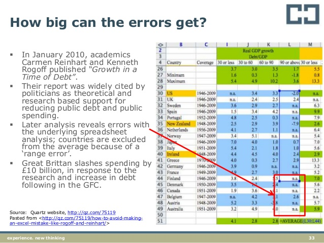

Fonte: [@error_rogoff]

PS.: ele não é Nobel...


## Homem foi a Lua há 50 anos

...e ainda...


Fonte: [@genetic]


## Objetivos do curso

Meta final: que vários dos processos de análise de dados da empresa passem a ser feitos dentro do fluxo de trabalho do R.


Fonte:[@tidyversebig]

Ao fim do curso o objetivo é que todos os fios da meada sejam puxados para que o aluno consiga continuar por si só usando a vasta documentação disponível.

## Por que programar?


Também amo o Excel, mas amo mais as seguintes vantagens:

* **Reprodutibilidade**. Muito mais fácil refazer uma análise com código do que point and click

* **Menor risco operacional**. A automatização é maior, a chance de erro na execução de um passo manual é nula

* **Menor risco de continuidade** caso haja imprevistos com a equipe. 

* **Maior flexibilidade**. Virtualmente tudo é possível

* **Manutenção** mais fácil

* **Controle de versão** de forma profissional

* **Mais fácil do que parece**


## Por que programar em R?

* Ela é feita para lidar com dados

* Comunidade de usuários gigante e cooperativa

* Ferramentas poderosas para comunicação dos resultados, em documentos ou aplicações

* Muitos pesquisadores em métodos quantitativos que estão no estado-da-arte publicam seus métodos em bibliotecas escritas em R

* Prazeroso programar (Tidyverse, Shiny, R Markdown...)


## Fluxo de trabalho

{width=50%} 

Fonte:[@wickham2016r]


{width=50%}

Fonte: [@tidyversebig]

## O processo de "Data Science"

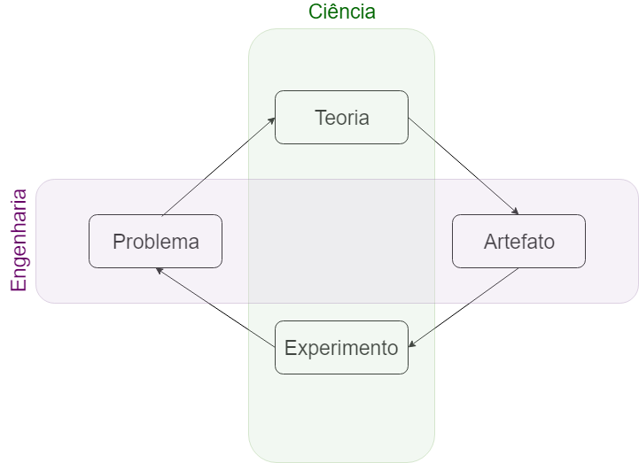

[@cadu]

## Exemplos de onde vamos chegar

É muito comum possuirmos dados gerados em planilhas ou em algum suporte de formato estruturado ou semi-estruturado. 

Estes dados podem ser organizados de forma "tidy" para análise

Após a possível execução de modelos, podemos publicar os resultados.

[Impacto da temperatura no consumo de energia elétrica](https://crotman.shinyapps.io/EfeitoTemperaturaCarga)

[Localização de empresas e dutos](https://crotman.shinyapps.io/Empresas/)

[Estimador de posição de fundos multimercado](http://crotman.shinyapps.io/posicaofundos)


## Ambiente R/RStudio

R é uma linguagem que é interpretada por um [engine](https://cran.r-project.org/) gratuito.

[RStudio](https://www.rstudio.com/) é o melhor ambiente de programação da linguagem R. A versão mais simples, que é totalmente funcional, é gratuita.

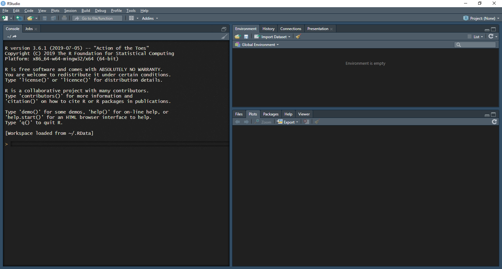{width=50%}

Na visualização padrão, ele oferece um console para execução de comandos e uma janela com a visualização dos *environments*, ou seja, das variáveis que ele guarda na sessão atual.


## RStudio como console

No console é possível executar comandos, como o que atribui valor a uma variável

```{r atribuicao,  echo=TRUE}

x <- 1

```

Note que a atribuição é feita com `<-` e não com `=` como na maioria das linguagens.

>Dica: o atalho **alt** + **-** gera o sinal de atribuição

Os comandos que não atribuem valor a uma variável são ecoados na tela

```{r atribuicao2,  echo=TRUE}

x + 2

```

Veja o `[1]` no console. O R considera que tudo é um vetor. É uma linguagem muito baseada em operações vetoriais. Isso facilita muito as coisas quando se lida com dados.

## RStudio como IDE para um script

O console serve só para testes, aprendizado de novos comandos, debug, experiências etc.

Para as atividades mais comuns de análise de dados, e para que elas sejam reprodutíveis, é necessária a criação de scripts.

Eles são salvos em um arquivo de extensão ".r"


## Funcionalidades interessantes do RStudio

* Atalhos de teclado: **ctrl**+**enter** (rodar linhas selecionadas), **ctrl**+**shift**+**enter** (rodar script),  **ctrl**+**1** (foco no script), **ctrl**+**2** ** (foco no console), **ctrl**+**shift**+**F10** ** (reiniciar R), **ctrl**+**shift**+**C** (comentar/descomentar bloco)  ...

* Refactoring

* Document outline

* Pane: Files/Plots/Packages/Help/Viewer

* Pane: Environment/History/Connections/Git

* Jobs

* Controle de versão integrado com o Github

* Cheat sheets


## Baixando o material do github

Todo o material do curso está hospedado no Github, inclusive esta apresentação, escrita em RMarkdown.

Os exemplos de código, as imagens e os dados mostrados nesta apresentação estão inclusos no repositório do curso.

O repositório fica em [github/crotman/cursoR](https://github.com/crotman/CursoR).

Para baixar este repositório no RStudio, crie um projeto em File/New Project, do tipo Github e use o endereço do repositório: https://github.com/crotman/CursoR.git.

Todo material é disponibilizado sob a licença [Creative Commons Attribution-NonCommercial-ShareAlike 4.0 International License](https://creativecommons.org/licenses/by-nc-sa/4.0/)


# FUNDAMENTOS DA LINGUAGEM
    

## Tipos de valores "armazenados" por variáveis

Para o R, simplificando para o escopo deste curso, as variáveis "armazenam" os seguintes tipos:

* Vetores (vetores atômicos e listas)

```{r seq_int, echo=TRUE}
1L:10L
```

```{r list, echo=TRUE}

list("oi", 1L)

```

* Data Frames / Tibbles


```{r dataframe, echo=TRUE}
tibble(col1 = 1:10, col2 = 11:20 )
```

## Tipos de valores "armazenados" por variáveis (cont.)

* Funções (sim... uma variável pode "armazenar" uma função)

```{r funcoes, echo=TRUE}

f <- function(a, b){
    a + b
}

g <- f

g(1L, 2L)

```

* Environments 

```{r env, echo=TRUE}


e1 <- rlang::env(
    a = 1L,
    b = "sou o b",
    c = 1L:20L
)

get("b", e1)

```

## Tipos de valores "armazenados" por variáveis (cont.)


Existe orientação a objetos no R, mas não está no escopo deste curso

Note que não há variáveis que armazenam dado escalar, como já vimos.

Dentre os vetores há:


* vetores atômicos (seus elementos são do mesmo tipo primário)

* listas (seus elementos, que são vetores atômicos, são de tipos primários diferentes)

{width=25%}

Fonte: [@wickham2014advanced]

## Tipos de valores "armazenados" por variáveis (cont.)

Os vetores atômicos podem ser dos seguintes tipos:


{width=25%}

Fonte: [@wickham2014advanced]

## Tipos de vetores atômicos

* Logical é um tipo booleano, aceita TRUE ou FALSE

```{r bool, echo=TRUE}

booleano <- !TRUE 

booleano

```

* Integer é numérico e inteiro. Equivalente ao long do C++ (por isso o L na declaração)

```{r integer, echo=TRUE}

inteiro <- 8L 

typeof(inteiro + 1L)

typeof(inteiro + 1)


```

## Tipos de vetores atômicos (cont.)

* Double é numérico e aceita números decimais. Equivalente ao double do C++

```{r double, echo=TRUE}

double <- 0.1

double_cientifico <- 1.5e3

infinito <- Inf 
```


```{r, double_valor, echo=TRUE}

double

double_cientifico

infinito

```


## Cobinando vetores em vetores maiores usando c()

Uma das funções mais usadas do R é c(), que cria um vetor novo vetor combinando vetores.

```{r c, echo=TRUE}

c(1, 2, 3)

c(1, 2, 3, c(4, 5, 6))

1.4 : 9.4

```

## Outras formas de gerar um vetor

O operador `:` é usado para gerar um vetor com todos números que estão entre os operandos e são formados somando números inteiros ao primeiro operando.

```{r dois_pontos, echo=TRUE}

1L:10L

1.5:9.1


```

A função `seq()` é usada para criar um vetor de várias formas. 

Numa das formas especifica-se o valor inicial, o valor final e o incremento entre elementos do vetor. 


```{r seq, echo=TRUE}

seq(1, 9.99, 0.1)


```

## Parâmetros nomeados


Note que chamamos a função passando os parâmetros sem especificação de quais são eles. Eles são recebidos pela função dem específica. 

Mas no R também é possível passar parâmetros de forma nomeada. 

Clique em `F1` enquanto tem o cursor em cima da função e veja a ordem dos parâmetros. Veja que outros parâmetros que não utilizamos. Podemos usar `length.out` ao invés de `by`:

```{r seq_nome, echo=TRUE}


seq(1L, 10L, length.out = 10L)

seq(1L, 10L, length.out = 5L)

```

Outro parâmetro, `along.with`, deixa que criemos um vetor num intervalo determinado e o mesmo número de elementos do vetor passado por este parâmetro. 

```{r along, echo=TRUE}

seq(20, 100, along.with = 1:10)

```

## Valores faltantes NA

Valores faltantes ou desconecidos são representados por `NA`

```{r na, echo=TRUE}

a <- c(1L,NA)
a
```

O valor NA quase sempre contamina os cálculos

```{r na_contamina, echo=TRUE}
media <- mean(a)
media
```


mas...

```{r narm, echo=TRUE}
media <- mean(a, na.rm = TRUE)
media
```


A exceção são expressões que dão sempre o mesmo resultado independentemente do valor da variável

```{r na_exc, echo=TRUE}
NA ^ 0
NA | TRUE
NA & FALSE
```


A melhor forma de testar se existe um valor `NA` é `is.na`

```{r isna}

v <- c(1, NA, 2)

is.na(v)

```


## Programação com vetores

As operações do R são vetoriais. Numa operação entre um vetor e um escalar, a operação com o escalar é aplicada a cada elemento do vetor


```{r vetor, echo=TRUE}

1:5 * 2

```


```{r  vetor2, echo=TRUE}

1:10 / 10

```


Numa operação com vetores do mesmo tamanho, os elementos são pareados


```{r vetor_pareado, echo=TRUE}

1:10 * 1:10

```

## Programação com vetores - recycling

Outro conceito importante é o de *recycling*. 

Numa operação entre dois vetores de tamanhos diferentes, o vetor menor é repetido ciclicamente de forma a ficar com o mesmo tamanho do vetor maior. 

Lembra que toda variável no R é um vetor? 

Então... o escalar mostrado no primeiro código do slide anterior é um vetor de 1 elemento que sofre *recycling*


```{r recycling, echo=TRUE}

1:10 * 1:2

```

## Estruturas construídas a partir de vetores e listas

Existem estruturas mais complexas na linguagem construídas a partir de vetores e listas.

* Data Frame

* Matrix

* Array

* Factor

* Estruturas que representam datas

* Objetos (no paradigma de orientação a objetos)

Vamos passar pelo Data Frame agora. Depois por Factor e objetos que representam Datas


## Data Frames

Data Frames, e seu primo Tibble, são estruturas muito usadas em análises de dados feitas em R.

O data frame consiste em um conjunto de vetores nomeados, com o mesmo número de elementos, que formam uma estrutura retangular, onde cada coluna é um vetor e cada linha n contém o n-ésimo elemento dos vetores.

É similar, em muitas características, a uma tabela de banco de dados.

Essa estrutura é chave no paradigma "Tidy" que usaremos com as bibliotecas **Tidy**verse

Tibble é uma adaptação do Data Frame para análise de dados. Discutir essas diferenças está fora do escopo do curso. Algumas diferenças serão citadas o longo do material e justificam o uso do Tibble.


```{r dataframetibble, echo=TRUE}

df <- 
    data.frame(
        nome = c("João", "Maria", "Zezinho", "Juquinha"), 
        idade = c(7, 8, 9, 10), 
        altura = c(10, 11)
    )
df


#tibble não aceita recycling em vetores de tamanho diferente de 1
tib <- 
    #try evita que o erro paralise toda a execução do script
    try(
        tibble(
            nome = c("João", "Maria", "Zezinho", "Juquinha"), 
            idade = c(7, 8, 9, 10), 
            altura = c(10, 11)
        )
    )
```


## Controle de fluxo

A linguagem oferece comandos de controle de fluxo similares aos de outras linguagens.

Podemos dividir os comandos de controle de fluxo em dois tipos:

* choices: execução alternativa de comandos

* loops: execução repetida de comandos


## Choices: `if`, `ifelse`

O comando `if` funciona para um valor lógico escalar


```{r if}
if (2 + 2 == 4) {
    "2 mais 2 são 4"
} else {
    "2 mais 2 não são 4"
}
```


Note o operador de comparação `==` e não `=`

A função `if_else` (da biblioteca dplyr) funciona de vetorial. `if_else` é mais rápida que a função `ifelse` da biblioteca `base`, mas só aceita argumentos de mesmo tipo no segundo e terceiro parâmetros

```{r jogo_pim}
jogo_do_pim_silvio_santos <- if_else(
    condition = 1:40 %% 4 == 0 ,
    true =  "PIM",
    false =  as.character(1:40)
)
jogo_do_pim_silvio_santos
```

Note o operador `%%` e a função de coerção de tipo `as.character` 


## Choices: `switch` e `case_when`

A cláusula `switch` e a função `dplyr::case_when` evitam que o programador tenha que criar muitos `if else` aninhados

```{r switch}
letra <- "b"

switch(
    letra,
    "a" = "começa com a",
    "b" = "começa com b",
    stop("deu ruim")
)

```

Note que a condição vai sendo testada na ordem e `stop` gera um erro

case_when serve ao caso vetorial

```{r case}
case_when(
    1:40 %% 10 == 0 ~ "dezena",
    1:40 %% 2 == 0 ~ "par",
    TRUE ~ as.character(1:40)
)
```


## Loops

A cláusula de loop mais usada e mais versátil é `for`

```{r for}
for(i in 1:5){ 
    print(i^2)
}
```

As cláusulas `next` e `break` modificam o comportamento, respectivamente caminhando direto para a próxima iteração e saindo do for

```{r next}
#next vai pra próxima iteração
for(i in 1:5){
    if (i %% 2 == 0){
        next
    }
    print(i)
}
```


```{r break}
#next sai do loop
for(i in 1:5){
    if (i %% 2 == 0){
        break
    }
    print(i)
}
```


## Loops: coisa do passado

Vamos ver que quase sempre é desnecessário usar loop para as tarefas que vamos executar.

O caráter vetorial da linguagem, aliado a funcionalidades das bibliotecas, faz com que a grande maioria dos loops sejam desnecessários.

O código fica mais limpo e expressivo e mais rápido. Às vezes MUITO mais rápido. Isso ocorre por motivos além do escopo do curso (alocação de memória, código interpretado x código compilado em C++ etc.)

O código abaixo usa loop e programação funcional, respectivamente. Programação funcional será abordada posteriormente no material. 


```{r com_loop, warning=FALSE}
com_loop <- function(n){
    x <- integer()
    for (i in 1:n){
        x <- c(x, i^2)
    }
    x
}

#programação funcional: aprenderemos posteriomente
sem_loop <- function(n){
    x <- 1:n %>% 
        map_dbl(function(x){x^2})
    x
}

```

Abaixo as três formas de fazer a mesma conta que terão a performance avaliada


```{r compara_loop}
com_loop(5)

sem_loop(5)

(1:5)^2

```

## Loops: coisa do passado (cont.)


A biblioteca `bench` oferece funções ótimas para avaliar a performance de pedaços pequenos de código.


```{r bench_loop, warning=FALSE, cache=TRUE}

resultados_perf <- mark(
    sem_loop(1e4),
    com_loop(1e4),
    (1:1e4)^2
)

#aprenderemos o que é %>% e select() posteriormente 
resultados_perf %>% 
    select(expression, min, median, `itr/sec` )

plot(resultados_perf)


```


## Revisão: tipos de vetores

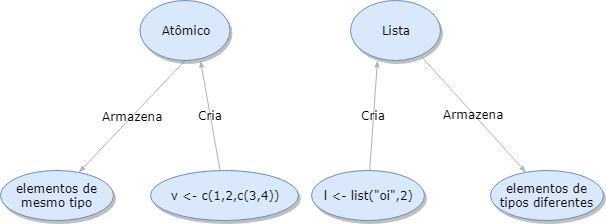


## Revisão: operações vetoriais

Qual o valor de v1 ?

```{r op vetorial}

v1 <- c(1, 2, 3, 4, 5, 6) * 2

```


* a) (1, 2, 3, 4, 5, 6, 1, 2, 3, 4, 5, 6)
* b) (2, 4, 6, 8, 10, 12)
* c) (2, 2, 3, 4, 5, 6)


## Revisão: operações vetoriais

Qual o valor de v2

```{r}

v2 <-  c(1, 2, 3, 4) + c(0, 1)

```

* a) (1, 3, 3, 5)
* b) (1, 3, 3, 4)
* c) (1, 2, 3, 4, 0, 1)


## Revisão: data frames


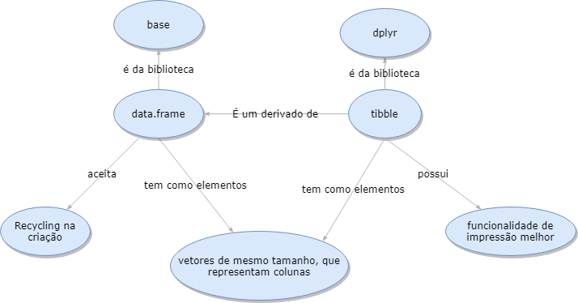


## Revisão: controle de fluxo

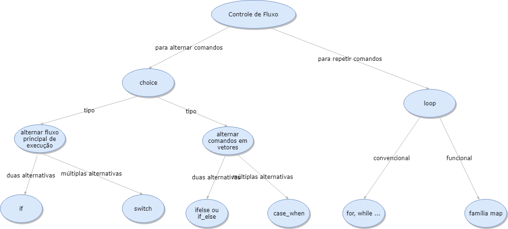{width=90%}

## Revisão: if


Complete a lacuna:


```{r, eval=FALSE}


if (n_pessoas ____ 0 ){
    print("Não há pessoas")
}
else{
    print("Há pessoas")
}
    
    

```


## Revisão: if_else

Complete a lacuna:


```{r, eval= FALSE}
x <- 1:10

if_else(
    _________,
    "par",
    "impar"
)


```


## Revisão: if_else

Qual o valor de x ?


```{r}

times <- c("Flamengo", "Fluminense", "Bahia", "Vasco")

x <- case_when(
    times == "Flamengo" ~ "Flamengo",
    times == "Bahia" ~ "Bahia",
    TRUE ~ "Flumifogo da Gama"
)


```


## Revisão: for

Complete a lacuna para imprimir os quadrados dos números de 1 a 10


```{r, eval=FALSE}
for ____{
    print(x^2)
}

```


## Exemplo de simulação: Monty Hall

Monty Hall era uma espécie de Sílvio Santos juvenil (sub 80) americano.

{width=20%}

Um dos seus jogos consistia em mostrar três portas ao otár... (ops) convidado. Em uma delas tem um carro.

Antes do resultado, o apresentador revela uma das portas e pergunta se o convidado que trocar a escolha.

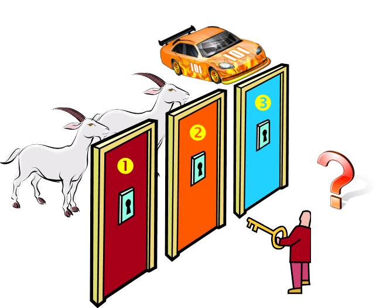{width=20%}

O que vocês acham? Melhor trocar, manter a escolha original ou tanto faz?


## Simulando o Monty Hall

Note o que há de interessante no código (comentado)

```{r monty_hall}
set.seed(88)

joga_monty_hall <- function(troca){
    portas <- 1:3
    #sample() sorteia elementos com ou sem reposição
    porta_carro <- sample(portas, size = 1, replace = FALSE)
    primeira_escolha <- 1
    #Seleção negativa (retirando elementos)
    portas_pra_revelar <- portas[-c(porta_carro, primeira_escolha)]
    porta_revelada <- sample( c(portas_pra_revelar, portas_pra_revelar  ), 1)

    if(troca){
        escolha <- portas[-c(primeira_escolha, porta_revelada)]
    }
    else{
        escolha <- primeira_escolha
    }
    
    escolha == porta_carro
        
}

n <- 1000
#replicate executa múltiplas vezes um comando e armazena os resultados em uma estruturaúnica
troca <- replicate(n = n, joga_monty_hall(troca = TRUE))
fica  <- replicate(n = n, joga_monty_hall(troca = FALSE))
```

Resultados:

```{r result_monty_hall}
sum(troca)/n
sum(fica)/n
```

## Outra simulação: dá pra passar no CFA sem saber nada?


{width=20%}


Vamos ver... mas dá pra simular sem saber quase nada.

Vamos usar uma das funções da família `r<familia de distribuição de prob>()`. Neste caso, a `rbinom`, que simula a distribução binomial (aquela que equivale ao evento de jogar n moedas (ou alguma coisa com dois lados) para cima e ver quantas deram cara).


```{r cfa}

n_simul <- 10000
n_questoes <- 240
min_aprovacao <-  0.6
n_aprovado <- 240 * min_aprovacao
prob_questao <- 0.2

acertos <- rbinom(n = n_simul, size = n_questoes, prob = prob_questao   )

sum(acertos >= n_aprovado)/n_simul 

```

A chance é praticamente nula.

Na verdade, a grande massa da distribuição fica muito distante.


```{r mostra_cfa}

dado <- enframe(acertos/n_questoes)

mostra_chances <- function(acertos, n_questoes){
    ggplot(enframe(acertos/n_questoes)) +
        geom_density( aes(x = value)) +
        scale_x_continuous(
            labels = percent_format(accuracy = 1), 
            limits = c(0,1),
            breaks = seq(0, 1, 0.1) 
            ) +
        labs(x ="% Acertos") +
        geom_vline(xintercept = min_aprovacao, color = "red") +
        theme_light()
}

mostra_chances(acertos, n_questoes)

```


## Outra simulação: dá pra passar no CFA sabendo a um grau x ?

O exemplo anterior era muito simplista: ninguém chuta tudo.

Imagine que sabemos qual a chance de aparecer uma pergunta onde podemos descartar 0 alternativas, a chance de uma onde descartamos 1 e assim por diante.


```{r cfa_mais}
#definindo a chance podermos eliminar 0, 1, 2, ... 4 alternativas
fracao_eliminar_questoes <- c( 0.1, 0.1, 0.2, 0.25 , 0.35 ) 
#definindo o número de questões 
n_questoes_cada_elimina <- t(rmultinom(n_simul, size = n_questoes, fracao_eliminar_questoes))
probs_quando_elimina <- 1/(5:1)
acertos_concatenados <- 
    rbinom( 
        n =  n_simul * 5 , 
        size = as.vector(t(n_questoes_cada_elimina)), 
        prob = probs_quando_elimina  
    )
```


```{r cfa_1}
n_questoes_cada_elimina[1:4,]

```


```{r cfa_2}
acertos_concatenados[1:20]
```

```{r cfa_3}
matriz_acertos <- matrix(acertos_concatenados, byrow = TRUE, nrow = n_simul )

matriz_acertos[1:5,]
```


```{r cfa_4}
acertos <- rowSums(matriz_acertos)
sum(acertos > n_aprovado)/n_simul


```


```{r cfa_5}
mostra_chances(acertos, n_questoes)
```


## Exemplo inicial de visualização de dados


```{r ggplot, eval=TRUE, code = readLines("exemplos\\exemplo_inicial_ggplot.r")}


```


# TIDY DATA (obtenção e organização dos dados)

## A habilidade mais subestimada

Dentro de todo o hype envolvendo Data Science, surgem as buzz words mais mirabolantes: machine learning, AI, Deep Learning... 

Tudo isso é legal, mas a habilidade de preparar os dados para os modelos, preparar os hiperparâmetros e especificações alternativas ainda melhora muito a análise. Anote mais uma buzz word: **FEATURE ENGINEERING**

A agilidade de se tentar abordagens alterativas com os dados cresce muito quando dominamos a arte de manipular os data frames. Por isso o peso grande dado neste curso. 


## Organizando os dados de forma tidy

Arrumar os dados de forma que as linhas sejam eventos e as colunas sejam atributos do evento ajuda muito a rodar modelos e construir visualizações eficientemente.

O que é o evento e o que é o atributo pode variar até para diferentes usos do mesmo dado. Mas a prática ajuda a determinar isso.

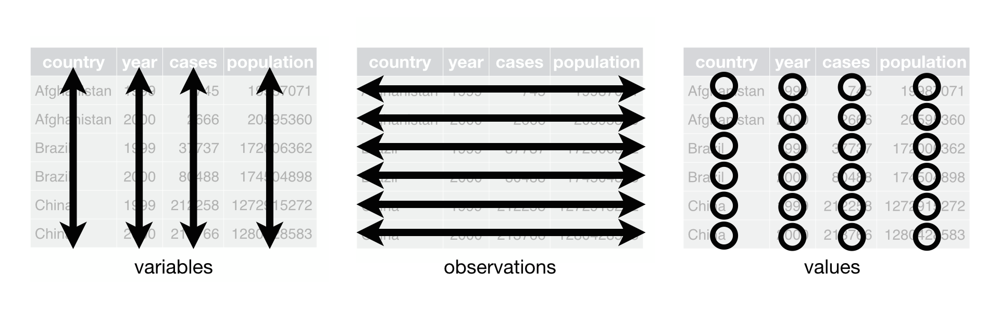

## Tratamento de dados em passos: operador Pipe (`%>%`)

Normalmente os tratamentos de dados são feitos em múltiplos passos encadeados:


```{r gapminder}
#dados de exemplo
head(gapminder)

```

Vamos imaginar que queremos a média de PIB per capita por continente em 2007.

Note quanto código desnecessário há nestas linhas: variáveis que não precisavam ser nomeadas nem passadas explicitamente como parâmetro.

Este código desnecessário causa fadiga no programador e confunde o próprio programador e o leitor posterior do código.


```{r sem_pipe }
#vamos cobrir essas funções de tratamento posteriormente
gapminder_07 <- filter(gapminder, year == 2007)
gapminder_07_group_continente <- group_by(gapminder_07, continent)
gapminder_media_gdp_continente <- summarise(
    gapminder_07_group_continente, media_gdp = sum(gdpPercap * pop)/sum(pop)
)
resultado <- arrange(gapminder_media_gdp_continente, desc(media_gdp))

resultado

```

## Tratamento de dados em passos: operador Pipe (`%>%`) (cont.)

O operador pipe `%>%` faz o seguinte:

x %>% y(z) = y(x,z)

Ou seja, o primeiro operando é enfiado como primeiro parâmetro da função que está no segundo operando.

Isso faz com que possamos escrever o código anterior assim:

```{r pipe}

resultado <- gapminder %>% 
    filter(year == 2007) %>% 
    group_by(continent) %>% 
    summarise(
        media_gdp = sum(gdpPercap * pop) / sum(pop)
    ) %>% 
    arrange(desc(media_gdp))
    
resultado


```


Note que agora podemos interpretar o código facilmente como uma série de comandos de tratamento em cima dos dados. 

Não é por coincidência que as funções de tratamento das bibliotecas tidyverse que veremos adiante são verbos e recebem os dados como primeiro parâmetro.

**Agora o mais importante de tudo: O ATALHO PARA O ` %>% ` É CTRL + SHIFT + M**


## Um mapa conceitual da bibioteca de transformação de dados `dplyr`


Fonte: [@dplyrrberlin]


## CRAN: uma Disneylândia dos dados?

CRAN é o repositório de bibliotecas mantido pelo R com contribuição de populares.

Além de funcionalidades estatísticas e funcionalidades para lidar com dados, há dados e funcionalidades para buscar dados online.

Usaremos várias das bases como exemplo.

A primeira é a do Banco Mundial, muito rica para quem gosta de dados socioeconômicos

Para acessar um indicador precisamos achá-lo na base de indicadores com a função `wbsearch()`

```{r banco_mundial}

#pattern é uma expressão regular. \\ serve para dizer que "(" é mesmo "(" 
#e não o ( usado nas operações de expressão regular (fora do escopo do curso)
indicadores <- wbsearch(pattern = "GINI index \\(World Bank estimate\\)")

indicadores


```

Sabendo o ID do indicador, podemos consultá-lo com a função `wb()`


```{r banco_mundial_2}

#mrv é most recent values. Pode ser usado para buscar os n valores mais recentes
gini = wb(indicator = "SI.POV.GINI", mrv= 10, POSIXct = TRUE)

head(gini)


```


## dplyr: Modificar -> Colunas -> Nomes e posições

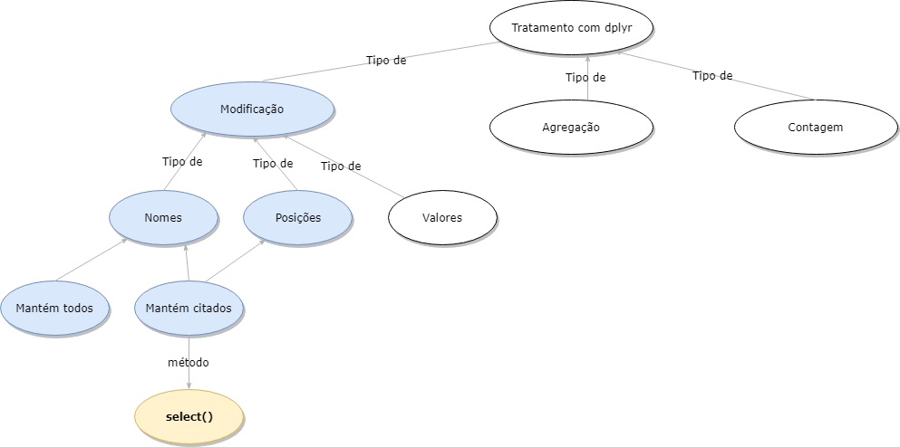


## Funções básicas de tratamento (dplyr): select()


A função `select()` é usada para selecionar colunas do data frame/tibble


```{r gini}

glimpse(gini)

```

```{r gini_select}

gini_select <- gini %>% 
    select(country, date, value, iso3c)

head(gini_select)

```

É possível usar a seleção negativa assim como fizemos com vetores

```{r gini_negativa}

gini_select2 <- gini_select %>% 
    select(-iso3c)

head(gini_select2)

```


## Funções básicas de tratamento (dplyr): select() (cont.)


Algumas funções *helpers* nos ajudam a usar a função `select` e são muito úteis para tratamentos mais elaborados.

Pra mostrar mais funcionalidades da função `select`, vamos usar uma base com dados eleitorais brasileiros, que retorna mais colunas


```{r  candidatos , cache=TRUE}

candidatos <- candidate_fed(2018)

glimpse(candidatos)

```

## Funções básicas de tratamento (dplyr): select() - helpers


```{r candidatos_select}

candidatos_select <- candidatos %>% 
    select(starts_with("NOME"))

datatable(head(candidatos_select))
    


```


```{r candidatos_select_ends }

candidatos_select <- candidatos %>% 
    select(ends_with("candidato"))

datatable(head(candidatos_select))
    


```

```{r contains }

candidatos_select <- candidatos %>% 
    select(contains("municipio"))

datatable(head(candidatos_select))


```

```{r ends_2}

candidatos_select <- candidatos %>% 
    select(ends_with("candidato"))

datatable(head(candidatos_select))


```


## Funções básicas de tratamento (dplyr): select() - helpers (cont.)


A função *helper* num_range ajuda a encontrar colunas do tipo `prefixo_n`. Isso é muito comum em bases de dados

A biblioteca `worldmet` retorna dados de estações meteorológicas espalhadas pelo planeta 

Primeiro é necessário encontrar o código da base desejada

```{r estacao, cache=TRUE}

estacao <- getMeta("heathrow", returnMap = TRUE)

estacao
    

```


## Funções básicas de tratamento (dplyr): select() - helpers (cont.)

A função abaixo retorna os dados de uma estação. Veja que alguns campos têm um sufixo _n 

```{r estacao_import, cache=TRUE }
dados_heathrow <- importNOAA(code = "037720-99999", year = 2019,
precip = TRUE, PWC = FALSE, parallel = TRUE)


glimpse(dados_heathrow)


```


A função *helper* `num_range` ajuda a selecionar essas colunas com prefixo comum e um sufixo numérico 


```{r num_range}

dados_heathrow_select <- dados_heathrow %>% 
    select( 
        date, 
        num_range("cl_", 1:3 ), 
        num_range("precip_", c(6, 12))  
    )


head(dados_heathrow_select)

```

Outra função útil é a `everything`, que ajuda, por exemplo, a passar algumas colunas para o início do *tibble*.


```{r everything}

dados_heathrow_select <- dados_heathrow %>% 
    select( 
        date, 
        air_temp,
        everything() 
    )


glimpse(dados_heathrow_select)


```

## Funções básicas de tratamento (dplyr): `rename()`

`rename()` é usada para modificar os nomes das colunas. Ela renomeia as colunas indicadas e mantném as outras.

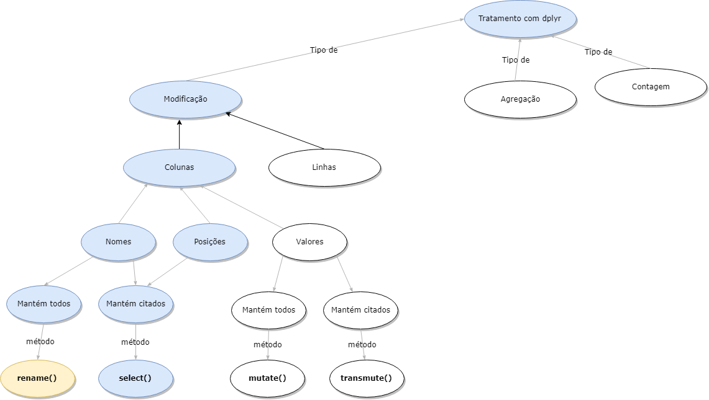

## Funções básicas de tratamento (dplyr): `rename()`

```{r}

dados_heathrow %>% 
    rename(
        data = date,
        estacao = station,
        temperatura = air_temp
    ) %>% 
    head()

```

## Funções básicas de tratamento (dplyr): `rename()` x `select()`


`select()` também pode ser usado para renomear colunas, mas mantém apenas as colunas citadas

```{r}

dados_heathrow %>% 
    select(
        data = date,
        estacao = station,
        temperatura = air_temp
    ) %>% 
    head()


```


## dplyr: Modificar -> Colunas -> Valores


A função mutate é usada para criar novas colunas no tibble, mantendo as outras.
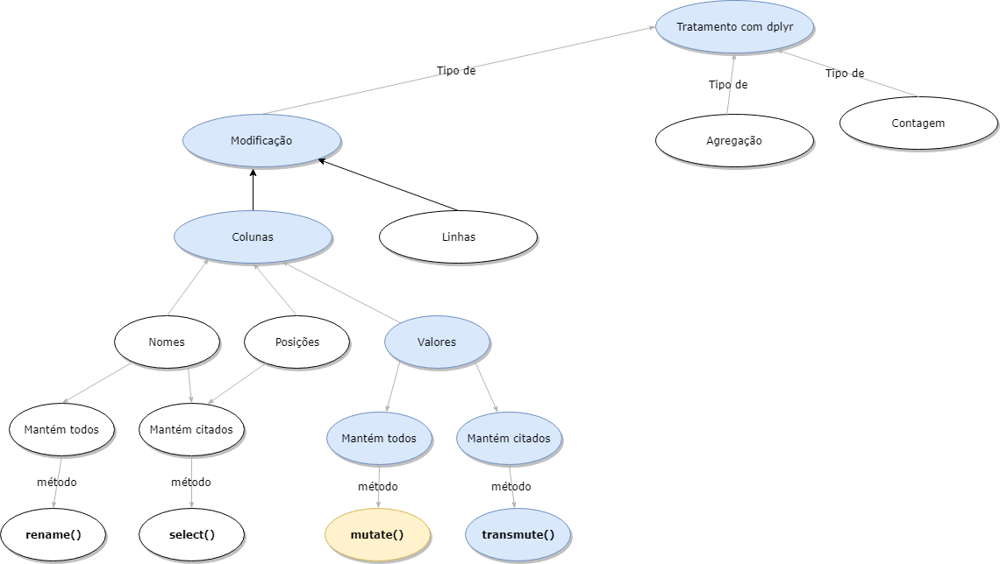


## Funções básicas de tratamento (dplyr): `mutate()`


Notando que a coluna DATA_ELEICAO é um caracter, vamos criar uma coluna de tipo data.

```{r typeof}

typeof(candidatos$DATA_ELEICAO)


```


O jeito mais fácil de fazer isso é usando uma das funções da biblioteca `lubridate` que veremos em detalhes em seguida


```{r lubridate}

candidatos_com_data <- candidatos %>% 
    mutate(DATA_ELEICAO_TIPO_DATA = dmy(DATA_ELEICAO)) %>% 
    select(DATA_ELEICAO, DATA_ELEICAO_TIPO_DATA)

head(candidatos_com_data)

```


É possível substituir um campo existente


```{r mutate_mesmo}

candidatos_com_data <- candidatos %>% 
    mutate(DATA_ELEICAO = dmy(DATA_ELEICAO)) %>% 
    select(DATA_ELEICAO)

head(candidatos_com_data)

```


## Funções básicas de tratamento (dplyr): `mutate()`


funções derivadas da `mutate` possibilitam a alteração de várias colunas ao mesmo tempo, usando os mesmos helpers que já vimos para a `select` e uma função à escolha


```{r mutate_at}

candidatos_com_data <- candidatos %>% 
    mutate_at(vars(starts_with("DATA_")), dmy ) %>% 
    select(starts_with("DATA_"))


head(candidatos_com_data)


```

## Funções básicas de tratamento (dplyr) `mutate()` (cont.):

Outras funções úteis são as que fazem operações acumuladas e as operações de `lag()` e `lead()`

```{r bets, cache = TRUE}

series <- BETS::BETSsearch("exchange dollar")

series

```

No código abaixo, calculamos o retorno da série, a volatilidade histórica e a volatilidade EWMA

```{r bets_vol, cache = TRUE}

dolar <- BETS::BETSget(1) 

dolar_com_vol <- dolar %>% 
    filter(date > ymd("1994-07-01")) %>% 
    arrange(date) %>% 
    mutate(
        retorno = (value - lag(value))/value,
        retorno_quad = retorno^2,
        dia = row_number(),
        fator_ewma = (1/0.94)^dia*1e-20
    ) %>% 
    filter(!is.na(retorno)) %>% 
    mutate(vol = sqrt(cumvar(retorno)) * sqrt(252) ) %>% 
    mutate(vol_ewma = sqrt(cumsum(retorno_quad * fator_ewma)/cumsum(fator_ewma)) * sqrt(252) ) %>% 
    rename(dolar = value) %>% 
    select(
        date,
        dolar,
        retorno,
        vol,
        vol_ewma
    )


datatable(dolar_com_vol) %>% 
    formatPercentage(c("retorno", "vol", "vol_ewma"), 2)


```


```{r dolar_vol, cache=TRUE}

dolar_ajeitado <- dolar_com_vol %>% 
    gather(variavel, valor, - date)


dolar_ajeitado %>% 
    ggplot() +
    geom_line(aes(x = date, y = valor)) +
    facet_grid( variavel ~ . , scales = "free") +
    theme_light() 


```


## Funções básicas de tratamento (dplyr) `transmute()`:

`transmute()` cria colunas e mantém apenas as colunas citadas


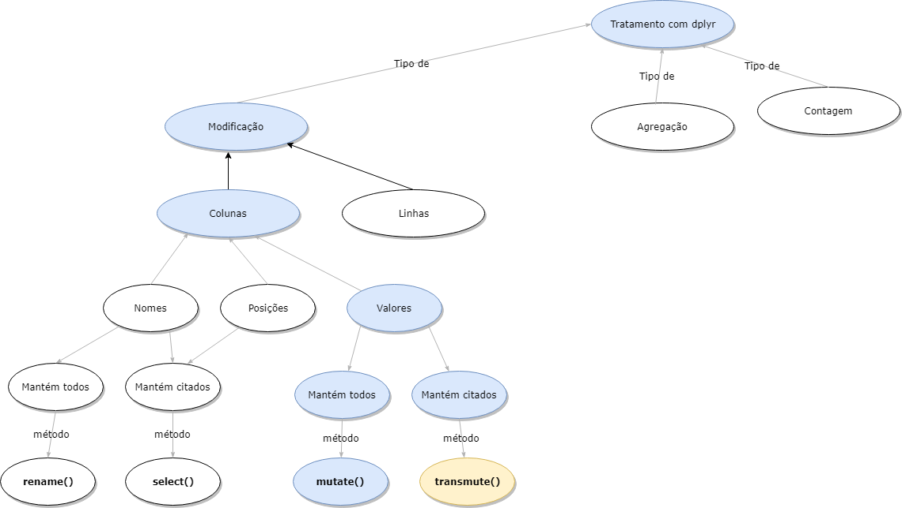


```{r}

gapminder %>% 
  transmute(
    ano = year,
    pais = country,
    pib = gdpPercap * pop
  ) %>% 
  head()


```

## dplyr: Modificar -> Linhas -> Posição


A função `arrange` serve para ordenar as linhas do tibble.

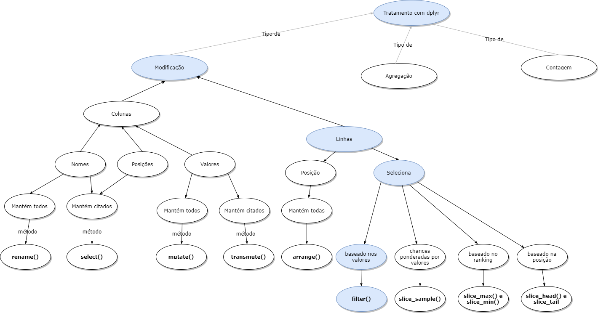


## Funções básicas de tratamento (dplyr) `arrange()`:


```{r arrange}

dados_ordenados <- dados_heathrow %>% 
    arrange(date)

head(dados_ordenados)

```

A função `desc()` permite a ordenação decrescente


```{r desc}

dados_ordenados <- dados_heathrow %>% 
    arrange(desc(date))

head(dados_ordenados)


```


## Funções básicas de tratamento (dplyr) `filter()`:

`filter()` seleciona colunas de acordo com os seus valores

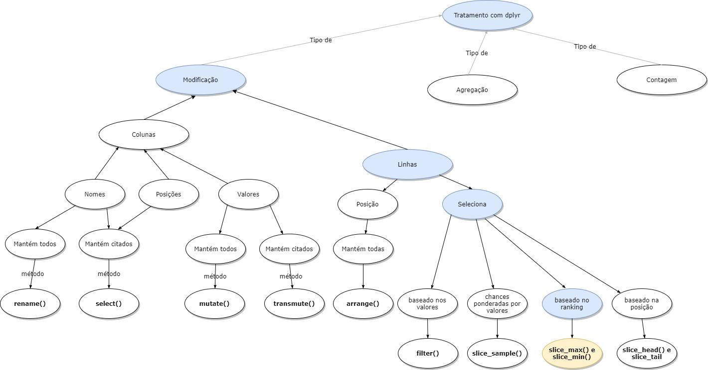

## Funções básicas de tratamento (dplyr) `filter()` (cont.):


Filtrando países (note o operador `%in%`)


```{r}

gapminder %>% 
  filter(country %in% c("Brazil", "Argentina", "Chile")) %>% 
  ggplot() +
    geom_line(aes(x = year, y = gdpPercap, color = country )) +
    geom_point(aes(x = year, y = gdpPercap, color = country )) +
    theme_light()
  

```


## Funções básicas de tratamento (dplyr) `top_n()`:

`top_n` seleciona as `n` linhas maiores de acordo com uma das colunas.

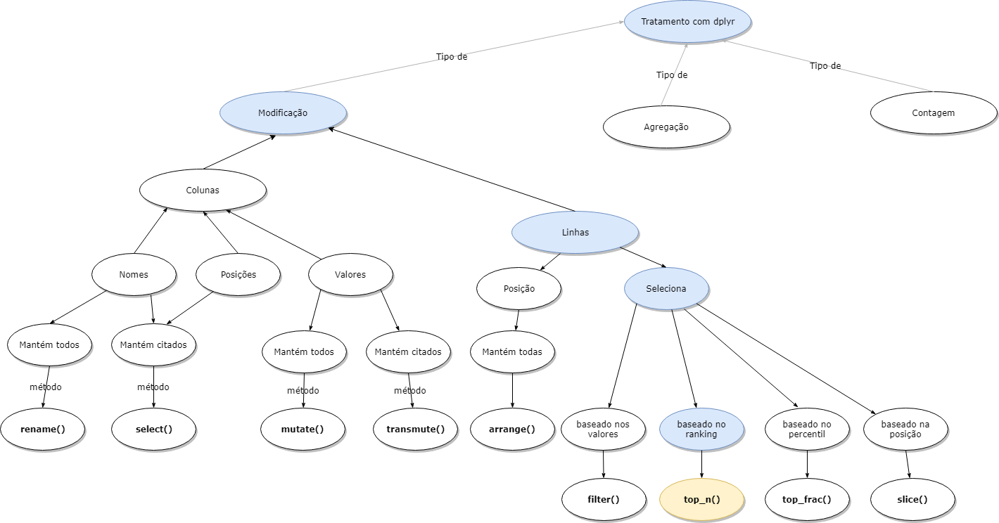

## Funções básicas de tratamento (dplyr) `top_n()` (cont.):

Selecionando os países mais ricos em 2007.

Depois aprenderemos como ordenar essas barras


```{r}

gapminder %>% 
  filter(year == 2007) %>% 
  top_n(5, gdpPercap) %>% 
  ggplot() +
    geom_col(aes(x = country, y = gdpPercap)) +
    theme_light() 

```

## Funções básicas de tratamento (dplyr) `top_frac()`:


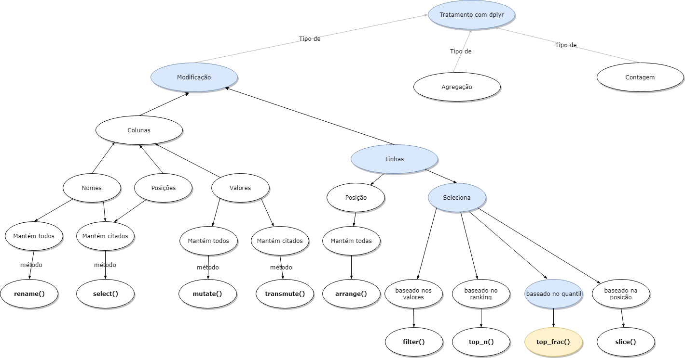


## Funções básicas de tratamento (dplyr) `top_frac()`:


```{r}

ricos <- gapminder %>% 
  filter(year == 2007) %>% 
  top_frac(.2, gdpPercap ) %>% 
  mutate(categoria = "Rico")

pobres <-  gapminder %>% 
  filter(year == 2007) %>% 
  top_frac(.2, desc(gdpPercap) ) %>% 
  mutate(categoria = "Pobre")

bind_rows(ricos, pobres) %>% 
  ggplot(aes(x = gdpPercap, y = lifeExp)) +
  geom_point( aes(color = continent)) +
  facet_grid(. ~ categoria, scales = "free_x") +
  geom_smooth(method = "lm", se = FALSE) +
  theme_light()
  


```


## Funções básicas de tratamento (dplyr) `slice()`:


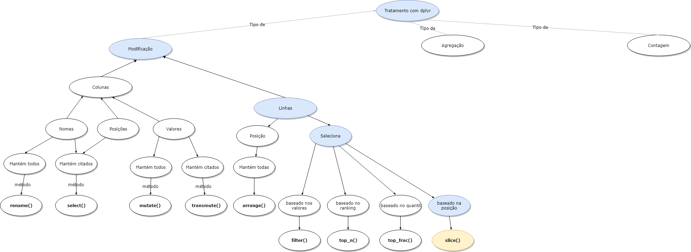


## Funções básicas de tratamento (dplyr) `slice()`:


```{r, cache=TRUE}


classificacao_brasileirao <- read_html("https://pt.wikipedia.org/wiki/Campeonato_Brasileiro_de_Futebol_de_2019_-_S%C3%A9rie_A") %>% 
  html_nodes("table") %>% 
  extract2(8) %>% 
  html_table()


limbo <- classificacao_brasileirao %>% 
  slice(12:16) %>% 
  select(time = Equipes )

limbo


```


## Funções básicas de tratamento (dplyr) `group_by()`:


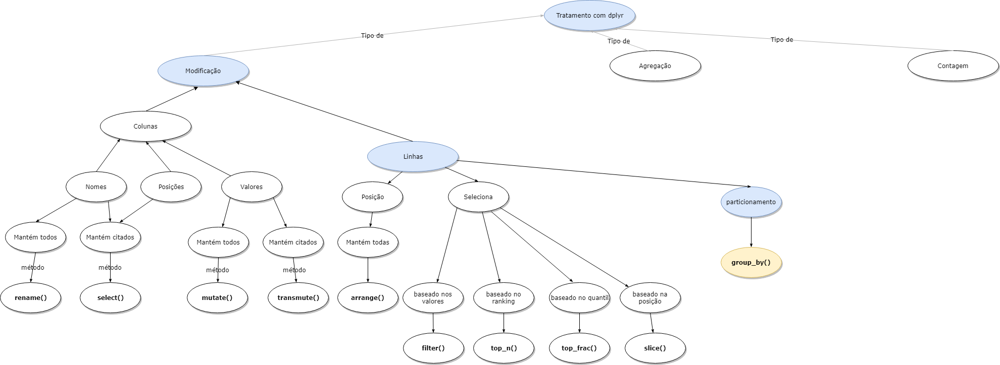


## Funções básicas de tratamento (dplyr) `group_by()`:


A função `group_by` será bastante usada.

Quem conhece SQL pode estranhar um pouco o comportamento desta função, pois ela não agrupa os dados diminuindo o número de linhas imediatamente.

Mas veja que ela indica que há agrupamento

Ela particiona o tibble. As operações passam a ser executadas em cada partição.


```{r group_by}

gini_agrupado <- gini %>% 
    select(country, date, value) %>% 
    group_by(country) 
    
gini_agrupado


```


## Funções básicas de tratamento (dplyr) `group_by()` (cont.):

Para várias operações, o agrupamento faz com que o comportamento seja diferente.

Uma operação bastante usada é numerar as linhas de um tibble.

No tibble agrupado, essa operação acontece em cada grupo.

```{r row_number}

gini_agrupado %<>% arrange(country, date) %>% 
    mutate(linha = row_number())


datatable(gini_agrupado)


```


## Funções básicas de tratamento (dplyr) `group_by()` (cont.):


As funções `lag()` e `lead()` funcionam dentro de cada grupo (o primeiro value de um grupo não acessa o valor do outro grupo com `lag()` .

```{r lag}

gini_agrupado %<>% mutate(
    value_ant = lag(value),
    delta_value = value - value_ant
    )

datatable(gini_agrupado)

```


## Funções básicas de tratamento (dplyr) `summarise()` (cont.):


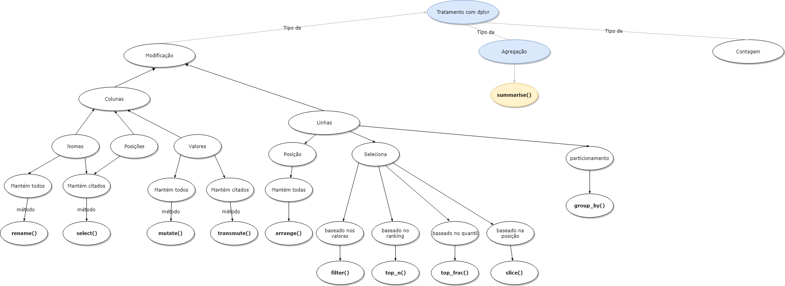


## Funções básicas de tratamento (dplyr) `group_by()` (cont.):


A função `group_by` só leva a uma sumarização, ou seja, só transforma o tibble em um tibble com o número de linhas igual ao número de grupos, quando executamos a função `summarise()`

Se executarmos `summarise` sem particionar o tibble, a operação resulta em uma linha.


```{r summarise}

maiores_temp_dia <- dados_heathrow %>% 
    group_by(date(date)) %>% 
    summarise(
        maxima = max(air_temp),
        minima = min(air_temp),
        media = mean(air_temp)
    )


datatable(maiores_temp_dia) %>% 
    formatRound(c("maxima", "minima", "media"), 1)


```


A função `top_n` retorna os n maiores valores. Se o tibble estiver agrupado, pra cada grupo.


```{r top_n}


maiores_temp_dia <- dados_heathrow %>% 
    group_by(date(date)) %>% 
    top_n(1, air_temp) %>% 
    ungroup() %>% 
    mutate(
        hora = hour(date),
        estacao = 
            case_when(
                month(date) %in% 1:3 ~ "Inverno",
                month(date) %in% 7:9 ~ "Verão",
                TRUE ~ "Outono/Primavera"
                
            )
    ) %>% 
    select(hora, estacao, air_temp)

ggplot(maiores_temp_dia) +
    geom_density( aes(x = hora, color = estacao )) +
    theme_light()


```


## Leitura de dados de arquivos 

Até agora acessamos dados que estavam disponíveis em bibliotecas, mas muitas vezes encontramos dados em arquivos.

De modo geral, as funções da biblioteca `readr` são mas rápidas do que as da biblioteca base, e também mostram barra de progresso no console. É possível reconhecê-las pelo `_` ao invés de `.` 

## Leitura de dados de arquivos 

O caso mais comum é ler dados em formato de tabela para um tibble

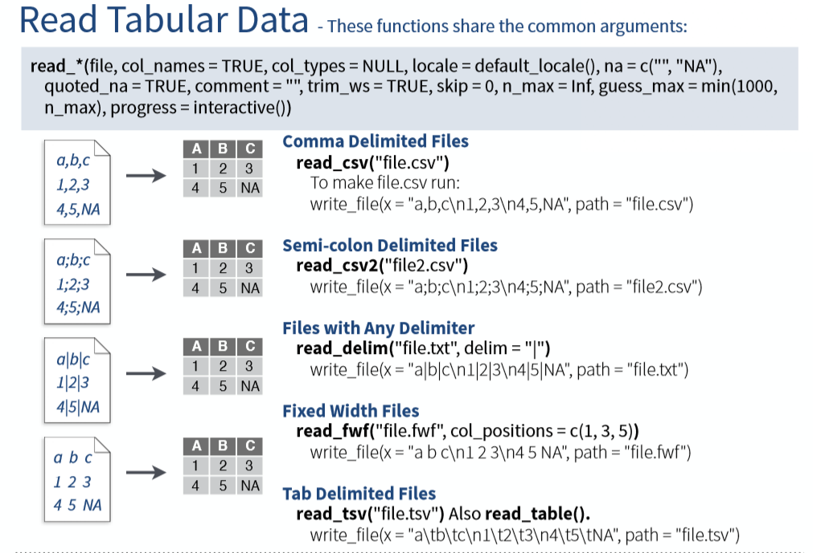

Fonte: [@cheatsheetimport]


## Leitura de dados de arquivos - Exemplo: CVM


O portal da CVM é uma das minas de ouro de dados


O código abaixo baixa os dados que ainda não estão na nossa base

```{r fundos, message=FALSE, warning=FALSE}

existem <- tibble(arquivo = list.files("dados/fundos"))


salva <- function(dado){
    
    endereco <- pull(dado, endereco)
    arquivo <- pull(dado, arquivo)
    
    print(endereco)
    conteudo <- read_csv2(endereco)
    
    write_csv(conteudo, paste0("dados/fundos/",arquivo))
    
}


baixa_faltantes <- tibble(data_dado = seq(ymd("2017-01-01"), by = "month", ymd(today()) )) %>% 
    mutate(data_formato = stamp_date("999912")(data_dado)) %>% 
    mutate(
        endereco = paste0(
            "http://dados.cvm.gov.br/dados/FI/DOC/INF_DIARIO/DADOS/",
            "inf_diario_fi_",
            data_formato,
            ".csv")) %>% 
    mutate(arquivo = paste("inf_diario_fi_",data_formato,".csv")) %>% 
    anti_join(existem, by = c("arquivo" = "arquivo")) %>% 
    select(-data_formato) %>% 
    group_by(data_dado) %>% 
    nest() %>% 
    mutate(data = map(data, salva ))


le_arquivo <- function(lista_arquivo){
    
    arquivo <- pull(lista_arquivo, arquivo)
    
    conteudo <- read_csv(arquivo)
    

    conteudo
    
}


todos_os_fundos <- tibble(arquivo = list.files("dados/fundos")) %>%
    mutate(arquivo = paste0("dados/fundos/",arquivo )) %>% 
    group_by(row_number()) %>% 
    nest() %>% 
    mutate(data = map(data, le_arquivo)) %>% 
    unnest()


head(todos_os_fundos)

```


```{r cadastro_fundos, cache=TRUE, warning=FALSE, message=FALSE}

cadastro_fundos <- read_csv2("http://dados.cvm.gov.br/dados/FIE/CAD/DADOS/inf_cadastral_fie.csv", locale =  locale(encoding = "latin1") )


```


```{r cotas_verde, cache=TRUE }

cotas_verde <- todos_os_fundos %>% 
    filter(CNPJ_FUNDO == "07.455.507/0001-89" )


cotas_verde

```


## Leitura de conteúdo de páginas WEB

Uma página WEB pode ser representada por uma árvore de objetos, também chamada de DOM (Document Object Model).

Esta árvore de objetos é definida pelo conteúdo de linguagem html que existe na página (e pode ser modificado por scripts em javascript e definições de estilo do CSS).

Podem existir objetos de vários tipos em uma página: links, inputs de dados, tabelas, células de tabelas, parágrafos, cabeçalhos etc.


## Leitura de conteúdo de páginas WEB (cont.)


Para retirar da página web o conteúdo de que precisamos, temos que analisar como é esta árvore de objetos e que nós desta árvore nos interessam.

Imagine que queremos buscar dados na página de [histórico de preços e taxas dos títulos brasileiros](https://sisweb.tesouro.gov.br/apex/f?p=2031:2:0::::)

A tecla F12 do Chrome nos permite ver a árvore DOM da página em que estamos navegando.

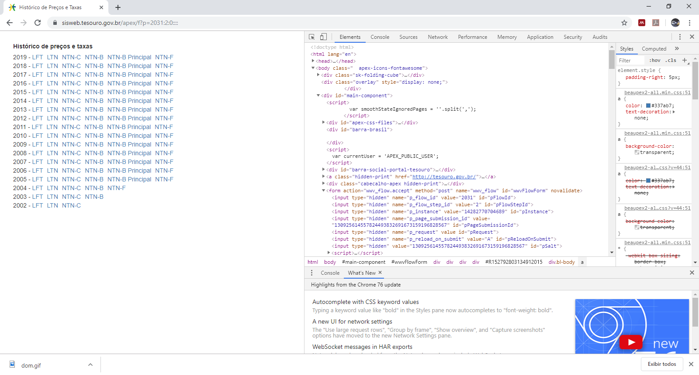{width=70%}


## Leitura de conteúdo de páginas WEB (cont.)

É possível clicar com o botão direito e inspecionar um elementos específico de forma a saber onde ele está na árvore e que tipo de elemento ele é (mesmo que você saiba pouco de html).

O mais importante é saber que uma tag html que define um elemento tem a sintaxe:

`<tipo_elemento nome_atributo=valor_attributo>texto do elemento</tipo_elemento>`

Mesmo sem saber hmtl, fica claro que queremos esse tal de atributo `href` dos tais elementos `a` seja lá o que diabos isso seja (`a` é um link e `href` é o destino do link).


{width=70%}


## Leitura de conteúdo de páginas WEB (cont.)


A biblioteca `rvest` possibilita a extração destes elementos.

É possível caminhar pela árvore DOM até os nós desejados e atributos que queremos usando `html_nodes` e `html_attr`. 

Munidos de uma função que faz download e salva um arquivo, podemos caminhar pelas planilhas e salvá-las


```{r rvest , warning=FALSE, message=FALSE }

existem <- tibble(arquivo = list.files("dados/titulos"))


salva_planilha <- function(dado){
    
    arquivo <- pull(dado, endereco)
    destino <- pull(dado, name_in)
    
    download.file(
        arquivo, 
        paste0("dados/titulos/",destino,".xls" ),
        mode = "wb" ##PRA ARQUIVOS BINÁRIOS,
        )
    
}


links <- read_html("https://sisweb.tesouro.gov.br/apex/f?p=2031:2:0::::") %>% 
    html_nodes("body") %>% 
    html_nodes("a") %>% 
    html_attr("href") %>% 
    enframe(value = "endereco") %>%
    filter(str_detect(endereco, "cosis/sistd/obtem_arquivo/")) %>%
    mutate(destino = paste0(name,".xls")) %>% 
    anti_join(existem, by = c("destino" = "arquivo")) %>%
    select(-destino) %>% 
    mutate(endereco = paste0("https://sisweb.tesouro.gov.br/apex/",endereco) ) %>% 
    mutate(name_in = name) %>% 
    group_by(name) %>% 
    nest() %>% 
    mutate(data = map(data, salva_planilha ))

```


## Leitura de conteúdo de planilhas Excel


Agora Vamos organizar as planilhas que lemos do site do tesouro.

Vamos usar a biblioteca `read_xl`.

Precisamos ler todas as sheets de todos os arquivos em um diretório (onde baixamos os arquivos excel do site do tesouro).

A função abaixo lê as sheets de um arquivo.


```{r le_sheets, warning=FALSE  }
le_sheets <- function(dados){
    
    arquivo <- pull(dados, arquivo)
    excel_sheets(paste0("dados/titulos/",arquivo)) 
    
}
```


A função abaixo lê o conteúdo de cada sheet


```{r le_conteudo_sheets, warning=FALSE }
le_conteudo_sheet <- function(dados){
    
    arquivo <- pull(dados, arquivo)
    sheet <- pull(dados, sheet)
    read_excel(
        paste0("dados/titulos/",arquivo),
        sheet = sheet,
        skip = 2,
        col_names = FALSE,
        col_types = "text"
    ) 
    
}
```

## Leitura de conteúdo de planilhas Excel (cont.)


Munidos destas duas funções, podemos guardar tudo em um só data frame.

Primeiro, definindo as sheets a ler

```{r arruma_titulos, warning=FALSE, cache=TRUE}
sheets_pra_ler <- list.files("dados/titulos") %>% 
    enframe(value = "arquivo") %>%
    mutate(arquivo_out = arquivo) %>% 
    group_by(name, arquivo_out) %>% 
    nest() %>% 
    mutate(data = map(data, le_sheets)) %>% 
    unnest() %>% 
    rename(
        arquivo = arquivo_out,
        sheet = data
    )
```

Depois lendo as sheets para um data frame


```{r arruma_titulos_1, warning=FALSE, cache=TRUE, message=FALSE }
sheets_lidas <- sheets_pra_ler %>% 
    mutate(titulo = str_extract(sheet,"[^[0-9]]*" )) %>% 
    mutate(vencimento = str_extract(sheet,"[0-9]{6}" )) %>% 
    mutate(vencimento = dmy(vencimento)) %>%
    mutate(
        arquivo_out = arquivo,
        sheet_out = sheet
    ) %>% 
    group_by(name, titulo, vencimento, arquivo_out, sheet_out) %>% 
    nest() %>% 
    mutate(data = map(data, le_conteudo_sheet)) %>% 
    unnest() %>% 
    ungroup()


```

## Leitura de conteúdo de planilhas Excel (cont.)


Uma última arrumada


```{r arruma_titulos_2, warning=FALSE, cache=TRUE}
taxas_titulos <- sheets_lidas %>% 
    rename(
        data = 6,
        taxa_compra_manha = 7,
        taxa_venda_manha = 8,
        pu_compra_manha = 9,
        pu_venda_manha = 10,
        pu_base_manha = 11
    ) %>% 
    mutate(
        data = if_else(
            str_detect(data, "/"),
            dmy(data),
            as.numeric(data) + ymd("1899-12-31")
        )
    ) %>% 
    mutate(
        titulo = str_trim(titulo), 
        taxa_compra_manha = as.numeric(taxa_compra_manha),
        taxa_venda_manha = as.numeric(taxa_venda_manha),
        pu_compra_manha = as.numeric(pu_compra_manha),
        pu_venda_manha = as.numeric(pu_venda_manha),
        pu_base_manha = as.numeric(pu_base_manha)
    ) %>% 
    select(
        titulo,
        vencimento,
        data,
        taxa_compra_manha,
        taxa_venda_manha,
        pu_compra_manha,
        pu_venda_manha,
        pu_base_manha
    ) %>% 
    mutate(
        titulo = if_else(
            titulo == "NTN-B Principal", 
            "NTN-B Princ", 
            titulo
        )
    )


```

## Leitura de conteúdo de planilhas Excel (cont.)


Aí fica fácil fazer a análise que desejarmos

```{r}

ntnb_2045 <- taxas_titulos %>% 
    filter(
        titulo == "NTN-B Princ",
        vencimento == ymd("2045-05-15")
    ) %>% 
    mutate(taxa = (taxa_compra_manha +taxa_venda_manha)/2 )


ggplot(ntnb_2045) +
    geom_line(aes(x = data, y = taxa) ) +
    scale_x_date(
        date_breaks = "3 months",
        limits = c(ymd("2016-12-01"),NA),
        labels = date_format("%m/%y")
    ) +
    scale_y_continuous(
        labels = percent_format(accuracy = 0.1)
    ) + 
    labs(y = "NTN-B Principal 2045", x = "Data") +
    theme_light()


```


## Outro exemplo de leitura de página


```{r, message=TRUE, warning=TRUE, cache=TRUE}

library(httr)
library(rvest)
library(lubridate)
library(tidyverse)
library(magrittr)

url <- "http://www.ceagesp.gov.br/entrepostos/servicos/cotacoes/#cotacao"


le_pagina_ceagesp <- function(grupo, data){

  dados <- NA 
  try({
    fd <- list(  
      cot_grupo  = grupo,
      cot_data = data
    )
    
    resp <- POST(url, body=fd, encode="form")
    
    tabela <- content(resp) %>% 
      html_nodes("table") %>% 
      extract2(1) %>% 
      html_table()
    
    nomes <- tabela %>% slice(2)
    
    dados <- tabela %>% slice(3:nrow(tabela)) %>% 
      mutate(data = dmy(data))
    
    names(dados) <- c(nomes, "data_precos")
  })

  str(dados)    
  
  dados
  
}

grupos <- c(
  "FRUTAS",
  "LEGUMES",
  "VERDURAS",
  "DIVERSOS",
  "FLORES",
  "PESCADOS"
)

datas <- seq(from = today()-5, by = 1, to = today()-1) %>% 
  format("%d/%m/%Y") 

dados_ceagesp <-  enframe(grupos, value = "grupo", name = "id_grupo") %>%
  crossing(enframe(datas, value = "data", name = "id_data")) %>% 
  mutate(leitura = map2(.x = grupo, .y = data, le_pagina_ceagesp )) %>% 
  filter(!is.na(leitura)) %>% 
  unnest(cols = leitura)
  

head(dados_ceagesp)
  

```


## E quando o desenvolvedor da página web tá manguaçado?

Nem todas as páginas são fáceis de ler.

A [página que mostra os DIs na BMF](http://www2.bmf.com.br/pages/portal/bmfbovespa/boletim1/SistemaPregao1.asp?pagetype=pop&caminho=Resumo%20Estat%EDstico%20-%20Sistema%20Preg%E3o&Data=10/01/2017&Mercadoria=DI1), por exemplo é esquisita:

O nosso objeto de interesse aparece na ferramenta chamada por F12, mas não é encontrada pela `rvest` ao ler o HTML

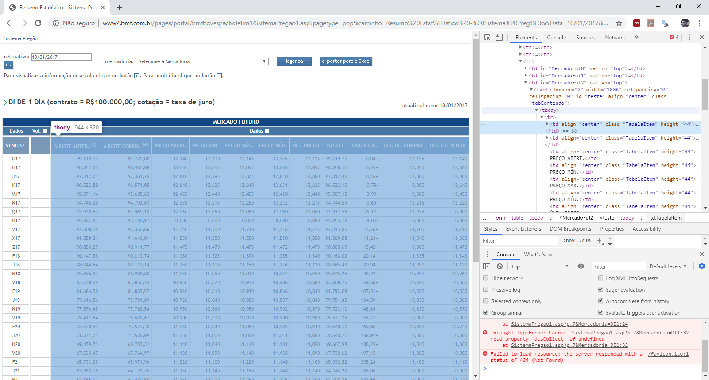

## Lendo páginas difíceis

Existem duas técnicas para o Web Scraping:

* Simular a navegação num browser emulado (fora do escopo deste curso)

* Interpretar páginas com base no conteúdo recebido

Na página que visualizamos da BMF, o conteúdo recebido inclui um script javascript que popula a tabela, por isso não conseguimos reconhecer o conteúdo da tabela de pronto, pois ela só é carregada pela execução do script.


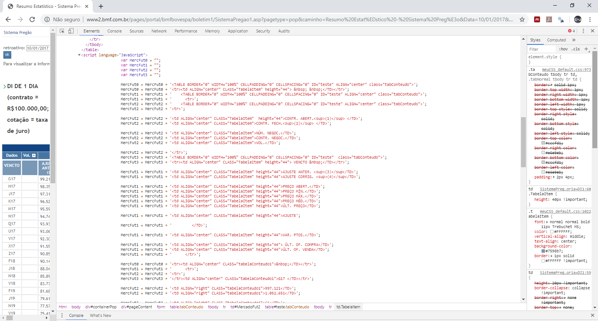


## Lendo páginas difíceis (cont.)


Conseguimos, no entanto, extrair do script as informações de que precisamos


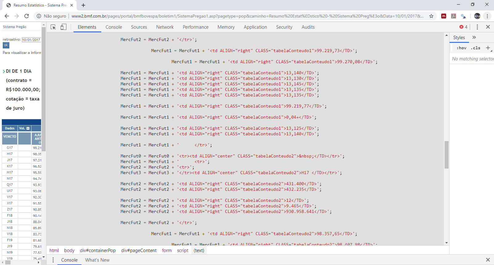


## Lendo páginas difíceis (cont.)

O código abaixo extrai da página as informações de que precisamos.

Para extrair as informações, ele usa expressões regulares.

Repare na função que silencia um possível erro. Este erro pode acontecer se passarmos um dia que não tem dados. Precisamos disso pois vamos buscar todas as datas possíveis.

Essa não é a melhor forma de tratar um erro deste tipo. Veremos mais adiante


```{r le_bmf, warning=FALSE, message= FALSE}


cotacoes <- tibble(
    id = 0:10,
    cotacao = c(
        "ajuste_ant",
        "ajuste_corrig",
        "preco_abert",
        "preco_min",
        "preco_max",
        "preco_med",
        "ult_preco",
        "ajuste",
        "var_pontos",
        "ult_of_compra",
        "ult_of_venda"
    )
)

#QUEM INVENTOU ISSO?
siglas_mes <- tibble(
    sigla_mes = c(
        "F",
        "G",
        "H",
        "J",
        "K",
        "M",
        "N",
        "Q",
        "U",
        "V",
        "X",
        "Z"
        ),
    mes = 1:12
)


pagina <- NA

try( 
    {pagina <- read_html("http://www2.bmf.com.br/pages/portal/bmfbovespa/boletim1/SistemaPregao1.asp?pagetype=pop&caminho=Resumo%20Estat%EDstico%20-%20Sistema%20Preg%E3o&Data=10/01/2017&Mercadoria=DI1") %>% 
    html_nodes("script") %>% 
    extract2(13) %>% 
    html_text()}
    ,
    silent = TRUE
)


linhas_impares <- str_extract_all(pagina, "MercFut1 \\+ '<td ALIGN=\"right\" CLASS=\"tabelaConteudo1\">[0-9.,]*") %>% 
    extract2(1) %>% 
    enframe() %>% 
    mutate(
        ativo = (row_number()-1) %/% 11 * 2,
        tipo_cotacao = (row_number() - 1) %% 11
    )


linhas_pares <- str_extract_all(pagina, "MercFut1 \\+ '<td ALIGN=\"right\" CLASS=\"tabelaConteudo2\">[0-9.,]*") %>% 
    extract2(1) %>% 
    enframe() %>% 
    mutate(
        ativo = (row_number()-1) %/% 11 * 2 + 1,
        tipo_cotacao = (row_number() - 1) %% 11
    )


linhas <- linhas_impares %>% 
    bind_rows(linhas_pares) %>%
    arrange(ativo) %>% 
    mutate(valor = str_extract_all(value, ">[0-9.,]*")) %>% 
    mutate(valor = str_sub(valor, 2)) %>% 
    select(ativo, tipo_cotacao, valor)


ativos <- str_extract_all(pagina, "MercFut3 = MercFut3 \\+ '</tr><td ALIGN=\"center\" CLASS=\"tabelaConteudo[0-9]\">[A-Z][0-9][0-9]") %>%
    extract2(1) %>% 
    enframe() %>% 
    mutate(
        nome_ativo = str_sub(value,-3),
        id = name - 1
    ) %>% 
    select(
        id,
        nome_ativo
    )


linhas %<>% left_join(ativos, by = c("ativo" = "id")) %>% 
    select(nome_ativo, tipo_cotacao, valor) %>% 
    mutate(
        sigla_mes = str_sub(nome_ativo, 1,1),
        ano = as.numeric(str_sub(nome_ativo, 2,4)) + 2000
    ) %>% 
    left_join(cotacoes, by = c("tipo_cotacao" = "id") ) %>% 
    left_join(siglas_mes, by = c("sigla_mes")) %>% 
    mutate(vencimento = make_date(ano, mes, 1)) %>%
    mutate(
        valor = parse_number(
            valor, 
            locale = locale(
                decimal_mark = ",", 
                grouping_mark = "." 
            )
        )
    ) %>% 
    select(
        nome_ativo,
        vencimento,
        cotacao,
        valor
    )


```


```{r}


datatable(linhas)

```


## Lendo páginas difíceis (cont.)


Agora vamos executar para todos os dias desde janeiro de 2017.

Preparamos a função...


```{r funcao_le_di , warning=FALSE, message=FALSE}


le_uma_pagina_bmf <- function(dados){
    
    
    
    data <- pull(dados, data_in) %>% 
        stamp_date("31/01/2017")(.)
    

    
    pagina <- NA

    try( 
        {pagina <- read_html(paste0("http://www2.bmf.com.br/pages/portal/bmfbovespa/boletim1/SistemaPregao1.asp?pagetype=pop&caminho=Resumo%20Estat%EDstico%20-%20Sistema%20Preg%E3o&Data=",data,"&Mercadoria=DI1")) %>% 
        html_nodes("script") %>% 
        extract2(13) %>% 
        html_text()}
        ,
        silent = TRUE
    )
        
    
        
    if (!is.na(pagina)){
        
        
        
        linhas_impares <- str_extract_all(pagina, "MercFut1 \\+ '<td ALIGN=\"right\" CLASS=\"tabelaConteudo1\">[0-9.,]*") %>% 
            extract2(1) %>% 
            enframe() %>% 
            mutate(
                ativo = (row_number()-1) %/% 11 * 2,
                tipo_cotacao = (row_number() - 1) %% 11
            )
        
        
        linhas_pares <- str_extract_all(pagina, "MercFut1 \\+ '<td ALIGN=\"right\" CLASS=\"tabelaConteudo2\">[0-9.,]*") %>% 
            extract2(1) %>% 
            enframe() %>% 
            mutate(
                ativo = (row_number()-1) %/% 11 * 2 + 1,
                tipo_cotacao = (row_number() - 1) %% 11
            )
        
        
        linhas <- linhas_impares %>% 
            bind_rows(linhas_pares) %>%
            arrange(ativo) %>% 
            mutate(valor = str_extract_all(value, ">[0-9.,]*")) %>% 
            mutate(valor = str_sub(valor, 2)) %>% 
            select(ativo, tipo_cotacao, valor)
        
        
        
        ativos <- str_extract_all(pagina, "MercFut3 = MercFut3 \\+ '</tr><td ALIGN=\"center\" CLASS=\"tabelaConteudo[0-9]\">[A-Z][0-9][0-9]") %>%
            extract2(1) %>% 
            enframe() %>% 
            mutate(
                nome_ativo = str_sub(value,-3),
                id = name - 1
            ) %>% 
            select(
                id,
                nome_ativo
            )
        
        
        linhas %<>% left_join(ativos, by = c("ativo" = "id")) %>% 
            select(nome_ativo, tipo_cotacao, valor) %>% 
            mutate(
                sigla_mes = str_sub(nome_ativo, 1,1),
                ano = as.numeric(str_sub(nome_ativo, 2,4)) + 2000
            ) %>% 
            left_join(cotacoes, by = c("tipo_cotacao" = "id") ) %>% 
            left_join(siglas_mes, by = c("sigla_mes")) %>% 
            mutate(vencimento = make_date(ano, mes, 1)) %>%
            mutate(
                valor = parse_number(
                    valor, 
                    locale = locale(
                        decimal_mark = ",", 
                        grouping_mark = "." 
                    )
                )
            ) %>% 
            select(
                nome_ativo,
                vencimento,
                cotacao,
                valor
            )
        
        linhas
    }
    else
    {
        tibble(dia_inutil = TRUE )
    }
}

```

E executamos para todos os dias.


```{r le_di,  warning=FALSE, message=FALSE, cache=TRUE}

dados_todas_as_datas <- seq.Date(
        ymd("2017-01-01"), 
        to = today(), 
        by = "day") %>% 
    enframe() %>% 
    rename(data_out = value) %>% 
    mutate(data_in = data_out) %>% 
    group_by(data_out, name) %>% 
    nest_legacy() %>% 
    mutate(data = map(data, le_uma_pagina_bmf)) %>% 
    unnest_legacy() 


```

## Lendo páginas difíceis (cont.)


O data frame com todos os dados ficou assim.

Veja como as funções da biblioteca `kable` e `kableExtra` dão mais controle na criação das tabelas.

Note como ele ainda não está "Tidy". Por quê?


```{r resultado_pagina_dificil  , warning=FALSE, message=FALSE}


dados_todas_as_datas %>%
    ungroup() %>% 
    filter(is.na(dia_inutil)) %>% 
    select(-dia_inutil, - name) %>% 
    head(n = 200) %>% 
    mutate(
        data_out = stamp_date("31/12/2010")(data_out),
        vencimento = stamp_date("12/%Y")(vencimento),
        valor = number(valor, accuracy = 0.001, decimal.mark = ",", big.mark = ".")
    ) %>% 
    kable(
        col.names = 
            c(
                "Data",
                "Ativo",
                "Vencimento",
                "Tipo Cotação",
                "Cotação"
            ),
        align = 
            c("l","l","l","l","r")
    ) %>% 
    kable_styling(
        
    ) %>% 
    row_spec(
        seq(2, 200, 2),
        background = "#eeeeee"
    ) 


```


## Pivoteando


Reparamos que o data frame no slide anterior não está "Tidy", ou seja não está de forma que **cada linha represente um evento** e **cada coluna represente um atributo do evento**.

Para nós, neste caso, um evento é formado por **todas** as informações de um ativo em um dia e não **uma só** das informações de um ativo em um dia.

Isso porque é extremamente comum fazermos contas com mais de uma informação do ativo em um dia (máxima - mínima, por exemplo)

{width=70%}


## Tidyr

O pacote Tidyr ajuda a arrumar os data frames dessas formas. O hex sticker dele é bem explicativo.


{width=40%}

## Tidyr - `pivot_longer()` e `pivot_wider()`


Os nomes das principais funções mudaram em setembro de 2019 (quando saiu a versão 1.0.0). Antes se chamavam `gather()` e `spread()` e agora se chamam `pivot_wider()` e `pivot_longer()`, o que é mais intuitivo.

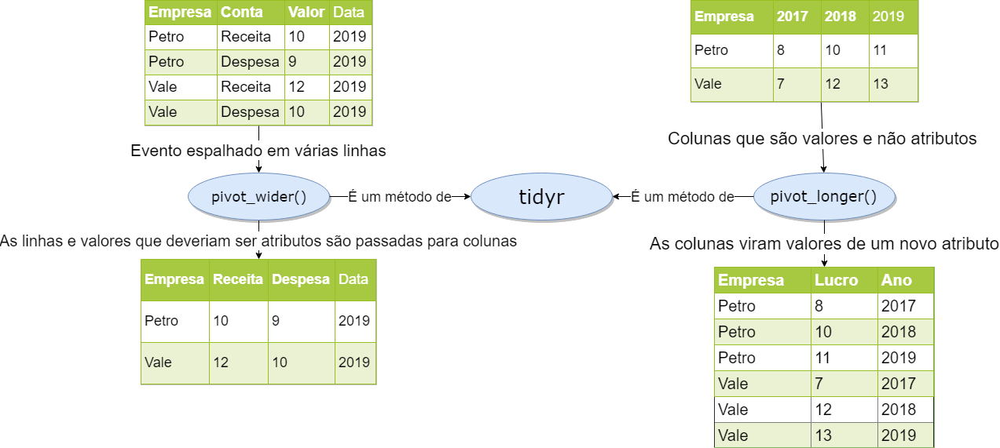


## Pivoteando nosso data frame com muitas linhas

O nosso data frame tem cada tipo de cotação em cada linha e gostaríamos que essas linhas fossem transformadas em colunas.

A função que faz isso se chama `pivot_wider()`

Seus parâmetros mais usados são: 

* `data`, que é o data frame a ser tratado

* `names_from`, que é o atributo de onde vêm os nomes para os novos atributos

* `values_from`, o atributo de onde vêm os valores dos novos atributos

```{r pivot_wider , warning=FALSE, message=FALSE, cache=TRUE}

dados_todas_as_datas %>% 
    pivot_wider(
        names_from = cotacao,
        values_from = valor
    ) %>% 
    str()


```


## Pivoteando nosso data frame com muitas colunas


É muito comum recebermos os dados com colunas que deviam ser valores de um atributo, e não um atributo em si.

O exemplo clássico é a colocação de datas nas colunas do dado, como nos dados retirados do site `Datasus`


```{r exemplo_datasus, cache=TRUE, warning=FALSE, message = FALSE}

read_csv2(
    "dados/siab/cadastro_numero_familias.csv", 
    skip = 3,
    locale = locale(encoding = "latin1" ) 
    ) %>% 
    glimpse()
    


```


## Pivoteando nosso data frame com muitas colunas (cont.)


Acontece que "2009" não é um atributo, mas sim o valor de um atributo que deveria ser data

A função `pivot_longe()` faz a operação de que precisamos.

* `data`, que é o data frame a ser tratado

* `names_from`, que é o atributo de onde vêm os nomes para os novos atributos

* `values_from`, o atributo de onde vêm os valores dos novos atributos

Note também a função `separate()`, que divide colunas de acordo com caracteres separadores. 


```{r pivot_longer, warning=FALSE, message=FALSE }

siab_familias <- read_csv2(
    "dados/siab/cadastro_numero_familias.csv", 
    skip = 3,
    locale = locale(encoding = "latin1" ) 
    ) %>% 
    pivot_longer(
        cols = -`Município`,
        names_to = "data",
        values_to = "familias"
    ) %>% 
    rename(
        municipio = `Município`
    ) %>% 
    separate(
        col = municipio,
        into = c("cod_municipio", "municipio"),
        sep = " ",
        extra = "merge"  
    ) %>% 
    mutate(
        cod_municipio = as.integer(cod_municipio),
        data = as.integer(data),
        familias = as.integer(familias)
    )


head(siab_familias)


```


## Pivoteando nosso data frame com muitas colunas (cont.)

Para pegar mais informações dos municipios, vamos ler um arquivo baixado do iBGE 


```{r le_municipios, message=FALSE, warning=FALSE, cache=TRUE}

municipios <- read_excel("dados/ibge/populacao.xlsx", skip = 2, col_names = TRUE) 


head(municipios, n = 30)


```

Ops... células mescladas

Não deixe o ódio tomar você...


```{r, message=FALSE, warning=FALSE  }

municipios_ajeitado <- municipios %>%  
  rename(
    cod_municipio = 1,
    nome_municipio = 2,
    ano = 3,
    populacao = 4
  ) %>% 
  fill(cod_municipio, .direction = "down") %>% 
  fill(nome_municipio, .direction = "down") %>% 
  mutate(UF = str_extract(nome_municipio,"\\([A-Z]{2}\\)")) %>%
  mutate(UF = str_extract(UF,"[A-Z]{2}")) %>% 
  mutate(
    cod_municipio = as.integer(cod_municipio),
    ano = as.integer(ano)
  )

head(municipios_ajeitado)

```


## Combinando tibbles (dplyr)

Para juntar as informações de dois tibbles em um só, podemos fazer isso de três formas

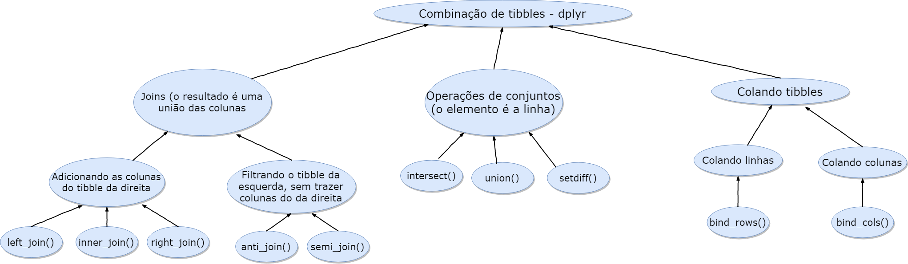

## Combinando tibbles (tidyr): funções de join

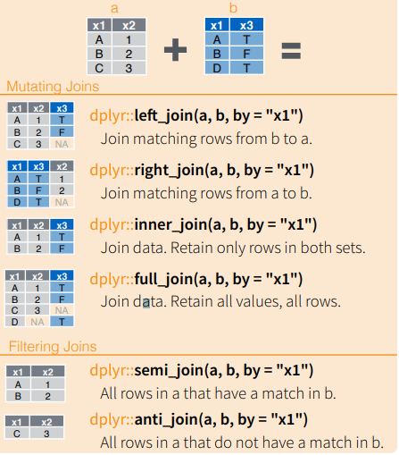

Fonte: [@cheatsheettransform]


## Combinando tibbles (tidyr): exemplo funções de join:

Anteriormente, pegamos informações do cadastro de famílias...

```{r}

head(siab_familias)

```

E de municípios


```{r}

head(municipios_ajeitado)


```

Os códigos são diferentes, mas 

```{r, warning=FALSE, message=FALSE, cache=TRUE }

de_para_codigos <- read_csv2(
  "http://blog.mds.gov.br/redesuas/wp-content/uploads/2018/06/Lista_Munic%C3%ADpios_com_IBGE_Brasil_Versao_CSV.csv",
  locale = locale(encoding = "latin1")
  ) %>% 
  select(IBGE, IBGE7)


head(de_para_codigos)

```


Agora juntamos as informações do Siab com as informações dos municípios 


```{r}


siab_familias %>% 
  inner_join(de_para_codigos, by = c("cod_municipio" = "IBGE")) %>%
  inner_join(municipios_ajeitado, by = c("IBGE7" = "cod_municipio", "data" = "ano") ) %>%
  View()

head(siab_familias)


```


Seria legal saber qual o tamanho médio das famílias


```{r}

numero_medio_familias <- read_excel("dados/ibge/pessoas_por_familia.xlsx", skip = 2) %>% 
  select(c(1, 3, 7)) %>% 
  rename(
    cod_municipio = 1,
    pessoas = 2,
    numero = 3
  ) %>% 
  
  View()


```


## Tratamento de strings (caracteres) com stringr

## Tratamento de datas (lubridate)

## Tratamento de dados categóricos (forcats) 

# VISUALIZAÇÃO DE DADOS 

## NÃO!!! Distorções


Fonte: [@doria]


## NÃO!!! Distorções II

Às vezes mesmo sem querer (será?)

PS. gráfico de 2014


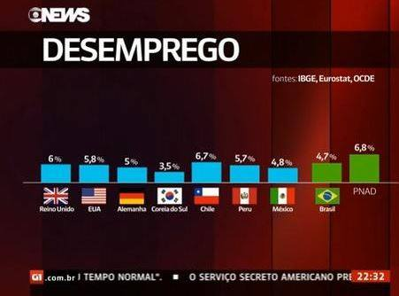


Fonte: [@gnews]

## NÃO!!! Estilos que atrapalham


Gráfico com sombra, 3D, estilos que dificultam a interpretação


Fonte: [@healy2018data]


## NÃO!!! 3D indiscriminado


O pessoal que usa Excel muitas vezes ama 3D, mas...


[@healy2018data]


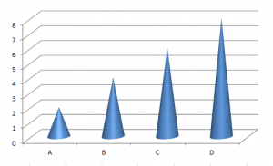


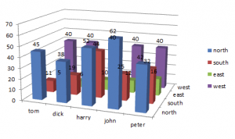


## NÃO!!! Pizza maior que 100%


Fonte: [@mais100]

## MELHOR AINDA: Pizza só meio a meio

Assim como os restaurantes devemos servir pizzas de dois sabores no máximo

Tentem descobrir qual a menor e a menor categoria em cada caso


Fonte: [@pie]


## NÃO!!! Pizza só meio a meio (cont.)


Fonte: [@pie]

## Com muita parcimônia: gráficos de linhas com dois eixos

Gráficos de dois eixos podem mostrar relações espúrias muito facilmente. E elas dependem da escolha da escala e dos limites dos eixos.


Fonte [@twoaxis]

O mesmo dado pode levar aos seguintes gráficos (e suas soluções)


## Dicas para uma boa visualização


* Enfatize o dado relevante

* Integre texto e gráfico

* Use fontes e cores diferentes do padrão 

* Principalmente em colunas e barras, faça o eixo começar de ZERO


```{r enfatize, warning=FALSE, message=FALSE, out.width="70%"}

loadfonts(device = "win")

by_country <- organdata %>% group_by(consent_law, country) %>%
    summarize_if(is.numeric, list(mean = mean, sd = sd), na.rm = TRUE) %>%
    ungroup()


p <- ggplot(data = by_country,
            mapping = aes(x = gdp_mean, y = health_mean))

p + geom_point( color = "coral4") +
    geom_text_repel(data = subset(by_country, gdp_mean > 25000),
                    mapping = aes(label = country), 
                    size = 3,
                    color = "coral4",
                    family="Bookman Old Style"

                    
                    
                    ) +

  labs(y = "Gastos com saúde per cap.", x = "PIB per cap." ) +
  scale_x_continuous(
    labels = number_format(decimal.mark = ",", big.mark = "."),
    limits = c(0,NA)
  ) +
  scale_y_continuous(
    labels = number_format(decimal.mark = ",", big.mark = "."),
    limits = c(0,NA)
  ) +
  theme_minimal(
  ) +
  ggtitle(
    label = "Gastos em saúde x PIB"
  ) +
  theme(
    text=element_text(family="Bookman Old Style", color = "coral4"),
    axis.text =  element_text(colour = "coral4"),
    panel.background = element_rect(fill = "beige"),
    panel.grid.minor =   element_line(colour = "bisque1"),
    panel.grid.major =  element_line(colour = "bisque3")
  )
  


```


## Dicas para uma boa visualização

Use small multiples: divida o gráfico em gráficos iguais menores cada um com parte dos dados, seguindo uma regra categórica


```{r, out.width="90%"}

#("azure2", "chocolate", "steelblue4", "darkslategray", "slategray3", "slategray4")

p <- ggplot(data = gapminder, mapping = aes(x = year, y = gdpPercap))
p + geom_line(color="chocolate", aes(group = country)) +
    geom_smooth(size = 1.1, method = "loess", se = FALSE, color = "tan4") +
    scale_y_log10(labels=scales::dollar) +
    facet_wrap(~ continent, ncol = 5) +
    labs(x = "Year",
         y = "GDP per capita",
         title = "GDP per capita on Five Continents")+
  theme_minimal() +
  theme(
    text=element_text(family="CMU Serif", color = "darkslategray", size = 8),
    axis.text =  element_text(colour = "darkslategray"),
    panel.background = element_rect(fill = "azure2"),
    panel.grid.minor =   element_line(colour = "slategray2"),
    panel.grid.major =  element_line(colour = "slategray2"),
    strip.text = element_text(family="CMU Serif", colour = "darkslategray"),
    aspect.ratio = 1
  )


```


## GGPLOT2


GGPLOT2 é a biblioteca de visualização de dados moderna mais usada no R.

Muitos dos problemas listados anteriormente são tratados por ela. É até difícil causar alguns dos problemas anteriores, por exemplo as distorções. É preciso muito malabarismo para produzir um gráfico com 2 eixos.

Por outro lado, a biblioteca facilita muito a criação de small multiples, a criação de gráficos personalizados e complexos


## Filosofia


GGPLOT é baseada na filosofia de Tufte [@tufte1973visual] e Wilkinson [@wilkinsongrammar], em que os gráficos são construídos a partir de dois princípios:

* Um gráfico é uma construção em camadas

* Os dados ganham sentido a partir de mapeamentos a escalas, que são mapeadas a geometrias

## Camadas da GGPLOT2

A GGPLOT2 parece mais complicada de usar do que funções como a `plot()` da biblioteca base do R.

Talvez porque as pessoas não são sempre apresentadas às camadas da gramática "Grammar of Graphics" que fundamenta a biblioteca.


Fonte: [@datacampggplot2]

## Descrição das camadas

- **Dados (data)**

- **Aesthetics (aes())**: mapeamento das colunas dos dados a escalas

- **Geometries geoms_()**: elementos visuais que mostram os dados nas escalas

- **Facets**: small multiples

- **Statistics**: representações do dados transformadas por operações matemáticas

- **Coordinates**

- **Themes**: "non-data ink", ou seja, os elementos que não são diretamente plotados pela existência de dados 

## Elementos das camadas

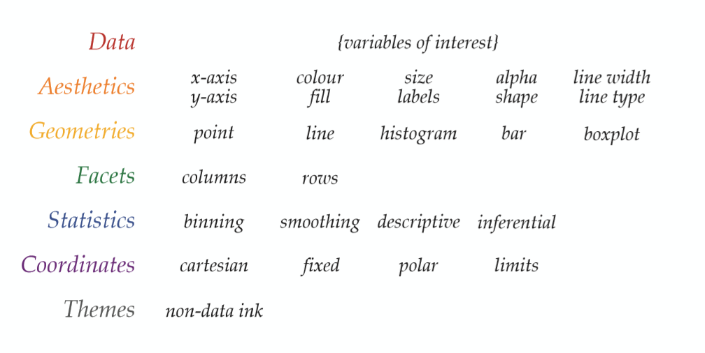

Fonte: [@datacampggplot2]


## Montando o gráfico

Usando as camadas, vamos montando o gráfico

Vamos usar para este exemplo um dataset clássico, de espécimes de flores: `iris`

```{r}

glimpse(iris)

```

## Montando o gráfico: data, aes, geom


```{r}

ggplot(iris, aes(x = Sepal.Length, y = Sepal.Width)) +     
  geom_point(alpha = 0.6)


```

Veja que, pela variável ser representada de forma discreta (uma casa decimal), há sobreposição de pontos. para dar a real impressão de quantos pontos existem, o ideal é inserir um ruído.

```{r}

ggplot(iris, aes(x = Sepal.Length, y = Sepal.Width)) +     
  geom_jitter(alpha = 0.6)


```

## Montando o gráfico: data, aes, geom, facet


```{r}

ggplot(iris, aes(x = Sepal.Length, y = Sepal.Width)) +     
  geom_jitter(alpha = 0.6) +
  facet_grid(. ~ Species)


```

## Montando o gráfico: data, aes, geom, facet, statistics


```{r}

ggplot(iris, aes(x = Sepal.Length, y = Sepal.Width)) +     
  geom_jitter(alpha = 0.6) +     
  facet_grid(. ~ Species) +
  stat_smooth(method = "lm", se = F, col = "red")

```


## Montando o gráfico: data, aes, geom, facet, statistics, coord


```{r}

ggplot(iris, aes(x = Sepal.Length, y = Sepal.Width)) +     
  geom_jitter(alpha = 0.6) +     
  facet_grid(. ~ Species) +
  stat_smooth(method = "lm", se = F, col = "red") +
  coord_flip()


```


## Montando o gráfico: data, aes, geom, facet, statistics, coord, theme


```{r}

wes <- wes_palette("Royal2", 5, "discrete")

ggplot(iris, aes(x = Sepal.Length, y = Sepal.Width)) +     
  geom_jitter(alpha = 0.6, color = wes[1]) +     
  facet_grid(. ~ Species) +
  stat_smooth(method = "lm", se = F, col = wes[1]) +
  coord_flip() +
  theme_minimal() +
  theme(
    text=element_text(family="Bradley Hand ITC", color = wes[1], size = 16),
    axis.text =  element_text(colour = wes[1]),
    panel.background = element_rect(fill = "white"),
    panel.grid.minor =   element_line(colour = wes[2]),
    panel.grid.major =  element_line(colour = wes[3]),
    strip.text = element_text(family="Bradley Hand ITC", color = wes[1]),
    panel.border = element_rect(colour = wes[4], fill = NA)
  )

```

## Escolhendo o melhor gráfico


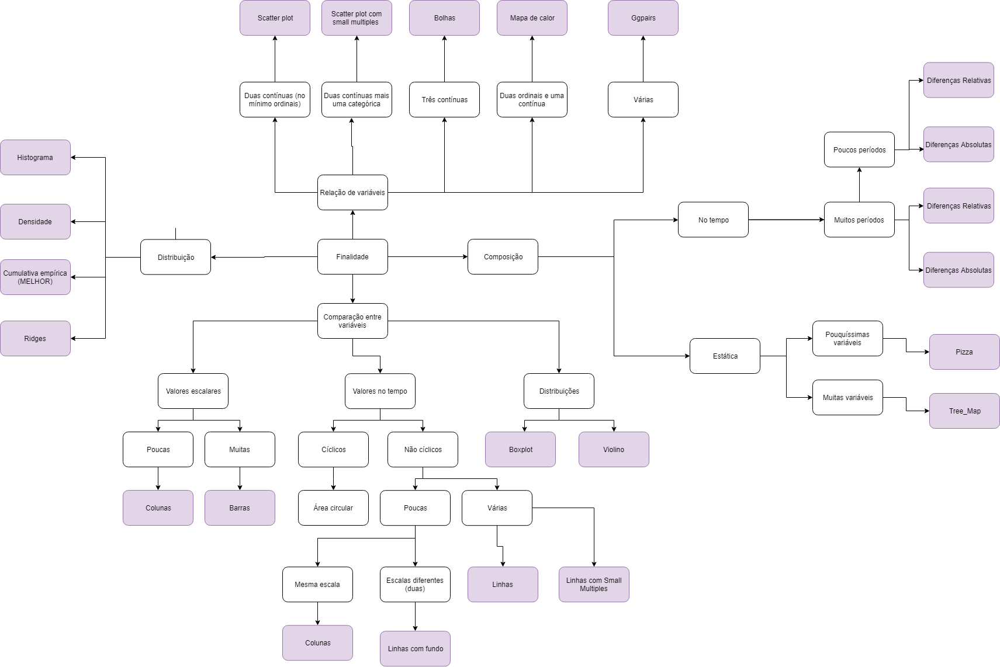


## Escolhendo o melhor gráfico: distribuição (variável discreta)


```{r, message= FALSE, warning= FALSE  }


gols <- read_csv("dados/football_events/ginf.csv") %>% 
  select(fthg, ftag) %>% 
  pivot_longer(cols = everything(),  names_to = "casa_fora", values_to = "gols")


ggplot(gols) + 
  geom_histogram(
    aes(x = gols),
    binwidth = 1
  ) +
  scale_x_continuous(breaks = 0:10, minor_breaks = c()) +
  theme_minimal()


```


```{r}


result <- fitdistr(  gols$gols  , densfun = "Poisson" ) 

pois <- rpois(length(gols$gols ), lambda = result$estimate ) %>% 
  enframe(value = "gols") %>% 
  mutate(tipo = "poisson")


real_simulado <- gols %>% 
  mutate(tipo = "real" ) %>% 
  bind_rows(pois)

ggplot() + 
  geom_histogram(
    data = real_simulado,
    aes(x = gols, group = tipo, fill = tipo),
    binwidth = 1,
    show.legend = TRUE,
    position = "identity",
    alpha = 0.5
  ) +
  scale_x_continuous(breaks = 0:10, minor_breaks = c()) +
  geom_vline(aes(xintercept = result$estimate)) +
  geom_text(aes(x = result$estimate, y = 7000 ),nudge_x = 0.3,   label = number(result$estimate, accuracy = 0.01 )) +
  theme_minimal()


```


## Escolhendo o melhor gráfico: acumulada empírica


O gráfico mostrando a função de probablidade acumulada empírica mostra propriedades que o histograma não mostra


```{r}

ggplot(gols, aes(x = gols)) +
  stat_ecdf(geom = "step") +
  scale_x_continuous(breaks = 0:10, minor_breaks = c()) +
  theme_minimal()


```

## Escolhendo o melhor gráfico: distribuição de variável contínua


Para variáveis contínuas, faz sentido usar o gráfico de densidade


```{r, message=FALSE, warning=FALSE}

ufc_pesos <- read_csv("dados/ufc/data.csv") %>% 
  filter(weight_class == "Heavyweight") %>% 
  select(
    R_Height_cms,
    B_Height_cms,
    Winner
  ) %>% 
  transmute(
    altura_vencedor = if_else(Winner == "Red", R_Height_cms, B_Height_cms  ),
    altura_perdedor = if_else(Winner == "Red", B_Height_cms, R_Height_cms  )
  ) %>% 
  pivot_longer(cols = everything(), names_to = "resultado", values_to = "altura")


ggplot(ufc_pesos) + 
  geom_density(aes(x = altura)) +
  theme_minimal()


```

## Escolhendo o melhor gráfico: distribuição de variável contínua. ECF


Mais uma vez a distribuição empírica nos deixa ver mais coisa: os quantis


```{r}

ggplot(ufc_pesos) + 
  stat_ecdf(aes(x = altura), geom = "density" ) +
  theme_minimal()


```


## Escolhendo o melhor gráfico: comparando distribuições


```{r}

ggplot(ufc_pesos) + 
  geom_density(aes(x = altura, color = resultado)) +
  theme_minimal()


```


```{r}

ggplot(ufc_pesos) + 
  stat_ecdf(aes(x = altura, color = resultado), geom = "density" ) +
  theme_minimal()


```


## Escolhendo o melhor gráfico: comparando muitas distribuições


```{r, message=FALSE, warning=FALSE }

ufc_pesos <- read_csv("dados/ufc/data.csv") %>% 
  select(
    weight_class,
    R_Height_cms,
    B_Height_cms,
    Winner
  ) %>% 
  transmute(
    weight_class,
    altura_vencedor = if_else(Winner == "Red", R_Height_cms, B_Height_cms  ),
    altura_perdedor = if_else(Winner == "Red", B_Height_cms, R_Height_cms  )
  ) %>% 
  pivot_longer(cols = -weight_class, names_to = "resultado", values_to = "altura")


ggplot(ufc_pesos) +
  geom_density_ridges(aes(x = altura, y = weight_class ), fill = "lightblue") +
  theme_ridges() +
  scale_x_continuous(breaks = seq(150,by = 5, to = 220))


```


Legal a ideia, mas não queremos comparar mulheres também 


## Introduzindo stringr


A biblioteca `stringr`facilita muio lidar com strings. Por exemplo detectar um pedaço de string em outra


```{r, message=FALSE, warning= FALSE }

ufc_pesos <- read_csv("dados/ufc/data.csv") %>% 
  filter(!str_detect(weight_class, "Women")) %>% 
  select(
    weight_class,
    R_Height_cms,
    B_Height_cms,
    Winner
  ) %>% 
  transmute(
    weight_class,
    altura_vencedor = if_else(Winner == "Red", R_Height_cms, B_Height_cms  ),
    altura_perdedor = if_else(Winner == "Red", B_Height_cms, R_Height_cms  )
  ) %>% 
  pivot_longer(cols = -weight_class, names_to = "resultado", values_to = "altura")


ggplot(ufc_pesos) +
  geom_density_ridges(aes(x = altura, y = weight_class ), fill = "lightblue") +
  theme_ridges() +
  scale_x_continuous(breaks = seq(150,by = 5, to = 220))


```

Melhorou, mas ainda á estranho. Melhor seria se as classes de peso estivessem em ordem


## Introduzindo forcats

No R, as variáveis categóricas são chamadas de `fatores`. Cada valor possível de um fator é representadas internamente com um identificador numérico, e não com a própria string.

Cada valor possível da variável categórica também é chamada de `level`

Podemos manipular essas representações facilmente com a `forcats`.

No caso, queremos ordenar nosso fator com a ordem as classes de peso no UFC

A função `fct_relevel` possibilita a ordenação manual de uma variável `factor`


```{r, message=FALSE, warning= FALSE}

ufc_pesos_ordem <- ufc_pesos %>% 
  mutate(
    weight_class = fct_relevel(weight_class,
      c(
      "Flyweight",
      "Bantamweight",
      "Featherweight",
      "Lightweight",
      "Welterweight",
      "Middleweight",
      "Light Heavyweight",
      "Heavyweight",
      "Catch Weight",
      "Open Weight"
      )
    )  
  )


ggplot(ufc_pesos_ordem) +
  geom_density_ridges(aes(x = altura, y = weight_class ), fill = "lightblue") +
  theme_ridges() +
  scale_x_continuous(breaks = seq(150,by = 5, to = 220))


```

## Relação entre variáveis: scatter plot


Os gráficos do tipo scatter plot


Vamos brincar um pouco com os dados do Banco Mundial


```{r, message=FALSE, warning=FALSE, cache=TRUE  }

 

taxa_homicidios <- wb("VC.IHR.PSRC.P5", country = "all", mrv = 10, POSIXct = TRUE ) %>% 
  select(iso3c, value, date) %>% 
  group_by(iso3c) %>% 
  top_n(1, date) %>% 
  rename(homicidios = value)

gini <- wb("SI.POV.GINI", country = "all", mrv = 10, POSIXct = TRUE ) %>% 
  select(iso3c, value, date) %>% 
  group_by(iso3c) %>% 
  top_n(1, date) %>% 
  rename(desigualdade = value)

pib_per_capita <- wb("NY.GDP.PCAP.PP.KD", country = "all", mrv = 10, POSIXct = TRUE ) %>% 
  select(iso3c, value, date) %>% 
  group_by(iso3c) %>% 
  top_n(1, date) %>% 
  rename(riqueza = value)

pib_gini_homi <- taxa_homicidios %>% 
  inner_join(gini, by = c("iso3c")) %>% 
  inner_join(pib_per_capita, by = c("iso3c")) %>% 
  left_join(codelist, by = c("iso3c") ) %>% 
  select(riqueza, desigualdade, homicidios, continent, region) %>% 
  pivot_longer(cols = c("riqueza", "desigualdade"), names_to = "tipo_indice", values_to = "indice" ) %>% 
  mutate(tipo_indice = str_to_title(tipo_indice))


```


```{r warning=FALSE, message=FALSE, out.width="80%"  }

ggplot(pib_gini_homi, aes(y = homicidios, x = indice)) +
  geom_point(alpha = 0.4) +
  facet_wrap(~tipo_indice, scales = "free", ncol = 1) +
  geom_smooth() +
  theme_minimal() +
  labs(x = "", y = "Homicídios por 100 mil") +
  scale_x_continuous(labels = number_format(decimal.mark = ",", big.mark = ".")) 
  


```

## Relação entre variáveis: scatter plot (cont.)


É possível visualizar os eixos em log na base 10


```{r, message=FALSE, warning=FALSE, out.width="80%"}


ggplot(pib_gini_homi, aes(y = homicidios, x = indice)) +
  geom_point(alpha = 0.4) +
  facet_wrap(~tipo_indice, scales = "free", ncol = 1) +
  geom_smooth() +
  theme_minimal() +
  labs(x = "", y = "Homicídios por 100 mil") +
  scale_x_continuous(labels = number_format(decimal.mark = ",", big.mark = ".")) +
  scale_y_log10() 


```


## Relação entre variáveis: scatter plot (cont.)


É possível também usar as cores para olhar uma terceira característica


```{r, message=FALSE, warning=FALSE, out.width="80%"}

ggplot(pib_gini_homi, aes(y = homicidios, x = indice)) +
  geom_point(alpha = 0.4, aes(color = continent )) +
  facet_wrap(~tipo_indice, scales = "free", ncol = 1) +
  geom_smooth() +
  theme_minimal() +
  labs(x = "", y = "Homicídios por 100 mil") +
  scale_x_continuous(labels = number_format(decimal.mark = ",", big.mark = ".")) +
  scale_y_log10()  +
  theme(legend.position = "top")


```


A linha de regressão também pode ser estimada para cada grupo. Neste caso vamos usar o método de regressão linear, pois o LOESS original nao funciona nada bem com muito poucos dados (nem a linear, mas...)


```{r, message=FALSE, warning=FALSE, out.width="80%"}

ggplot(pib_gini_homi, aes(y = homicidios, x = indice, color = continent)) +
  geom_point(alpha = 0.4 ) +
  facet_wrap(~tipo_indice, scales = "free", ncol = 1) +
  geom_smooth(se = FALSE, method = "lm") +
  theme_minimal() +
  labs(x = "", y = "Homicídios por 100 mil") +
  scale_x_continuous(labels = number_format(decimal.mark = ",", big.mark = ".")) +
  scale_y_log10() 


```


```{r, message=FALSE, warning=FALSE, out.width="80%"}

analise_desigualdade <- pib_gini_homi %>% 
  filter(tipo_indice == "Desigualdade")

ggplot(analise_desigualdade, aes(y = homicidios, x = indice, color = continent)) +
  geom_point(alpha = 0.4) +
  facet_wrap(~tipo_indice, ncol = 1) +
  geom_smooth(se = FALSE, method = "lm") +
  theme_minimal() +
  labs(x = "Índice de Gini", y = "Homicídios por 100 mil") +
  scale_x_continuous(labels = number_format(decimal.mark = ",", big.mark = ".")) +
  scale_y_log10() +
  facet_wrap(~continent)  +
  theme(legend.position = "top")


```

```{r, message=FALSE, warning=FALSE, out.width="80%"}


ggplot(analise_desigualdade, aes(y = homicidios, x = indice, color = continent)) +
  geom_text(aes(label = iso3c), size = 2) +
  facet_wrap(~tipo_indice, ncol = 1) +
  geom_smooth(se = FALSE, method = "lm") +
  theme_minimal() +
  labs(x = "Índice de Gini", y = "Homicídios por 100 mil") +
  scale_x_continuous(labels = number_format(decimal.mark = ",", big.mark = ".")) +
  scale_y_log10() +
  facet_wrap(~continent) +
  theme(legend.position = "top")


```

## Relação entre variáveis: Três variáveis contínuas


Podemos avaliar três variáveis contínuas usando um gráfico de bolhas

Primeiro vamos colocar em wide as duas variáveis que tínhamos deixado long.

```{r}

pib_gini_homi_wide <- pib_gini_homi %>% 
  pivot_wider(names_from = tipo_indice, values_from = indice )
  

head(pib_gini_homi_wide)


```


A escala de cor usada abaixo, Viridis, oferece a mesma sensação para olorido e preto e branco e é feita para ajudar daltônicos.


O log foi usado aqui para evitar que os valores extremos dificultem a visualização da escala de cores.


```{r}


ggplot(pib_gini_homi_wide) +
  geom_point(aes(color = homicidios, x = Desigualdade , y = Riqueza )) +
  scale_color_viridis_c(trans = "log10", direction = -1, option = "inferno") +
  theme_minimal()


```


## Relação entre variáveis:  Três variáveis contínuas


```{r, cache=TRUE, warning=FALSE, message=FALSE }

hdi <- read_csv("dados/hdi/atlas.csv") %>% 
  rename(municipio = `município` ) %>% 
  select(
    ano,
    rdpc,
    gini,
    municipio,
    uf
  ) %>% 
  filter(ano == 2010)
  

violencia <- extract_text("dados/atlasviolencia/8099-tabelamunicipiostodossite.pdf", encoding = "UTF-8") %>% 
  str_split(pattern = fixed("\n")) %>% 
  unlist() %>% 
  enframe( value = "linha") %>% 
  mutate(
    UF = str_extract(linha, "[A-Z]{2}") ,
    municipio = str_extract(linha, "(?<=[A-Z]{2} ).+?(?=[0-9])"),
    numeros = str_extract_all(linha, "(?<= )[0-9 ,.]*") 
  ) %>% 
  unnest_legacy() %>% 
  filter(str_length(numeros)>1) %>% 
  mutate(
    numeros = str_trim(numeros),
    municipio = str_trim(municipio) %>% str_to_upper()
  ) %>% 
  separate(
    col = numeros,
    into = c("populacao", "homicidios", "ocultos", "taxa_homicidios"),
    sep = " "
  ) %>% 
  mutate(taxa_homicidios = parse_number(taxa_homicidios, locale = locale(decimal_mark = ",")) )
  

ufs <- municipios_ajeitado %>% 
  select(
    UF,
    cod_municipio
  ) %>% 
  mutate(
    cod_uf = cod_municipio %/% 100000
  ) %>% 
  select(-cod_municipio) %>% 
  distinct() %>% 
  filter(!is.na(cod_uf)) 
  
hdi %<>% inner_join(ufs, by = c("uf" = "cod_uf"), suffix = c("_old", "")) 


hdi_violencia <- hdi %>% 
  inner_join(violencia, by = c("municipio", "UF") ) %>% 
  mutate(
    regiao = case_when(
      uf %/% 10 == 1 ~ "Norte",
      uf %/% 10 == 2 ~ "Nordeste",
      uf %/% 10 == 3 ~ "Sudeste",
      uf %/% 10 == 4 ~ "Sul",
      uf %/% 10 == 5 ~ "Centro-Oeste",
      TRUE ~ NA_character_
      
    ) 
  )
  


```


```{r}


ggplot(hdi_violencia) +
  geom_jitter(aes(color = taxa_homicidios, x = gini , y = rdpc ), alpha = 0.2   ) +
  scale_color_gradient(low = "blue", high = "red", trans = "log10" ) +
  facet_wrap(~regiao) + 
  theme_minimal()


```


## Relação entre variáveis: Duas discretas e uma contínua


```{r, message=FALSE, warning=FALSE }

ufc_data <- read_csv("dados/ufc/data.csv") %>% 
  select(weight_class, no_of_rounds )

ufc_raw_data <- read_csv2("dados/ufc/raw_total_fight_data.csv") %>% 
  select(last_round)


ufc_tudo <- bind_cols(ufc_data, ufc_raw_data) %>% 
  filter(no_of_rounds == 3) %>% 
  group_by(weight_class) %>% 
  mutate(n_classe = n()) %>%
  group_by(weight_class, last_round) %>% 
  summarise(n_round = n(), n_classe = mean(n_classe)) %>% 
  mutate(frac_lutas = n_round/n_classe ) %>% 
  ungroup() %>% 
  filter( weight_class %in%
      c(
      "Flyweight",
      "Bantamweight",
      "Featherweight",
      "Lightweight",
      "Welterweight",
      "Middleweight",
      "Light Heavyweight",
      "Heavyweight"
            
          )) %>% 
  mutate(
    weight_class = fct_relevel(weight_class,
      c(
      "Flyweight",
      "Bantamweight",
      "Featherweight",
      "Lightweight",
      "Welterweight",
      "Middleweight",
      "Light Heavyweight",
      "Heavyweight"
      )
    )
  )


```


```{r}

ggplot(ufc_tudo, aes(x = last_round, y = weight_class)) +
  geom_tile(aes(fill = frac_lutas )) +
  geom_text(aes(label = percent(frac_lutas))   ) +
  scale_fill_gradient(low = "white", high = "darkgreen", labels = percent ) +
  theme_minimal() 
  


```


## Relação entre variáveis:  Várias variáveis


```{r, message=FALSE, warning=FALSE, cache=TRUE, out.width="90%" }

hdi_desc <-  read_csv("dados/hdi/desc.csv")

hdi_tudo <-  read_csv("dados/hdi/atlas.csv") %>% 
  mutate(
    regiao = case_when(
      uf %/% 10 == 1 ~ "N",
      uf %/% 10 == 2 ~ "NE",
      uf %/% 10 == 3 ~ "SE",
      uf %/% 10 == 4 ~ "S",
      uf %/% 10 == 5 ~ "CO",
      TRUE ~ NA_character_
    )
  ) %>% 
  select(
      espvida,
      anos_estudo = e_anosestudo,
      gini,
      pind,
      pren10ricos,
      prentrab,
      t_banagua,
      regiao
  )


ggpairs(hdi_tudo)  +
  theme_minimal()


```


## Composição: no tempo, poucos períodos, valores relativos


```{r, message=FALSE, warning=FALSE}


jogos <- read_csv("dados/football_events/ginf.csv") %>% 
  mutate(
    resultado = case_when(
      fthg > ftag ~ "Casa",
      fthg < ftag ~ "Fora",
      TRUE ~ "Empate"
      )
  ) %>% 
  count(season, country, resultado) 


ggplot(jogos) + 
  geom_col(aes(y = n, fill = resultado, x = as.factor(season)), position = "fill") +
  facet_wrap(~country) +
  theme_minimal() +
  scale_fill_manual(values = wes_palette("Royal2")) +
  scale_y_continuous(labels = percent) +
  theme(
    axis.text.x = element_text(angle = 90),
    legend.position = "top",
    text = element_text(family = "Rockwell Condensed")
  ) +
  labs(x = "Temporada", y = "% Vitórias", fill = "Resultado")
  


```

## Composição: no tempo, poucos períodos, valores absolutos


```{r, message=FALSE, warning=FALSE}

jogos <- read_csv("dados/football_events/ginf.csv") %>% 
  filter(season != 2017) %>% 
  select(season, country, Fora = ftag, Casa = fthg) %>% 
  pivot_longer(cols = c(Fora, Casa), names_to = "Time", values_to = "Gols"  ) %>% 
  group_by(season, country, Time) %>% 
  summarise(Gols = sum(Gols)) 


ggplot(jogos) + 
  geom_col(aes(y = Gols, fill = Time, x = as.factor(season)), position = "stack") +
  facet_wrap(~country) +
  theme_minimal() +
  scale_fill_manual(values = wes_palette("Royal2")) +
  theme(
    axis.text.x = element_text(angle = 90),
    legend.position = "top",
    text = element_text(family = "Rockwell Condensed")
  ) +
  labs(x = "Temporada", y = "Gols", fill = "Time")


```


## Composição: no tempo, muitos períodos, valores relativos


Repare que há muitos países, ou seja, muitas categorias.

Usando a biblioteca `forcats` e sua função `fct_lump` conseguimos criar uma categoria de "Outros"


```{r, cache=TRUE, warning=FALSE, message=FALSE   }

gdps <- wb(indicator = "NY.GDP.MKTP.PP.KD",  country = "countries_only") 


gdps_tratado <- gdps %>% 
  mutate(date = as.integer(date) ) %>% 
  group_by(country) %>% 
  mutate(ultimo_gdp = last(value, order_by = date)) %>% 
  ungroup() %>%  
  mutate(country = fct_lump(country, n = 7, w = ultimo_gdp, other_level = "Outros")) %>% 
  group_by(country, date) %>% 
  summarise(value = sum(value),
            ultimo_gdp = sum(ultimo_gdp)) %>% 
  ungroup() %>% 
  mutate(country = fct_reorder(country, ultimo_gdp ))


ggplot(gdps_tratado ) +
  geom_area(aes(x = date, y = value, fill = country), position = "fill") +
  theme_minimal() +
  scale_fill_brewer(palette = "Accent") +
  theme(
    axis.text.x = element_text(angle = 90),
    legend.position = "top",
    text = element_text(family = "CMU Classical Serif")
  ) +
  labs(x = "Ano", y = "PIB PPP", fill = "País")


```

## Composição: no tempo, muitos períodos, valores absolutos 


```{r}


gdps_tratado <- gdps %>% 
  mutate(date = as.integer(date) ) %>% 
  group_by(country) %>% 
  mutate(ultimo_gdp = last(value, order_by = date)) %>% 
  ungroup() %>%  
  mutate(country = fct_lump(country, n = 7, w = ultimo_gdp, other_level = "Outros")) %>% 
  group_by(country, date) %>% 
  summarise(value = sum(value),
            ultimo_gdp = sum(ultimo_gdp)) %>% 
  ungroup() %>% 
  mutate(country = fct_reorder(country, ultimo_gdp ))


ggplot(gdps_tratado ) +
  geom_area(aes(x = date, y = value, fill = country) ) +
  theme_minimal() +
  scale_fill_brewer(palette = "Accent") +
  theme(
    axis.text.x = element_text(angle = 90),
    legend.position = "top",
    text = element_text(family = "CMU Serif Extra")
  ) +
  labs(x = "Ano", y = "PIB PPP", fill = "País")


```

## Composição: estática, valores relativos

Aqui cabe uma torta se houver poucas categorias


```{r}

gdps_tratado <- gdps %>% 
  mutate(date = as.integer(date)) %>% 
  filter(date == max(date) ) %>% 
  mutate(country = fct_lump(country, n = 1, w =  value, other_level = "Resto")) %>% 
  group_by(country) %>% 
  summarise(PIB = sum(value))

  
ggplot(gdps_tratado, aes(x = "", y = PIB, fill = country)) +
  geom_bar( width = 1, stat = "identity", color = "white") +
  coord_polar("y", start = 0) +
  scale_fill_brewer(palette = "Accent") +
  theme_void()

  
```

## Composição: estática, valores relativos, muitos


```{r}


gdps_tratado <- gdps %>% 
  mutate(date = as.integer(date)) %>% 
  filter(date == max(date) ) %>% 
  mutate(country = fct_lump(country, n = 50, w =  value, other_level = "Resto")) %>% 
  group_by(country) %>% 
  summarise(PIB = sum(value))

  
ggplot(gdps_tratado, aes( fill = country, area = PIB, label = country)) +
  geom_treemap() +
  geom_treemap_text(grow = TRUE) +
  theme(
    legend.position = "none"
  )


```


# MODELOS DE APRENDIZADO ESTATÍSTICO

## Rudimentos de Aprendizado Estatístico

Aqui apresentaremos RUDIMENTOS de Aprendizado Estatístico com o objetivo de desmistificar alguns conceitos e apresentar algumas considerações que nos ajudarão a iniciar um processo deste tipo.


## Desmistificando Aprendizado Estatístico (ou Machine Learning)


Pesquisando imagens no Google vemos as percepções a respeito de "Machine Learning" e "Statistical Learning"


## O processo de "Data Science"


[@cadu]


## Mecânico ou Piloto ?


## O processo de Aprendizado Estatístico

Temos acesso a um pedaço dos dados existentes, que usamos para nos ajudar a especificar e treinar o nosso modelo.

Podemos adotar como premissa que existe uma função que traduz como o universo funciona. Esta função determina qual valor $y$ da variável dependente acontece quando as variáveis independentes assumem valores $x$, onde $x$ é um vetor de tamanho $p$. $p$ é o número de variáveis dependentes usadas. Esta função não determina perfeitamente $y$, então temos sempre um $\epsilon$, um ruído que pode ser devido a variáveis dependentes desconhecidas ou efeitos que não podem ser mensurados.

$$y = f(x) + \epsilon$$

Onde: 

$f(x)$ é uma função desconhecida e $E(\epsilon) = 0$, 

$\epsilon$ é independente de $x$ e $Var(\epsilon) = \sigma^2$ é constante em relação a $x$. 

Nós não temos acesso a esta $f()$ que representa a VERDADE, mas tentamos estimar uma $\hat{f}()$


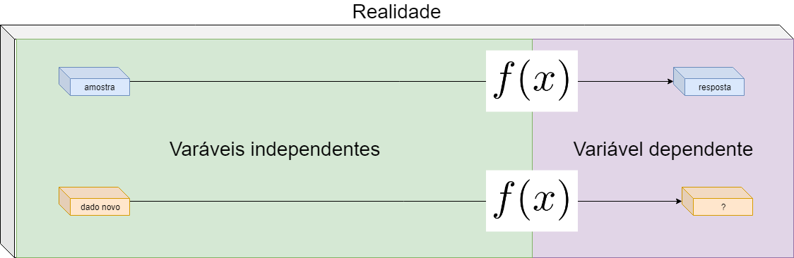  


## Fábrica de função que aproximaa realidade

Nosso modelo de Aprendizado Estatístico é uma fábrica de $\hat{f}()$ que tenta aproximar a $f()$ verdadeira.

Existem fábricas para todos os gostos. Desde fábricas que produzem funções simples e inteligíveis até funções do tipo caixa preta. 

Esta fábrica de $\hat{f}()$ recebe como insumo variáveis retiradas do ambiente. Essas variáveis podem ser tratadas de forma a deixar as coisas mais fáceis para o modelo, de modo a deixá-lo na cara do gol como Gérson fazia na copa de 70. Esta etapa de preparar as entradas se chama Feature Engineering. Para fazer isso, usamos tudo que aprendemos sobre manipulação de dados.

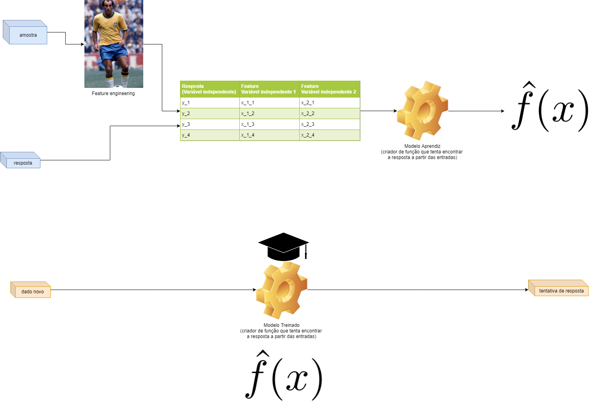

## Modelo treinado

Com o(s) modelo(s) treinado(s), faremos **predições** a respeito de outros dados futuros ou cuja variável dependente ainda desconhecemos.

Podemos também fazer **inferências** a respeito de como as variáveis independentes afetam a variáveis dependente.


## Inferência x Predição

A **predição** é o ato de descobrir $y$ a partir de $x$.

A **inferência** é o entendimento de como valores diferentes de **x** afetam **y**


## Predição

Temos que:

$$\hat{y} = \hat{f}(x) $$

Então:

$$E(y - \hat{y})^2 = [f(x) - \hat{f}(x)]^2 + Var(\epsilon)$$

Onde

$[f(x) - \hat{f}(x)]^2$ é redutível: podemos sempre estimar uma $\hat{f}()$ melhor

e

$Var(\epsilon)$ é irredutível: não importa quão bem estimemos $\hat{f}()$ o resíduo $\epsilon$ está lá

[@friedman2001elements]

## Viés e Variância

Se rodarmos $\hat{f}(x_0)$ treinando o modelo com vários conjuntos de treinamento e testasse ele com uma entrada específica qualquer para a qual $y_0 = f(x_0) + \epsilon$:

$$E[y_o - \hat{f}(x_0)] = Var(\hat{f}(x_0) + [Bias(\hat{f}(x_0))]^2 + Var(\epsilon)$$


$Var(\hat{f}(x_0)$ é a variância do modelo: o quanto ele muda quando treinamos ele com outro conjunto de treinamento

$[Bias(\hat{f}(x_0))]^2$ é o erro introduzido por tentarmos aproximar um problema complexo fda vida real com uso de um modelo simplificado.


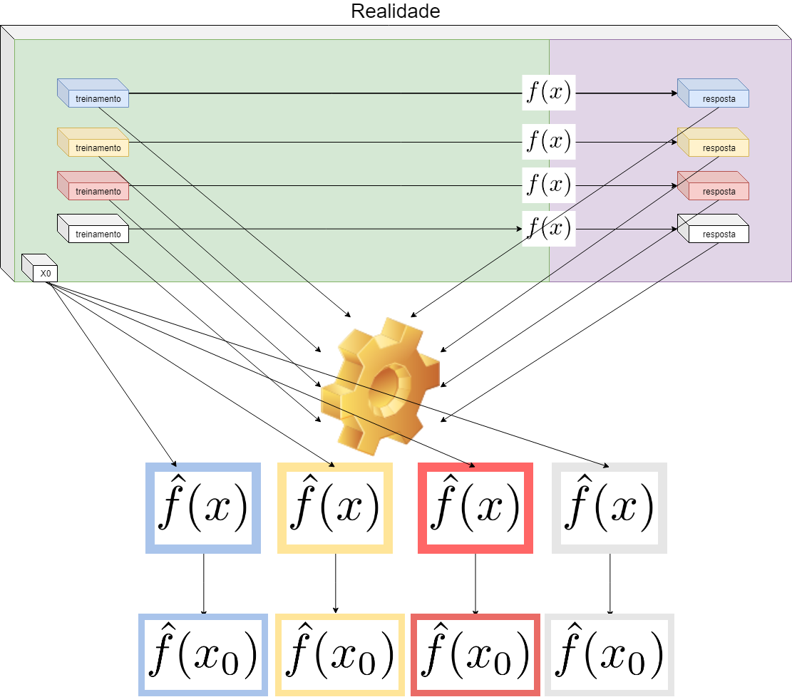


## Inferência

Os modelos variam muito com relação a "transparência da caixa"

Há uma relação inversamente proporcional (grosso modo) entre: 

- Flexibilidade do modelo, ou poder de se adaptar a uma relação complexa entre entrada e saída

- Interpretabilidade, ou facilidade de o usuário do modelo (piloto) inferir as relações entre as variáveis independentes e as variáveis dependentes

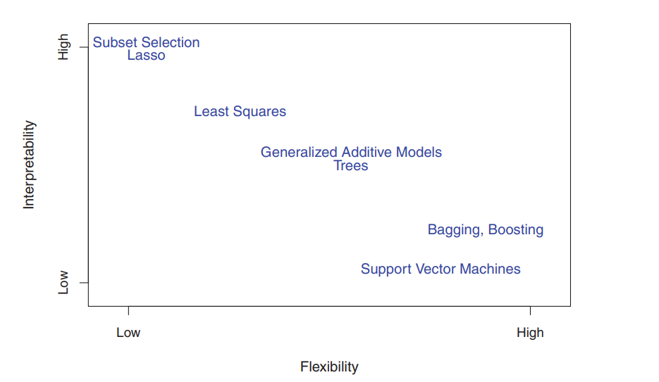

[@james2013introduction]


## Trade-off viés variância

Além da falta de interpretabilidade, outra questão pode contar contra os modelos mais complexos, com mais poder de aprender nuances sobre os dados: eles podem aprender características específicas dos dados de treinamento.

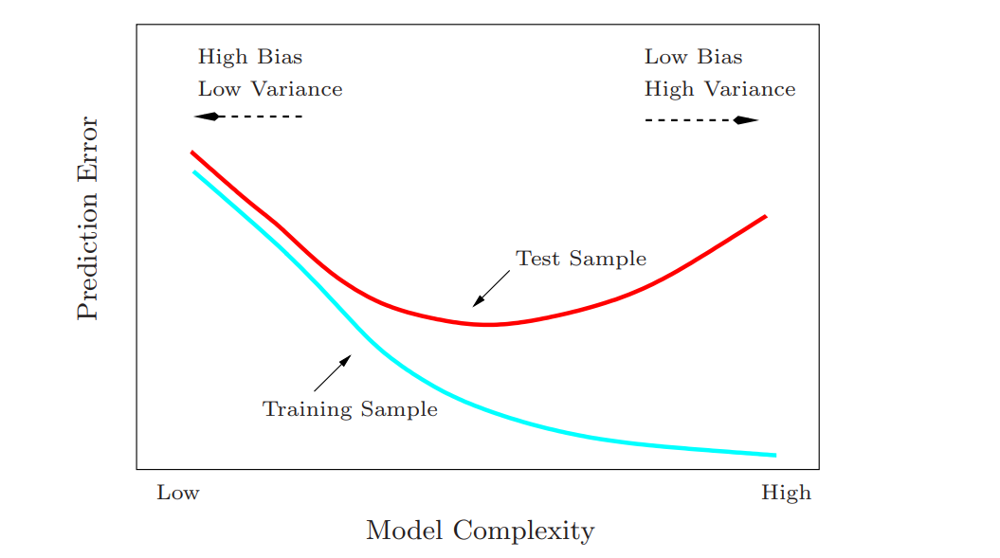

[@friedman2001elements]

## Treino, Validação e Teste

O procedimento mais usado para preparar um modelo para a vida real envolve dividir a nossa base em três pedaços:

- Dados de treinamento: que serão usados para treinar o modelo e não servem para avaliar seu desempenho

- Dados de validação: servem para comparar modelos de forma que nos possibilite escolher UM MODELO COM UMA ESPECIFICAÇÃO DE HIPERPARÂMETROS (número de nós da rede neural, )

- Dados de teste: são separados logo no início do processo, e só são usados numa avaliação final do único modelo escolhido. 


## Model Selection e Model Assesment

Model Selection: estimação da performance de vários modelos a fim de escolher o melhor

Model Assessment: tendo escolhido  melhor modelo, estimação do erro de generalização em novos dados

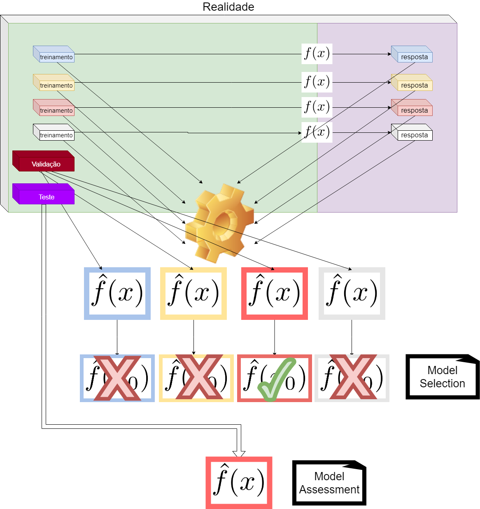


## K-Fold Cross validation

Uma forma de usar todos os dados (EXCETO OS DADOS DE TESTE) tanto para treinar quando para validar é revezando que partes dos dados estão sendo usados para treinamento e para validação. 

Podemos dividir os dados em $k$ partes. Cada vez uma parte é escolhida para ser a validação.


[@datarobot]

## Execução de modelos com broom


## Execução de modelos com broom - explorando os dados

Primeiro podemos fazer nossa exploração preliminar.

Como exemplo, podemos executar um pequeno tratamento das features usando a função `pivot_longer()` de um jeito diferente, só possível na últiam versão


```{r, message=FALSE, warning=FALSE, cache=TRUE }

ufc_data <- read_csv("dados/ufc/data.csv") 

ufc_raw_data <- read_csv2("dados/ufc/raw_total_fight_data.csv") 

ufc_raw_fighter <- read_csv2("dados/ufc/raw_fighter_details.csv") 

ufc_raw_pre <- read_csv2("dados/ufc/preprocessed_data.csv") 


ufc_cada_lutador <- bind_cols(ufc_data, ufc_raw_data) %>% 
  pivot_longer(
    cols = matches("[BR]_.*"),
    names_to = c("lutador",".value") ,
    names_sep = "_"
  ) %>% 
  mutate(
    ganhou = str_sub(Winner,1,1) == lutador
  ) %>% 
  mutate(aprov = wins/(wins+losses) )
  
  
ggplot(ufc_cada_lutador) +
  geom_boxplot(aes(x = ganhou, y = aprov )) + 
  facet_wrap(~weight_class) +
  theme_minimal()
  


ufc_aprend <- bind_cols(ufc_data, ufc_raw_data) %>%
  filter(Winner != "Draw") %>%
  mutate(
    R_aprov = R_wins / (R_wins + R_losses),
    B_aprov = B_wins / (B_wins + B_losses),
  ) %>% 
  select(
    Winner,
    weight_class,
    B_Weight_lbs,
    B_age,
    R_Weight_lbs,
    R_age,
    B_age,
    R_aprov,
    B_aprov

  ) %>%
  mutate(
    winner_color = Winner,
    zebra_blue = if_else(Winner == "Blue",1,0),
    red_mais_velho = R_age - B_age,
    idade_red = R_age
  ) %>% 
  filter(
    !is.na(idade_red) & !is.na(red_mais_velho) & !is.na(zebra_blue)
  )


```

## Estudando algumas features para nossso exemplo


Como exemplo, podemos observar a relação entre a diferença de idade dos lutadores e o vencedor da luta.

Normalmente o lutador vermelho é o favorito. mas podemos ver que quando o lutador vermelho é velho e mais velho que o azul, ele costuma perder.


```{r, message=FALSE, warning=FALSE, cache=TRUE}

ggplot(ufc_aprend ) +
  geom_jitter(aes( y = red_mais_velho, x = R_age, color = winner_color ), alpha = 0.15) +
  scale_color_manual( values =c("Blue" = "blue", "Red" = "red")) +
  facet_wrap( ~weight_class ) +
  theme_minimal()


```

## Estudando algumas features para nossso exemplo


Podemos tentar uma regressão linear simples para avaliar isso:

$$ zebra = \alpha + \beta_{idade} idade\_vermelho + \beta_{dif} dif\_vermelho\_mais\_velho + \epsilon   $$

Podemos perceber que os betas são signifucativos.


```{r, message=FALSE, warning=FALSE, cache=TRUE}

modelo_lm <- lm(zebra_blue ~ idade_red  + red_mais_velho , data = ufc_aprend)

summary(modelo_lm)


```


## Facilitando a análise de um modelo com `broom`


A biblioteca `broom` ajuda a extrair informações de vários tipos de modelo com as mesmas funções.


```{r, message=FALSE, warning=FALSE, cache=TRUE}
modelo_tidy <- tidy(modelo_lm)

modelo_aumentado <- augment(modelo_lm)

```


```{r}

modelo_tidy


```


```{r, message=FALSE, warning=FALSE, cache=TRUE}

head(modelo_aumentado)

```


## Matriz de confusão com a `caret`

A biblioteca `caret` também ajuda muito 


```{r, message=FALSE, warning=FALSE, cache=TRUE}

modelo_aumentado_factor <- modelo_aumentado %>% 
  mutate(
    previsao_zebra_blue = as_factor(round(.fitted)),
    zebra_blue = as_factor(zebra_blue)
  ) 

confusionMatrix(modelo_aumentado_factor$previsao_zebra_blue, modelo_aumentado_factor$zebra_blue )


```

## Rodando o modelo e plotando um grid de predições usando a biblioteca `purr`

Preparando um grid das variáveis independentes


```{r, message=FALSE, warning=FALSE, cache=TRUE,  out.width="90%"}
red_mais_velho <-  seq(
    from = min(ufc_aprend$red_mais_velho, na.rm = TRUE), 
    to =  max(ufc_aprend$red_mais_velho, na.rm = TRUE), 
    length.out = 50
  ) %>% 
  enframe(name = "1", value = "red_mais_velho")

idade_red <-  seq(
    from = min(ufc_aprend$idade_red, na.rm = TRUE), 
    to =  max(ufc_aprend$idade_red, na.rm = TRUE), 
    length.out = 50
  ) %>% 
  enframe(name = "2", value = "idade_red")

weight_classes <- ufc_aprend %>% 
  select(weight_class) %>% 
  distinct()


grid_previsao <- red_mais_velho %>% 
  crossing(idade_red) %>% 
  crossing(weight_classes)


ggplot(grid_previsao %>% filter(weight_class == "Heavyweight")) +
  geom_point(aes(x = idade_red, y = red_mais_velho ), size = 0.01) +
  theme_minimal()


```

## Rodando o modelo e plotando um grid de predições usando a biblioteca `purr`

Rodando o modelo com o grid

```{r, message=FALSE, warning=FALSE, cache=TRUE, out.width="90%" }
previsoes <- augment(modelo_lm, newdata = grid_previsao  ) 


#idade_red  + red_mais_velho

ggplot(ufc_aprend ) +
  geom_jitter(aes( y = red_mais_velho, x = idade_red, color = winner_color ), alpha = 0.3) +
  scale_color_manual( values =c("Blue" = "blue", "Red" = "red")) +
  facet_wrap( ~weight_class ) +
  geom_point(
    data = previsoes %>% filter(.fitted > 0.5), 
    aes(y = red_mais_velho, x = idade_red ), 
    color = "lightblue",
    alpha = 0.1
  ) +
  geom_point(
    data = previsoes %>% filter(.fitted < 0.5), 
    aes(y = red_mais_velho, x = idade_red ), 
    color = "lightcoral",
    alpha = 0.1
  ) +
  theme_minimal()


```

## Rodando várias especificações de uma vez com `purrr`


Podemos treinar o modelo para cada classe


```{r varias_espec_purr, message=FALSE, warning=FALSE, cache=TRUE, out.width="90%"}  


modelo_ufc_por_classe <- ufc_aprend %>% 
  group_by(weight_class) %>% 
  nest_legacy() %>%
  mutate(
    modelo = map(data, ~lm(zebra_blue ~ idade_red  + red_mais_velho, data = .x)),
  ) %>% 
  select(-data)

ufc_por_classe <- modelo_ufc_por_classe %>%
  mutate(
    aumentado = map(modelo, augment)
  ) %>%
  unnest(aumentado)

ufc_por_classe_treinamento  <- ufc_por_classe %>%
  ungroup() %>%
  mutate(
    previsao_zebra_blue = as_factor(round(.fitted)),
    zebra_blue = as_factor(zebra_blue)
  )


confusionMatrix(ufc_por_classe_treinamento$previsao_zebra_blue, ufc_por_classe_treinamento$zebra_blue )


```

## Plotando as várias especificações de regressões lineares

```{r, message=FALSE, warning=FALSE, cache=TRUE, out.width="90%"}


grid_previsao_com_modelo <- grid_previsao %>%
  group_by(weight_class) %>% 
  nest() %>% 
  inner_join(modelo_ufc_por_classe, by = c("weight_class")) %>% 
  mutate(previsoes = map2(.x = modelo, .y =  data, .f =  ~augment(x = .x, newdata = .y) )) %>% 
  unnest_legacy(previsoes)


ggplot(ufc_aprend ) +
  geom_jitter(aes( y = red_mais_velho, x = idade_red, color = winner_color ), alpha = 0.3) +
  scale_color_manual( values =c("Blue" = "blue", "Red" = "red")) +
  facet_wrap( ~weight_class ) +
  geom_point(
    data = grid_previsao_com_modelo %>% filter(.fitted > 0.5), 
    aes(y = red_mais_velho, x = idade_red ), 
    color = "lightblue",
    alpha = 0.1
  ) +
  geom_point(
    data = grid_previsao_com_modelo %>% filter(.fitted < 0.5), 
    aes(y = red_mais_velho, x = idade_red ), 
    color = "lightcoral",
    alpha = 0.1
  ) +
  theme_minimal()


```

## Separando dados de treinamento e validação


```{r, message=FALSE, warning=FALSE, cache=TRUE, out.width="90%"}

set.seed(2512)

ufc_aprend_classes_selec <- ufc_aprend %>% 
  filter(weight_class %in%
      c(   
      "Flyweight",
      "Bantamweight",
      "Featherweight",
      "Lightweight",
      "Welterweight",
      "Middleweight",
      "Light Heavyweight",
      "Heavyweight"
      )
      )


index_treino <- createDataPartition(
  ufc_aprend_classes_selec$zebra_blue,
  p = 0.75,
  list = FALSE,
  times = 1
) 


ufc_aprend_treino <- ufc_aprend_classes_selec %>% 
  filter(row_number() %in% index_treino) %>% 
  select(
    idade_red,
    red_mais_velho,
    zebra_blue,
    weight_class
  )

ufc_aprend_teste <- ufc_aprend_classes_selec %>% 
  filter(!(row_number() %in% index_treino)) %>% 
  select(
    idade_red,
    red_mais_velho,
    zebra_blue,
    weight_class
  )
  


modelo_ufc_por_classe_treino  <-  ufc_aprend_treino %>% 
  group_by(weight_class) %>% 
  nest_legacy() %>% 
  mutate( 
    modelo = map(data, ~lm(zebra_blue ~ idade_red  + red_mais_velho, data = .x)),
  ) %>% 
  select(-data)


resultados_teste_lm <-  ufc_aprend_teste %>% 
  group_by(weight_class) %>% 
  nest_legacy() %>% 
  inner_join(modelo_ufc_por_classe_treino, by = c("weight_class") ) %>% 
  mutate(
    previsao = map2(.x = modelo, .y =  data,  .f = ~predict.lm(.x, .y)  )
  ) %>%
  unnest(cols = c("data","previsao")) %>% 
  ungroup() %>% 
  mutate(
    actual = if_else(zebra_blue == 1, "B", "R"),
    predicted = if_else(previsao > 0.5, "B", "R"),
  ) %>% 
  mutate(
    actual  = fct_relevel(actual, "R", "B"),
    predicted = fct_relevel(predicted, "R", "B")
  ) %>% 
  select(
    actual,
    predicted
  ) 


confusionMatrix(resultados_teste_lm$predicted, resultados_teste_lm$actual  )


```


## Rodando um modelo mais complexo: Generalized Additive Model 


```{r, message=FALSE, warning=FALSE, cache=TRUE}

#ALGO ERRADO AO RODAR O MARKDOWN. NÃO SEI


# modelo_ufc_por_classe_treino_gam  <-  ufc_aprend_treino %>%
#   # group_by(weight_class) %>%
#   nest(data =c(zebra_blue, idade_red, red_mais_velho ) ) %>%
#   mutate(
#     modelo = map(data, ~gam(formula = zebra_blue ~ s(idade_red) + s(red_mais_velho), data = .x))
#   ) %>%
#   select(-data)
# 
# 
# resultados_teste_gam <-  ufc_aprend_teste %>%
#   group_by(weight_class) %>%
#   nest_legacy() %>%
#   inner_join(modelo_ufc_por_classe_treino_gam, by = c("weight_class") ) %>%
#   mutate(
#     previsao = map2(.x = modelo, .y =  data,  .f = ~predict(.x, .y)  )
#   ) %>%
#   unnest(cols = c("data","previsao")) %>%
#   ungroup() %>%
#   mutate(
#     actual = if_else(zebra_blue == 1, "B", "R"),
#     predicted = if_else(previsao > 0.5, "B", "R"),
#   ) %>%
#   mutate(
#     actual  = fct_relevel(actual, "R", "B"),
#     predicted = fct_relevel(predicted, "R", "B")
#   ) %>%
#   select(
#     actual,
#     predicted
#   )
# 
# write_rds(resultados_teste_gam, "dados/ufc/resultados_teste_gam.rds")

resultados_teste_gam <- read_rds("dados/ufc/resultados_teste_gam.rds")

confusionMatrix(resultados_teste_gam$predicted, resultados_teste_gam$actual  )


```

Plotando as regiões deste modelo mais complexo


```{r, message=FALSE, warning=FALSE, cache=TRUE}

# 
# grid_previsao_com_modelo_gam <- grid_previsao %>%
#   group_by(weight_class) %>% 
#   nest() %>% 
#   inner_join(modelo_ufc_por_classe_treino_gam, by = c("weight_class")) %>% 
#   mutate(previsoes = map2(.x = modelo, .y =  data, .f =  ~predict( .x, .y) )) %>% 
#   select(-modelo) %>% 
#   unnest(cols = c("previsoes","data")) %>% 
#   ungroup()
# 
# 
# write_rds(grid_previsao_com_modelo_gam, "dados/ufc/grid_previsao_com_modelo_gam.RDS") 

grid_previsao_com_modelo_gam <- read_rds("dados/ufc/grid_previsao_com_modelo_gam.RDS")


ggplot( bind_rows(ufc_aprend_classes_selec) ) +
  geom_jitter(aes( y = red_mais_velho, x = idade_red, color = winner_color ), alpha = 0.3) +
  scale_color_manual( values =c("Blue" = "blue", "Red" = "red")) +
  facet_wrap( ~weight_class ) +
  geom_point(
    data = grid_previsao_com_modelo_gam %>% filter(previsoes > 0.5),
    aes(y = red_mais_velho, x = idade_red ),
    color = "lightblue",
    alpha = 0.1
  ) +
  geom_point(
    data = grid_previsao_com_modelo_gam %>% filter(previsoes < 0.5),
    aes(y = red_mais_velho, x = idade_red ),
    color = "lightcoral",
    alpha = 0.1
  ) +
  theme_minimal()


```


## Execução de modelos com caret

Vamos mostrar a biblioteca `caret`, que facilita o processo de aprendizado de vários modelos com várias especificações de hiperparâmetros, executando o processo de cross-validation.

Primeiro vamos ler uma base com informações e diagnósticos de câncer de mama [@uci]

Já vamos separar os dados de teste

```{r}


options(OutDec = ",")


dados <- read_csv("dados/diagnostico/wdbc.csv") %>% 
    select(-"ID number") %>% 
    rename_all( .funs = ~str_replace(.,"fractal-media ","fractal_")   ) %>% 
    rename_all( .funs = ~str_replace(.,"fractal-pior ","fractal_")   ) %>% 
    rename_all( .funs = ~str_replace(.,"fractal-dv ","fractal_")   ) %>% 
    rename("fractal_dimension-media" = "fractal_dimension-meia") %>% 
    rename_all( .funs = ~str_replace(.,"-","_")   ) %>% 
    rename_all( .funs = ~str_replace(.," ","_")   ) %>% 
    mutate(Diagnosis = as.factor(Diagnosis)) 


set.seed(13)


rows <- sample(nrow(dados))

dados <- dados[rows,]

split <- round(nrow(dados) * .70 )

treino <- dados[1:split, ]

teste <- dados[(split + 1):nrow(dados), ]


```

## Preparando 4-fold cross validation


A função `trainControl` estabelece os conjuntos para cross validation.

Os mesmos conjuntos serão usado para todos os modelos

```{r}

set.seed(13)


controle_cv <- trainControl(
    
    summaryFunction = twoClassSummary,
    classProbs = TRUE,
    verboseIter = FALSE,
    returnResamp = "all",
    number = 4,
    repeats = 10,
    returnData = TRUE,
    savePredictions = "all",
    method = "repeatedcv",
    allowParallel = FALSE,

)


```


## Treinando um modelo de classificação. Exemplo: Regressão logística 

A função `train` permite o estabelecimento de uma métrica para a escolha do melhor valor para os hiperparâmetros (no caso, não existem), e execuções de funções de pré-processamento. 

A função retorna um objeto com todas as informações relativas ao treinamento e a melhor especificação do modelo treinada com todos os dados passados.

A saída padrão impressa em problemas de classificação mostra o resultado do melhor modelo nos seus dados de validação dele.


```{r, message=FALSE, warning=FALSE, cache = TRUE  }


model_logistic <- train( 
    
    form = Diagnosis ~ . ,
    data = treino,
    metric = "ROC",
    method = "glm",
    trControl = controle_cv,
    preProcess = c( "center", "scale"),
    family=binomial(link='logit')

)


model_logistic

```

## Avaliando a curva ROC

A curva ROC (Receiver Operating Characteristics) foi inventada na época da Segunda Guerra Mundial para avaliar se os operadores de radar americanos estavam detectando confiavelmente aeronaves japonesas a partir de sinais de radar.

A curva mostra, para vários thresholds, qual a fração de verdadeiros positivos (ou sensibilidade) e a fração de falsos positivos (fall-out, ou $1 - especificidade$ ).

Uma métrica numérica que traduz o quão bom um modelo de classificação é consiste na área embaixo desta curva (AUC, Area Under the Curve). Note que quanto mais perto de um essa área, menor a taxa de falsos positivos e maior a sensibilidade


```{r, cache = TRUE, message=FALSE, warning=FALSE }
ggplot(model_logistic$pred, aes(m = M, d = obs, color = Resample )) +
    geom_roc( labels = FALSE  ) +
    coord_equal() + style_roc() + ggtitle("ROC", subtitle = "Métricas para diversos thresholds" )+       style_roc()
  


```


## Desempenho dos diversos modelos

Podemos avaliar a ROC de cada treinamento feito.


```{r, cache = TRUE }


result_model_logistic <-  model_logistic$resample %>% 
    select(Resample, ROC) %>%
    rename(AUC = ROC) 


result_model_logistic %>% 
    mutate_if(is.numeric, percent) %>% 
    kable( caption = "\\label{tab_auc_reglog}Métricas para cada Fold da regressão logistica")


```

## Desempenho e estimativa da variância do modelo


```{r , cache = TRUE }

result_model_logistic %>%     
    summarise(media = mean(AUC), sd = sd(AUC)) %>% 
    rename("Média AUC" = media, "Desvio-padrão AUC" = sd) %>% 
    mutate_if(is.numeric, percent) %>% 
    kable(caption = "\\label{tab_auc_reglog_grup}Média e desvio-padrão da Métrica AUC para regressão logistica")


```

## Gerando um latex bonitinho do modelo


```{r, message=FALSE, warning=FALSE, cache=TRUE}


texreg(model_logistic$finalModel, custom.model.names = c("Regressão logística simples"), caption = "Coeficientes estimados na regressão logística", label = "reg:log", fontsize = "footnotesize")


```


## Treinando outro modelo: lasso-ridge

Uma outra forma de evitar que muitas variáveis sejam usadas no modelo é aplicar uma penalidade diminuir a variância do modelo. É isso que as regressões do tipo Ridge e Lasso fazem. 

O modelo mostrado nessa seção é rodado com várias parametrizações. Este modelo conjuga a penalização do tipo Ridge com a penalização do tipo Lasso modificando a função de penalização da regressão, que originalmente é o erro quadrático:

$$RSS = \sum_{i = 1}^{n} ( y_i - \beta_0 - \sum_{j=1}^{p}\beta_j x_{ij})^2  $$ 

Para a regressão Ridge, os coeficientes são penalizados de forma quadrática. Isso diminui a variância do modelo mas não diminui tanto a diminuição do número de coeficientes diferentes de 0:

$$Loss_{Ridge} = RSS + \lambda \sum_{j=1}^{p}\beta_j^2 $$

Para a regressão Lasso, os coeficientes são penalizados pelo seu valor absoluto. Isso diminui a variância do modelo E diminui o número de coeficientes diferentes de 0, favorecendo a interpretabilidade


$$Loss_{Lasso} = RSS + \lambda \sum_{j=1}^{p} \left| \beta_j \right| $$

## Conjugando Lasso e Ridge e avaliando o modelo

Cada conjunto de hiperparâmetros do modelo rodado nesta possui dois valores. Um dos valores, $\alpha$ define que peso deve ser dado a cada tipo de penalização Ridge ou Lasso, onde $\alpha = 0$ é Ridge puro e $\alpha = 1$ é Lasso puro. O outro parâmetro, $\lambda$, regula a intensidade da penalização.

Os resultados para várias parametrizações é mostrado abaixo. 

Veja como podemos passar um grid de hiperparâmetros e avaliar esses resultados.


```{r, cache=TRUE}

set.seed(13)

model_net <- train(
    
    Diagnosis ~ .,
    treino,
    metric = "ROC",
    method = "glmnet",
    trControl = controle_cv,
    preProcess = c( "center", "scale"),
    tuneGrid = expand.grid(
         alpha = c(0,0.5,0.75,0.1,0.125,0.15,0.25,0.5, 1),
         lambda = 0:10/500
     )    
    

)


plot(model_net)


```


Os resultados de cada parametrização são mostrados em ordem decrescente de AUC.


```{r}

resultados_net <- model_net$resample %>% 
    group_by(alpha, lambda) %>% 
    summarise(media = mean(ROC), "Desvio-padrão AUC" = sd(ROC)) %>% 
    arrange(desc(media)) %>% 
    rename("Média AUC" = media) 


head(resultados_net, 20)


```


## Pré-processando com Principal Component Analysis

Uma outra forma de reduzir a dimensionalidade do probelam é usar o método PCA para transformar as variáveis em componentes principais em menor número mas com boa parte da informação original.

veja como pedimos esse pré-processamento.

```{r, cache=TRUE}


set.seed(13)

model_net_pca <- train(
    
    Diagnosis ~ .,
    treino,
    metric = "ROC",
    method = "glmnet",
    trControl = controle_cv,
    preProcess = c( "center", "scale", "pca"),
    tuneGrid = expand.grid(
         alpha = c(0,0.5,0.75,0.1,0.125,0.15,0.25,0.5, 1),
         lambda = 0:10/500
     )    
    

)


plot(model_net_pca)


```


```{r, cache=TRUE}

resultados_net_pca <- model_net_pca$resample %>% 
    group_by(alpha, lambda) %>% 
    summarise(media = mean(ROC), "Desvio-padrão AUC" = sd(ROC)) %>% 
    arrange(desc(media)) %>% 
    rename("Média AUC" = media)

resultados_net_pca

```


## Árvore de decisão

A árvore de decisão


```{r, cache = TRUE }


model_tree <- train(
    
    Diagnosis  ~ .,
    treino,
    metric = "ROC",
    method = "rpart",
    trControl = controle_cv,
    preProcess = c( "center", "scale")


)


resultados_tree <- model_tree$resample %>% 
    group_by(cp) %>% 
    summarise(media = mean(ROC), "Desvio-padrão AUC" = sd(ROC)) %>% 
    arrange(desc(media)) %>% 
    rename("Média AUC" = media)


resultados_tree

```


# SÉRIES TEMPORAIS

## Repositórios de séries temporais

## Manipulação de séries temporais

## Biblioteca Forecast

# COMUNICANDO OS RESULTADOS

## Criando relatórios com R Markdown

## Livros

[Referência Bookdown](https://bookdown.org/yihui/bookdown/html.html)

## Criando visualizações interativas com Shiny

# REFERÊNCIAS

## Bibliografia


