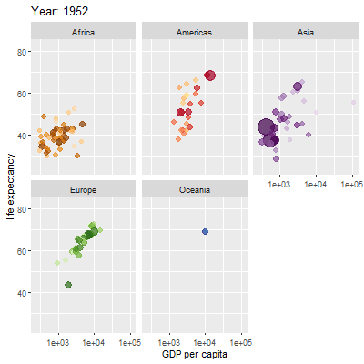
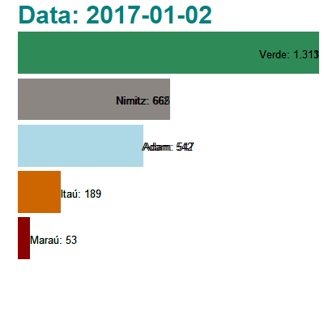
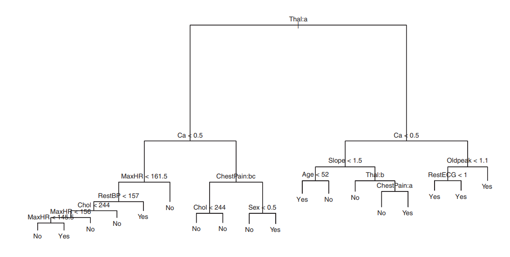
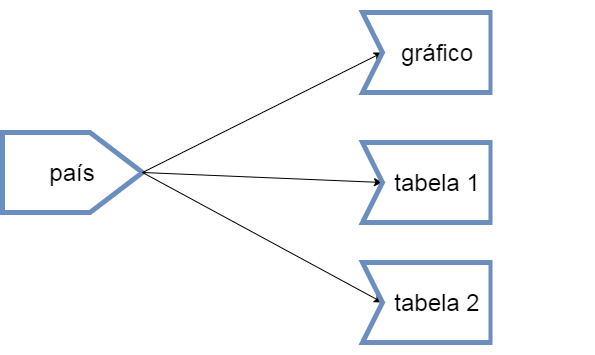
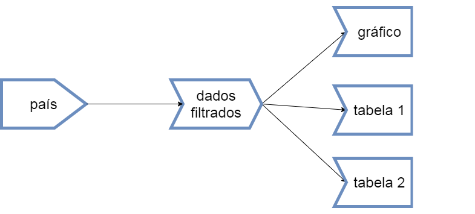

```{r, warning=FALSE, message=FALSE, echo=FALSE}

library(fitdistrplus)
library(rlang)
library(bench)
library(ggbeeswarm)
library(scales)
library(Surrogate)
library(wbstats)
library(tidyverse)
library(magrittr)
library(knitr)
library(kableExtra)
library(DT)
library(lubridate)
library(cumstats)
library(rvest)
library(readxl)
library(tables)
library(socviz)
library(ggrepel)
library(extrafont)
library(wesanderson)
library(ggridges)
library(countrycode)
library(pdftools)
library(GGally)
library(broom)
library(caret)
library(gam)
library(treemapify)
library(pROC)
library(plotROC)
library(xtable)
library(texreg)
library(ranger)
library(furrr)
library(httr)
library(shiny)
library(rhandsontable)
library(reactable)
library(RSelenium)
library(sf)
library(leaflet)
library(ggmap)
library(RColorBrewer)
library(fpp3)
library(gtrendsR)
library(gganimate)

library(electionsBR)
library(worldmet)
library(gapminder)

```


```{r setup, include=FALSE}
 
knitr::opts_chunk$set(echo = TRUE)
```


```{r, echo=FALSE}

remissivo <<- tibble(palavra = "####")

slide_atual <<- 1

a_r <- function(palavra_add){
    remissivo <<- remissivo %>% 
        bind_rows(tibble(palavra = palavra_add, slide = slide_atual))

    str_glue("**{palavra_add}**")
    
}


escreve_remissivo <- function(){
    
    remissivo_final <- remissivo %>% 
        slice(2:nrow(remissivo)) %>% 
        mutate(
            linha = row_number(),
            link = str_glue("[{palavra}](#({slide}))\n\n")
        ) %>% 
        arrange(palavra)
        
    str_flatten(remissivo_final$link, "\n\n")

}


```

# CURSO DE R PARA ANÁLISE DE DADOS

## Instrutor
`r slide_atual = slide_atual + 1`

Bruno Crotman (crotman@gmail.com)

- Trabalha há 5 anos na Empresa de Pesquisa Energética fomentando o trabalho com dados em todas as áreas da empresa

- Trabalhou por 5 anos no Banco BBM na área de Pesquisa Quantitativa

- Doutorado (em curso): Engenharia de Software baseada em teoria dos jogos e ciência de dados, Unirio. Orientador: Prof. Márcio Barros

- Mestrado: Engenharia de Software baseada em otimização, Unirio. Orientador: Prof. Márcio Barros

- Graduação: Ciência da Computação, UFRJ

## Conteúdo
`r slide_atual = slide_atual + 1`


- Introdução
  + Motivação
  + R e RStudio

- Fundamentos da Linguagem
  + Tipos de dados, Data Frame
  + Vetorização

- Introdução à Programação Funcional
  + biblioteca purrr
  + paralelização

- Obtenção e Organização dos dados
  + Obtenção de dados de arquivos
  + Obtenção de dados da WEB
  + Organização e manipulação dos dados para análise

- Visualização de dados
  + Boas Práticas
  + Melhores gráficos
  + ggplot
  + Dados espaciais
  
- Rudimentos de aprendizado estatístico
  + Desmistificação
  + Processo do aprendizado estatístico (seleção do modelo, validação do modelo)
  + Na prática: broom
  + Na prática: caret

- Comunicação
  + Aplicativos Web Shiny
  + Relatórios Markdown
  
- Séries Temporais
  + tidyverts
  + Visualização
  + Modelos. ARIMA etc.


# INTRODUÇÃO
`r slide_atual = slide_atual + 1`

## A máquina de escrever do meu avô
`r slide_atual = slide_atual + 1`

{width=50%} 


## Nem um Nobel escapa... 
`r slide_atual = slide_atual + 1`


...da maldição do erro operacional


Fonte: [@error_rogoff]

PS.: ele não é Nobel...


## Homem foi a Lua há 50 anos
`r slide_atual = slide_atual + 1`

...e ainda...


Fonte: [@genetic]


## Objetivos do curso
`r slide_atual = slide_atual + 1`

Meta final: que vários dos processos de análise de dados da empresa passem a ser feitos dentro do fluxo de trabalho do R.


Fonte:[@tidyversebig]

Ao fim do curso o objetivo é que todos os fios da meada sejam puxados para que o aluno consiga continuar por si só usando a vasta documentação disponível.

## Por que programar?
`r slide_atual = slide_atual + 1`


Também amo o Excel, mas amo mais as seguintes vantagens:

* **Reprodutibilidade**. Muito mais fácil refazer uma análise com código do que point and click

* **Menor risco operacional**. A automatização é maior, a chance de erro na execução de um passo manual é nula

* **Menor risco de continuidade** caso haja imprevistos com a equipe. 

* **Maior flexibilidade**. Virtualmente tudo é possível

* **Manutenção** mais fácil

* **Controle de versão** de forma profissional

* **Mais fácil do que parece**


## Por que programar em R?
`r slide_atual = slide_atual + 1`

* Ela é feita para lidar com dados

* Comunidade de usuários gigante e cooperativa

* Ferramentas poderosas para comunicação dos resultados, em documentos ou aplicações

* Muitos pesquisadores em métodos quantitativos que estão no estado-da-arte publicam seus métodos em bibliotecas escritas em R

* Prazeroso programar (Tidyverse, Shiny, R Markdown...)


## Fluxo de trabalho
`r slide_atual = slide_atual + 1`

{width=50%} 

Fonte:[@wickham2016r]


{width=50%}

Fonte: [@tidyversebig]

## O processo de "Data Science"
`r slide_atual = slide_atual + 1`


[@cadu]

## Exemplos de onde vamos chegar
`r slide_atual = slide_atual + 1`

É muito comum possuirmos dados gerados em planilhas ou em algum suporte de formato estruturado ou semi-estruturado. 

Estes dados podem ser organizados de forma "tidy" para análise

Após a possível execução de modelos, podemos publicar os resultados.

[Impacto da temperatura no consumo de energia elétrica](https://crotman.shinyapps.io/EfeitoTemperaturaCarga)

[Localização de empresas e dutos](https://crotman.shinyapps.io/Empresas/)

[Estimador de posição de fundos multimercado](http://crotman.shinyapps.io/posicaofundos)

[Cenários futuros para expansão da matriz energética](https://crotman.shinyapps.io/PNE-Planel)

[Localização dos equipamentos de geração distribuída](https://crotman.shinyapps.io/DashboardGD)

[Passos de um algoritmo](https://crotman.shinyapps.io/seqalign)

[Equilíbrio de Nash pra vários cenários](https://crotman.shinyapps.io/GTPI)

[Ajuda pra escolher o local de um consultório de psicologia](https://crotman.shinyapps.io/psirio)


## Ambiente R/RStudio
`r slide_atual = slide_atual + 1`

R é uma linguagem que é interpretada por um [engine](https://cran.r-project.org/) gratuito.

`r a_r("RStudio")` é o melhor ambiente de programação da linguagem R. A versão mais simples, que é totalmente funcional, é gratuita.

{width=50%}

Na visualização padrão, ele oferece um console para execução de comandos e uma janela com a visualização dos *environments*, ou seja, das variáveis que ele guarda na sessão atual.


## RStudio como console
`r slide_atual = slide_atual + 1`

No console é possível executar comandos, como o que atribui valor a uma variável

```{r atribuicao,  echo=TRUE}

x <- 1

```

Note que a atribuição é feita com `<-` e não com `=` como na maioria das linguagens.

>Dica: o atalho **alt** + **-** gera o sinal de atribuição

Os comandos que não atribuem valor a uma variável são ecoados na tela

```{r atribuicao2,  echo=TRUE}

x + 2

```

Veja o `[1]` no console. O R considera que tudo é um vetor. É uma linguagem muito baseada em operações vetoriais. Isso facilita muito as coisas quando se lida com dados.

## RStudio como IDE para um script
`r slide_atual = slide_atual + 1`

O console serve só para testes, aprendizado de novos comandos, debug, experiências etc.

Para as atividades mais comuns de análise de dados, e para que elas sejam reprodutíveis, é necessária a criação de scripts.

Eles são salvos em um arquivo de extensão ".r"


## Funcionalidades interessantes do RStudio
`r slide_atual = slide_atual + 1`

* Atalhos de teclado: **ctrl**+**enter** (rodar linhas selecionadas), **ctrl**+**shift**+**enter** (rodar script),  **ctrl**+**1** (foco no script), **ctrl**+**2** (foco no console), **ctrl**+**shift**+**F10** (reiniciar R), **ctrl**+**shift**+**C** (comentar/descomentar bloco)  ...

* Refactoring

* Document outline

* Pane: Files/Plots/Packages/Help/Viewer

* Pane: Environment/History/Connections/Git

* Jobs

* Controle de versão integrado com o Github

* Cheat sheets

* Verificação ortográfica (versão 1.3, ainda não lançada)

## Baixando o material do github
`r slide_atual = slide_atual + 1`

Todo o material do curso está hospedado no Github, inclusive esta apresentação, escrita em RMarkdown.

Os exemplos de código, as imagens e os dados mostrados nesta apresentação estão inclusos no repositório do curso.

O repositório fica em [github/crotman/cursoR](https://github.com/crotman/CursoR).

Para baixar este repositório no RStudio, crie um projeto em File/New Project, do tipo Github e use o endereço do repositório: https://github.com/crotman/CursoR.git.

O projeto tanbém está disponível no RStudio Cloud: [Projeto Curso R](https://rstudio.cloud/project/575191). A vantagem é que as bibliotecas já estão todas instaladas. 

Todo material é disponibilizado sob a licença [Creative Commons Attribution-NonCommercial-ShareAlike 4.0 International License](https://creativecommons.org/licenses/by-nc-sa/4.0/)


# FUNDAMENTOS DA LINGUAGEM
`r slide_atual = slide_atual + 1`
    

## Tipos de valores "armazenados" por variáveis
`r slide_atual = slide_atual + 1`

Para o R, simplificando para o escopo deste curso, as variáveis "armazenam" os seguintes tipos:

* Vetores (vetores atômicos e listas)

```{r seq_int, echo=TRUE}
1L:10L
```

```{r list, echo=TRUE}

list("oi", 1L)

```

* Data Frames / Tibbles


```{r dataframe, echo=TRUE}
tibble(col1 = 1:10, col2 = 11:20 )
```

## Tipos de valores "armazenados" por variáveis (cont.)
`r slide_atual = slide_atual + 1`

* Funções (sim... uma variável pode "armazenar" uma função)

```{r funcoes, echo=TRUE}

f <- function(a, b){
    a + b
}

g <- f

g(1L, 2L)

```

* Environments 

```{r env, echo=TRUE}


e1 <- rlang::env(
    a = 1L,
    b = "sou o b",
    c = 1L:20L
)

get("b", e1)

```

## Tipos de valores "armazenados" por variáveis (cont.)
`r slide_atual = slide_atual + 1`


Existe orientação a objetos no R, mas não está no escopo deste curso

Note que não há variáveis que armazenam dado escalar, como já vimos.

Dentre os vetores há:


* `r a_r("vetores atômicos")` (seus elementos são do mesmo tipo primário)

* `r a_r("listas")` (seus elementos, que são vetores atômicos, são de tipos primários diferentes)

{width=25%}

Fonte: [@wickham2014advanced]

## Tipos de valores "armazenados" por variáveis (cont.)
`r slide_atual = slide_atual + 1`

Os vetores atômicos podem ser dos seguintes tipos:


{width=25%}

Fonte: [@wickham2014advanced]

## Tipos de vetores atômicos
`r slide_atual = slide_atual + 1`

* `r a_r("Logical")` é um tipo booleano, aceita TRUE ou FALSE

```{r bool, echo=TRUE}

booleano <- !TRUE 

booleano

```

* `r a_r("Integer")` é numérico e inteiro. Equivalente ao long do C++ (por isso o `r a_r("L")` na declaração)

```{r integer, echo=TRUE}

inteiro <- 8L 

typeof(inteiro + 1L)

typeof(inteiro + 1)


```

## Tipos de vetores atômicos (cont.)
`r slide_atual = slide_atual + 1`

* `r a_r("Double")` é numérico e aceita números decimais. Equivalente ao double do C++

```{r double, echo=TRUE}

double <- 0.1

double_cientifico <- 1.5e3

infinito <- Inf 
```


```{r, double_valor, echo=TRUE}

double

double_cientifico

infinito

```


## Cobinando vetores em vetores maiores usando c()
`r slide_atual = slide_atual + 1`

Uma das funções mais usadas do R é `r a_r("c()")`, que cria um vetor novo vetor combinando vetores.

```{r c, echo=TRUE}

c(1, 2, 3)

c(1, 2, 3, c(4, 5, 6))

1.4 : 9.4

```

## Outras formas de gerar um vetor
`r slide_atual = slide_atual + 1`

O operador `r a_r(":")` é usado para gerar um vetor com todos números que estão entre os operandos e são formados somando números inteiros ao primeiro operando.

```{r dois_pontos, echo=TRUE}

1L:10L

1.5:9.1


```

A função `r a_r("seq()")` é usada para criar um vetor de várias formas. 

Numa das formas especifica-se o valor inicial, o valor final e o incremento entre elementos do vetor. 


```{r seq, echo=TRUE}

seq(1, 9.99, 0.1)


```

## Parâmetros nomeados
`r slide_atual = slide_atual + 1`


Note que chamamos a função passando os parâmetros sem especificação de quais são eles. Eles são recebidos pela função na ordem padrão definida pela função. 

Mas no R também é possível passar `r a_r("parâmetros nomeados")`. 

Clique em `F1` enquanto tem o cursor em cima da função e veja a ordem dos parâmetros. Veja que outros parâmetros que não utilizamos. Podemos usar `length.out` ao invés de `by`:

```{r seq_nome, echo=TRUE}


seq(1L, 10L, length.out = 10L)

seq(1L, 10L, length.out = 5L)

```

Outro parâmetro, `along.with`, deixa que criemos um vetor num intervalo determinado e o mesmo número de elementos do vetor passado por este parâmetro. 

```{r along, echo=TRUE}

seq(20, 100, along.with = 1:10)

```

## Valores faltantes NA
`r slide_atual = slide_atual + 1`

Valores faltantes ou desconecidos são representados por `r a_r("NA")`

```{r na, echo=TRUE}

a <- c(1L,NA)
a
```

O valor NA quase sempre contamina os cálculos

```{r na_contamina, echo=TRUE}
media <- mean(a)
media
```


mas...

```{r narm, echo=TRUE}
media <- mean(a, na.rm = TRUE)
media
```


A exceção são expressões que dão sempre o mesmo resultado independentemente do valor da variável

```{r na_exc, echo=TRUE}
NA ^ 0
NA | TRUE
NA & FALSE
```


A melhor forma de testar se existe um valor `NA` é `is.na`

```{r isna}

v <- c(1, NA, 2)

is.na(v)

```


## Programação com vetores
`r slide_atual = slide_atual + 1`

As operações do R são vetoriais. Numa operação entre um vetor e um escalar, a operação com o escalar é aplicada a cada elemento do vetor


```{r vetor, echo=TRUE}

1:5 * 2

```


```{r  vetor2, echo=TRUE}

1:10 / 10

```


Numa operação com vetores do mesmo tamanho, os elementos são pareados


```{r vetor_pareado, echo=TRUE}

1:10 * 1:10

```

## Programação com vetores - recycling
`r slide_atual = slide_atual + 1`

Outro conceito importante é o de `r a_r("recycling")`. 

Numa operação entre dois vetores de tamanhos diferentes, o vetor menor é repetido ciclicamente de forma a ficar com o mesmo tamanho do vetor maior. 

Lembra que toda variável no R é um vetor? 

Então... o escalar mostrado no primeiro código do slide anterior é um vetor de 1 elemento que sofre *recycling*


```{r recycling, echo=TRUE}

1:10 * 1:2

```

## Estruturas construídas a partir de vetores e listas
`r slide_atual = slide_atual + 1`

Existem estruturas mais complexas na linguagem construídas a partir de vetores e listas.

* Data Frame

* Matrix

* Array

* Factor

* Estruturas que representam datas

* Objetos (no paradigma de orientação a objetos)

Data Frame é a estrutura que mais vamos usar para nossas análises de dados.


## Data Frames
`r slide_atual = slide_atual + 1`

`r a_r("Data Frame")`, e seu primo `r a_r("Tibble")`, são estruturas muito usadas em análises de dados feitas em R.

O Data Frame consiste em um conjunto de vetores nomeados, com o mesmo número de elementos, que formam uma estrutura retangular, onde cada coluna é um vetor e cada linha n contém o n-ésimo elemento dos vetores.

É similar, em muitas características, a uma tabela de banco de dados.

Essa estrutura é chave no paradigma "Tidy" que usaremos com as bibliotecas **Tidy**verse

Tibble é uma adaptação do Data Frame para análise de dados. Discutir essas diferenças está fora do escopo do curso. Algumas diferenças serão citadas o longo do material e justificam o uso do Tibble.


```{r dataframetibble, echo=TRUE}

df <- 
    data.frame(
        nome = c("João", "Maria", "Zezinho", "Juquinha"), 
        idade = c(7, 8, 9, 10), 
        altura = c(10, 11)
    )
df


#tibble não aceita recycling em vetores de tamanho diferente de 1
tib <- 
    #try evita que o erro paralise toda a execução do script
    try(
        tibble(
            nome = c("João", "Maria", "Zezinho", "Juquinha"), 
            idade = c(7, 8, 9, 10), 
            altura = c(10, 11)
        )
    )
```

## Criando um `tibble` com `tribble()`
`r slide_atual = slide_atual + 1`

É possível criar um Tibble a partir de um código que parece uma tabela, ou seja, criar por linhas e não por colunas.

Isso é feito com a função `r a_r("tribble()")`


```{r}

tribble(
  ~nome,       ~idade,      ~altura,
  "Bruno",     41,         1.75,
  "João",      23,         1.80,
  "Maria",     29,         1.70,
  "Zezinho",   31,         1.78
)


```

## Controle de fluxo
`r slide_atual = slide_atual + 1`

A linguagem oferece comandos de `r a_r("controle de fluxo")` similares aos de outras linguagens.

Podemos dividir os comandos de controle de fluxo em dois tipos:

* `r a_r("choices")`: execução alternativa de comandos

* `r a_r("loops")`: execução repetida de comandos


## Choices: `if`, `ifelse`
`r slide_atual = slide_atual + 1`

O comando `r a_r("if")` funciona para um valor lógico escalar


```{r if}
if (2 + 2 == 4) {
    "2 mais 2 são 4"
} else {
    "2 mais 2 não são 4"
}
```


Note o operador de comparação `==` e não `=`

A função `r a_r("if_else")` (da biblioteca dplyr) funciona de vetorial. `if_else` é mais rápida que a função `ifelse` da biblioteca `base`, mas só aceita argumentos de mesmo tipo no segundo e terceiro parâmetros

```{r jogo_pim}
jogo_do_pim_silvio_santos <- if_else(
    condition = 1:40 %% 4 == 0 ,
    true =  "PIM",
    false =  as.character(1:40)
)
jogo_do_pim_silvio_santos
```

Note o operador `%%` e a função de coerção de tipo `as.character` 


## Choices: `switch` e `case_when`
`r slide_atual = slide_atual + 1`

A cláusula `r a_r("switch")` e a função `r a_r("dplyr::case_when")` evitam que o programador tenha que criar muitos `if else` aninhados

```{r switch}
letra <- "b"

switch(
    letra,
    "a" = "começa com a",
    "b" = "começa com b",
    stop("deu ruim")
)

```

Note que a condição vai sendo testada na ordem e `r a_r("stop")` gera um erro

case_when serve ao caso vetorial

```{r case}
case_when(
    1:40 %% 10 == 0 ~ "dezena",
    1:40 %% 2 == 0 ~ "par",
    TRUE ~ as.character(1:40)
)
```


## Loops
`r slide_atual = slide_atual + 1`

A cláusula de `r a_r("loop")` mais usada e mais versátil é `r a_r("for")`

```{r for}
for(i in 1:5){ 
    print(i^2)
}
```

As cláusulas `r a_r("next")` e `r a_r("break")` modificam o comportamento, respectivamente caminhando direto para a próxima iteração e saindo do for

```{r next}
#next vai pra próxima iteração
for(i in 1:5){
    if (i %% 2 == 0){
        next
    }
    print(i)
}
```


```{r break}
#next sai do loop
for(i in 1:5){
    if (i %% 2 == 0){
        break
    }
    print(i)
}
```


## Loops: coisa do passado
`r slide_atual = slide_atual + 1`

Vamos ver que quase sempre é desnecessário usar loop para as tarefas que vamos executar.

O caráter vetorial da linguagem, aliado a funcionalidades das bibliotecas, faz com que a grande maioria dos loops sejam desnecessários.

O código fica mais limpo e expressivo e mais rápido. Às vezes MUITO mais rápido. Isso ocorre por motivos além do escopo do curso (alocação de memória, código interpretado x código compilado em C++ etc.)

O código abaixo usa loop e programação funcional, respectivamente. Programação funcional será abordada posteriormente no material. 


```{r com_loop, warning=FALSE}
com_loop <- function(n){
    x <- integer()
    for (i in 1:n){
        x <- c(x, i^2)
    }
    x
}

#programação funcional: aprenderemos posteriomente
sem_loop <- function(n){
    x <- 1:n %>% 
        map_dbl(function(x){x^2})
    x
}

```

Abaixo as três formas de fazer a mesma conta que terão a performance avaliada


```{r compara_loop}
com_loop(5)

sem_loop(5)

(1:5)^2

```

## Loops: coisa do passado (cont.)
`r slide_atual = slide_atual + 1`


A biblioteca `r a_r("bench")` oferece funções ótimas para avaliar a performance de pedaços pequenos de código.


```{r bench_loop, warning=FALSE, cache=TRUE}

resultados_perf <- mark(
    sem_loop(1e4),
    com_loop(1e4),
    (1:1e4)^2
)

#aprenderemos o que é %>% e select() posteriormente 
resultados_perf %>% 
    select(expression, min, median, `itr/sec` )

plot(resultados_perf)


```


## Revisão: tipos de vetores
`r slide_atual = slide_atual + 1`


## Revisão: operações vetoriais
`r slide_atual = slide_atual + 1`

Qual o valor de v1 ?

```{r op vetorial}

v1 <- c(1, 2, 3, 4, 5, 6) * 2

```


* a) (1, 2, 3, 4, 5, 6, 1, 2, 3, 4, 5, 6)
* b) (2, 4, 6, 8, 10, 12)
* c) (2, 2, 3, 4, 5, 6)


## Revisão: operações vetoriais
`r slide_atual = slide_atual + 1`

Qual o valor de v2

```{r}

v2 <-  c(1, 2, 3, 4) + c(0, 1)

```

* a) (1, 3, 3, 5)
* b) (1, 3, 3, 4)
* c) (1, 2, 3, 4, 0, 1)


## Revisão: data frames
`r slide_atual = slide_atual + 1`


## Revisão: controle de fluxo
`r slide_atual = slide_atual + 1`

{width=90%}

## Revisão: if
`r slide_atual = slide_atual + 1`


Complete a lacuna:


```{r, eval=FALSE}


if (n_pessoas ____ 0 ){
    print("Não há pessoas")
}
else{
    print("Há pessoas")
}
    
    

```


## Revisão: if_else
`r slide_atual = slide_atual + 1`

Complete a lacuna:


```{r, eval= FALSE}
x <- 1:10

if_else(
    _________,
    "par",
    "impar"
)


```


## Revisão: if_else
`r slide_atual = slide_atual + 1`

Qual o valor de x ?


```{r}

times <- c("Flamengo", "Fluminense", "Bahia", "Vasco")

x <- case_when(
    times == "Flamengo" ~ "Flamengo",
    times == "Bahia" ~ "Bahia",
    TRUE ~ "Flumifogo da Gama"
)


```


## Revisão: for
`r slide_atual = slide_atual + 1`

Complete a lacuna para imprimir os quadrados dos números de 1 a 10


```{r, eval=FALSE}
for ____{
    print(x^2)
}

```


## Exemplo de simulação: Monty Hall
`r slide_atual = slide_atual + 1`

`r a_r("Monty Hall")` era uma espécie de Sílvio Santos juvenil (sub 80) americano.

{width=20%}

Um dos seus jogos consistia em mostrar três portas ao otár... (ops) convidado. Atrás de uma delas sempre tem um carro. Atrás das outras, alguma brincadeira

Após a escolha inicial, o apresentador revelava uma das portas e perguntava se o convidado queria trocar a porta escolhida originalmente.

{width=20%}

O que vocês acham? Melhor trocar, manter a escolha original ou tanto faz?


## Simulando o Monty Hall
`r slide_atual = slide_atual + 1`

Note o que há de interessante no código (comentado):

- A função `r a_r("sample()")`

- A `r a_r("seleção negativa de elementos com -")`

- A função `r a_r("replicate()")`

```{r monty_hall}
set.seed(88)

joga_monty_hall <- function(troca){
    portas <- 1:3
    #sample() sorteia elementos com ou sem reposição
    porta_carro <- sample(portas, size = 1, replace = FALSE)
    primeira_escolha <- 1
    #Seleção negativa (retirando elementos)
    portas_pra_revelar <- portas[-c(porta_carro, primeira_escolha)]
    porta_revelada <- sample( c(portas_pra_revelar, portas_pra_revelar  ), 1)

    if(troca){
        escolha <- portas[-c(primeira_escolha, porta_revelada)]
    }
    else{
        escolha <- primeira_escolha
    }
    
    escolha == porta_carro
        
}

n <- 1000
#replicate executa múltiplas vezes um comando e armazena os resultados em uma estrutura única
troca <- replicate(n = n, joga_monty_hall(troca = TRUE))
fica  <- replicate(n = n, joga_monty_hall(troca = FALSE))
```

Resultados:

```{r result_monty_hall}
sum(troca)/n
sum(fica)/n
```

## Outra simulação: dá pra passar no CFA sem saber nada?
`r slide_atual = slide_atual + 1`


{width=20%}


Vamos ver... mas dá pra simular sem saber quase nada.

Vamos usar uma das funções da família `r<familia de distribuição de prob>()`. Neste caso, a `r a_r("rbinom")`, que simula a distribução binomial, aquela que equivale a jogar n moedas para cima e ver quantas deram cara, ou seja, quantos desfechos chamados de "sucessos" são obtidos em n eventos com desfecho binário. Nestes eventos há uma probabilidade fixa para um desfecho considerado "sucesso".


```{r cfa}

n_simul <- 10000
n_questoes <- 240
min_aprovacao <-  0.6
n_aprovado <- 240 * min_aprovacao
prob_questao <- 0.2

acertos <- rbinom(n = n_simul, size = n_questoes, prob = prob_questao   )

sum(acertos >= n_aprovado)/n_simul 

```

A chance é praticamente nula.

Na verdade, a grande massa da distribuição fica muito distante.


```{r mostra_cfa}

dado <- enframe(acertos/n_questoes)

mostra_chances <- function(acertos, n_questoes){
    ggplot(enframe(acertos/n_questoes)) +
        geom_density( aes(x = value)) +
        scale_x_continuous(
            labels = percent_format(accuracy = 1), 
            limits = c(0,1),
            breaks = seq(0, 1, 0.1) 
            ) +
        labs(x ="% Acertos") +
        geom_vline(xintercept = min_aprovacao, color = "red") +
        theme_light()
}

mostra_chances(acertos, n_questoes)

```


## Outra simulação: dá pra passar no CFA sabendo a um grau x ?
`r slide_atual = slide_atual + 1`

O exemplo anterior era muito simplista: ninguém chuta tudo.

Imagine que sabemos qual a chance de aparecer uma pergunta onde podemos descartar 0 alternativas, a chance de uma onde descartamos 1 e assim por diante.

Na função `rbinom()`, a cada simulação, sorteamos uma de dois tipos de desfecho para cada um dos n eventos. A `r a_r("rmultinom()")` sorteia um de k tipos de desfecho para cada um dos n eventos. Um vetor de k elementos indica a probabilidade de cada tipo de desfecho.

A `rmultinom()` nos ajuda a compor provas de acordo com a proficiência de quem vai fazer a prova.


```{r cfa_mais}
#definindo a chance podermos eliminar 0, 1, 2, ... 4 alternativas
fracao_eliminar_questoes <- c( 0.1, 0.1, 0.2, 0.25 , 0.35 ) 
#definindo o número de questões 
n_questoes_cada_elimina <- t(rmultinom(n_simul, size = n_questoes, fracao_eliminar_questoes))
probs_quando_elimina <- 1/(5:1)
acertos_concatenados <- 
    rbinom( 
        n =  n_simul * 5 , 
        size = as.vector(t(n_questoes_cada_elimina)), 
        prob = probs_quando_elimina  
    )
```


```{r cfa_1}
n_questoes_cada_elimina[1:4,]

```


```{r cfa_2}
acertos_concatenados[1:20]
```

Como geramos os acertos concatenados em um vetor, o ideal é transformá-los numa matriz onde cada linha corresponde a uma simulação e cada coluna corresponde aos acertos conseguidos em cada tipo de questão. Usamos a função A `matrix()`, informando que estamos passando a matriz linha a linha e informando a quantidade de linhas.


```{r cfa_3}
matriz_acertos <- matrix(acertos_concatenados, byrow = TRUE, nrow = n_simul )

matriz_acertos[1:5,]
```

A `rowSums()` nos ajuda a ter a quantidade de acertos em cada simulação de prova.


```{r cfa_4}
acertos <- rowSums(matriz_acertos)
sum(acertos > n_aprovado)/n_simul


```


```{r cfa_5}
mostra_chances(acertos, n_questoes)
```


# INTRODUÇÃO À PROGRAMAÇÃO FUNCIONAL COM PURRR
`r slide_atual = slide_atual + 1`


## O que é `r a_r("programação funcional")`?
`r slide_atual = slide_atual + 1`

O fato de que funções são objetos de primeira classe no R, ou seja, objetos que têm propriedades iguais às de qualquer outro, possibilita a progrmação no estilo funcional.

A programação funcional inclui as formas de interação entre vetores e funções a partir de uma função


Neste curso vamos nos concentrar nos Functionals, funções que recebem função como argumento e devolvem um vetor ou uma lista


## Função map
`r slide_atual = slide_atual + 1`

A função mais fundamental é `r a_r("map()")`. 

Ela recebe uma função e um vetor de $n$ elementos

A função é chamada para cada elemento do vetor, $n$ vezes.

Os resultados da aplicação destas $n$ execuções são devolvidos em uma lista de $n$ elementos
 


## Exemplo da função map
`r slide_atual = slide_atual + 1`

Uma função é um objeto como outro qualquer e pode ser colocado em uma variável

````{r}

funcao <- function(x) x^2

```

`map` devolve uma lista com o resultado da execução de `map` em cada elemento

````{r}

map(.x = 1:10, .f = funcao)

```


## `map` pode retornar outros tipos de objeto
`r slide_atual = slide_atual + 1`


```{r}

map_dbl(.x = 1:10, .f = funcao)

map_chr(.x = 1:10, .f = funcao)

map_df(.x = tibble(x = 1:10), .f = funcao)

```


## Shortcuts pra funções
`r slide_atual = slide_atual + 1`

Funções podem ser declaradas inline.

```{r}

map(.x = 1:5, .f = function(x){rnorm(n = 4, mean = x, sd = .01)} )

```


Ou então `r a_r("shortcuts para funções")` podem ser usados


```{r}

map(.x = 1:5, .f = ~rnorm(n = 4, mean = .x, sd = .01) )

```

Os argumentos são repassados pela `map` para a função executada. Podemos então passar os argumentos para a `map`.

```{r}

map(.x = 1:5, .f = rnorm, n = 4, sd = .01 )


```


## Versões da `map()` para dois argumentos
`r slide_atual = slide_atual + 1`

A função `map()`possui versões para mais de um argumento.

`r a_r("map2")` e suas modificações para retornos em outros tipos, como `map2_dbl()`, são preparadas para funções de dois argumentos.


```{r}

tib_2_arg <- tribble(
  
  ~mean,  ~sd,
  0,       2,
  0,       4,
  1,       2,
  1,       4,
  
)
  

map2(
  .x = tib_2_arg$mean, 
  .y = tib_2_arg$sd, 
  .f = ~rnorm(n = 4, mean = .x, sd = .y) 
)

```


## Versões da `map()` para mais de dois argumentos
`r slide_atual = slide_atual + 1`


`r a_r("pmap")` e suas modificações para retornos em outros tipos, como `pmap_dbl()`, são preparadas um número ilimitado de argumentos.

Uma lista de vetores nomeados deve ser passada para a `pmap()`. Esses são os argumentos passados para a função.

Lembre que um Data Frame/Tibble é exatamente isso: uma lista de vetores nomeados.

O detalhe é que os nomes dos vetores deve bater com o nome dos parâmetros da função 


```{r}

tib_n_arg <- tribble(
  
  ~mean,  ~sd,  ~n,
  0,       2,   5,
  0,       4,   5,
  1,       2,   5,
  1,       4,   5,
  0,       2,   10,
  0,       4,   10,
  1,       2,   10,
  1,       4,   10
  
)

pmap(.l = tib_n_arg, .f = rnorm)


```


## Vantagens da programação funcional
`r slide_atual = slide_atual + 1`


A programação funcional deixa o código mais expressivo e maioria das vezes mais performático

Existem algumas características avançadas da programação funcional que facilitam bastante o trabalho.

A principal delas é a facilidade com que podemos converter um código que roda em série para um código que roda em paralelo com a biblioteca `furrr`, que veremos adiante.


# TIDY DATA (obtenção e organização dos dados)
`r slide_atual = slide_atual + 1`

## Um habilidade subestimada
`r slide_atual = slide_atual + 1`

Dentro de todo o hype envolvendo Data Science, surgem as buzz words mais mirabolantes: machine learning, AI, Deep Learning... 

Tudo isso é legal, mas a habilidade de preparar os dados para os modelos, preparar os hiperparâmetros e especificações alternativas ainda melhora muito a análise. Anote mais uma buzz word: **FEATURE ENGINEERING**

A agilidade de se tentar abordagens alterativas com os dados cresce muito quando dominamos a arte de manipular os data frames. Por isso o peso grande dado neste curso. 


## Organizando os dados de forma tidy
`r slide_atual = slide_atual + 1`

Arrumar os dados de forma que as linhas sejam eventos e as colunas sejam atributos do evento ajuda muito a rodar modelos e construir visualizações eficientemente. Esta forma de organização foi chamada de `r a_r("Tidy data")` por Hadley Wickham, o criador do conjunto de bibliotecas `Tidyverse`

O que é o evento e o que é o atributo pode variar até para diferentes usos do mesmo dado. Mas a prática ajuda a determinar isso.


## Tratamento de dados em passos: operador Pipe (`%>%`)
`r slide_atual = slide_atual + 1`

O operador `r a_r("pipe")`, representado por `r a_r("%>% ")` é extremamente útil para análise de dados no R com uso das bibliotecas `Tidyverse`

Normalmente os tratamentos de dados são feitos em múltiplos passos encadeados:


```{r gapminder}
#dados de exemplo
head(gapminder)

```

Vamos imaginar que queremos a média de PIB per capita por continente em 2007.

Note quanto código desnecessário há nestas linhas: variáveis que não precisavam ser nomeadas nem passadas explicitamente como parâmetro.

Este código desnecessário causa fadiga no programador, confunde o próprio autor do código e confunde ainda mais o leitor posterior do código.


```{r sem_pipe }
#vamos cobrir essas funções de tratamento posteriormente
gapminder_07 <- filter(gapminder, year == 2007)
gapminder_07_group_continente <- group_by(gapminder_07, continent)
gapminder_media_gdp_continente <- summarise(
    gapminder_07_group_continente, media_gdp = sum(gdpPercap * pop)/sum(pop)
)
resultado <- arrange(gapminder_media_gdp_continente, desc(media_gdp))

resultado

```

## Tratamento de dados em passos: operador Pipe (`%>%`) (cont.)
`r slide_atual = slide_atual + 1`

O operador pipe `%>%` faz o seguinte:

x %>% y(z) = y(x,z)

Ou seja, o primeiro operando é enfiado como primeiro parâmetro da função que está no segundo operando.

Isso faz com que possamos escrever o código anterior assim:

```{r pipe}

resultado <- gapminder %>% 
    filter(year == 2007) %>% 
    group_by(continent) %>% 
    summarise(
        media_gdp = sum(gdpPercap * pop) / sum(pop)
    ) %>% 
    arrange(desc(media_gdp))
    
resultado


```


Note que agora podemos interpretar o código facilmente como uma série de comandos de tratamento em cima dos dados. 

Não é por coincidência que as funções de tratamento das bibliotecas tidyverse que veremos adiante são verbos e recebem os dados como primeiro parâmetro.

**Agora o mais importante de tudo: O ATALHO PARA O ` %>% ` É CTRL + SHIFT + M**


## Um mapa conceitual da bibioteca de transformação de dados `dplyr`
`r slide_atual = slide_atual + 1`

`r a_r("dplyr")` é a biblioteca mais central do conjunto `tidyverse`


Fonte: [@dplyrrberlin]


## CRAN: além de bibliotecas de funções, bibliotecas de dados
`r slide_atual = slide_atual + 1`

`r a_r("CRAN")` é o repositório de bibliotecas mantido pelo R com contribuição de populares.

Além de funcionalidades estatísticas e funcionalidades para lidar com dados, há dados e funcionalidades para buscar dados online.

Usaremos várias das bases como exemplo.

A primeira é a do `r a_r("Banco Mundial")`, muito rica para quem gosta de dados socioeconômicos: `r a_r("wbstats")`

Para acessar um indicador precisamos achá-lo na base de indicadores com a função `wbsearch()`

```{r banco_mundial}

#pattern é uma expressão regular. \\ serve para dizer que "(" é mesmo "(" 
#e não o ( usado nas operações de expressão regular (fora do escopo do curso)
indicadores <- wbsearch(pattern = "GINI index \\(World Bank estimate\\)")

indicadores


```

Sabendo o ID do indicador, podemos consultá-lo com a função `wb()`


```{r banco_mundial_2}

#mrv é most recent values. Pode ser usado para buscar os n valores mais recentes
gini = wb(indicator = "SI.POV.GINI", mrv= 10, POSIXct = TRUE)

head(gini)


```


## dplyr: Modificar -> Colunas -> Nomes e posições
`r slide_atual = slide_atual + 1`


## Funções básicas de tratamento (dplyr): `r a_r("select()")`
`r slide_atual = slide_atual + 1`


A função `select()` é usada para selecionar colunas do data frame/tibble


```{r gini}

glimpse(gini)

```

```{r gini_select}

gini_select <- gini %>% 
    select(country, date, value, iso3c)

head(gini_select)

```

É possível usar a seleção negativa assim como fizemos com vetores

```{r gini_negativa}

gini_select2 <- gini_select %>% 
    select(-iso3c)

head(gini_select2)

```


## Funções básicas de tratamento (dplyr): select() (cont.)
`r slide_atual = slide_atual + 1`


Algumas `r a_r("funções helpers da dplyr")` nos ajudam a usar a função `select` e são muito úteis para tratamentos mais elaborados.

Pra mostrar mais funcionalidades da função `select`, vamos usar uma base com dados eleitorais brasileiros, que retorna mais colunas


```{r  candidatos , cache=TRUE, message= FALSE, warning=FALSE }

candidatos <- candidate_fed(2018)

glimpse(candidatos)

```

## Funções básicas de tratamento (dplyr): select() - helpers
`r slide_atual = slide_atual + 1`


```{r candidatos_select}

candidatos_select <- candidatos %>% 
    select(starts_with("NOME"))

datatable(head(candidatos_select))
    


```


```{r candidatos_select_ends }

candidatos_select <- candidatos %>% 
    select(ends_with("candidato"))

datatable(head(candidatos_select))
    


```

```{r contains }

candidatos_select <- candidatos %>% 
    select(contains("municipio"))

datatable(head(candidatos_select))


```

```{r ends_2}

candidatos_select <- candidatos %>% 
    select(ends_with("candidato"))

datatable(head(candidatos_select))


```


## Funções básicas de tratamento (dplyr): select() - helpers (cont.)
`r slide_atual = slide_atual + 1`


A função *helper* `r a_r("num_range")` ajuda a encontrar colunas do tipo `prefixo_n`. Isso é muito comum em bases de dados

A biblioteca `r a_r("worldmet")` retorna dados de `r a_r("estações meteorológicas")` espalhadas pelo planeta 

Primeiro é necessário encontrar o código da base desejada

```{r estacao, cache=TRUE}

estacao <- getMeta("heathrow", returnMap = TRUE)

estacao
    

```


## Funções básicas de tratamento (dplyr): select() - helpers (cont.)
`r slide_atual = slide_atual + 1`

A função abaixo retorna os dados de uma estação. Veja que alguns campos têm um sufixo _n 

```{r estacao_import, cache=TRUE }
dados_heathrow <- importNOAA(code = "037720-99999")


glimpse(dados_heathrow)


```


A função *helper* `num_range` ajuda a selecionar essas colunas com prefixo comum e um sufixo numérico 


```{r num_range}

dados_heathrow_select <- dados_heathrow %>% 
    select( 
        date, 
        num_range("cl_", 1:3 ), 
        num_range("precip_", c(6, 12))  
    )


head(dados_heathrow_select)

```

Outra função útil é a `r a_r("everything()")`, que ajuda, por exemplo, a passar algumas colunas para o início do `tibble`.


```{r everything}

dados_heathrow_select <- dados_heathrow %>% 
    select( 
        date, 
        air_temp,
        everything() 
    )


glimpse(dados_heathrow_select)


```

## Funções básicas de tratamento (dplyr): `rename()`
`r slide_atual = slide_atual + 1`

`r a_r("rename()")` é usada para modificar os nomes das colunas. Ela renomeia as colunas indicadas e mantném as outras.


## Funções básicas de tratamento (dplyr): `rename()`
`r slide_atual = slide_atual + 1`

```{r}

dados_heathrow %>% 
    rename(
        data = date,
        estacao = station,
        temperatura = air_temp
    ) %>% 
    head()

```

## Funções básicas de tratamento (dplyr): `rename()` x `select()`
`r slide_atual = slide_atual + 1`


`select()` também pode ser usado para renomear colunas, mas mantém apenas as colunas citadas

```{r}

dados_heathrow %>% 
    select(
        data = date,
        estacao = station,
        temperatura = air_temp
    ) %>% 
    head()


```


## dplyr: Modificar -> Colunas -> Valores
`r slide_atual = slide_atual + 1`


A função `r a_r("mutate()")` é usada para criar novas colunas no tibble, mantendo as outras.


## Funções básicas de tratamento (dplyr): `mutate()`
`r slide_atual = slide_atual + 1`


Notando que a coluna DATA_ELEICAO é um caracter, vamos criar uma coluna de tipo data.

```{r typeof}

typeof(candidatos$DATA_ELEICAO)


```


O jeito mais fácil de fazer isso é usando uma das funções da biblioteca `r a_r("lubridate")`


```{r lubridate}

candidatos_com_data <- candidatos %>% 
    mutate(DATA_ELEICAO_TIPO_DATA = dmy(DATA_ELEICAO)) %>% 
    select(DATA_ELEICAO, DATA_ELEICAO_TIPO_DATA)

head(candidatos_com_data)

```


É possível substituir um campo existente


```{r mutate_mesmo}

candidatos_com_data <- candidatos %>% 
    mutate(DATA_ELEICAO = dmy(DATA_ELEICAO)) %>% 
    select(DATA_ELEICAO)

head(candidatos_com_data)

```


## Funções básicas de tratamento (dplyr): `mutate()`
`r slide_atual = slide_atual + 1`


funções derivadas da `mutate` possibilitam a alteração de várias colunas ao mesmo tempo, usando os mesmos helpers que já vimos para a `select` e uma função à escolha


```{r mutate_at}

candidatos_com_data <- candidatos %>% 
    mutate_at(vars(starts_with("DATA_")), dmy ) %>% 
    select(starts_with("DATA_"))


head(candidatos_com_data)


```

## Funções básicas de tratamento (dplyr) `mutate()` (cont.):
`r slide_atual = slide_atual + 1`

Outras funções úteis são as que fazem operações acumuladas e as operações de `r a_r("lag()")` e `r a_r("lead()")`.

`r a_r("BETS")` é uma biblioteca criada pela FGV que dá acesso a `r a_r("séries temporais econômicas")`

```{r bets, cache = TRUE, warning=FALSE, message=FALSE}

series <- BETS::BETSsearch("exchange dollar")

series

```

No código abaixo, calculamos o retorno da série, a `r a_r("volatilidade histórica")` e a volatilidade `r a_r("EWMA")`

```{r bets_vol, cache = TRUE}

dolar <- BETS::BETSget(1) 

dolar_com_info <- dolar %>% 
    filter(date > ymd("1994-07-01")) %>% 
    arrange(date) %>% 
    mutate(
        retorno = (value - lag(value))/value,
        retorno_quad = retorno^2,
        dia = row_number(),
        fator_ewma = (1/0.94)^dia*1e-20
    ) %>% 
    filter(!is.na(retorno))
  
  
dolar_com_vol <- dolar_com_info %>% 
    mutate(vol = sqrt(cumvar(retorno)) * sqrt(252) ) %>% 
    mutate(vol_ewma = sqrt(cumsum(retorno_quad * fator_ewma)/cumsum(fator_ewma)) * sqrt(252) ) %>% 
    rename(dolar = value) %>% 
    select(
        date,
        dolar,
        retorno,
        vol,
        vol_ewma
    )


datatable(dolar_com_vol) %>% 
    formatPercentage(c("retorno", "vol", "vol_ewma"), 2)


```


```{r dolar_vol, cache=TRUE}

dolar_ajeitado <- dolar_com_vol %>% 
    pivot_longer(cols = -date, names_to = "variavel", values_to = "valor")


dolar_ajeitado %>% 
    ggplot() +
    geom_line(aes(x = date, y = valor)) +
    facet_grid( variavel ~ . , scales = "free") +
    theme_light() 


```


## Funções básicas de tratamento (dplyr) `transmute()`:
`r slide_atual = slide_atual + 1`

`r a_r("transmute()")` cria colunas e mantém apenas as colunas citadas


```{r}

gapminder %>% 
  transmute(
    ano = year,
    pais = country,
    pib = gdpPercap * pop
  ) %>% 
  head()


```

## dplyr: Modificar -> Linhas -> Posição
`r slide_atual = slide_atual + 1`


A função `r a_r("arrange")` serve para ordenar as linhas do tibble.


## Funções básicas de tratamento (dplyr) `arrange()`:
`r slide_atual = slide_atual + 1`


```{r arrange}

dados_ordenados <- dados_heathrow %>% 
    arrange(date)

head(dados_ordenados)

```

A função `r a_r("desc()")` permite a ordenação decrescente


```{r desc}

dados_ordenados <- dados_heathrow %>% 
    arrange(desc(date))

head(dados_ordenados)


```


## Funções básicas de tratamento (dplyr) `filter()`:
`r slide_atual = slide_atual + 1`

`r a_r("filter()")` seleciona colunas de acordo com os seus valores


## Funções básicas de tratamento (dplyr) `filter()` (cont.):
`r slide_atual = slide_atual + 1`


Filtrando países (note o operador `r a_r("%in% ")`)


```{r}

gapminder %>% 
  filter(country %in% c("Brazil", "Argentina", "Chile")) %>% 
  ggplot() +
    geom_line(aes(x = year, y = gdpPercap, color = country )) +
    geom_point(aes(x = year, y = gdpPercap, color = country )) +
    theme_light()
  

```


## Funções básicas de tratamento (dplyr) `top_n()`:
`r slide_atual = slide_atual + 1`

`r a_r("top_n()")` seleciona as `n` linhas maiores de acordo com uma das colunas.


## Funções básicas de tratamento (dplyr) `top_n()` (cont.):
`r slide_atual = slide_atual + 1`


Selecionando os países mais ricos em 2007.

Depois aprenderemos como ordenar essas barras


```{r}

gapminder %>% 
  filter(year == 2007) %>% 
  top_n(5, gdpPercap) %>% 
  ggplot() +
    geom_col(aes(x = country, y = gdpPercap)) +
    theme_light() 

```

## Funções básicas de tratamento (dplyr) `top_frac()`:
`r slide_atual = slide_atual + 1`


## Funções básicas de tratamento (dplyr) `top_frac()`:
`r slide_atual = slide_atual + 1`


```{r}

ricos <- gapminder %>% 
  filter(year == 2007) %>% 
  top_frac(.2, gdpPercap ) %>% 
  mutate(categoria = "Rico")

pobres <-  gapminder %>% 
  filter(year == 2007) %>% 
  top_frac(.2, desc(gdpPercap) ) %>% 
  mutate(categoria = "Pobre")

bind_rows(ricos, pobres) %>% 
  ggplot(aes(x = gdpPercap, y = lifeExp)) +
  geom_point( aes(color = continent)) +
  facet_grid(. ~ categoria, scales = "free_x") +
  geom_smooth(method = "lm", se = FALSE) +
  theme_light()
  


```


## Funções básicas de tratamento (dplyr) `slice()`:
`r slide_atual = slide_atual + 1`

`r a_r("slice()")` seleciona "linhas" de um data frame/tibble


## Funções básicas de tratamento (dplyr) `slice()`:
`r slide_atual = slide_atual + 1`


```{r, cache=TRUE}


classificacao_brasileirao <- read_html("https://pt.wikipedia.org/wiki/Campeonato_Brasileiro_de_Futebol_de_2019_-_S%C3%A9rie_A") %>% 
  html_nodes("table") %>% 
  extract2(7) %>% 
  html_table()


limbo <- classificacao_brasileirao %>% 
  slice(12:16) %>% 
  select(time = Equipes )

limbo


```


## Funções básicas de tratamento (dplyr) `group_by()`:
`r slide_atual = slide_atual + 1`


## Funções básicas de tratamento (dplyr) `group_by()`:
`r slide_atual = slide_atual + 1`


A função `r a_r("group_by()")` será bastante usada.

Quem conhece SQL pode estranhar um pouco o comportamento desta função, pois ela não agrupa os dados diminuindo o número de linhas imediatamente.
 
Mas veja que ela indica que há agrupamento

Ela particiona o tibble. As operações passam a ser executadas em cada partição.


```{r group_by}

gini_agrupado <- gini %>% 
    select(country, date, value) %>% 
    group_by(country) 
    
gini_agrupado


```


## Funções básicas de tratamento (dplyr) `group_by()` (cont.):
`r slide_atual = slide_atual + 1`

Para várias operações, o agrupamento faz com que o comportamento seja diferente.

Uma operação bastante usada é numerar as linhas de um tibble.

No tibble agrupado, essa operação acontece em cada grupo.

```{r row_number}

gini_agrupado %<>% arrange(country, date) %>% 
    mutate(linha = row_number())


datatable(gini_agrupado)


```


## Funções básicas de tratamento (dplyr) `group_by()` (cont.):
`r slide_atual = slide_atual + 1`


As funções `r a_r("lag() no contexto da group_by")` e `r a_r("lead() no contexto da group_by")` funcionam dentro de cada grupo (o primeiro value de um grupo não acessa o valor do outro grupo com `lag()` .

```{r lag}

gini_agrupado %<>% mutate(
    value_ant = lag(value),
    delta_value = value - value_ant
    )

datatable(gini_agrupado)

```


## Funções básicas de tratamento (dplyr) `summarise()` (cont.):
`r slide_atual = slide_atual + 1`


## Funções básicas de tratamento (dplyr) `group_by()` (cont.):
`r slide_atual = slide_atual + 1`


A função `group_by` só leva a uma sumarização, ou seja, só transforma o tibble em um tibble com o número de linhas igual ao número de grupos, quando executamos a função `r a_r("summarise()")`

Se executarmos `summarise()` sem particionar o tibble, a operação resulta em uma linha.


```{r summarise}

maiores_temp_dia <- dados_heathrow %>% 
    group_by(date(date)) %>% 
    summarise(
        maxima = max(air_temp),
        minima = min(air_temp),
        media = mean(air_temp)
    )


datatable(maiores_temp_dia) %>% 
    formatRound(c("maxima", "minima", "media"), 1)


```


A função `r a_r("top_n() no contexto da group_by()")` retorna os n maiores valores. Se o tibble estiver agrupado, pra cada grupo.


```{r top_n}


maiores_temp_dia <- dados_heathrow %>% 
    group_by(date(date)) %>% 
    top_n(1, air_temp) %>% 
    ungroup() %>% 
    mutate(
        hora = hour(date),
        estacao = 
            case_when(
                month(date) %in% 1:3 ~ "Inverno",
                month(date) %in% 7:9 ~ "Verão",
                TRUE ~ "Outono/Primavera"
                
            )
    ) %>% 
    select(hora, estacao, air_temp)

ggplot(maiores_temp_dia) +
    geom_density( aes(x = hora, color = estacao )) +
    theme_light()


```


## Leitura de dados de arquivos 
`r slide_atual = slide_atual + 1`

Até agora acessamos dados que estavam disponíveis em bibliotecas, mas muitas vezes encontramos dados em arquivos.

De modo geral, as funções da biblioteca `r a_r("readr")` são mais rápidas do que as da biblioteca base, e além disso mostram barra de progresso no console. É possível reconhecê-las pelo `_` ao invés de `.` 

## Leitura de dados de arquivos 
`r slide_atual = slide_atual + 1`

O caso mais comum é ler dados em formato de tabela para um tibble


Fonte: [@cheatsheetimport]


## Baixando arquivos em lote - Exemplo: CVM
`r slide_atual = slide_atual + 1`


O portal da CVM é uma fonte interessante de dados

O código abaixo baixa os dados que ainda não estão na nossa base.

Note que vamos usar `r a_r("programação funcional no exemplo")`. Sem uso de loop vamos executar uma função para cada linha do data frame/tibble.

Esta função vai salvar os dados como um objeto `r a_r("rds")`. Este formato é binário, diferentemente do formato csv (textual). Podemos compactar estes dados ou não. Se usarmos compactação, a leitura e escrita são mais lentas, mas os arquivos ocupam menos espaço.  


```{r fundos, message=FALSE, warning=FALSE}
existem <- tibble(arquivo = list.files("dados/fundos"))


salva <- function(endereco, arquivo){
    print(endereco)
    read_csv2(endereco) %>% 
      mutate_at(
        vars(-one_of(c("CNPJ_FUNDO", "NR_COTST", "DT_COMPTC"))),
        as.numeric
      ) %>% 
      mutate_at(
        vars(one_of("CNPJ_FUNDO")),
        as.character
      ) %>% 
      mutate_at(
        vars(one_of("NR_COTST")),
        as.numeric
      ) %>% 
      write_rds(paste0("dados/fundos/",arquivo), compress = "xz")
}


baixa_faltantes <- tibble(data_dado = seq(ymd("2017-01-01"), by = "month", ymd(today()-4) )) %>% 
    mutate(data_formato = format(data_dado, "%Y%m")) %>% 
    mutate(
        endereco = paste0(
            "http://dados.cvm.gov.br/dados/FI/DOC/INF_DIARIO/DADOS/",
            "inf_diario_fi_",
            data_formato,
            ".csv")) %>% 
    mutate(arquivo = paste0("inf_diario_fi_",data_formato,".rds")) %>% 
    anti_join(existem, by = c("arquivo" = "arquivo")) %>% 
    select(-data_formato) %>% 
    mutate(data = pmap(.l = list(endereco, arquivo), salva))
```


## Leitura de dados de arquivos em uma pasta - Exemplo: CVM
`r slide_atual = slide_atual + 1`

Após a  operação de baixar os dados dos arquivos, podemos ler todos os arquivos de uma pasta e colocá-los em um só tibble, já que eles são do mesmo formato.

Usamos `r a_r("execução em paralelo no exemplo")`, que é possibilitada ao chamarmos uma função future_<map> ao invés de <map>.


```{r fundos2, message=FALSE, warning=FALSE}

plan(multiprocess)

todos_os_fundos <- tibble(arquivo = list.files("dados/fundos")) %>%
    mutate(arquivo = paste0("dados/fundos/",arquivo)) %>%
    mutate(data = future_map(arquivo, read_rds, .progress = TRUE)) %>% 
    unnest()


head(todos_os_fundos)

```


```{r cadastro_fundos, cache=TRUE, warning=FALSE, message=FALSE}

download.file(url = "http://dados.cvm.gov.br/dados/FIE/CAD/DADOS/cad_fie.zip", destfile = "dados/cvm/cad_fie.zip" )

unzip(zipfile = "dados/cvm/cad_fie.zip", exdir =  "dados/cvm")


cadastro_fundos <- read_csv2("dados/cvm/cad_fie.csv", locale = locale(encoding = "latin1"))

```


```{r cotas_verde, cache=TRUE }

cotas_verde <- todos_os_fundos %>% 
    filter(CNPJ_FUNDO == "07.455.507/0001-89" )


cotas_verde

```

## Leitura de conteúdo de páginas web
`r slide_atual = slide_atual + 1`

Existem duas dois tipos de atividades envolvidas na leitura de páginas web:

* Extração do conteúdo que interessa a partir da página já obtida

* Automatização da navegação com uso de emuladores de browser

Vamos ver primeiro como ler o conteúdo de uma página e depois como usar um emulador para navegar em um portal e obter o que desejamos

## Leitura de conteúdo de páginas web 
`r slide_atual = slide_atual + 1`

Para efetuar a `r a_r("leitura de páginas WEB")`, é necessário conhecer como é a estrutura de uma página web.

Uma página web pode ser representada por uma árvore de objetos, também chamada de `r a_r("DOM (Document Object Model)")`.

Esta árvore de objetos é definida pelo conteúdo de linguagem html que existe na página (e pode ser modificado por scripts em javascript e definições de estilo do CSS).

Podem existir objetos de vários tipos em uma página: links, inputs de dados, tabelas, células de tabelas, parágrafos, cabeçalhos etc.


## Leitura de conteúdo de páginas WEB (cont.)
`r slide_atual = slide_atual + 1`

Para retirar da página web o conteúdo de que precisamos, temos que analisar como é esta árvore de objetos e que nós desta árvore nos interessam.

Imagine que queremos buscar dados na página de [histórico de preços e taxas dos títulos brasileiros](https://sisweb.tesouro.gov.br/apex/f?p=2031:2:0::::)

A tecla F12 do Chrome nos permite ver a árvore DOM da página em que estamos navegando.

{width=70%}


## Leitura de conteúdo de páginas WEB (cont.)
`r slide_atual = slide_atual + 1`

É possível clicar com o botão direito e inspecionar um elemento específico de forma a saber onde ele está na árvore e que tipo de elemento ele é (mesmo que você saiba pouco de `r a_r("html")`).

O mais importante é saber que uma `r a_r("tag html")` que define um elemento tem a sintaxe:

`<tipo_elemento nome_atributo=valor_attributo>texto do elemento</tipo_elemento>`

Mesmo sem saber hmtl, fica claro que queremos esse tal de atributo `href` dos tais elementos `a` seja lá o que diabos isso seja (`a` é um link e `href` é o destino do link).


{width=70%}


## Leitura de conteúdo de páginas WEB (cont.)
`r slide_atual = slide_atual + 1`


A biblioteca `r a_r("rvest")` possibilita a extração destes elementos.

É possível caminhar pela árvore DOM até os nós desejados e atributos que queremos usando `r a_r("html_nodes()")` e `r a_r("html_attr()")`. 

Munidos de uma função que faz download e salva um arquivo, podemos caminhar pelas planilhas e salvá-las


```{r rvest , warning=FALSE, message=FALSE }

existem <- tibble(arquivo = list.files("dados/titulos"))


salva_planilha <- function(name, endereco){
    arquivo <- endereco
    destino <- name
    print(arquivo)
    download.file(
        arquivo, 
        paste0("dados/titulos/",destino ),
        mode = "wb" ##PRA ARQUIVOS BINÁRIOS,
        )
}


links <- read_html("https://sisweb.tesouro.gov.br/apex/f?p=2031:2:0::::") %>% 
    html_nodes("body") %>% 
    html_nodes("a") %>% 
    html_attr("href") %>% 
    enframe(value = "endereco") %>%
    filter(str_detect(endereco, "cosis/sistd/obtem_arquivo/")) %>%
    mutate(destino = str_extract(endereco, "[0-9]*:[0-9]*$") %>% str_remove(":")  ) %>% 
    mutate(destino = paste0(destino,".xls")) %>%
    anti_join(existem, by = c("destino" = "arquivo")) %>%
    mutate(endereco = paste0("https://sisweb.tesouro.gov.br/apex/",endereco) ) %>% 
    mutate(data = map2(destino, endereco, salva_planilha ))

```


## Leitura de conteúdo de planilhas Excel
`r slide_atual = slide_atual + 1`

vamos aproveitar as planilhas que baixamos para ver como podemos efetuar a `r a_r("leitura de planilhas Excel")`.

Agora vamos organizar as planilhas que lemos do site do tesouro.

Vamos usar a biblioteca `r a_r("read_xl")`.

Precisamos ler todas as sheets de todos os arquivos em um diretório (onde baixamos os arquivos excel do site do tesouro).

A função abaixo lê as sheets de um arquivo.

Aqui fazemosuso de uma função da biblioteca `r a_r("stringr")`, que trata strings, ou seja, cadeias de caracteres. 

A função `r a_r("str_glue()")` possibilita a criação de novas strings a partir de variáveis já existentes de uma forma expressiva.


```{r le_sheets, warning=FALSE  }
le_sheets <- function(arquivo){
    
  excel_sheets(str_glue("dados/titulos/{arquivo}")) 
    
}
```


A função abaixo lê o conteúdo de cada sheet


```{r le_conteudo_sheets, warning=FALSE }
le_conteudo_sheet <- function(arquivo, sheet){
    
    read_excel(
        str_glue("dados/titulos/{arquivo}"),
        sheet = sheet,
        skip = 2,
        col_names = FALSE,
        col_types = "text"
    ) 
    
}
```

## Leitura de conteúdo de planilhas Excel (cont.)
`r slide_atual = slide_atual + 1`


Munidos destas duas funções, podemos guardar tudo em um só data frame.

Primeiro, definindo as sheets a ler

```{r arruma_titulos, warning=FALSE, cache=TRUE}

plan(multiprocess)

sheets_pra_ler <- list.files("dados/titulos") %>% 
    enframe(value = "arquivo") %>%
    mutate(sheet = future_map(arquivo, le_sheets, .progress = TRUE)) %>% 
    unnest(cols = sheet) 
```

Depois lendo as sheets para um data frame

Neste momento, vamos executar a função em `r a_r("processamento paralelo")`, usando todos os processadores da nossa máquina.

Para isso, vamos lançar mão da biblioteca `r a_r("furrr")`%.

Ela contém adaptações de todas as funções map. São as funções baseadas na `r a_r("future_map")`.

Antes de rodar a future_map, determinamos a forma de paralelização. No nosso caso, plan(multiprocess).

É legal notar a forma como usamos `r a_r("expressão regular")` aqui


```{r arruma_titulos_1, warning=FALSE, cache=TRUE, message=FALSE }

plan(multiprocess)

sheets_lidas <- sheets_pra_ler %>% 
  mutate(titulo = str_extract(sheet,"[^[0-9]]*" )) %>% 
  mutate(vencimento = str_extract(sheet,"[0-9]{6}" )) %>% 
  mutate(vencimento = dmy(vencimento)) %>%
  mutate(
      arquivo_out = arquivo,
      sheet_out = sheet
  ) %>% 
  mutate(data = future_map2(.x = arquivo, .y = sheet , le_conteudo_sheet, .progress = TRUE)) %>% 
  unnest(data) 


```

## Leitura de conteúdo de planilhas Excel (cont.)
`r slide_atual = slide_atual + 1`


Uma última arrumada


```{r arruma_titulos_2, warning=FALSE, cache=TRUE}
taxas_titulos <- sheets_lidas %>% 
    rename(
        data = 8,
        taxa_compra_manha = 9,
        taxa_venda_manha = 10,
        pu_compra_manha = 11,
        pu_venda_manha = 12,
        pu_base_manha = 13
    ) %>% 
    mutate(
        data = if_else(
            str_detect(data, "/"),
            dmy(data),
            as.numeric(data) + ymd("1899-12-31")
        )
    ) %>% 
    mutate(
        titulo = str_trim(titulo), 
        taxa_compra_manha = as.numeric(taxa_compra_manha),
        taxa_venda_manha = as.numeric(taxa_venda_manha),
        pu_compra_manha = as.numeric(pu_compra_manha),
        pu_venda_manha = as.numeric(pu_venda_manha),
        pu_base_manha = as.numeric(pu_base_manha)
    ) %>% 
    select(
        titulo,
        vencimento,
        data,
        taxa_compra_manha,
        taxa_venda_manha,
        pu_compra_manha,
        pu_venda_manha,
        pu_base_manha
    ) %>% 
    mutate(
        titulo = if_else(
            titulo == "NTN-B Principal", 
            "NTN-B Princ", 
            titulo
        )
    )


```

## Leitura de conteúdo de planilhas Excel (cont.)
`r slide_atual = slide_atual + 1`


Aí fica fácil fazer a análise que desejarmos

```{r}

ntnb_2045 <- taxas_titulos %>% 
    filter(
        titulo == "NTN-B Princ",
        vencimento == ymd("2045-05-15")
    ) %>% 
    mutate(taxa = (taxa_compra_manha +taxa_venda_manha)/2 )


ggplot(ntnb_2045) +
    geom_line(aes(x = data, y = taxa) ) +
    scale_x_date(
        date_breaks = "3 months",
        limits = c(ymd("2016-12-01"),NA),
        labels = date_format("%m/%y")
    ) +
    scale_y_continuous(
        labels = percent_format(accuracy = 0.1)
    ) + 
    labs(y = "NTN-B Principal 2045", x = "Data") +
    theme_light()


```


## Outro exemplo de leitura de página
`r slide_atual = slide_atual + 1`

Neste caso, precisamos entender quando requisição é feita pela página e emular essas requisições passando os parâmetros que devem ser passados via método `r a_r("POST")`.

Primeiro usamos a função `r a_r("crossing")` para criar 


```{r, message=TRUE, warning=TRUE, cache=TRUE}


url <- "http://www.ceagesp.gov.br/entrepostos/servicos/cotacoes/#cotacao"


le_pagina_ceagesp <- function(grupo, data){

  print(str_glue("Grupo:{grupo}, data:{data}"))

  dados <- NA 
  fd <- list(  
    cot_grupo  = grupo,
    cot_data = data
  )
  
  resp <- POST(url, body=fd, encode="form")
  
  tabela <- content(resp) %>% 
    html_nodes("table") %>% 
    extract2(1) %>% 
    html_table()
  
  nomes <- tabela %>% slice(2)
  
  dados <- tabela %>% slice(3:nrow(tabela)) %>% 
    mutate(data = dmy(data))
  
  names(dados) <- c(nomes, "data_precos")

  dados
  
}


le_pagina_ceagesp_ignora_erro <- possibly(le_pagina_ceagesp, otherwise = NA) 


grupos <- c(
  "FRUTAS",
  "LEGUMES",
  "VERDURAS",
  "DIVERSOS",
  "FLORES",
  "PESCADOS"
)

datas <- seq(from = today()-3, by = 1, to = today()-1) %>% 
  format("%d/%m/%Y") 

dados_ceagesp <-  enframe(grupos, value = "grupo", name = "id_grupo") %>%
  crossing(enframe(datas, value = "data", name = "id_data")) %>% 
  mutate(leitura = map2(.x = grupo, .y = data, le_pagina_ceagesp_ignora_erro )) %>% 
  filter(!is.na(leitura)) %>%
  unnest(cols = leitura)

head(dados_ceagesp)


```


## Leitura de página como um robô
`r slide_atual = slide_atual + 1`


Em dois casos precisamos emular um browser para obter o conteúdo html que desejamos, para então usar a `rvest`

- Quando a página precisa executar um script javascript para que fique pronta

- Quando a página exige muitos passos de navegação antes de chegarmos aos dados desejados;


## Usando Selenium
`r slide_atual = slide_atual + 1`


`r a_r("Selenium")` é um famoso automatizador de browser. Através dele, é possível enviar cliques, preencher caixas de texto etc. até se chegar aos dados desejados. Além disso, ele executa os scripts javascripts que a página exige.

A biblioteca `r a_r("RSelenium")` possibilita o uso na linguagem R

Abaixo um exemplo de ativação do firefox a partir do R com RSelenium

```{r, eval=FALSE }

rs <- rsDriver(
    browser = "firefox",
    extraCapabilities = list(
        `mox:firefoxOptions` = list(
            binary = "C:/Program Files (x86)/Mozilla Firefox/firefox.exe"
        )
    )
)


```


## Baixando dados da ANEEL
`r slide_atual = slide_atual + 1`

```{r, eval=FALSE}

library(RSelenium)
library(rvest)
library(httr)
library(magrittr)

# initiate selenium     -- start it this way every time
# make sure the location of firefox on your machine is correct
rs <- rsDriver(
  browser = "firefox", 
  extraCapabilities = list(
    `mox:firefoxOptions` = list(
      binary = "C:/Program Files/Mozilla Firefox/firefox.exe"
    )
  )
)


preparou <-  function(){
  outputzipfile <- "nada"
  try(outputzipfile <- rsc$findElement(using = "xpath", "/html/body/div[2]/div[1]/div/div[13]/div[2]/div/div/div[3]/div[2]/div[2]/div[2]/div/div[1]"))  
  if(typeof(outputzipfile) == "S4"){
    resposta <- outputzipfile$getElementText() == "Output Zip File"
  }
  else{
    resposta <-  FALSE
  }
  
  resposta
  
}


rsc <- rs$client

rsc$navigate("https://sigel.aneel.gov.br/Down/")

imagem <- rsc$findElement(using = "css selector",  "#uniqName_9_1 > div:nth-child(1)" )

imagem$clickElement()

Sys.sleep(3)

UHE <- rsc$findElement(using = "xpath", "/html/body/div[2]/div[1]/div/div[13]/div[2]/div/div/div[3]/div[2]/div[1]/div[1]/div[1]/div[2]/div/div[3]/div[1]")

UHE$clickElement()

GD <- rsc$findElement(using = "xpath", "/html/body/div[2]/div[1]/div/div[13]/div[2]/div/div/div[3]/div[2]/div[1]/div[1]/div[1]/div[2]/div/div[1]/div[1]")

GD$clickElement()

baixar <- rsc$findElement(using = "xpath", "/html/body/div[2]/div[1]/div/div[13]/div[2]/div/div/div[3]/div[2]/div[1]/div[2]/div[2]/div")

baixar$clickElement()

while(!preparou()){
  
  print("esperando")
  Sys.sleep(1)
  
}
  
arquivo_download <- rsc$findElement(using = "xpath", "/html/body/div[2]/div[1]/div/div[13]/div[2]/div/div/div[3]/div[2]/div[2]/div[2]/div/div[2]/div/a")

endereco <- arquivo_download$getElementText()

download.file(url = unlist(endereco), destfile = "c:\\temp\\gd.zip")


```


## Pivoteando
`r slide_atual = slide_atual + 1`

O data frame mostrad neste slide  não está "Tidy", ou seja não está de forma que **cada linha represente um evento** e **cada coluna represente um atributo do evento**.

Para nós, neste caso, um evento é formado por **todas** as informações de um ativo em um dia e não **uma só** das informações de um ativo em um dia.

Isso porque é extremamente comum fazermos contas com mais de uma informação do ativo em um dia (máxima - mínima, por exemplo)

{width=70%}

```{r}

dados_long <- tribble(
  
  ~data,                        ~ativo,         ~cotacao,              ~valor,
  make_date(2010,01,01),        "PETR4",        "Máxima",               1.02,
  make_date(2010,01,01),        "PETR4",        "Mínima",              1.00,
  make_date(2010,01,02),        "PETR4",        "Máxima",               1.05,
  make_date(2010,01,02),        "PETR4",        "Mínima",              1.02,
  make_date(2010,01,03),        "PETR4",        "Máxima",               1.07,
  make_date(2010,01,03),        "PETR4",        "Mínima",              1.01,
  make_date(2010,01,04),        "PETR4",        "Máxima",               1.07,
  make_date(2010,01,04),        "PETR4",        "Mínima",              1.03
  
  
)

```


## Tidyr
`r slide_atual = slide_atual + 1`

O pacote `r a_r("Tidyr")` ajuda a arrumar os data frames dessas formas. O hex sticker dele é bem explicativo.


{width=40%}

## Tidyr - `pivot_longer()` e `pivot_wider()`
`r slide_atual = slide_atual + 1`

Os nomes das principais funções mudaram em setembro de 2019 (quando saiu a versão 1.0.0). Antes se chamavam `r a_r("gather()")` e `r a_r("spread()")` e agora se chamam `r a_r("pivot_wider()")` e `r a_r("pivot_longer()")`, o que é mais intuitivo.


## Pivoteando nosso data frame com muitas linhas
`r slide_atual = slide_atual + 1`

O nosso data frame tem cada tipo de cotação em cada linha e gostaríamos que essas linhas fossem transformadas em colunas.

A função que faz isso se chama `pivot_wider()`

Seus parâmetros mais usados são: 

* `data`, que é o data frame a ser tratado

* `names_from`, que é o atributo de onde vêm os nomes para os novos atributos

* `values_from`, o atributo de onde vêm os valores dos novos atributos

```{r pivot_wider , warning=FALSE, message=FALSE, cache=TRUE}

dados_long %>% 
    pivot_wider(
        names_from = cotacao,
        values_from = valor
    ) %>% 
    str()


```


## Pivoteando nosso data frame com muitas colunas
`r slide_atual = slide_atual + 1`

É muito comum recebermos os dados com colunas que deviam ser valores de um atributo, e não um atributo em si.

O exemplo clássico é a colocação de datas nas colunas do dado, como nos dados retirados do site `Datasus`


```{r exemplo_datasus, cache=TRUE, warning=FALSE, message = FALSE}

read_csv2(
    "dados/siab/cadastro_numero_familias.csv", 
    skip = 3,
    locale = locale(encoding = "latin1" ) 
    ) %>% 
    glimpse()
    


```


## Pivoteando nosso data frame com muitas colunas (cont.)
`r slide_atual = slide_atual + 1`

Acontece que "2009" não é um atributo, mas sim o valor de um atributo que deveria ser data

A função `pivot_longer()` faz a operação de que precisamos.

* `data`, que é o data frame a ser tratado

* `names_from`, que é o atributo de onde vêm os nomes para os novos atributos

* `values_from`, o atributo de onde vêm os valores dos novos atributos

Note também a função `r a_r("separate()")`, que divide colunas de acordo com caracteres separadores. 


```{r pivot_longer, warning=FALSE, message=FALSE }

siab_familias <- read_csv2(
    "dados/siab/cadastro_numero_familias.csv", 
    skip = 3,
    locale = locale(encoding = "latin1" ) 
    ) %>% 
    pivot_longer(
        cols = -`Município`,
        names_to = "data",
        values_to = "familias"
    ) %>% 
    rename(
        municipio = `Município`
    ) %>% 
    separate(
        col = municipio,
        into = c("cod_municipio", "municipio"),
        sep = " ",
        extra = "merge"  
    ) %>% 
    mutate(
        cod_municipio = as.integer(cod_municipio),
        data = as.integer(data),
        familias = as.integer(familias)
    )


head(siab_familias)


```


## Pivoteando nosso data frame com muitas colunas (cont.)
`r slide_atual = slide_atual + 1`

Para pegar mais informações dos municipios, vamos ler um arquivo baixado do IBGE 


```{r le_municipios, message=FALSE, warning=FALSE, cache=TRUE}

municipios <- read_excel("dados/ibge/populacao.xlsx", skip = 2, col_names = TRUE) 


head(municipios, n = 30)


```

Ops... `r a_r("células mescladas")`

Não deixe o ódio tomar você...

A função `r a_r("fill()")` pode te ajudar


```{r, message=FALSE, warning=FALSE  }

municipios_ajeitado <- municipios %>%  
  rename(
    cod_municipio = 1,
    nome_municipio = 2,
    ano = 3,
    populacao = 4
  ) %>% 
  fill(cod_municipio, .direction = "down") %>% 
  fill(nome_municipio, .direction = "down") %>% 
  mutate(UF = str_extract(nome_municipio,"\\([A-Z]{2}\\)")) %>%
  mutate(UF = str_extract(UF,"[A-Z]{2}")) %>% 
  mutate(
    cod_municipio = as.integer(cod_municipio),
    ano = as.integer(ano)
  )

head(municipios_ajeitado)

```


## Combinando tibbles (dplyr)
`r slide_atual = slide_atual + 1`

Para juntar as informações de dois tibbles em um só, podemos fazer isso de três formas


## Combinando tibbles (tidyr): funções de join
`r slide_atual = slide_atual + 1`


Eis as funções de `r a_r("join de data frames")`


Fonte: [@cheatsheettransform]


## Combinando tibbles (tidyr): exemplo funções de join:
`r slide_atual = slide_atual + 1`

Anteriormente, pegamos informações do cadastro de famílias...

```{r}

head(siab_familias)

```

E de municípios


```{r}

head(municipios_ajeitado)


```

Os códigos são diferentes, mas 

```{r, warning=FALSE, message=FALSE, cache=TRUE }

de_para_codigos <- read_csv2(
  "http://blog.mds.gov.br/redesuas/wp-content/uploads/2018/06/Lista_Munic%C3%ADpios_com_IBGE_Brasil_Versao_CSV.csv",
  locale = locale(encoding = "latin1")
  ) %>% 
  select(IBGE, IBGE7)


head(de_para_codigos)

```


Agora juntamos as informações do Siab com as informações dos municípios 


```{r}


siab_familias %>% 
  inner_join(de_para_codigos, by = c("cod_municipio" = "IBGE")) %>%
  inner_join(municipios_ajeitado, by = c("IBGE7" = "cod_municipio", "data" = "ano") ) %>%
  View()

head(siab_familias)


```


Seria legal saber qual o tamanho médio das famílias


```{r}

numero_medio_familias <- read_excel("dados/ibge/pessoas_por_familia.xlsx", skip = 2) %>% 
  select(c(1, 3, 7)) %>% 
  rename(
    cod_municipio = 1,
    pessoas = 2,
    numero = 3
  ) %>% 
  
  View()


```


# VISUALIZAÇÃO DE DADOS 
`r slide_atual = slide_atual + 1`


## NÃO!!! Distorções
`r slide_atual = slide_atual + 1`

Nos próximos slides vemos `r a_r("antipadrões de visualização e dados")`.


Fonte: [@doria]


## NÃO!!! Distorções II
`r slide_atual = slide_atual + 1`

Às vezes mesmo sem querer (será?)

PS. gráfico de 2014


Fonte: [@gnews]

## NÃO!!! Estilos que atrapalham
`r slide_atual = slide_atual + 1`

Gráfico com sombra, 3D, estilos que dificultam a interpretação


Fonte: [@healy2018data]


## NÃO!!! 3D indiscriminado
`r slide_atual = slide_atual + 1`

O pessoal que usa Excel muitas vezes ama 3D, mas...


[@healy2018data]


## NÃO!!! Pizza maior que 100%
`r slide_atual = slide_atual + 1`


Fonte: [@mais100]

## MELHOR AINDA: Pizza só meio a meio
`r slide_atual = slide_atual + 1`

Assim como os restaurantes devemos servir pizzas de dois sabores no máximo

Tentem descobrir qual a menor e a menor categoria em cada caso


Fonte: [@pie]


## NÃO!!! Pizza só meio a meio (cont.)
`r slide_atual = slide_atual + 1`


Fonte: [@pie]

## Com muita parcimônia: gráficos de linhas com dois eixos
`r slide_atual = slide_atual + 1`

Gráficos de dois eixos podem mostrar relações espúrias muito facilmente. E elas dependem da escolha da escala e dos limites dos eixos.


Fonte [@twoaxis]

O mesmo dado pode levar aos seguintes gráficos (e suas soluções)


## Dicas para uma boa visualização
`r slide_atual = slide_atual + 1`

Algumas `r a_r("dicas para boa visualização de dados")`:

* Enfatize o dado relevante

* Integre texto e gráfico

* Use fontes e cores diferentes do padrão 

* Principalmente em colunas e barras, faça o eixo começar de ZERO


```{r enfatize, warning=FALSE, message=FALSE, out.width="70%"}

loadfonts(device = "win")

by_country <- organdata %>% group_by(consent_law, country) %>%
    summarize_if(is.numeric, list(mean = mean, sd = sd), na.rm = TRUE) %>%
    ungroup()


p <- ggplot(data = by_country,
            mapping = aes(x = gdp_mean, y = health_mean))

p + geom_point( color = "coral4") +
    geom_text_repel(data = subset(by_country, gdp_mean > 25000),
                    mapping = aes(label = country), 
                    size = 3,
                    color = "coral4",
                    family="Bookman Old Style"

                    
                    
                    ) +

  labs(y = "Gastos com saúde per cap.", x = "PIB per cap." ) +
  scale_x_continuous(
    labels = number_format(decimal.mark = ",", big.mark = "."),
    limits = c(0,NA)
  ) +
  scale_y_continuous(
    labels = number_format(decimal.mark = ",", big.mark = "."),
    limits = c(0,NA)
  ) +
  theme_minimal(
  ) +
  ggtitle(
    label = "Gastos em saúde x PIB"
  ) +
  theme(
    text=element_text(family="Bookman Old Style", color = "coral4"),
    axis.text =  element_text(colour = "coral4"),
    panel.background = element_rect(fill = "beige"),
    panel.grid.minor =   element_line(colour = "bisque1"),
    panel.grid.major =  element_line(colour = "bisque3")
  )
  


```


## Dicas para uma boa visualização
`r slide_atual = slide_atual + 1`
Use `r a_r("small multiples")`: divida o gráfico em gráficos iguais menores cada um com parte dos dados, seguindo uma regra categórica


```{r, out.width="90%"}

#("azure2", "chocolate", "steelblue4", "darkslategray", "slategray3", "slategray4")

p <- ggplot(data = gapminder, mapping = aes(x = year, y = gdpPercap))
p + geom_line(color="chocolate", aes(group = country)) +
    geom_smooth(size = 1.1, method = "loess", se = FALSE, color = "tan4") +
    scale_y_log10(labels=scales::dollar) +
    facet_wrap(~ continent, ncol = 5) +
    labs(x = "Year",
         y = "GDP per capita",
         title = "GDP per capita on Five Continents")+
  theme_minimal() +
  theme(
    text=element_text(family="CMU Serif", color = "darkslategray", size = 8),
    axis.text =  element_text(colour = "darkslategray"),
    panel.background = element_rect(fill = "azure2"),
    panel.grid.minor =   element_line(colour = "slategray2"),
    panel.grid.major =  element_line(colour = "slategray2"),
    strip.text = element_text(family="CMU Serif", colour = "darkslategray"),
    aspect.ratio = 1
  )


```


## GGPLOT2
`r slide_atual = slide_atual + 1`


`r a_r("ggplot2")` é a biblioteca de visualização de dados moderna mais usada no R.

Muitos dos problemas listados anteriormente são tratados por ela. É até difícil causar alguns dos problemas anteriores, por exemplo as distorções. É preciso muito malabarismo para produzir um gráfico com 2 eixos.

Por outro lado, a biblioteca facilita muito a criação de small multiples, a criação de gráficos personalizados e complexos


## Filosofia
`r slide_atual = slide_atual + 1`


GGPLOT é baseada na filosofia de Tufte [@tufte1973visual] e Wilkinson [@wilkinsongrammar], em que os gráficos são construídos a partir de dois princípios:

* Um gráfico é uma construção em camadas

* Os dados ganham sentido a partir de mapeamentos a escalas, que são mapeadas a geometrias

## Camadas da GGPLOT2
`r slide_atual = slide_atual + 1`


A GGPLOT2 parece mais complicada de usar do que funções como a `plot()` da biblioteca base do R.

Talvez porque as pessoas não são sempre apresentadas às camadas da gramática "Grammar of Graphics" que fundamenta a biblioteca.

As camadas da ggplot


Fonte: [@datacampggplot2]

## Descrição das camadas
`r slide_atual = slide_atual + 1`


As `r a_r("camadas da ggplot")` são as seguintes:

- **Dados (data)**

- `r a_r("Aesthetics (aes())")`: mapeamento das colunas dos dados a escalas

- `r a_r("Geometries geoms_()")`: elementos visuais que mostram os dados nas escalas

- `r a_r("Facets")`: small multiples

- **Statistics**: representações do dados transformadas por operações matemáticas

- **Coordinates**

- **Themes**: "non-data ink", ou seja, os elementos que não são diretamente plotados pela existência de dados 

## Elementos das camadas
`r slide_atual = slide_atual + 1`


Fonte: [@datacampggplot2]


## Montando o gráfico
`r slide_atual = slide_atual + 1`

Usando as camadas, vamos montando o gráfico

Vamos usar para este exemplo um dataset clássico, de espécimes de flores: `iris`

```{r}

glimpse(iris)

```

## Montando o gráfico: data, aes, geom
`r slide_atual = slide_atual + 1`


```{r}

ggplot(iris, aes(x = Sepal.Length, y = Sepal.Width)) +     
  geom_point(alpha = 0.6)


```

Veja que, pela variável ser representada de forma discreta (uma casa decimal), há sobreposição de pontos. para dar a real impressão de quantos pontos existem, o ideal é inserir um ruído com `r a_r("geom_jitter()")`.

```{r}

ggplot(iris, aes(x = Sepal.Length, y = Sepal.Width)) +     
  geom_jitter(alpha = 0.6)


```

## Montando o gráfico: data, aes, geom, facet
`r slide_atual = slide_atual + 1`


```{r}

ggplot(iris, aes(x = Sepal.Length, y = Sepal.Width)) +     
  geom_jitter(alpha = 0.6) +
  facet_grid(. ~ Species)


```

## Montando o gráfico: data, aes, geom, facet, statistics
`r slide_atual = slide_atual + 1`


```{r}

ggplot(iris, aes(x = Sepal.Length, y = Sepal.Width)) +     
  geom_jitter(alpha = 0.6) +     
  facet_grid(. ~ Species) +
  stat_smooth(method = "lm", se = F, col = "red")

```


## Montando o gráfico: data, aes, geom, facet, statistics, coord
`r slide_atual = slide_atual + 1`


```{r}

ggplot(iris, aes(x = Sepal.Length, y = Sepal.Width)) +     
  geom_jitter(alpha = 0.6) +     
  facet_grid(. ~ Species) +
  stat_smooth(method = "lm", se = F, col = "red") +
  coord_flip()


```


## Montando o gráfico: data, aes, geom, facet, statistics, coord, theme
`r slide_atual = slide_atual + 1`


```{r}

wes <- wes_palette("Royal2", 5, "discrete")

ggplot(iris, aes(x = Sepal.Length, y = Sepal.Width)) +     
  geom_jitter(alpha = 0.6, color = wes[1]) +     
  facet_grid(. ~ Species) +
  stat_smooth(method = "lm", se = F, col = wes[1]) +
  coord_flip() +
  theme_minimal() +
  theme(
    text=element_text(family="Bradley Hand ITC", color = wes[1], size = 16),
    axis.text =  element_text(colour = wes[1]),
    panel.background = element_rect(fill = "white"),
    panel.grid.minor =   element_line(colour = wes[2]),
    panel.grid.major =  element_line(colour = wes[3]),
    strip.text = element_text(family="Bradley Hand ITC", color = wes[1]),
    panel.border = element_rect(colour = wes[4], fill = NA)
  )

```

## Escolhendo o melhor gráfico
`r slide_atual = slide_atual + 1`


## Escolhendo o melhor gráfico: distribuição (variável discreta)
`r slide_atual = slide_atual + 1`


```{r, message= FALSE, warning= FALSE  }


gols <- read_csv("dados/football_events/ginf.csv") %>% 
  select(fthg, ftag) %>% 
  pivot_longer(cols = everything(),  names_to = "casa_fora", values_to = "gols")


ggplot(gols) + 
  geom_histogram(
    aes(x = gols),
    binwidth = 1
  ) +
  scale_x_continuous(breaks = 0:10, minor_breaks = c()) +
  theme_minimal()


```


```{r}


result <- fitdistr(  gols$gols  , densfun = "Poisson" ) 

pois <- rpois(length(gols$gols ), lambda = result$estimate ) %>% 
  enframe(value = "gols") %>% 
  mutate(tipo = "poisson")


real_simulado <- gols %>% 
  mutate(tipo = "real" ) %>% 
  bind_rows(pois)

ggplot() + 
  geom_histogram(
    data = real_simulado,
    aes(x = gols, group = tipo, fill = tipo),
    binwidth = 1,
    show.legend = TRUE,
    position = "identity",
    alpha = 0.5
  ) +
  scale_x_continuous(breaks = 0:10, minor_breaks = c()) +
  geom_vline(aes(xintercept = result$estimate)) +
  geom_text(aes(x = result$estimate, y = 7000 ),nudge_x = 0.3,   label = number(result$estimate, accuracy = 0.01 )) +
  theme_minimal()


```


## Escolhendo o melhor gráfico: acumulada empírica
`r slide_atual = slide_atual + 1`


O gráfico mostrando gráfco com a `r a_r("função de probablidade acumulada empírica")` mostra propriedades que o histograma não mostra


```{r}

ggplot(gols, aes(x = gols)) +
  stat_ecdf(geom = "step") +
  scale_x_continuous(breaks = 0:10, minor_breaks = c()) +
  theme_minimal()


```

## Escolhendo o melhor gráfico: distribuição de variável contínua
`r slide_atual = slide_atual + 1`


Para variáveis contínuas, faz sentido usar o gráfico de `r a_r("densidade de probabilidade")`


```{r, message=FALSE, warning=FALSE}

ufc_pesos <- read_csv("dados/ufc/data.csv") %>% 
  filter(weight_class == "Heavyweight") %>% 
  select(
    R_Height_cms,
    B_Height_cms,
    Winner
  ) %>% 
  transmute(
    altura_vencedor = if_else(Winner == "Red", R_Height_cms, B_Height_cms  ),
    altura_perdedor = if_else(Winner == "Red", B_Height_cms, R_Height_cms  )
  ) %>% 
  pivot_longer(cols = everything(), names_to = "resultado", values_to = "altura")


ggplot(ufc_pesos) + 
  geom_density(aes(x = altura)) +
  theme_minimal()


```

## Escolhendo o melhor gráfico: distribuição de variável contínua. ECF
`r slide_atual = slide_atual + 1`


Mais uma vez a distribuição empírica nos deixa ver mais coisa: os quantis


```{r}

ggplot(ufc_pesos) + 
  stat_ecdf(aes(x = altura), geom = "density" ) +
  theme_minimal()


```


## Escolhendo o melhor gráfico: comparando distribuições
`r slide_atual = slide_atual + 1`


```{r}

ggplot(ufc_pesos) + 
  geom_density(aes(x = altura, color = resultado)) +
  theme_minimal()


```


```{r}

ggplot(ufc_pesos) + 
  stat_ecdf(aes(x = altura, color = resultado), geom = "density" ) +
  theme_minimal()


```


## Escolhendo o melhor gráfico: comparando muitas distribuições
`r slide_atual = slide_atual + 1`


O tipo de gráfico gerado por `r a_r("geom_desity_ridges()")` ajuda a comparar várias distribuições.


```{r, message=FALSE, warning=FALSE }

ufc_pesos <- read_csv("dados/ufc/data.csv") %>% 
  select(
    weight_class,
    R_Height_cms,
    B_Height_cms,
    Winner
  ) %>% 
  transmute(
    weight_class,
    altura_vencedor = if_else(Winner == "Red", R_Height_cms, B_Height_cms  ),
    altura_perdedor = if_else(Winner == "Red", B_Height_cms, R_Height_cms  )
  ) %>% 
  pivot_longer(cols = -weight_class, names_to = "resultado", values_to = "altura")


ggplot(ufc_pesos) +
  geom_density_ridges(aes(x = altura, y = weight_class ), fill = "lightblue") +
  theme_ridges() +
  scale_x_continuous(breaks = seq(150,by = 5, to = 220))


```


Legal a ideia, mas não queremos comparar mulheres também 


## Introduzindo stringr
`r slide_atual = slide_atual + 1`


A biblioteca `r a_r("stringr")` facilita muito lidar com strings. Por exemplo detectar um pedaço de string em outra.


```{r, message=FALSE, warning= FALSE }

ufc_pesos <- read_csv("dados/ufc/data.csv") %>% 
  filter(!str_detect(weight_class, "Women")) %>% 
  select(
    weight_class,
    R_Height_cms,
    B_Height_cms,
    Winner
  ) %>% 
  transmute(
    weight_class,
    altura_vencedor = if_else(Winner == "Red", R_Height_cms, B_Height_cms  ),
    altura_perdedor = if_else(Winner == "Red", B_Height_cms, R_Height_cms  )
  ) %>% 
  pivot_longer(cols = -weight_class, names_to = "resultado", values_to = "altura")


ggplot(ufc_pesos) +
  geom_density_ridges(aes(x = altura, y = weight_class ), fill = "lightblue") +
  theme_ridges() +
  scale_x_continuous(breaks = seq(150,by = 5, to = 220))


```

Melhorou, mas ainda á estranho. Melhor seria se as classes de peso estivessem em ordem


## Introduzindo forcats
`r slide_atual = slide_atual + 1`

No R, as variáveis categóricas são chamadas de `r a_r("fator")`. Cada valor possível de um fator é representadas internamente com um identificador numérico, e não com a própria string.

Cada valor possível da variável categórica também é chamada de `r a_r("level")`

Podemos manipular essas representações facilmente com a `r a_r("forcats")`.

No caso, queremos ordenar nosso fator com a ordem as classes de peso no UFC

A função `r a_r("fct_relevel")` possibilita a ordenação manual de uma variável `r a_r("factor")`


```{r, message=FALSE, warning= FALSE}

ufc_pesos_ordem <- ufc_pesos %>% 
  mutate(
    weight_class = fct_relevel(weight_class,
      c(
      "Flyweight",
      "Bantamweight",
      "Featherweight",
      "Lightweight",
      "Welterweight",
      "Middleweight",
      "Light Heavyweight",
      "Heavyweight",
      "Catch Weight",
      "Open Weight"
      )
    )  
  )


ggplot(ufc_pesos_ordem) +
  geom_density_ridges(aes(x = altura, y = weight_class ), fill = "lightblue") +
  theme_ridges() +
  scale_x_continuous(breaks = seq(150,by = 5, to = 220))


```

## Relação entre variáveis: scatter plot
`r slide_atual = slide_atual + 1`


Os gráficos do tipo `r a_r("scatter plot")` possibilitam a visualização de relações entre as variáveis


Vamos brincar um pouco com os dados do Banco Mundial


```{r, message=FALSE, warning=FALSE, cache=TRUE  }

 

taxa_homicidios <- wb("VC.IHR.PSRC.P5", country = "all", mrv = 10, POSIXct = TRUE ) %>% 
  select(iso3c, value, date) %>% 
  group_by(iso3c) %>% 
  top_n(1, date) %>% 
  rename(homicidios = value)

gini <- wb("SI.POV.GINI", country = "all", mrv = 10, POSIXct = TRUE ) %>% 
  select(iso3c, value, date) %>% 
  group_by(iso3c) %>% 
  top_n(1, date) %>% 
  rename(desigualdade = value)

pib_per_capita <- wb("NY.GDP.PCAP.PP.KD", country = "all", mrv = 10, POSIXct = TRUE ) %>% 
  select(iso3c, value, date) %>% 
  group_by(iso3c) %>% 
  top_n(1, date) %>% 
  rename(riqueza = value)

pib_gini_homi <- taxa_homicidios %>% 
  inner_join(gini, by = c("iso3c")) %>% 
  inner_join(pib_per_capita, by = c("iso3c")) %>% 
  left_join(codelist, by = c("iso3c") ) %>% 
  select(riqueza, desigualdade, homicidios, continent, region) %>% 
  pivot_longer(cols = c("riqueza", "desigualdade"), names_to = "tipo_indice", values_to = "indice" ) %>% 
  mutate(tipo_indice = str_to_title(tipo_indice))


```


```{r warning=FALSE, message=FALSE, out.width="80%"  }

ggplot(pib_gini_homi, aes(y = homicidios, x = indice)) +
  geom_point(alpha = 0.4) +
  facet_wrap(~tipo_indice, scales = "free", ncol = 1) +
  geom_smooth() +
  theme_minimal() +
  labs(x = "", y = "Homicídios por 100 mil") +
  scale_x_continuous(labels = number_format(decimal.mark = ",", big.mark = ".")) 
  


```

## Relação entre variáveis: scatter plot (cont.)
`r slide_atual = slide_atual + 1`


É possível visualizar os `r a_r("eixos em log")` na base 10


```{r, message=FALSE, warning=FALSE, out.width="80%"}


ggplot(pib_gini_homi, aes(y = homicidios, x = indice)) +
  geom_point(alpha = 0.4) +
  facet_wrap(~tipo_indice, scales = "free", ncol = 1) +
  geom_smooth() +
  theme_minimal() +
  labs(x = "", y = "Homicídios por 100 mil") +
  scale_x_continuous(labels = number_format(decimal.mark = ",", big.mark = ".")) +
  scale_y_log10() 


```


## Relação entre variáveis: scatter plot (cont.)
`r slide_atual = slide_atual + 1`

É possível também usar as cores para olhar uma terceira característica


```{r, message=FALSE, warning=FALSE, out.width="80%"}

ggplot(pib_gini_homi, aes(y = homicidios, x = indice)) +
  geom_point(alpha = 0.4, aes(color = continent )) +
  facet_wrap(~tipo_indice, scales = "free", ncol = 1) +
  geom_smooth() +
  theme_minimal() +
  labs(x = "", y = "Homicídios por 100 mil") +
  scale_x_continuous(labels = number_format(decimal.mark = ",", big.mark = ".")) +
  scale_y_log10()  +
  theme(legend.position = "top")


```


A linha de regressão também pode ser estimada para cada grupo. Neste caso vamos usar o método de regressão linear, pois o LOESS original nao funciona nada bem com muito poucos dados (nem a linear, mas...)


```{r, message=FALSE, warning=FALSE, out.width="80%"}

ggplot(pib_gini_homi, aes(y = homicidios, x = indice, color = continent)) +
  geom_point(alpha = 0.4 ) +
  facet_wrap(~tipo_indice, scales = "free", ncol = 1) +
  geom_smooth(se = FALSE, method = "lm") +
  theme_minimal() +
  labs(x = "", y = "Homicídios por 100 mil") +
  scale_x_continuous(labels = number_format(decimal.mark = ",", big.mark = ".")) +
  scale_y_log10() 


```


```{r, message=FALSE, warning=FALSE, out.width="80%"}

analise_desigualdade <- pib_gini_homi %>% 
  filter(tipo_indice == "Desigualdade")

ggplot(analise_desigualdade, aes(y = homicidios, x = indice, color = continent)) +
  geom_point(alpha = 0.4) +
  facet_wrap(~tipo_indice, ncol = 1) +
  geom_smooth(se = FALSE, method = "lm") +
  theme_minimal() +
  labs(x = "Índice de Gini", y = "Homicídios por 100 mil") +
  scale_x_continuous(labels = number_format(decimal.mark = ",", big.mark = ".")) +
  scale_y_log10() +
  facet_wrap(~continent)  +
  theme(legend.position = "top")


```

```{r, message=FALSE, warning=FALSE, out.width="80%"}


ggplot(analise_desigualdade, aes(y = homicidios, x = indice, color = continent)) +
  geom_text(aes(label = iso3c), size = 2) +
  facet_wrap(~tipo_indice, ncol = 1) +
  geom_smooth(se = FALSE, method = "lm") +
  theme_minimal() +
  labs(x = "Índice de Gini", y = "Homicídios por 100 mil") +
  scale_x_continuous(labels = number_format(decimal.mark = ",", big.mark = ".")) +
  scale_y_log10() +
  facet_wrap(~continent) +
  theme(legend.position = "top")


```

## Relação entre variáveis: Três variáveis contínuas
`r slide_atual = slide_atual + 1`


Podemos avaliar três variáveis contínuas usando um gráfico

Primeiro vamos colocar em wide as duas variáveis que tínhamos deixado long.

```{r}

pib_gini_homi_wide <- pib_gini_homi %>% 
  pivot_wider(names_from = tipo_indice, values_from = indice )
  

head(pib_gini_homi_wide)


```


A escala de cor usada abaixo, `r a_r("Viridis")`, oferece a mesma sensação para colorido e preto e branco e é feita para ajudar `r a_r("daltônicos")`.


O log foi usado aqui para evitar que os valores extremos dificultem a visualização da escala de cores.


```{r}


ggplot(pib_gini_homi_wide) +
  geom_point(aes(color = homicidios, x = Desigualdade , y = Riqueza )) +
  scale_color_viridis_c(trans = "log10", direction = -1, option = "inferno") +
  theme_minimal()


```


## Relação entre variáveis:  Três variáveis contínuas
`r slide_atual = slide_atual + 1`


```{r, cache=TRUE, warning=FALSE, message=FALSE }

hdi <- read_csv("dados/hdi/atlas.csv") %>% 
  rename(municipio = `município` ) %>% 
  select(
    ano,
    rdpc,
    gini,
    municipio,
    uf
  ) %>% 
  filter(ano == 2010)
  

violencia <- pdf_text("dados/atlasviolencia/8099-tabelamunicipiostodossite.pdf") %>% 
  str_split(pattern = fixed("\n")) %>% 
  unlist() %>% 
  enframe( value = "linha") %>% 
  mutate(
    UF = str_extract(linha, "[A-Z]{2}") ,
    municipio = str_extract(linha, "(?<=[A-Z]{2} ).+?(?=[0-9])"),
    numeros = str_extract_all(linha, "(?<= )[0-9 ,.]*") 
  ) %>% 
  rowwise() %>% 
  mutate(
    numeros = str_flatten(numeros)
  ) %>% 
  filter(str_length(numeros)>1) %>% 
  mutate(
    numeros = str_trim(numeros),
    municipio = str_trim(municipio) %>% str_to_upper()
  ) %>% 
  separate(
    col = numeros,
    into = c("populacao", "homicidios", "ocultos", "taxa_homicidios"),
    sep = "[ ]+"
  ) %>% 
  mutate(taxa_homicidios = parse_number(taxa_homicidios, locale = locale(decimal_mark = ",")) )
  

ufs <- municipios_ajeitado %>% 
  select(
    UF,
    cod_municipio
  ) %>% 
  mutate(
    cod_uf = cod_municipio %/% 100000
  ) %>% 
  select(-cod_municipio) %>% 
  distinct() %>% 
  filter(!is.na(cod_uf)) 
  
hdi %<>% inner_join(ufs, by = c("uf" = "cod_uf"), suffix = c("_old", "")) 


hdi_violencia <- hdi %>% 
  inner_join(violencia, by = c("municipio", "UF") ) %>% 
  mutate(
    regiao = case_when(
      uf %/% 10 == 1 ~ "Norte",
      uf %/% 10 == 2 ~ "Nordeste",
      uf %/% 10 == 3 ~ "Sudeste",
      uf %/% 10 == 4 ~ "Sul",
      uf %/% 10 == 5 ~ "Centro-Oeste",
      TRUE ~ NA_character_
      
    ) 
  )
  


```


```{r}


ggplot(hdi_violencia) +
  geom_jitter(aes(color = taxa_homicidios, x = gini , y = rdpc ), alpha = 0.2   ) +
  scale_color_gradient(low = "blue", high = "red", trans = "log10" ) +
  facet_wrap(~regiao) + 
  theme_minimal()


```


## Relação entre variáveis: Duas discretas e uma contínua
`r slide_atual = slide_atual + 1`


```{r, message=FALSE, warning=FALSE }

ufc_data <- read_csv("dados/ufc/data.csv") %>% 
  select(weight_class, no_of_rounds )

ufc_raw_data <- read_csv2("dados/ufc/raw_total_fight_data.csv") %>% 
  select(last_round)


ufc_tudo <- bind_cols(ufc_data, ufc_raw_data) %>% 
  filter(no_of_rounds == 3) %>% 
  group_by(weight_class) %>% 
  mutate(n_classe = n()) %>%
  group_by(weight_class, last_round) %>% 
  summarise(n_round = n(), n_classe = mean(n_classe)) %>% 
  mutate(frac_lutas = n_round/n_classe ) %>% 
  ungroup() %>% 
  filter( weight_class %in%
      c(
      "Flyweight",
      "Bantamweight",
      "Featherweight",
      "Lightweight",
      "Welterweight",
      "Middleweight",
      "Light Heavyweight",
      "Heavyweight"
            
          )) %>% 
  mutate(
    weight_class = fct_relevel(weight_class,
      c(
      "Flyweight",
      "Bantamweight",
      "Featherweight",
      "Lightweight",
      "Welterweight",
      "Middleweight",
      "Light Heavyweight",
      "Heavyweight"
      )
    )
  )


```


O gráfico gerado por `r a_r("geom_tile()")` ajuda a visualizar duas variáveis discretas ordinais e uma contínua.


```{r}

ggplot(ufc_tudo, aes(x = last_round, y = weight_class)) +
  geom_tile(aes(fill = frac_lutas )) +
  geom_text(aes(label = percent(frac_lutas))   ) +
  scale_fill_gradient(low = "white", high = "darkgreen", labels = percent ) +
  theme_minimal() 
  


```


## Relação entre variáveis:  Várias variáveis
`r slide_atual = slide_atual + 1`


```{r, message=FALSE, warning=FALSE, cache=TRUE, out.width="90%" }

hdi_desc <-  read_csv("dados/hdi/desc.csv")

hdi_tudo <-  read_csv("dados/hdi/atlas.csv") %>% 
  mutate(
    regiao = case_when(
      uf %/% 10 == 1 ~ "N",
      uf %/% 10 == 2 ~ "NE",
      uf %/% 10 == 3 ~ "SE",
      uf %/% 10 == 4 ~ "S",
      uf %/% 10 == 5 ~ "CO",
      TRUE ~ NA_character_
    )
  ) %>% 
  select(
      espvida,
      anos_estudo = e_anosestudo,
      gini,
      pind,
      pren10ricos,
      prentrab,
      t_banagua,
      regiao
  )


ggpairs(hdi_tudo)  +
  theme_minimal()


```


## Composição: no tempo, poucos períodos, valores relativos
`r slide_atual = slide_atual + 1`


A função `r a_r("geom_col()")` é melhor para poucos períodos

Pelo mapeamentos no eixo x e y, haveria valores no mesmo lugar do eixo cartesiano.

Para sanar esse conflito, usamos o `r a_r("position - parâmetro da geom_col()")`.

Pata o caso em que queremos comparar valores relativamente a cada período, devemos empilhar as categorias de forma que a coluna tenha o mesmo tamanho a cada período.

Para isso, usamos o valor *fill* para o parâmetro *position*    


```{r, message=FALSE, warning=FALSE}


jogos <- read_csv("dados/football_events/ginf.csv") %>% 
  mutate(
    resultado = case_when(
      fthg > ftag ~ "Casa",
      fthg < ftag ~ "Fora",
      TRUE ~ "Empate"
      )
  ) %>% 
  count(season, country, resultado) 


ggplot(jogos) + 
  geom_col(aes(y = n, fill = resultado, x = as.factor(season)), position = "fill") +
  facet_wrap(~country) +
  theme_minimal() +
  scale_fill_manual(values = wes_palette("Royal2")) +
  scale_y_continuous(labels = percent) +
  theme(
    axis.text.x = element_text(angle = 90),
    legend.position = "top",
    text = element_text(family = "Rockwell Condensed")
  ) +
  labs(x = "Temporada", y = "% Vitórias", fill = "Resultado")
  


```

## Composição: no tempo, poucos períodos, valores absolutos
`r slide_atual = slide_atual + 1`

Para compararmos de forma que o total de cada período apareça, em valores absolutos, devemos usar o valor *stack*


```{r, message=FALSE, warning=FALSE}

jogos <- read_csv("dados/football_events/ginf.csv") %>% 
  filter(season != 2017) %>% 
  select(season, country, Fora = ftag, Casa = fthg) %>% 
  pivot_longer(cols = c(Fora, Casa), names_to = "Time", values_to = "Gols"  ) %>% 
  group_by(season, country, Time) %>% 
  summarise(Gols = sum(Gols)) 


ggplot(jogos) + 
  geom_col(aes(y = Gols, fill = Time, x = as.factor(season)), position = "stack") +
  facet_wrap(~country) +
  theme_minimal() +
  scale_fill_manual(values = wes_palette("Royal2")) +
  theme(
    axis.text.x = element_text(angle = 90),
    legend.position = "top",
    text = element_text(family = "Rockwell Condensed")
  ) +
  labs(x = "Temporada", y = "Gols", fill = "Time")


```


## Composição: no tempo, muitos períodos, valores relativos
`r slide_atual = slide_atual + 1`


Para muito períodos o ideal é usar áreas empilhadas, com a função `r a_r("geom_area()")`

Repare que há muitos países, ou seja, muitas categorias.

Usando a biblioteca `r a_r("forcats")` e sua função `r a_r("fct_lump()")` conseguimos criar uma categoria de "Outros"


```{r, cache=TRUE, warning=FALSE, message=FALSE   }

gdps <- wb(indicator = "NY.GDP.MKTP.PP.KD",  country = "countries_only") 


gdps_tratado <- gdps %>% 
  mutate(date = as.integer(date) ) %>% 
  group_by(country) %>% 
  mutate(ultimo_gdp = last(value, order_by = date)) %>% 
  ungroup() %>%  
  mutate(country = fct_lump(country, n = 7, w = ultimo_gdp, other_level = "Outros")) %>% 
  group_by(country, date) %>% 
  summarise(value = sum(value),
            ultimo_gdp = sum(ultimo_gdp)) %>% 
  ungroup() %>% 
  mutate(country = fct_reorder(country, ultimo_gdp ))


ggplot(gdps_tratado ) +
  geom_area(aes(x = date, y = value, fill = country), position = "fill") +
  theme_minimal() +
  scale_fill_brewer(palette = "Accent") +
  theme(
    axis.text.x = element_text(angle = 90),
    legend.position = "top",
    text = element_text(family = "CMU Classical Serif")
  ) +
  labs(x = "Ano", y = "PIB PPP", fill = "País")


```

## Composição: no tempo, muitos períodos, valores absolutos 
`r slide_atual = slide_atual + 1`


```{r}


gdps_tratado <- gdps %>% 
  mutate(date = as.integer(date) ) %>% 
  group_by(country) %>% 
  mutate(ultimo_gdp = last(value, order_by = date)) %>% 
  ungroup() %>%  
  mutate(country = fct_lump(country, n = 7, w = ultimo_gdp, other_level = "Outros")) %>% 
  group_by(country, date) %>% 
  summarise(value = sum(value),
            ultimo_gdp = sum(ultimo_gdp)) %>% 
  ungroup() %>% 
  mutate(country = fct_reorder(country, ultimo_gdp ))


ggplot(gdps_tratado ) +
  geom_area(aes(x = date, y = value, fill = country) ) +
  theme_minimal() +
  scale_fill_brewer(palette = "Accent") +
  theme(
    axis.text.x = element_text(angle = 90),
    legend.position = "top",
    text = element_text(family = "CMU Serif Extra")
  ) +
  labs(x = "Ano", y = "PIB PPP", fill = "País")


```

## Composição: estática, valores relativos
`r slide_atual = slide_atual + 1`

Aqui cabe uma torta se houver poucas categorias

Para gerar um `r a_r("gráfico de torta")` é preciso gerar um gráfico de barras e tornar a coordenada polar com uso de `r a_r("coord_polar")` 


```{r}

gdps_tratado <- gdps %>% 
  mutate(date = as.integer(date)) %>% 
  filter(date == max(date) ) %>% 
  mutate(country = fct_lump(country, n = 1, w =  value, other_level = "Resto")) %>% 
  group_by(country) %>% 
  summarise(PIB = sum(value))

  
ggplot(gdps_tratado, aes(x = "", y = PIB, fill = country)) +
  geom_bar( width = 1, stat = "identity", color = "white") +
  coord_polar("y", start = 0) +
  scale_fill_brewer(palette = "Accent") +
  theme_void()

  
```

## Composição: estática, valores relativos, muitos
`r slide_atual = slide_atual + 1`


```{r}


gdps_tratado <- gdps %>% 
  mutate(date = as.integer(date)) %>% 
  filter(date == max(date) ) %>% 
  mutate(country = fct_lump(country, n = 50, w =  value, other_level = "Resto")) %>% 
  group_by(country) %>% 
  summarise(PIB = sum(value))

  
ggplot(gdps_tratado, aes( fill = country, area = PIB, label = country)) +
  geom_treemap() +
  geom_treemap_text(grow = TRUE) +
  theme(
    legend.position = "none"
  )


```


## Gráficos animados
`r slide_atual = slide_atual + 1`

Gráficos animados devem ser usados com moderação.

A `r a_r("gganimate")` ajuda a faxer animações depois que você tiver pensado duas vezes e sucumbido a elas.

Ela é uma camada adicionada a um gráfico ggplot que define um particionamento do tibble referenciado pelo gráfico de forma a gerar múltiplos frames.

A função `r a_r("transition_time()")` define o campo que particiona o gráfico. 


```{r, eval=FALSE}

library(gapminder)

plot <- ggplot(gapminder, aes(gdpPercap, lifeExp, size = pop, colour = country)) +
  geom_point(alpha = 0.7, show.legend = FALSE) +
  scale_colour_manual(values = country_colors) +
  scale_size(range = c(2, 12)) +
  scale_x_log10() +
  facet_wrap(~continent) +
  # Here comes the gganimate specific bits
  labs(title = 'Year: {frame_time}', x = 'GDP per capita', y = 'life expectancy') +
  transition_time(year) +
  ease_aes('linear')


animate(plot, nframes = 500, fps = 15, width = 400, height = 400, renderer = gifski_renderer())

anim_save(filename = "imagens/animate_1.gif")


```





## Na onda da bar race
`r slide_atual = slide_atual + 1`

Vocês provavelmente já se depararam com a famigerada ")`bar race`r a_r(".

Veja como construir sua própria bar race

```{r, eval=FALSE}

fundos_escolhidos <- tribble(  
    ~cnpj,                       ~nome,
    "07.455.507/0001-89",        "Verde",
    "12.798.221/0001-36",        "Nimitz",
    "17.087.932/0001-16",        "Maraú",
    "31.666.755/0001-53",        "Legacy",
    "23.884.632/0001-60",        "Adam",
    "11.419.627/0001-06",         "Itaú"
)

cores <- c(
    "Nimitz" = "seashell4", 
    "Verde" = "seagreen", 
    "Maraú" = "darkred",
    "Itaú" = "darkorange3",
    "Legacy" = "lightgoldenrod4",
    "Adam" = "lightblue"
)


dados_fundos_escolhidos <- todos_os_fundos %>% 
    inner_join(
        fundos_escolhidos,
        by = c("CNPJ_FUNDO" = "cnpj")
    ) %>% 
    filter(
        !is.na(VL_PATRIM_LIQ) & VL_PATRIM_LIQ > 1000000000
    )


dados_fundos_escolhidos_rank <- dados_fundos_escolhidos %>%  
    group_by(DT_COMPTC) %>% 
    mutate(
        casas = log10(max(VL_PATRIM_LIQ)) %>%  floor(),
        VL_PATRIM_LIQ = VL_PATRIM_LIQ / 10^(casas - 9),
        rank = rank(VL_PATRIM_LIQ),
        rank = (6 - max(rank)) + rank,
        pl = VL_PATRIM_LIQ/max(VL_PATRIM_LIQ)
    ) %>% 
    select(
        casas,
        everything() 
    ) %>%
    ungroup() %>% 
    mutate(
        PL_texto = number(VL_PATRIM_LIQ / 1000000, accuracy = 1, big.mark = ".", decimal.mark = ","),
        label = str_glue("{nome}: {PL_texto}")
    )
    


my_plot <- ggplot(dados_fundos_escolhidos_rank, aes(group = nome, y = nome, x = rank, label = nome, fill = nome) ) +
    geom_tile(
        aes(
            y = pl/2,
            height = pl,
            width = 0.9,
            fill = nome
        )
    ) +
    geom_text(
        aes( 
            y = pl,
            label = label,
            hjust = ifelse(pl > 0.5, 1, 0),
            size = 3
        ) 
    ) +
    coord_flip(clip = "off", expand = FALSE) +
    scale_fill_manual(values = cores) +
    # Here comes the gganimate specific bits
    labs(title = 'Data: {frame_time}', x = '', y = '') +
    transition_time(DT_COMPTC) +
    ease_aes("cubic-in-out") +
    theme_minimal() +
    theme(
        plot.title = element_text(color = "#01807e", face = "bold", hjust = 0, size = 30),
        axis.ticks.y = element_blank(), #removes axis ticks
        axis.text.y = element_blank(), #removes axis ticks
        axis.ticks.x = element_blank(), #removes axis ticks
        axis.text.x = element_blank(), #removes axis ticks
        panel.grid.major = element_blank(), #removes grid lines
        panel.grid.minor = element_blank(), #removes grid lines
        legend.position = "none",
    )

animate(my_plot, nframes = 500, fps = 15, width = 400, height = 400, renderer = gifski_renderer())

anim_save(filename = "imagens/bar_race.gif")


```





## Visualização Geoespacial
`r slide_atual = slide_atual + 1`


## Visualização Geoespacial
`r slide_atual = slide_atual + 1`

A biblioteca `r a_r("sf")` tem várias funções para lidar com dados geoespaciais.

A função `r a_r("st_read")` lê vários formatos de dados geoespaciais para um objeto da classe `sf`, ou `simple features`.


```{r }

gd <- read_sf("dados/gd/Geração_Distribuída.shp")


```


## Classe sf
`r slide_atual = slide_atual + 1`

`r a_r("sf")` é uma classe que extende a classe data.frame contendo uma coluna de dados geoespaciais.

Cada linha do data.frame é relacionada a um dado geoespacial, que pode ser um ponto, um polígono etc.

```{r}

str(gd)


```


## Operações espaciais com sf
`r slide_atual = slide_atual + 1`


```{r}

enderecos <- tribble(
  
  ~nome,    ~endereco,
  "RB1",    "Avenida Rio Branco 1, Centro, Rio de Janeiro",
  "Marques dos Reis",    "Praça Pio X 54, Centro, Rio de Janeiro"
  
) 


enderecos_com_geo <- enderecos %>% 
  mutate_geocode(location = endereco)

enderecos_id <- enderecos_com_geo %>% 
  mutate(id = row_number()) 

comb_1 <- enderecos_id %>% 
  rename_all(function(x){str_glue("{x}_1")})

comb_2 <- enderecos_id %>% 
  rename_all(function(x){str_glue("{x}_2")})


ponto_4326 <- function (lat, lon){
  st_point(c(lat, lon)) %>% 
    st_sfc(crs = 4326)
}

enderecos_combinados <- comb_1 %>% 
  crossing(comb_2) %>% 
  filter(id_1 < id_2) %>% 
  mutate(
    ponto_1 = map2(.x = lon_1, .y = lat_1, .f = ponto_4326 ) ,
    ponto_2 = map2(.x = lon_2, .y = lat_2, .f = ponto_4326 ) ,
    dist = map2(.x = ponto_1, .y = ponto_2, st_distance ) 
  )


```


## Biblioteca ggmap
`r slide_atual = slide_atual + 1`

A biblioteca `r a_r("ggmap")` deixa que usemos um background em um plot de mapa.

Ele funciona em camadas como o ggplot, e aceita as mesmas funcionalidades para plotar os dados, usando o eixo x como latitude e o eixo y como longitude

No código abaixo, usamos `r a_r("get_map")` para pegar o fundo, passando os parâmetros desejados. Existem várias fontes de dados e vários tipos de fundo

O tema incluído por `r a_r("theme_inset")` é mais adequado a mapas: não mostra os eixos, com ticks e rótulos, por exemplo.

As coordenadas são mantidas fixas, também, com uso de `r a_r("coord_fixed")`

```{r, cache=TRUE, message=FALSE, warning=FALSE}

map <- get_map(location = "Brazil",  zoom = 4, source = "google", maptype = "toner-lite")

ggmap(map) +
  coord_fixed() +
  theme_inset()


```


## Plotando objetos no mapa
`r slide_atual = slide_atual + 1`


Podemos plotar os objetos como pontos no mapa, por exemplo, usando geom_point()


```{r}

ggmap(map) + 
  geom_point(
    data = gd, 
    alpha = 0.01,
    size = 0.5,
    aes(
      x = X,
      y = Y
    ),
    color = "darkblue"
  ) +
  theme_inset()


```


## Plotando a densidade de objetos no mapa
`r slide_atual = slide_atual + 1`


Usando `r a_r("stat_density_2d")`, podemos plotar


```{r}


map <- get_map(location = "Brazil", zoom = 4,  source = "google", maptype = "toner-lite")


ggmap(ggmap = map) +
  stat_density_2d(
    aes(x = X, y = Y, fill = ..level.. ), 
    bins = 70,
    geom = "polygon", 
    data = gd  ,
    alpha = .2
  ) +
  scale_fill_gradientn(colors = brewer.pal(10, "YlOrRd")) +  
  theme_inset()


```


# MODELOS DE APRENDIZADO ESTATÍSTICO
`r slide_atual = slide_atual + 1`

## Rudimentos de Aprendizado Estatístico
`r slide_atual = slide_atual + 1`

Aqui apresentaremos RUDIMENTOS de Aprendizado Estatístico com o objetivo de desmistificar alguns conceitos e apresentar algumas considerações que nos ajudarão a iniciar um processo deste tipo.


## Desmistificando Aprendizado Estatístico (ou Machine Learning)
`r slide_atual = slide_atual + 1`


Pesquisando imagens no Google vemos as percepções a respeito de "Machine Learning" e "Statistical Learning"


## O processo de "Data Science"
`r slide_atual = slide_atual + 1`


[@cadu]


## Mecânico ou Piloto ?
`r slide_atual = slide_atual + 1`


## O processo de Aprendizado Estatístico
`r slide_atual = slide_atual + 1`

Temos acesso a um pedaço dos dados existentes, que usamos para nos ajudar a especificar e treinar o nosso modelo.

Podemos adotar como premissa que existe uma função que traduz como o universo funciona. Esta função determina qual valor $y$ da variável dependente acontece quando as variáveis independentes assumem valores $x$, onde $x$ é um vetor de tamanho $p$. $p$ é o número de variáveis dependentes usadas. Esta função não determina perfeitamente $y$, então temos sempre um $\epsilon$, um ruído que pode ser devido a variáveis dependentes desconhecidas ou efeitos que não podem ser mensurados.

$$y = f(x) + \epsilon$$

Onde: 

$f(x)$ é uma função desconhecida e $E(\epsilon) = 0$, 

$\epsilon$ é independente de $x$ e $Var(\epsilon) = \sigma^2$ é constante em relação a $x$. 

Nós não temos acesso a esta $f()$ que representa a VERDADE, mas tentamos estimar uma $\hat{f}()$


  


## Fábrica de função que aproxima a realidade
`r slide_atual = slide_atual + 1`

Nosso modelo de Aprendizado Estatístico é uma fábrica de $\hat{f}()$ que tenta aproximar a $f()$ verdadeira.

Existem fábricas para todos os gostos. Desde fábricas que produzem funções simples e inteligíveis até funções do tipo caixa preta. 

Esta fábrica de $\hat{f}()$ recebe como insumo variáveis retiradas do ambiente. Essas variáveis podem ser tratadas de forma a deixar as coisas mais fáceis para o modelo, de modo a deixá-lo na cara do gol como Gérson fazia na copa de 70. Esta etapa de preparar as entradas se chama Feature Engineering. Para fazer isso, usamos tudo que aprendemos sobre manipulação de dados.


## Modelo treinado
`r slide_atual = slide_atual + 1`


Com o(s) modelo(s) treinado(s), faremos `r a_r("predições")` a respeito de outros dados futuros ou cuja variável dependente ainda desconhecemos.

Podemos também fazer `r a_r("inferências")` a respeito de como as variáveis independentes afetam a variáveis dependente.


## Inferência x Predição
`r slide_atual = slide_atual + 1`


A **predição** é o ato de descobrir $y$ a partir de $x$.

A **inferência** é o entendimento de como valores diferentes de **x** afetam **y**


## Predição
`r slide_atual = slide_atual + 1`

Podemos dividir o erro de previsão em redutível e irredutível.

Temos que:

$$\hat{y} = \hat{f}(x) $$

Então:

$$E(y - \hat{y})^2 = [f(x) - \hat{f}(x)]^2 + Var(\epsilon)$$

Onde

$[f(x) - \hat{f}(x)]^2$ é um `r a_r("erro redutível")`: podemos sempre estimar uma $\hat{f}()$ melhor

e

$Var(\epsilon)$ é um `r a_r("erro irredutível")`: não importa quão bem estimemos $\hat{f}()$ o resíduo $\epsilon$ está lá

[@friedman2001elements]

## Viés e Variância
`r slide_atual = slide_atual + 1`

Podemos dividir o erro redutível em viés e variância.

Se rodarmos $\hat{f}(x_0)$ treinando o modelo com vários conjuntos de treinamento e testássemos ele com uma entrada específica qualquer para a qual $y_0 = f(x_0) + \epsilon$:

$$E[y_o - \hat{f}(x_0)] = Var(\hat{f}(x_0)) + [Bias(\hat{f}(x_0))]^2 + Var(\epsilon)$$


$Var(\hat{f}(x_0)$ é a `r a_r("variância do modelo")`: o quanto ele muda quando treinamos ele com outro conjunto de treinamento

$[Bias(\hat{f}(x_0))]^2$ é o erro introduzido por tentarmos aproximar um problema complexo da vida real com uso de um modelo simplificado, também chamado de `r a_r("viés do modelo")`.


## Trade-off viés x variância
`r slide_atual = slide_atual + 1`

Os modelos variam muito com relação a "transparência da caixa" e essa relação tem correlação com viés e variância.

Existe um `r a_r("trade-off entre viés e variância")`, que são medidas que a gente não observa diretamente.

Há uma relação inversamente proporcional (grosso modo) entre: 

- Flexibilidade do modelo, ou poder de se adaptar a uma relação complexa entre entrada e saída. Modelos com maior flexibilidade tendem a ter viés menor e variância maior.

- Interpretabilidade, ou facilidade de o usuário do modelo (piloto) inferir as relações entre as variáveis independentes e as variáveis dependentes. Modelos mais fáceis de interpretar tendem a ser menos poderosos portanto tem viés maior. Mas também variam menos.


[@james2013introduction]


## Ponto ótimo no aprendizado e overfitting
`r slide_atual = slide_atual + 1`

Além da falta de interpretabilidade, outra questão pode contar contra os modelos mais complexos, com mais poder de aprender nuances sobre os dados: eles podem aprender características específicas da amostra de treinamento que não podem ser generalizados para o resto dos dados.

Existe um ponto ótimo no poder de aprendizado para que o modelo atinja a melhor performance possível na população como um todo.

Além desse ponto ótimo, onde o erro no conjunto de teste é mínimo, o erro no conjunto de treinamento continua a diminuir, mas o aumento do erro no conjunto de teste mostra que ele perde o poder de generalização. Neste região diz-se que está acontecendo o fenômeno do `r a_r("overfitting")`.


[@friedman2001elements]

## Treino, Validação e Teste
`r slide_atual = slide_atual + 1`

O procedimento mais usado para preparar um modelo para a vida real envolve dividir a nossa base em três pedaços:

- `r a_r("Dados de treinamento")`: que serão usados para treinar o modelo e não servem para avaliar seu desempenho

- `r a_r("Dados de validação")`: servem para comparar modelos de forma que nos possibilite escolher UM MODELO COM UMA ESPECIFICAÇÃO DE HIPERPARÂMETROS (número de nós da rede neural, )

- `r a_r("Dados de teste")`: são separados logo no início do processo, e só são usados numa avaliação final do único modelo escolhido. 


## Model Selection e Model Assesment
`r slide_atual = slide_atual + 1`

`r a_r("Model Selection")`: estimação da performance de vários modelos a fim de escolher o melhor

`r a_r("Model Assessment")`: tendo escolhido o melhor modelo, estimação do erro de generalização em novos dados


## K-Fold Cross validation
`r slide_atual = slide_atual + 1`

Uma forma de usar todos os dados (EXCETO OS DADOS DE TESTE) tanto para treinar quando para validar é revezando que partes dos dados estão sendo usados para treinamento e para validação. 

Este esquema é chamado de `r a_r("k-fold cross validation")`

Podemos dividir os dados em $k$ partes. Cada vez uma parte é escolhida para ser a validação.


[@datarobot]


## Execução de modelos com broom - explorando os dados
`r slide_atual = slide_atual + 1`

Primeiro podemos fazer nossa exploração preliminar.

Como exemplo, podemos executar um pequeno tratamento das features usando a função `pivot_longer()` de um jeito diferente, só possível na última versão da biblioteca `tidyr`.


```{r, message=FALSE, warning=FALSE, cache=TRUE }

ufc_data <- read_csv("dados/ufc/data.csv") 

ufc_raw_data <- read_csv2("dados/ufc/raw_total_fight_data.csv") 

ufc_raw_fighter <- read_csv2("dados/ufc/raw_fighter_details.csv") 

ufc_raw_pre <- read_csv2("dados/ufc/preprocessed_data.csv") 


ufc_cada_lutador <- bind_cols(ufc_data, ufc_raw_data ) %>% 
  rename_with(
    ~str_remove(.x,"[\\.]{3}[0-9]")
  ) %>% 
  pivot_longer(
    cols = matches("[BR]_.*"),
    names_to = c("lutador",".value") ,
    names_sep = "_"
  ) %>% 
  mutate(
    ganhou = str_sub(Winner,1,1) == lutador
  ) %>% 
  mutate(aprov = wins/(wins+losses) )
  
  
ggplot(ufc_cada_lutador) +
  geom_boxplot(aes(x = ganhou, y = aprov )) + 
  facet_wrap(~weight_class) +
  theme_minimal()
  


ufc_aprend <- bind_cols(ufc_data, ufc_raw_data) %>%
  rename_with(
    ~str_remove(.x,"[\\.]{3}[0-9]")
  ) %>% 
  filter(Winner != "Draw") %>%
  mutate(
    R_aprov = R_wins / (R_wins + R_losses),
    B_aprov = B_wins / (B_wins + B_losses),
  ) %>% 
  select(
    Winner,
    weight_class,
    B_Weight_lbs,
    B_age,
    R_Weight_lbs,
    R_age,
    B_age,
    R_aprov,
    B_aprov

  ) %>%
  mutate(
    winner_color = Winner,
    zebra_blue = if_else(Winner == "Blue",1,0),
    red_mais_velho = R_age - B_age,
    idade_red = R_age
  ) %>% 
  filter(
    !is.na(idade_red) & !is.na(red_mais_velho) & !is.na(zebra_blue)
  )


```

## Estudando algumas features para nosso exemplo
`r slide_atual = slide_atual + 1`


Como exemplo, podemos observar a relação entre a diferença de idade dos lutadores e o vencedor da luta.

Normalmente o lutador vermelho é o favorito. mas podemos ver que quando o lutador vermelho é velho e mais velho que o azul, ele costuma perder.


```{r, message=FALSE, warning=FALSE, cache=TRUE}

ggplot(ufc_aprend ) +
  geom_jitter(aes( y = red_mais_velho, x = R_age, color = winner_color ), alpha = 0.15) +
  scale_color_manual( values =c("Blue" = "blue", "Red" = "red")) +
  facet_wrap( ~weight_class ) +
  theme_minimal()


```

## Estudando algumas features para nossso exemplo
`r slide_atual = slide_atual + 1`


Podemos tentar uma `r a_r("regressão linear")` para avaliar isso:

$$ zebra = \alpha + \beta_{idade} idade\_vermelho + \beta_{dif} dif\_vermelho\_mais\_velho + \epsilon   $$

Podemos perceber que os betas são significativos.


```{r, message=FALSE, warning=FALSE, cache=TRUE}

modelo_lm <- lm(zebra_blue ~ idade_red  + red_mais_velho , data = ufc_aprend)

summary(modelo_lm)


```


## Facilitando a análise de um modelo com `broom`
`r slide_atual = slide_atual + 1`


A biblioteca `r a_r("broom")` ajuda a extrair informações de vários tipos de modelo com as mesmas funções.


```{r, message=FALSE, warning=FALSE, cache=TRUE}
modelo_tidy <- tidy(modelo_lm)

modelo_aumentado <- augment(modelo_lm)

```


```{r}

modelo_tidy


```


```{r, message=FALSE, warning=FALSE, cache=TRUE}

head(modelo_aumentado)

```


## Matriz de confusão com a `caret`
`r slide_atual = slide_atual + 1`

A biblioteca `caret` também ajuda muito.

A função `r a_r("confusionMatrix")` monta uma matriz de confusão, que mostra estão acontecendo os falsos positivos, falsos negativos, verdadeiros positivos e verdadeiros negativos.


```{r, message=FALSE, warning=FALSE, cache=TRUE}

modelo_aumentado_factor <- modelo_aumentado %>% 
  mutate(
    previsao_zebra_blue = as_factor(round(.fitted)),
    zebra_blue = as_factor(zebra_blue)
  ) 

confusionMatrix(modelo_aumentado_factor$previsao_zebra_blue, modelo_aumentado_factor$zebra_blue )


```

## Rodando o modelo e plotando um grid de predições usando a biblioteca `purr`
`r slide_atual = slide_atual + 1`

Preparando um grid das variáveis independentes


```{r, message=FALSE, warning=FALSE, cache=TRUE,  out.width="90%"}
red_mais_velho <-  seq(
    from = min(ufc_aprend$red_mais_velho, na.rm = TRUE), 
    to =  max(ufc_aprend$red_mais_velho, na.rm = TRUE), 
    length.out = 50
  ) %>% 
  enframe(name = "1", value = "red_mais_velho")

idade_red <-  seq(
    from = min(ufc_aprend$idade_red, na.rm = TRUE), 
    to =  max(ufc_aprend$idade_red, na.rm = TRUE), 
    length.out = 50
  ) %>% 
  enframe(name = "2", value = "idade_red")

weight_classes <- ufc_aprend %>% 
  select(weight_class) %>% 
  distinct()


grid_previsao <- red_mais_velho %>% 
  crossing(idade_red) %>% 
  crossing(weight_classes)


ggplot(grid_previsao %>% filter(weight_class == "Heavyweight")) +
  geom_point(aes(x = idade_red, y = red_mais_velho ), size = 0.01) +
  theme_minimal()


```

## Rodando o modelo e plotando um grid de predições usando a biblioteca `purr`
`r slide_atual = slide_atual + 1`

Rodando o modelo com o grid

```{r, message=FALSE, warning=FALSE, cache=TRUE, out.width="90%" }
previsoes <- augment(modelo_lm, newdata = grid_previsao  ) 


#idade_red  + red_mais_velho

ggplot(ufc_aprend ) +
  geom_jitter(aes( y = red_mais_velho, x = idade_red, color = winner_color ), alpha = 0.3) +
  scale_color_manual( values =c("Blue" = "blue", "Red" = "red")) +
  facet_wrap( ~weight_class ) +
  geom_point(
    data = previsoes %>% filter(.fitted > 0.5), 
    aes(y = red_mais_velho, x = idade_red ), 
    color = "lightblue",
    alpha = 0.1
  ) +
  geom_point(
    data = previsoes %>% filter(.fitted < 0.5), 
    aes(y = red_mais_velho, x = idade_red ), 
    color = "lightcoral",
    alpha = 0.1
  ) +
  theme_minimal()


```

## Rodando várias especificações de uma vez com `purrr`
`r slide_atual = slide_atual + 1`


Podemos treinar o modelo para cada classe usando `r a_r("group_by + nest() + map()")`.

Estes comandos criam um tibble com uma coluna de tibbles aninhados já separados por classe de peso. A função `map()` pode, então rodar o modelo para cada classe.


```{r varias_espec_purr, message=FALSE, warning=FALSE, cache=TRUE, out.width="90%"}  


modelo_ufc_por_classe <- ufc_aprend %>% 
  group_by(weight_class) %>% 
  nest_legacy() %>%
  mutate(
    modelo = map(data, ~lm(zebra_blue ~ idade_red  + red_mais_velho, data = .x)),
  ) %>% 
  select(-data)

ufc_por_classe <- modelo_ufc_por_classe %>%
  mutate(
    aumentado = map(modelo, augment)
  ) %>%
  unnest(aumentado)

ufc_por_classe_treinamento  <- ufc_por_classe %>%
  ungroup() %>%
  mutate(
    previsao_zebra_blue = as_factor(round(.fitted)),
    zebra_blue = as_factor(zebra_blue)
  )


confusionMatrix(ufc_por_classe_treinamento$previsao_zebra_blue, ufc_por_classe_treinamento$zebra_blue )


```

## Plotando as várias especificações de regressões lineares
`r slide_atual = slide_atual + 1`


```{r, message=FALSE, warning=FALSE, cache=TRUE, out.width="90%"}


grid_previsao_com_modelo <- grid_previsao %>%
  group_by(weight_class) %>% 
  nest() %>% 
  inner_join(modelo_ufc_por_classe, by = c("weight_class")) %>% 
  mutate(previsoes = map2(.x = modelo, .y =  data, .f =  ~augment(x = .x, newdata = .y) )) %>% 
  unnest_legacy(previsoes)


ggplot(ufc_aprend ) +
  geom_jitter(aes( y = red_mais_velho, x = idade_red, color = winner_color ), alpha = 0.3) +
  scale_color_manual( values =c("Blue" = "blue", "Red" = "red")) +
  facet_wrap( ~weight_class ) +
  geom_point(
    data = grid_previsao_com_modelo %>% filter(.fitted > 0.5), 
    aes(y = red_mais_velho, x = idade_red ), 
    color = "lightblue",
    alpha = 0.1
  ) +
  geom_point(
    data = grid_previsao_com_modelo %>% filter(.fitted < 0.5), 
    aes(y = red_mais_velho, x = idade_red ), 
    color = "lightcoral",
    alpha = 0.1
  ) +
  theme_minimal()


```

## Separando dados de treinamento e validação
`r slide_atual = slide_atual + 1`


```{r, message=FALSE, warning=FALSE, cache=TRUE, out.width="90%"}

set.seed(2512)

ufc_aprend_classes_selec <- ufc_aprend %>% 
  filter(weight_class %in%
      c(   
      "Flyweight",
      "Bantamweight",
      "Featherweight",
      "Lightweight",
      "Welterweight",
      "Middleweight",
      "Light Heavyweight",
      "Heavyweight"
      )
      )


index_treino <- createDataPartition(
  ufc_aprend_classes_selec$zebra_blue,
  p = 0.75,
  list = FALSE,
  times = 1
) 


ufc_aprend_treino <- ufc_aprend_classes_selec %>% 
  filter(row_number() %in% index_treino) %>% 
  select(
    idade_red,
    red_mais_velho,
    zebra_blue,
    weight_class
  )

ufc_aprend_teste <- ufc_aprend_classes_selec %>% 
  filter(!(row_number() %in% index_treino)) %>% 
  select(
    idade_red,
    red_mais_velho,
    zebra_blue,
    weight_class
  )
  


modelo_ufc_por_classe_treino  <-  ufc_aprend_treino %>% 
  group_by(weight_class) %>% 
  nest_legacy() %>% 
  mutate( 
    modelo = map(data, ~lm(zebra_blue ~ idade_red  + red_mais_velho, data = .x)),
  ) %>% 
  select(-data)


resultados_teste_lm <-  ufc_aprend_teste %>% 
  group_by(weight_class) %>% 
  nest_legacy() %>% 
  inner_join(modelo_ufc_por_classe_treino, by = c("weight_class") ) %>% 
  mutate(
    previsao = map2(.x = modelo, .y =  data,  .f = ~predict.lm(.x, .y)  )
  ) %>%
  unnest(cols = c("data","previsao")) %>% 
  ungroup() %>% 
  mutate(
    actual = if_else(zebra_blue == 1, "B", "R"),
    predicted = if_else(previsao > 0.5, "B", "R"),
  ) %>% 
  mutate(
    actual  = fct_relevel(actual, "R", "B"),
    predicted = fct_relevel(predicted, "R", "B")
  ) %>% 
  select(
    actual,
    predicted
  ) 


confusionMatrix(resultados_teste_lm$predicted, resultados_teste_lm$actual  )


```


## Rodando um modelo mais complexo: Generalized Additive Model 
`r slide_atual = slide_atual + 1`


```{r, message=FALSE, warning=FALSE, cache=TRUE}

#ALGO ERRADO AO RODAR O MARKDOWN. NÃO SEI


# modelo_ufc_por_classe_treino_gam  <-  ufc_aprend_treino %>%
#   # group_by(weight_class) %>%
#   nest(data =c(zebra_blue, idade_red, red_mais_velho ) ) %>%
#   mutate(
#     modelo = map(data, ~gam(formula = zebra_blue ~ s(idade_red) + s(red_mais_velho), data = .x))
#   ) %>%
#   select(-data)
# 
# 
# resultados_teste_gam <-  ufc_aprend_teste %>%
#   group_by(weight_class) %>%
#   nest_legacy() %>%
#   inner_join(modelo_ufc_por_classe_treino_gam, by = c("weight_class") ) %>%
#   mutate(
#     previsao = map2(.x = modelo, .y =  data,  .f = ~predict(.x, .y)  )
#   ) %>%
#   unnest(cols = c("data","previsao")) %>%
#   ungroup() %>%
#   mutate(
#     actual = if_else(zebra_blue == 1, "B", "R"),
#     predicted = if_else(previsao > 0.5, "B", "R"),
#   ) %>%
#   mutate(
#     actual  = fct_relevel(actual, "R", "B"),
#     predicted = fct_relevel(predicted, "R", "B")
#   ) %>%
#   select(
#     actual,
#     predicted
#   )
# 
# write_rds(resultados_teste_gam, "dados/ufc/resultados_teste_gam.rds")

resultados_teste_gam <- read_rds("dados/ufc/resultados_teste_gam.rds")

confusionMatrix(resultados_teste_gam$predicted, resultados_teste_gam$actual  )


```

Plotando as regiões deste modelo mais complexo
`r slide_atual = slide_atual + 1`


É possível observar que este modelo se adapta com muito mais potência às especificidades dos dados. Ou seja, consegue um viés baixo no conjunto de treinamento. 

Ele se adapta tão bem ao conjunto que se apresentarmos um conjunto um pouco diferente, a $\hat{f}()$ será diferente certamente.

O modelo parece se adaptar demais aos dados, gerando `overfitting`. Será que ele é melhor do que um modelo simples?

Precisamos de um mecanismo para avaliar o poder de generalização do modelo.


```{r, message=FALSE, warning=FALSE, cache=TRUE}

# 
# grid_previsao_com_modelo_gam <- grid_previsao %>%
#   group_by(weight_class) %>% 
#   nest() %>% 
#   inner_join(modelo_ufc_por_classe_treino_gam, by = c("weight_class")) %>% 
#   mutate(previsoes = map2(.x = modelo, .y =  data, .f =  ~predict( .x, .y) )) %>% 
#   select(-modelo) %>% 
#   unnest(cols = c("previsoes","data")) %>% 
#   ungroup()
# 
# 
# write_rds(grid_previsao_com_modelo_gam, "dados/ufc/grid_previsao_com_modelo_gam.RDS") 

grid_previsao_com_modelo_gam <- read_rds("dados/ufc/grid_previsao_com_modelo_gam.RDS")


ggplot( bind_rows(ufc_aprend_classes_selec) ) +
  geom_jitter(aes( y = red_mais_velho, x = idade_red, color = winner_color ), alpha = 0.3) +
  scale_color_manual( values =c("Blue" = "blue", "Red" = "red")) +
  facet_wrap( ~weight_class ) +
  geom_point(
    data = grid_previsao_com_modelo_gam %>% filter(previsoes > 0.5),
    aes(y = red_mais_velho, x = idade_red ),
    color = "lightblue",
    alpha = 0.1
  ) +
  geom_point(
    data = grid_previsao_com_modelo_gam %>% filter(previsoes < 0.5),
    aes(y = red_mais_velho, x = idade_red ),
    color = "lightcoral",
    alpha = 0.1
  ) +
  theme_minimal()


```


## Execução de modelos com caret
`r slide_atual = slide_atual + 1`


Vamos mostrar a biblioteca `r a_r("caret")`, que facilita o processo de aprendizado de vários modelos com várias especificações de hiperparâmetros, executando o processo de cross-validation.

Primeiro vamos ler uma base com informações e diagnósticos de câncer de mama [@uci]

Já vamos separar os dados de teste

```{r}


options(OutDec = ",")


dados <- read_csv("dados/diagnostico/wdbc.csv") %>% 
    select(-"ID number") %>% 
    rename_all( .funs = ~str_replace(.,"fractal-media ","fractal_")   ) %>% 
    rename_all( .funs = ~str_replace(.,"fractal-pior ","fractal_")   ) %>% 
    rename_all( .funs = ~str_replace(.,"fractal-dv ","fractal_")   ) %>% 
    rename("fractal_dimension-media" = "fractal_dimension-meia") %>% 
    rename_all( .funs = ~str_replace(.,"-","_")   ) %>% 
    rename_all( .funs = ~str_replace(.," ","_")   ) %>% 
    mutate(Diagnosis = as.factor(Diagnosis)) 


set.seed(13)


rows <- sample(nrow(dados))

dados <- dados[rows,]

split <- round(nrow(dados) * .70 )

treino <- dados[1:split, ]

teste <- dados[(split + 1):nrow(dados), ]


```

## Preparando 4-fold cross validation
`r slide_atual = slide_atual + 1`


A função `r a_r("trainControl()")` estabelece os conjuntos para cross validation.

Os mesmos conjuntos serão usados para todos os modelos

```{r}

set.seed(13)


controle_cv <- trainControl(
    
    summaryFunction = twoClassSummary,
    classProbs = TRUE,
    verboseIter = FALSE,
    returnResamp = "all",
    number = 4,
    repeats = 10,
    returnData = TRUE,
    savePredictions = "all",
    method = "repeatedcv",
    allowParallel = FALSE,

)


```


## Treinando um modelo de classificação. Exemplo: Regressão logística 
`r slide_atual = slide_atual + 1`

A função `r a_r("train()")` permite o estabelecimento de uma métrica para a escolha do melhor valor para os hiperparâmetros (no caso, não existem), e execuções de funções de pré-processamento. 

A função retorna um objeto com todas as informações relativas ao treinamento e a melhor especificação do modelo treinada com todos os dados passados.

A saída padrão impressa em problemas de classificação mostra o resultado do melhor modelo nos seus dados de validação dele.


```{r, message=FALSE, warning=FALSE, cache=TRUE  }


model_logistic <- train( 
    
    form = Diagnosis ~ . ,
    data = treino,
    metric = "ROC",
    method = "glm",
    trControl = controle_cv,
    preProcess = c( "center", "scale"),
    family=binomial(link='logit')

)


model_logistic

```

## Avaliando a curva ROC
`r slide_atual = slide_atual + 1`

A curva `r a_r("ROC")` (Receiver Operating Characteristics) foi inventada na época da Segunda Guerra Mundial para avaliar se os operadores de radar americanos estavam detectando confiavelmente aeronaves japonesas a partir de sinais de radar.

A curva mostra, para vários thresholds, qual a fração de verdadeiros positivos (ou sensibilidade) e a fração de falsos positivos (fall-out, ou $1 - especificidade$ ).

Uma métrica numérica que traduz o quão bom um modelo de classificação é consiste na área embaixo desta curva (`r a_r("AUC, Area Under the Curve)")`. Note que quanto mais perto de um essa área, menor a taxa de falsos positivos e maior a sensibilidade


```{r, cache = TRUE, message=FALSE, warning=FALSE }
ggplot(model_logistic$pred, aes(m = M, d = obs, color = Resample )) +
    geom_roc( labels = FALSE  ) +
    coord_equal() + style_roc() + ggtitle("ROC", subtitle = "Métricas para diversos thresholds" )+       style_roc()
  


```


## Desempenho dos diversos modelos
`r slide_atual = slide_atual + 1`

Podemos avaliar a ROC de cada treinamento feito.


```{r, cache = TRUE }


result_model_logistic <-  model_logistic$resample %>% 
    select(Resample, ROC) %>%
    rename(AUC = ROC) 


result_model_logistic %>% 
    mutate_if(is.numeric, percent) %>% 
    kable( caption = "\\label{tab_auc_reglog}Métricas para cada Fold da regressão logistica")


```

## Desempenho e estimativa da variância do modelo
`r slide_atual = slide_atual + 1`


```{r , cache = TRUE }

result_model_logistic %>%     
    summarise(media = mean(AUC), sd = sd(AUC)) %>% 
    rename("Média AUC" = media, "Desvio-padrão AUC" = sd) %>% 
    mutate_if(is.numeric, percent) %>% 
    kable(caption = "\\label{tab_auc_reglog_grup}Média e desvio-padrão da Métrica AUC para regressão logistica")


```

## Gerando um latex bonitinho do modelo
`r slide_atual = slide_atual + 1`


```{r, message=FALSE, warning=FALSE, cache=TRUE}


texreg(model_logistic$finalModel, custom.model.names = c("Regressão logística simples"), caption = "Coeficientes estimados na regressão logística", label = "reg:log", fontsize = "footnotesize")


```


## Treinando outro modelo: lasso-ridge
`r slide_atual = slide_atual + 1`

Uma outra forma de evitar que muitas variáveis sejam usadas no modelo é aplicar uma penalidade diminuir a variância do modelo. É isso que as regressões do tipo `r a_r("Ridge")` e `r a_r("Lasso")` fazem. 

O modelo mostrado nessa seção é rodado com várias parametrizações. Este modelo, chamado `r a_r("Elastic Net")`, conjuga a penalização do tipo Ridge com a penalização do tipo Lasso modificando a função de penalização da regressão, que originalmente é o erro quadrático:

$$RSS = \sum_{i = 1}^{n} ( y_i - \beta_0 - \sum_{j=1}^{p}\beta_j x_{ij})^2  $$ 

Para a regressão Ridge, os coeficientes são penalizados de forma quadrática. Isso diminui a variância do modelo mas não diminui tanto a diminuição do número de coeficientes diferentes de 0:

$$Loss_{Ridge} = RSS + \lambda \sum_{j=1}^{p}\beta_j^2 $$

Para a regressão Lasso, os coeficientes são penalizados pelo seu valor absoluto. Isso diminui a variância do modelo E diminui o número de coeficientes diferentes de 0, favorecendo a interpretabilidade


$$Loss_{Lasso} = RSS + \lambda \sum_{j=1}^{p} \left| \beta_j \right| $$

## Conjugando Lasso e Ridge e avaliando o modelo
`r slide_atual = slide_atual + 1`


Cada conjunto de `r a_r("hiperparâmetros")` do modelo Elastic Net rodado nesta possui dois valores. Um dos valores, $\alpha$ define que peso deve ser dado a cada tipo de penalização Ridge ou Lasso, onde $\alpha = 0$ é Ridge puro e $\alpha = 1$ é Lasso puro. O outro parâmetro, $\lambda$, regula a intensidade da penalização.

Os resultados para várias parametrizações é mostrado abaixo. 

Veja como podemos passar um grid de hiperparâmetros e avaliar esses resultados.


```{r, cache=TRUE}

set.seed(13)

model_net <- train(
    
    Diagnosis ~ .,
    treino,
    metric = "ROC",
    method = "glmnet",
    trControl = controle_cv,
    preProcess = c( "center", "scale"),
    tuneGrid = expand.grid(
         alpha = c(0,0.5,0.75,0.1,0.125,0.15,0.25,0.5, 1),
         lambda = 0:10/500
     )    
    

)


plot(model_net)


```


Os resultados de cada parametrização são mostrados em ordem decrescente de AUC.


```{r}

resultados_net <- model_net$resample %>% 
    group_by(alpha, lambda) %>% 
    summarise(media = mean(ROC), "Desvio-padrão AUC" = sd(ROC)) %>% 
    arrange(desc(media)) %>% 
    rename("Média AUC" = media) 


head(resultados_net, 20)


```


## Pré-processando com Principal Component Analysis
`r slide_atual = slide_atual + 1`

Uma outra forma de reduzir a dimensionalidade do probelam é usar o método `r a_r("PCA (Principal Component Analysis)")` para transformar as variáveis em componentes principais em menor número mas com boa parte da informação original.

Veja como estabelecemos esse pré-processamento.

```{r, cache=TRUE}


set.seed(13)

model_net_pca <- train(
    
    Diagnosis ~ .,
    treino,
    metric = "ROC",
    method = "glmnet",
    trControl = controle_cv,
    preProcess = c( "center", "scale", "pca"),
    tuneGrid = expand.grid(
         alpha = c(0,0.5,0.75,0.1,0.125,0.15,0.25,0.5, 1),
         lambda = 0:10/500
     )    
    

)


plot(model_net_pca)


```


```{r, cache=TRUE}

resultados_net_pca <- model_net_pca$resample %>% 
    group_by(alpha, lambda) %>% 
    summarise(media = mean(ROC), "Desvio-padrão AUC" = sd(ROC)) %>% 
    arrange(desc(media)) %>% 
    rename("Média AUC" = media)

resultados_net_pca

```


## Árvore de decisão
`r slide_atual = slide_atual + 1`

A `r a_r("árvore de decisão")` particiona o espaço formado pelas variáveis explicativas em subespaços baseando-se na "pureza" desses subespaços com relação à variável dependente.




```{r, cache = TRUE }


model_tree <- train(
    
    Diagnosis  ~ .,
    treino,
    metric = "ROC",
    method = "rpart",
    trControl = controle_cv,
    preProcess = c( "center", "scale")
    


)


resultados_tree <- model_tree$resample %>% 
    group_by(cp) %>% 
    summarise(media = mean(ROC), "Desvio-padrão AUC" = sd(ROC)) %>% 
    arrange(desc(media)) %>% 
    rename("Média AUC" = media)


resultados_tree

```


## Random Forests
`r slide_atual = slide_atual + 1`


A forma como a árvore de decisão é criada faz com que ela tenha muita variância. 

Cada decisão de particionamento é tomada a partir de características que podem ser muito específicas aos dados de treinamento.

Uma ideia usada nas `r a_r("Random Forests")` é criar conjuntos de treinamento criados a partir do conjunto original, mas retirando amostras de mesmo tamanho COM REPOSIÇÃO. Além disso, cada vez que a árvore é particionada, a partição só pdoe acontecer em $m$ das variáveis explicativas. 

O resultado final é uma média do resultado dessas várias árvores

Estas duas mudanças fazem com que o modelo tenha uma variância muito menor do que as árvore de decisão simples    

```{r, cache=TRUE}

model_ranger <- train(
    
    Diagnosis  ~ .,
    treino,
    metric = "ROC",
    method = "ranger",
    trControl = controle_cv,
    preProcess = c( "center", "scale"),
    verbose = TRUE,
    tuneGrid = expand.grid(
         mtry = seq(2, by = 2, to = 20),
         splitrule = c("gini", "extratrees"),
         min.node.size = 1
     )    


)

plot(model_ranger)

resultados_ranger <- model_ranger$resample %>% 
    group_by(mtry, splitrule) %>% 
    summarise(media = mean(ROC), "Desvio-padrão AUC" = sd(ROC)) %>% 
    arrange(desc(media)) %>% 
    rename("Média AUC" = media)


resultados_ranger

```


## Montando um modelo ensemble
`r slide_atual = slide_atual + 1`

Podemos montar um modelo `r a_r("ensemble")`, onde cada modelo original vota e a escolha final recai sobre a classificação que receber mais votos


```{r, message=FALSE, warning=FALSE }

pred_logistic <- model_logistic$pred %>% 
    semi_join(model_logistic$bestTune) %>% 
    mutate(modelo = "Logística")

pred_net_pca <- model_net_pca$pred %>% 
    semi_join(model_net_pca$bestTune) %>% 
    mutate(modelo = "Lasso-Ridge PCA")
    
pred_ranger <- model_ranger$pred %>% 
    semi_join(model_ranger$bestTune) %>% 
    mutate(modelo = "Floresta")

pred_ensemble_todos <- bind_rows(pred_logistic, pred_net_pca, pred_ranger)

pred_ensemble_mediana <- pred_ensemble_todos %>% 
    separate(Resample, c("Fold", "Repeat")) %>% 
    group_by(Repeat, rowIndex) %>% 
    summarise(M = median(M), B= median(B), n = n(), obs = unique(obs)) 

ret_roc <- function(data)
{
    roc(data$obs,data$M)
}


ret_roc_auc <- function(data)
{
    unlist(as.numeric(roc(data$obs,data$M)$auc))
}


pred_ensemble_mediana_foldado <- model_ranger$pred %>% 
    semi_join(model_ranger$bestTune) %>% 
    separate(Resample, c("Fold", "Repeat")) %>% 
    select(Fold, Repeat, rowIndex) %>% 
    inner_join(pred_ensemble_mediana, by = c("Repeat", "rowIndex"), suffix = c("","_") )  %>% 
    group_by(Fold, Repeat) %>% 
    nest() %>% 
    mutate( roc = map(data, ret_roc), auc = unlist(map(data, ret_roc_auc))  )

resultado_ensemble_pra_mostrar <- tibble( "Média AUC" = mean(pred_ensemble_mediana_foldado$auc), "Desvio-padrão AUC" = sd(pred_ensemble_mediana_foldado$auc) )


resultado_ensemble_pra_mostrar

```


## Uma forma de avaliar o impacto das variáveis  
`r slide_atual = slide_atual + 1`

É possível propor uma forma de avaliação do impacto das variáveis indireta e agnóstica ao modelo, ou seja, que pode ser usada da mesma forma para qualquer modelo e .

Para avaliar o impacto de cada variável nos resultados de cada um dos 5 modelos, podemos gerar casos sintéticos e avaliar a probabilidade de esses casos serem malignos segundo cada modelo.

Dois grupos de casos sintéticos foram gerados. 

No primeiro grupo, para cada variável explicativa $x_i$, foram criados casos onde o valor de $x_i$ varia em relação a seus quantis, enquanto as outras permanecem parada no valor das suas medianas. 

No segundo grupo, para avaliar uma região onde os casos têm mais chance de ser malignos, as variáveis que não estão sendo avaliadas a cada gráfico são mantidas no quantil 0,65.

```{r, cache=TRUE, out.width="90%"}


medias_treino <- treino %>% 
    select(-Diagnosis) %>% 
    summarise_all(mean) %>% 
    gather(variavel, media) 

dps_treino <- treino %>% 
    select(-Diagnosis) %>% 
    summarise_all(sd) %>% 
    gather(variavel, dp) 

mediana_treino <- treino %>% 
    select(-Diagnosis) %>% 
    summarise_all(median) %>% 
    gather(variavel, mediana) 


variaveis <- medias_treino %>% 
    select(variavel)

caso_media <- medias_treino %>% 
    spread(variavel, media)


quantis <- treino %>% 
    select(-Diagnosis) %>% 
    gather(variavel, valor) %>% 
    crossing( tibble( q = seq(0,1, 0.05))   ) %>% 
    group_by(variavel,q ) %>% 
    summarise( valor = quantile(valor, mean(q))) 
    

casos <- variaveis %>% 
    crossing(variaveis %>% rename(fixa = variavel)) %>% 
    crossing(tibble( q = seq(0,1, 0.05)) ) %>% 
    arrange(q, variavel, fixa) %>% 
    mutate(caso = (row_number()-1) %/% nrow(variaveis) + 1) %>% 
    mutate(q_cada_variavel = if_else(variavel == fixa, q, 0.5 )) %>% 
    inner_join(quantis, by=c("q_cada_variavel" = "q", "fixa" = "variavel") ) %>%
    select(-q_cada_variavel) %>% 
    spread(fixa, valor)
    
prev_log <- predict(model_logistic, casos, type = "prob") %>% 
    mutate(modelo = "Logistica") %>% 
    bind_cols(casos)

prev_ranger <- predict(model_ranger, casos, type = "prob") %>% 
    mutate(modelo = "Floresta") %>% 
    bind_cols(casos)

prev_pca <- predict(model_net_pca, casos, type = "prob") %>% 
    mutate(modelo = "Lasso-Ridge PCA") %>% 
    bind_cols(casos)


prev <- 
    bind_rows(prev_log, prev_ranger, prev_pca)


prev %>% 
    ggplot() +
    geom_line( aes(x = q, y = M, color = modelo) ) +
    facet_wrap( ~variavel) +
    theme_minimal() +
    theme(
        aspect.ratio = .4,
        strip.text = element_text(size = 5),
        strip.background.y = element_rect(size = c(0.1,0.1)),
        strip.switch.pad.grid = unit(.01,"cm"),
        strip.switch.pad.wrap = unit(.01,"cm"),
        axis.text =  element_text(size = 4) 
        
        ) +
  theme(legend.position = "top" )
    


```


````{r, cache = TRUE, out.width="90%"}


casos <- variaveis %>% 
    crossing(variaveis %>% rename(fixa = variavel)) %>% 
    crossing(tibble( q = seq(0,1, 0.05)) ) %>% 
    arrange(q, variavel, fixa) %>% 
    mutate(caso = (row_number()-1) %/% nrow(variaveis) + 1) %>% 
    mutate(q_cada_variavel = if_else(variavel == fixa, q, 0.65 )) %>% 
    inner_join(quantis, by=c("q_cada_variavel" = "q", "fixa" = "variavel") ) %>%
    select(-q_cada_variavel) %>% 
    spread(fixa, valor)
    
prev_log <- predict(model_logistic, casos, type = "prob") %>% 
    mutate(modelo = "Logistica") %>% 
    bind_cols(casos)

prev_ranger <- predict(model_ranger, casos, type = "prob") %>% 
    mutate(modelo = "Floresta") %>% 
    bind_cols(casos)

prev_pca <- predict(model_net_pca, casos, type = "prob") %>% 
    mutate(modelo = "Lasso-Ridge PCA") %>% 
    bind_cols(casos)


prev <- 
    bind_rows(prev_log, prev_ranger, prev_pca)


prev %>% 
    ggplot() +
    geom_line( aes(x = q, y = M, color = modelo) ) +
    facet_wrap( ~variavel) +
    theme_minimal() +
    theme(
        aspect.ratio = .4,
        strip.text = element_text(size = 5),
        strip.background.y = element_rect(size = c(0.1,0.1)),
        strip.switch.pad.grid = unit(.01,"cm"),
        strip.switch.pad.wrap = unit(.01,"cm"),
        axis.text =  element_text(size = 4) 
        
        ) +
  theme(legend.position = "top" )
    


```


## Modelos escolhidos e seus thresholds: Model Selection
`r slide_atual = slide_atual + 1`


```{r, warning=FALSE, message=FALSE }


roc_best_modelo <- function(modelo)
{

    dados_roc <- modelo$pred %>% 
        semi_join(modelo$bestTune) %>% 
        mutate(obs = if_else(obs == "B", 0, 1))

    dados_curva <- roc(dados_roc$obs, dados_roc$M)
    
    tibble( sensitivities = dados_curva$sensitivities, 
            specificities= dados_curva$specificities,  
            thresholds = dados_curva$thresholds,
            auc = dados_curva$auc
            ) 
    
}   


pred_best_modelo <- function(modelo)
{
    modelo$pred %>% 
        semi_join(modelo$bestTune)

}

    
plota_roc_modelo <-  function(modelo, prob, nome)
{
    
    
    
    
    roc_modelo <-  roc_best_modelo(modelo)
    pred_modelo <- pred_best_modelo(modelo)
    
    
    threshold_escolhido <- roc_modelo %>% 
        filter(thresholds >= prob) %>% 
        top_n(n = 1, wt = desc(thresholds )) 
    
    
    ggplot(pred_modelo ) +
        geom_roc( labels = FALSE, labelround = 2, labelsize = 3, n.cuts = 0, aes(m = M, d = obs )  ) +
        geom_point(data = threshold_escolhido, aes(y = sensitivities, x = 1-specificities), size = 3) +
        geom_text(data = threshold_escolhido, aes(y = sensitivities, x = 1-specificities, label = paste0(percent(sensitivities), " / ", percent(1-specificities)) ), nudge_x = .11, nudge_y = -.05, size = 3 ) +
        coord_equal() + style_roc() + ggtitle(paste0("ROC - ", nome), subtitle = paste0("Corte na probabilidade ", prob )) + style_roc()
    
}


plota_roc_ensemble <-  function(modelo, prob, nome)
{
    prob <- 0.3
    nome <- "Ensemble"
    dados_curva <- roc(pred_ensemble_mediana$obs, pred_ensemble_mediana$M)
    
    roc_modelo <- tibble( sensitivities = dados_curva$sensitivities, 
            specificities= dados_curva$specificities,  
            thresholds = dados_curva$thresholds,
            auc = dados_curva$auc
            ) 
    
    
    
    pred_modelo <- pred_ensemble_mediana
    
    
    threshold_escolhido <- roc_modelo %>% 
        filter(thresholds >= prob) %>% 
        top_n(n = 1, wt = desc(thresholds )) 
    
    
    ggplot(pred_modelo ) +
        geom_roc( labels = FALSE, labelround = 2, labelsize = 3, n.cuts = 0, aes(m = M, d = obs )  ) +
        geom_point(data = threshold_escolhido, aes(y = sensitivities, x = 1-specificities), size = 3) +
        geom_text(data = threshold_escolhido, aes(y = sensitivities, x = 1-specificities, label = paste0(percent(sensitivities), " / ", percent(1-specificities)) ), nudge_x = .11, nudge_y = -.05, size = 3 ) +
        coord_equal() + style_roc() + ggtitle(paste0("ROC - ", nome), subtitle = paste0("Corte na probabilidade ", prob )) + style_roc()
    
}


plota_roc_modelo(model_logistic, 1e-8, "Logistica")

plota_roc_modelo(model_net_pca, 0.18, "Lasso-Ridge PCA")

plota_roc_modelo(model_ranger, 0.25, "Random Forest")


plota_roc_ensemble <-  function(modelo, prob, nome)
{
    prob <- 0.17
    nome <- "Ensemble"
    dados_curva <- roc(pred_ensemble_mediana$obs, pred_ensemble_mediana$M)
    
    roc_modelo <- tibble( sensitivities = dados_curva$sensitivities, 
            specificities= dados_curva$specificities,  
            thresholds = dados_curva$thresholds,
            auc = dados_curva$auc
            ) 
    
    
    
    pred_modelo <- pred_ensemble_mediana
    
    
    threshold_escolhido <- roc_modelo %>% 
        filter(thresholds >= prob) %>% 
        top_n(n = 1, wt = desc(thresholds )) 
    
    
    ggplot(pred_modelo ) +
        geom_roc( labels = FALSE, labelround = 2, labelsize = 3, n.cuts = 0, aes(m = M, d = obs )  ) +
        geom_point(data = threshold_escolhido, aes(y = sensitivities, x = 1-specificities), size = 3) +
        geom_text(data = threshold_escolhido, aes(y = sensitivities, x = 1-specificities, label = paste0(percent(sensitivities), " / ", percent(1-specificities)) ), nudge_x = .11, nudge_y = -.05, size = 3 ) +
        coord_equal() + style_roc() + ggtitle(paste0("ROC - ", nome), subtitle = paste0("Corte na probabilidade ", prob )) + style_roc()
    
}


plota_roc_ensemble()


```


## Avaliação nos dados de teste: Model Assessment
`r slide_atual = slide_atual + 1`


```{r}


confusao_teste <- function(modelo, threshold)
{

    prev_teste_svm <- predict(modelo, teste, type = "prob") 
    
    
    pred_teste_svm <- prev_teste_svm %>% 
        mutate(pred = as.factor( if_else(M > threshold, "M", "B"))) %>% 
        select(pred)
    
    conf_svm <- confusionMatrix(data = pred_teste_svm$pred, reference =  teste$Diagnosis, positive = "M")
}


gera_dados_confusao_teste <- function(modelo, threshold)
{

    prev_teste_svm <- predict(modelo, teste, type = "prob") 
    
    
    pred_teste_svm <- prev_teste_svm %>% 
        mutate(pred = as.factor( if_else(M > threshold, "M", "B"))) %>% 
        select(pred)
    
    #tibble(data = pred_teste_svm$pred, reference =  teste$Diagnosis, positive = "M")
    
    bind_cols(pred_teste_svm, teste) 
    
}


```


```{r}

confusao_logistic <-  confusao_teste(model_logistic, 1e-8)

confusao_logistic


```


```{r}

confusao_net_pca <-  confusao_teste(model_net_pca, 0.18)

confusao_net_pca 


```


```{r}


confusao_ranger  <-  confusao_teste(model_ranger, 0.25)

confusao_ranger


```


```{r}

pred_test_1 <- predict(model_logistic, teste, type = "prob") %>% 
    mutate(row = row_number())  

pred_test_2 <- predict(model_net_pca, teste, type = "prob") %>% 
    mutate(row = row_number())  

pred_test_3 <- predict(model_ranger, teste, type = "prob") %>% 
    mutate(row = row_number())  

pred_teste_ensemble <- bind_rows(pred_test_1, pred_test_2, pred_test_3) %>% 
    group_by(row) %>% 
    summarise (M = median(M)) %>% 
    mutate(pred = as.factor( if_else(M > 0.17, "M", "B"))) 


confusao_ensemble <- confusionMatrix(data = pred_teste_ensemble$pred, reference =  teste$Diagnosis, positive = "M")
    
confusao_ensemble        


```


```{r}

dados_confusao_teste1 <- gera_dados_confusao_teste(model_logistic, 1e-8) %>% 
    mutate(modelo = "Logistic", linha = row_number())

dados_confusao_teste2 <- gera_dados_confusao_teste(model_net_pca, 0.18) %>% 
    mutate(modelo = "Lasso-Ridge", linha = row_number())

dados_confusao_teste3 <- gera_dados_confusao_teste(model_ranger , 0.25) %>% 
    mutate(modelo = "Random Forest", linha = row_number())


dados_confusao_teste_todos <- bind_rows(
    
    dados_confusao_teste1,
    dados_confusao_teste2,
    dados_confusao_teste3

)

pred_errados_teste <- dados_confusao_teste_todos %>% 
    filter(pred != Diagnosis) %>% 
    group_by(linha, pred, Diagnosis) %>% 
    summarise(n= n()) %>% 
    arrange(desc(n))

pred_errados_teste


```


## Avaliando regiões de fraqueza do modelo
`r slide_atual = slide_atual + 1`


```{r, out.width="90%"}

dados_confusao_teste_todos_tidy <- dados_confusao_teste_todos %>% 
    gather(atributo, valor, - pred,-Diagnosis, - modelo, - linha)

dados_confusao_teste_todos_certos <- 
    dados_confusao_teste_todos_tidy %>% 
    filter(pred == Diagnosis)

dados_confusao_teste_todos_falso_negativo <- 
    dados_confusao_teste_todos_tidy %>% 
    filter(pred == "M" & Diagnosis == "B")

dados_confusao_teste_todos_falso_positivo <- 
    dados_confusao_teste_todos_tidy %>% 
    filter(pred == "B" & Diagnosis == "M")


ggplot() +
    geom_jitter(data = dados_confusao_teste_todos_certos %>% filter(Diagnosis == "M"), aes(x = valor, y = 0), alpha = 0.05, size = 0.5, color = "red") +
    geom_jitter(data = dados_confusao_teste_todos_certos %>% filter(Diagnosis == "B")  , aes(x = valor, y = 0), alpha = 0.05, size = 0.5, color = "blue") +
    geom_jitter(data = dados_confusao_teste_todos_falso_negativo, aes(x = valor, y = 0), alpha = 0.5, color = "blue", size = 0.5) +
    geom_jitter(data = dados_confusao_teste_todos_falso_positivo , aes(x = valor, y = 0), alpha = 0.5, color = "red", size = 0.5) +
    facet_wrap(~atributo, scales = "free") +
    theme_minimal() +
    theme(
        aspect.ratio = .4,
        strip.text = element_text(size = 5),
        strip.background.y = element_rect(size = c(0.1,0.1)),
        strip.switch.pad.grid = unit(.01,"cm"),
        strip.switch.pad.wrap = unit(.01,"cm"),
        axis.text =  element_text(size = 4) ,
        axis.text.y = element_blank()
        
        )
    


```


# COMUNICANDO OS RESULTADOS
`r slide_atual = slide_atual + 1`

## Criando visualizações interativas com Shiny
`r slide_atual = slide_atual + 1`

`r a_r("Shiny")` é um pacote R que permite a criação de `r a_r("aplicações WEB interativas")` que ativam código em R, com as possibilidades de formatação de tabelas, geração de gráficos, execução de modelos etc que as bibliotecas do R disponibilizam.


## Uma aplicação Shiny mínima 
`r slide_atual = slide_atual + 1`


Os códigos desta seção que fala do Shiny não são executados diretamente, apenas são mostrados.

Uma aplicação Shiny mínima tem 4 itens:

- Carregamento da biblioteca `shiny`

- Definição da interface do usuário, ou seja, a página HTML com a qual o usuário vai interagir. Essa interface é definida com o uso da função `r a_r("fluidPage()")`

- Definição do comportamento da aplicação com a função `server()`

- Execução da função `shinyApp(ui, server)` para construir e iniciar uma aplicação.


````{r, eval=FALSE}

library(shiny)
ui <- fluidPage(
  "Hello, world!"
)
server <- function(input, output, session) {
}
shinyApp(ui, server)

```


## Uma aplicação simples funcional
`r slide_atual = slide_atual + 1`


Abaixo uma aplicação Shiny simples

Na função `r a_r("ui() do aplicativo shiny")`, definimos a interface.

No exemplo abaixo, além dos títulos, há um select e espaços para um gráfico e duas tabelas

Na função `r a_r("server() do aplicativo shiny")`, definimos o comportamento

No exemplo abaixo, definimos como o gráfico e as tabelas são gerados a partir do conteúdo do select contido na interface.

Repare que há duas tabelas, cada uma gerada com uma biblioteca diferente.

A biblioteca `r a_r("reactable")` permite que tenhamos mais controle sobre a estética

A biblioteca `r a_r("rhandontable")` parece mais com uma tabela de Excel, permitindo inclusive copiar e colar os números.


```{r, eval=FALSE}


selectPaises <-     
    selectInput(
        "pais", 
        label = "País", 
        choices = gapminder$country,
        multiple = TRUE 
    )


ui <- fluidPage(
    h1("Dashboard Gapminder"),
    hr(),
    h3("Filtros:"),
    selectPaises,
    h3("Gráfico:"),
    plotOutput("grafico"),
    h3("Tabela bonita:"),
    reactableOutput("tabela_reactable"),
    h3("Tabela pros viciados:"),
    rHandsontableOutput("tabela_rhanson")
)

server <- function(input, output, session) {

    output$grafico <- renderPlot({
        gapminder %>% 
            filter(country %in% input$pais) %>% 
            ggplot() +
            geom_line(aes(x = year, y = gdpPercap, color = country )) +
            geom_point(aes(x = year, y = gdpPercap, color = country )) +
            theme_light()
        
    }) 

    
    output$tabela_reactable <- renderReactable({
        
        gapminder %>% 
            filter(country %in% input$pais) %>%
            select(
                country,
                year,
                gdpPercap
            ) %>% 
            pivot_wider(
                names_from = year,
                values_from = gdpPercap
            ) %>% 
            reactable(
                defaultColDef = colDef(
                    format = colFormat(digits = 0, separators = TRUE) 
                )
            )
            
    })
        
    
    output$tabela_rhanson <- renderRHandsontable({
        gapminder %>% 
            filter(country %in% input$pais) %>%
            select(
                country,
                year,
                gdpPercap
            ) %>% 
            pivot_wider(
                names_from = year,
                values_from = gdpPercap
            ) %>% 
            mutate_at(
                vars(matches("[0-9]{4}")),
                ~round(x = .x, digits = 0)
            ) %>% 
            rhandsontable(
                readOnly = TRUE
            ) %>% 
            hot_cols(
                format = "0,000",
                language = "pt-BR"
            )
        
    })
    
    
}


shinyApp(ui, server)


```


## Programação reativa  
`r slide_atual = slide_atual + 1`

Diferentemente da programação feita em scripts, a execução no Shiny não segue a ordem dos comandos. É o conceito da `r a_r("programação reativa")`

A execução das funções do tipo render (que já vimos), reactive, observe e observeEvent é preguiçosa. Só acontece quando os inputs são alterados.

No caso do nosso aplicativo simples, apenas quando o input "pais" é alterado, as funções render relativas aos outputs (gráfico e tabela) são executadas.



## Produtores e consumidores
`r slide_atual = slide_atual + 1`

Temos 2 papéis para os objetos: produtores e consumidores

Os inputs são produtores e os outputs são consumidores.

Vamos começar a ver agora objetos que funcionam tanto como produtores como consumidores.

As `r a_r("reactive expressions do shiny")` são objetos que assumem os dois papéis.

Elas possibilitam que cálculos e tratamentos que são comuns a várias saídas sejam executados apenas uma vez. 


## Usando reactive para evitar duplicação
`r slide_atual = slide_atual + 1`


Na aplicação que desenhamos anteriormente, o select de país filtra da mesma forma os dados que são mostrados no gráfico e nas tabelas.

Podemos inserir um reactive que vai realizar esse tratamento que é comum a todas as saídas de uma só vez.

Assim evitamos mais facilmente, também, duplicar código.





## Reactive expressions
`r slide_atual = slide_atual + 1`


Esta é a sintaxe das `r a_r("reactive expressions")`.

```{r, eval=FALSE }

selectPaises <-     
    selectInput(
        "pais", 
        label = "País", 
        choices = gapminder$country,
        multiple = TRUE 
    )


ui <- fluidPage(
    h1("Dashboard Gapminder"),
    hr(),
    h3("Filtros:"),
    selectPaises,
    h3("Gráfico:"),
    plotOutput("grafico"),
    h3("Tabela bonita:"),
    reactableOutput("tabela_reactable"),
    h3("Tabela pros viciados:"),
    rHandsontableOutput("tabela_rhanson")
)

server <- function(input, output, session) {
    
    
    
    dados_filtrados <- reactive({
        
        gapminder %>% 
            filter(country %in% input$pais)
        
    })
    
    
    output$grafico <- renderPlot({
            dados_filtrados() %>% 
            ggplot() +
            geom_line(aes(x = year, y = gdpPercap, color = country )) +
            geom_point(aes(x = year, y = gdpPercap, color = country )) +
            theme_light()
        
    }) 
    
    
    output$tabela_reactable <- renderReactable({
        
        dados_filtrados() %>% 
            select(
                country,
                year,
                gdpPercap
            ) %>% 
            pivot_wider(
                names_from = year,
                values_from = gdpPercap
            ) %>% 
            reactable(
                defaultColDef = colDef(
                    format = colFormat(digits = 0, separators = TRUE) 
                )
            )
        
    })
    
    
    output$tabela_rhanson <- renderRHandsontable({

        dados_filtrados() %>% 
            select(
                country,
                year,
                gdpPercap
            ) %>% 
            pivot_wider(
                names_from = year,
                values_from = gdpPercap
            ) %>% 
            mutate_at(
                vars(matches("[0-9]{4}")),
                ~round(x = .x, digits = 0)
            ) %>% 
            rhandsontable(
                readOnly = TRUE
            ) %>% 
            hot_cols(
                format = "0,000",
                language = "pt-BR"
            )
        
    })
    
    
}


shinyApp(ui, server)


```


## Dashboard exemplo
`r slide_atual = slide_atual + 1`


Este dashboard de exemplo tem algumas funcionalidades interessantes que vamos explorar nos próximos slides


[Dashboard GD]((https://https://crotman.shinyapps.io/DashboardGD/))


```{r, eval=FALSE}
 
library(shiny)
library(tidyverse)
library(reactable)
library(sf)
library(waiter)
library(ggmap)
library(RColorBrewer)
library(scales)

#### LEITURA DE DADOS ####

gd <- read_rds("dados/gd/gd.rds") %>% 
    mutate(
        unidade = 1
    )

#### VARIÁVEIS DE ESTADO GLOBAIS ####

ultimos_pontos <- gd
ultimo_grafico <- NA
ultimo_n_amostra <- 0

#### OPÇÕES DOS SELECTS ####

agrupadores <- c(
    "Setor econômico" = "USER_DscCl", 
    "Tarifa" = "USER_DscGr",  
    "Tipo de geração" = "USER_DscMo", 
    "Município" =  "USER_NomMu", 
    "Região" = "USER_NomRe", 
    "UF" = "USER_SigUF",
    "Tipo de fonte" = "USER_SigTi", 
    "Combustível" = "USER_DscCo",
    "Agente" = "USER_SigAg"
)


somas <- c(
    
    "Quantidade" = "unidade",
    "Potência (MW)" = "USER_MdaPo"
)

#### ELEMENTOS DE UI ####


mapa <- plotOutput(
    "mapa", 
    height = "600px",
    brush = brushOpts(
        id = "brush_mapa",
        #resetOnNew = TRUE,
        opacity = 0.2,
        stroke = "black",
        fill = "white",
        clip = FALSE,
        delay = 5000
    )
    
)


selectUFs <- selectInput(
    "ufs",
    "UFs:",
    choices = unique(gd$USER_SigUF) %>% sort(),
    multiple = TRUE
)

slider_n_amostra <- sliderInput(
    "n_amostra",
    label = "% amostrado no gráfico",
    min = 10,
    max = 100,
    step = 10,
    value = 10,
    post = "%"
    
)

slider_tamanho_ponto <- sliderInput(
    "tamanho_ponto",
    "Tamanho do ponto",
    min = 0,
    max = 2,
    step = 0.05,
    value = 0.05
    
)


agrupador <- selectInput(
    "campo_grupo",
    "Agrupar por:",
    choices = agrupadores
)


soma_por <- selectInput(
    "campo_soma",
    "Somar por:",
    choices = somas
)


tabela_count <- reactableOutput("info")

grafico_barras <- plotOutput("grafico_barras")

#### DIAGRAMAÇÃO DA UI ####


ui <- fluidPage(
    theme = "bootstrap.css",
    use_waiter(),
    titlePanel(
        fluidRow(
            column(width = 1, img(height = 40, src = "logo-epe-azul-15-anos.gif")),
            column(
                width = 11,
                tags$div(style = "height:10px"),
                h3("Dashboard Geração Distribuída")
                
            )
        )    
    ),
    tags$hr(),
    sidebarLayout(
        sidebarPanel(
            h4("Filtros" %>% tags$b()),
            wellPanel(
                selectUFs 
            ),
            h4("Configurações do gráfico" %>% tags$b()),
            wellPanel(
                agrupador,
                soma_por,
                slider_n_amostra,
                slider_tamanho_ponto
            ),
            width = 3
        ),
        mainPanel(
            width = 9,
            splitLayout(
                cellWidths =  c("60%","40%"),
                div(style = 'overflow: hidden',mapa),
                div(style = 'overflow: hidden',
                    verticalLayout(
                        grafico_barras,
                        tabela_count
                    )
                )
            )
        ) 
    )
)


server <- function(input, output, session) {
    
    #### MAPA ####
    
    
    output$mapa <- renderPlot({
        
        
        pontos_selecionados <- pontos()

        if(isTRUE(all_equal(ultimos_pontos, pontos_selecionados)) & ultimo_n_amostra == input$n_amostra)
        {
            resposta <- ultimo_grafico
        }
        else
        {
            print("atualiza")

            xmin <- min(pontos_selecionados$X)
            ymin <- min(pontos_selecionados$Y)
            xmax <- max(pontos_selecionados$X)
            ymax <- max(pontos_selecionados$Y)
            
            margem_x <- min((ymax - ymin)/7,2)
            margem_y <- min((xmax - xmin)/7,2)
            
            xmin <- xmin - margem_x 
            ymin <- ymin - margem_y
            xmax <- xmax + margem_x 
            ymax <- ymax + margem_y
            
            
    
            if (is.na(xmin)){
                local <- c(-67.85551, -31.76278, -34.80921, -1.198088)
            }
            else{
                local <- c(xmin, ymin, xmax, ymax)    
            }
            
            map = get_map(local,source = "stamen", maptype = "toner-lite") 
            
            
            resposta <- ggmap(ggmap = map) +
                stat_density_2d(
                    aes(x = X, y = Y, fill = ..level.. ), 
                    bins = 30,
                    geom = "polygon", 
                    data = pontos_selecionados ,
                    alpha = .1
                ) +
                geom_point(
                    data = pontos_selecionados, 
                    aes(
                        x = X,
                        y = Y
                    ),
                    alpha = 0.01,
                    color = "darkblue",
                    size = input$tamanho_ponto
                ) +
                scale_fill_gradientn(colors = brewer.pal(7, "YlOrRd")) +  
                theme_inset()
            
            ultimo_grafico <<- resposta 
            ultimos_pontos <<- pontos_selecionados
            ultimo_n_amostra <<- input$n_amostra 
        
        }

        resposta 
        
    })

    #### PONTOS DO MAPA SELECIONADOS ####

        
    pontos <- reactive({
        
        
        waiter <- Waiter$new(id = "mapa")$show()

        resposta <- brushedPoints(gd_sample(), input$brush_mapa, xvar = "X", yvar = "Y") 
        

        if (nrow(resposta) == 0){
            resposta <- gd_sample()
        }
        

        resposta
    })

    #### DADOS SELECIONADOS PELO MAPA####
    
        
    dados <- reactive({

        resposta <- brushedPoints(gd_filtro(), input$brush_mapa, xvar = "X", yvar = "Y") 
        
        if (nrow(resposta) == 0){
            resposta <- gd_filtro()
        }

        campo_grupo <- names(agrupadores)[agrupadores == input$campo_grupo]
        campo_soma <- names(somas)[somas == input$campo_soma]
        
        resposta %>% 
            group_by_at(input$campo_grupo) %>% 
            summarise_at(input$campo_soma, sum) %>% 
            ungroup() %>% 
            mutate(
                Parcela = .data[[input$campo_soma]]/sum(.data[[input$campo_soma]])
            ) %>% 
            arrange(desc(.data[[input$campo_soma]])) %>% 
            rename(
                !!campo_grupo := 1,
                !!campo_soma := 2
            )
        
    })

    #### TABELA ####
    
    
    output$info <- renderReactable({
        

        
        dados() %>% 
            reactable(
                pagination = FALSE,
                defaultColDef = colDef(
                    format = colFormat(
                        digits = 0,
                        separators = TRUE
                    )
                ),
                columns = list(
                    Parcela = colDef(
                        format = colFormat(
                            percent = TRUE,
                            digits = 0
                        )
                    )
                )
                    
            )
        
    })

    #### GRÁFICO DE BARRAS HORIZONTAIS ####
    
    
    output$grafico_barras <- renderPlot({

        campo_grupo <- names(agrupadores)[agrupadores == input$campo_grupo]
        campo_soma <- names(somas)[somas == input$campo_soma]

        dados() %>% 
            mutate(
                !!campo_grupo := 
                    fct_lump(
                        f = .data[[campo_grupo]], 
                        prop = 0.05, 
                        w = .data[[campo_soma]] ,
                        other_level = "Outros"
                    )
            ) %>% 
            mutate(
                !!campo_grupo :=
                    fct_reorder(
                        .f = .data[[campo_grupo]],
                        .x = .data[[campo_soma]],
                        .fun = sum
                    )
            ) %>% 
            ggplot() +
            geom_col(
                aes(
                    x = .data[[campo_grupo]],
                    y = .data[[campo_soma]],
                    fill = .data[[campo_grupo]]
                )
            ) +
            labs(
                y = campo_soma,
                x = campo_grupo,
                fill = campo_grupo
            ) +
            coord_flip() +
            theme_minimal() +
            scale_y_continuous(
                labels = number_format(
                    big.mark = ".",
                    accuracy = 1
                )
            ) +
            theme(
                legend.position =  "top"
            ) +
            NULL
        
        
        
    })
    
    

    gd_filtro <- reactive({
        
        gd %>%
            filter(USER_SigUF %in% input$ufs | length(input$ufs) == 0 )
        
    })
    
    gd_sample <- reactive({
        gd_filtro() %>% 
            sample_frac(input$n_amostra/100)
    })


}


shinyApp(ui, server)

```


## Mapa interativo
`r slide_atual = slide_atual + 1`

O usuário pode selecionar áreas do mapa.

A seleção dessa área leva a uma seleção de pontos

Essa opção é habilitada com `r a_r("brushOpts")` e os pontos selecionados são acessados com `brushedPoints`

Este tipo de interação pode ser usado com qualquer tipo de gráfico

## Spinner de espera
`r slide_atual = slide_atual + 1`

Esta aplicação lida com mais de 100.000 dados a respeito de instalações de geração distribuída.

Portanto, o gráfico demora um pouco para ser plotado.

Para que o usuário saiba que a aplicação está calculando alguma coisa e não travada, usamos um `r a_r("waiter")`


## Uso de váriáveis globais de estado
`r slide_atual = slide_atual + 1`

Algumas variáveis de estado são criadas para ajudar a controlar a aplicação.

Elas são atribuídas com o operador `<<-`

## Programando com Tidy evaluation

O Tidy evaluation deixa que usemos os nomes dos campos sem aspas.

Em aplicações Shiny exploratórias, é comum que os campos que participam dos agrupamentos ou dos cálculos sejam escolhidos pelo usuário. Portanto, estes campos estarão no comteúdo de variáveis.

Para que as funções do tidyverse usem o conteúdo da variável como o campo a ser considerado (e não o próprio nome da variável), temos que lançar mão das funções `group_by_at`, `summarise_at`, `.data[[variável]]` e o operador `!!`.

## Diagramação da página
`r slide_atual = slide_atual + 1`

A diagramação da página é toda feita com as funções de diagramação do Shiny. 

Entretanto, cada objeto é definido anteriormente, o que é diferente do template que é gerado pelo RStudio quando um template Shiny é gerado.

Isso parece besteira, mas separar a criação dos objetos da diagramação destes objetos facilita muito uma reorganizaçào da diagramação e causa menos problemas relacionados a erros de sintaxe como falta de vírgulas e parênteses

## Criando relatórios com R Markdown
`r slide_atual = slide_atual + 1`

## Livros
`r slide_atual = slide_atual + 1`

[Referência Bookdown](https://bookdown.org/yihui/bookdown/html.html)


# SÉRIES TEMPORAIS
`r slide_atual = slide_atual + 1`

## tidyverts
`r slide_atual = slide_atual + 1`


Os pacotes integrantes do conjunto tidyverts tratam as séries temporais do jeito tidy


<table style = "width:90%">
<tr>
<td>-Funções básicas para o tsibble (tibble temporal)</td>
<td>-Funções pra extrações de features e estatísticas</td>
<td>-Funções para projeção</td>
</table>


## tsibbles
`r slide_atual = slide_atual + 1`


")`tsibble`r a_r(" é uma classe derivada da tibbl que tem funcionalidades para séries temporais


```{r}


ipca <- BETS::BETSget(433)


```


A função ")`as_tsibble()`r a_r(" cria um tibble a partir de vários tipos de objetos que armazenam séries temporais

O tsibble representa bem séries temporais regulares e reconhece o intervalo entre os valores


```{r}

tsbl_ipca <- as_tsibble(ipca) %>% 
  mutate(value = value/100)


print(tsbl_ipca)

```


## tsibbles com várias séries a partir de um tibble

No código abaixo calculamos o número de instalações de Geração Distribuída por UF as partir dos dados a respeito das instalações.

Repare que a função ")`yearmonth()### cria uma data mensal que é específica para períodos de um mês


```{r}
dados_gd <- read_rds("dados/gd/gd.rds")

meses <- tibble(mes = seq.Date(from = make_date(2009,1,1), to = make_date(2020,3,1), by = "month" ) %>%  yearmonth())


dados_gd_cum <- dados_gd %>% 
    rename(
        uf = USER_SigUF
    ) %>% 
    crossing(meses) %>% 
    filter(DthConexao < mes) %>%
    group_by(
        uf,
        mes
    ) %>% 
    summarise(
        n = n(),
        potencia = sum(USER_MdaPo)
    )


```


A função as_tibble aceita um campo como referência da data, via parâmetro `index`, e um campo como chave de cada série contida no tibble: `key`


```{r}


dados_gd_tsbl <- as_tsibble(dados_gd_cum, key = uf, index = mes ) 


dados_gd_tsbl

```


## Mudando a periodicidade


Podemos mudar a periodicidade da série indexando por uma transformação do índice atual, usando ")`group_by_key`r a_r(" e  ")`index_by`r a_r(".

No caso, queremos as informações no final do ano, portanto vamos usar ")`last()`r a_r(".


```{r}

gd_anual <- dados_gd_tsbl %>% 
    group_by_key() %>% 
    index_by(ano = year(mes) ) %>% 
    summarise(
        n = last(n),
        potencia = last(potencia)
    )

gd_trimestre <- dados_gd_tsbl %>% 
    group_by_key() %>% 
    index_by(trimestre = yearquarter(mes)) %>% 
    summarise(
        n = last(n), 
        potencia = last(potencia)
    )


gd_anual

gd_trimestre


```


## Plotando uma série


A função ")`autoplot()### cuida das principais tarefas para plotar uma série


```{r}


# 
# 
# tsbl_ipca %>% 
#   filter(index > make_date(1994,7,1)) %>% 
#   autoplot(value, color = "darkblue", size = 1) +
#   scale_y_continuous(labels = percent_format(accuracy = 1) ) + 
#   scale_x_date(date_breaks =  "1 year", labels = year) +
#   labs(
#     x = "",
#     y = "IPCA"
#   ) +
#   theme_minimal() +
#   theme(
#     axis.text.x = element_text(angle = 90)
#   )
# 

```


## Plot sazonal

A função ")`gg_season")` ajuda a fazer um gráfico mostrando os períodos sazonais para comparação


```{r}

# tsbl_ipca %>% 
#   filter(year(index) > 2009) %>% 
#   gg_season(value, period = "year", labels = "both") +
#   scale_y_continuous(
#     labels = percent_format(accuracy = 0.1), 
#     breaks = seq(0.000, by = 0.001,to =  0.015) ) + 
#   scale_x_date(
#     date_labels = "%b",
#     date_breaks = "1 month"
#   ) +
#   labs(
#     x = "",
#     y = "IPCA"
#   ) +
#   theme_minimal() +
#   theme(
#     axis.text.x = element_text(angle = 90)
#   )
#   
# 
# 
# 


```


```{r}


# tsbl_ipca %>% 
#   filter(year(index) > 1995) %>% 
#   gg_season(value, period = "year") +
#   scale_y_continuous(
#     labels = percent_format(accuracy = 0.1), 
#     breaks = seq(0.000, by = 0.002,to =  0.03) ) + 
#   scale_x_date(
#     date_labels = "%b",
#     date_breaks = "1 month"
#   ) +
#   labs(
#     x = "",
#     y = "IPCA"
#   ) +
#   theme_minimal() +
#   theme(
#     axis.text.x = element_text(angle = 90)
#   )
# 


```


```{r}


# buscas <- gtrends("xvideos", geo = "BR", time = "today 1-m", onlyInterest = TRUE)
# 
# buscas$interest_over_time
# 
# 


```


# DESENVOLVIMENTO DE PACOTES


`r slide_atual = slide_atual + 1`


## Filosofia
`r slide_atual = slide_atual + 1`

Tudo que pode ser automatizado deve ser automatizado *devtools*


## Preparando o ambiente 
`r slide_atual = slide_atual + 1`


Pacotes a instalar para começar:

```{r, eval = FALSE }

install.packages(c("devtools", "roxygen2", "testthat", "knitr"))

```

Para checar se o ambiente está preparado para criar pacotes:


```{r, eval = FALSE }

devtools::has_devel()


```


## Criando a estrutura
`r slide_atual = slide_atual + 1`


New Project -> New Directory -> R Package

The main difference between library() and require() is what happens if a package isn’t found. While library() throws an error, require() prints a warning message and returns FALSE. In practice, this distinction isn’t important because when building a package you should NEVER use either inside a package. See package dependencies for what you should do instead.
 

# Apêndices
`r slide_atual = slide_atual + 1`

## Índice remissivo
`r slide_atual = slide_atual + 1`

`r escreve_remissivo()`

## Bibliografia
`r slide_atual = slide_atual + 1`


```{r, echo=FALSE }

# TODO
# Package
# mature
# actively
# document
# well used
# 
# Package ctv
# 
# old.packages
# 
# conflicted
# 
# T/F  e TRUE e FALSE
# isTRUE() 
# 
#supressPackageStartupMessages
#
#message() longrunning

#warning()

#stop()

#try

#não usar "." num nome de função

#Estilo: consistente

# = ou <-

#spaces: operadores e depois de espaço

#lintr: análise de código

#não use espacos em nomes de arquivos

#traço é melhor. google usa traço como separador, e espressão regular usa traço como caracter

#YYYY-MM-DD


```


